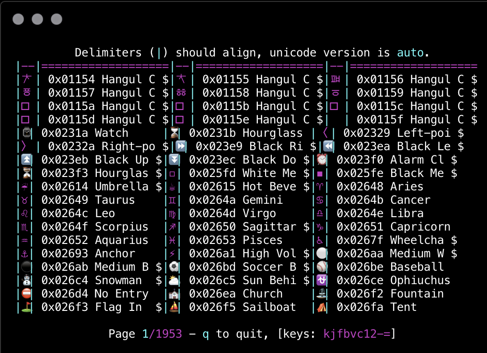
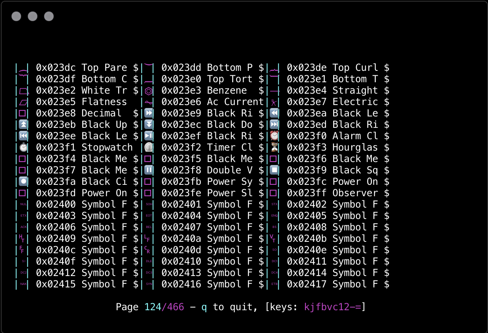

ucs-detect
==========

This CLI utility determines the Unicode Version of a terminal, and prints an
sh_-compatible variable for export::

    $ ucs-detect
    UNICODE_VERSION=12.0.0; export UNICODE_VERSION

This environment variable is then used by the python wcwidth_ library, to
determine how dependent python programs, such as IPython_ and others using
`python-prompt-toolkit`_ render zero-width and wide unicode characters.

If this variable is not exported, the python wcwidth_ library assumes the latest.

Installation & Usage
--------------------

From an sh_-compatible shell:

::

   pip install -U ucs-detect
   eval $(ucs-detect)

To make this automatic, add the ``eval`` statement to your shell login profile.

Problem
-------

Chinese, Japanese, Korean, and Emoticon characters are "double-wide", occupying
2 cells, instead of 1, and some other special characters are "zero-width".

Any terminal application that formats and displays these characters may have
trouble determining how it will be displayed to the end-user.  Here is one such
example, from `vercel/hyper`_ terminal:

This problem happens often, because the Unicode Consortium releases new versions
of the Unicode Standard periodically, but the source code of libraries and
applications are not updated at the same time, or at all!

Many languages and libraries continue to conform only to Unicode 5.0, which is
the last version of `wcwidth.c`_ released by Markus Kuhn in 2007.

Solution
--------

The most important factor is to determine: **What version of unicode is the
Terminal Emulator using?**

This program, ``ucs-detect``, is able to **automatically detect** the version of
unicode that the connecting Terminal supports. The python wcwidth_ library
supports **all** Unicode versions, 4.1.0 through 12.1.0 at time of this writing,
and so it is able to select and match the correct return value for by using the
given value of the ``UNICODE_VERSION`` environment variable.

With this solution, we can correctly determine the ``UNICODE_VERSION`` of
`vercel/hyper`_ terminal as ``5.1.0``, and the cells that were previously
mis-aligned are now aligned correctly:

How it works
------------

The unicode version is determined using the `Query Cursor Position`_ terminal
sequence, which asks the terminal emulator "where is the cursor?".

By displaying a series of Wide Unicode characters for each Unicode version
expected to advance the cursor by 2 cells, the last version that successfully
advances 2 cells is determined to be the version of Unicode supported by the
Terminal Emulator.

This solution of using `Query Cursor Position`_ and exporting an sh_ variable is
precisely the same solution used by the `resize(1)`_ program distributed with
X11, which determines the terminal size over transports that are not capable of
communicating or forwarding it (such as over a serial line).

Further
-------

I hope that this CLI tool is provisional. I'd like to see all Terminal Emulators
automatically export the environment variable, ``UNICODE_VERSION`` and that this
tool would not be required.

.. _IPython: https://ipython.org/
.. _python-prompt-toolkit: https://github.com/prompt-toolkit/python-prompt-toolkit/blob/master/PROJECTS.rst#projects-using-prompt_toolkit
.. _sh: https://en.wikipedia.org/wiki/Bourne_shell
.. _vercel/hyper: https://github.com/vercel/hyper
.. _wcwidth.c: https://www.cl.cam.ac.uk/~mgk25/ucs/wcwidth.c
.. _wcwidth: https://github.com/jquast/wcwidth
.. _`Query Cursor Position`: https://blessed.readthedocs.io/en/latest/location.html#finding-the-cursor
.. _`resize(1)`: https://github.com/joejulian/xterm/blob/master/resize.c
