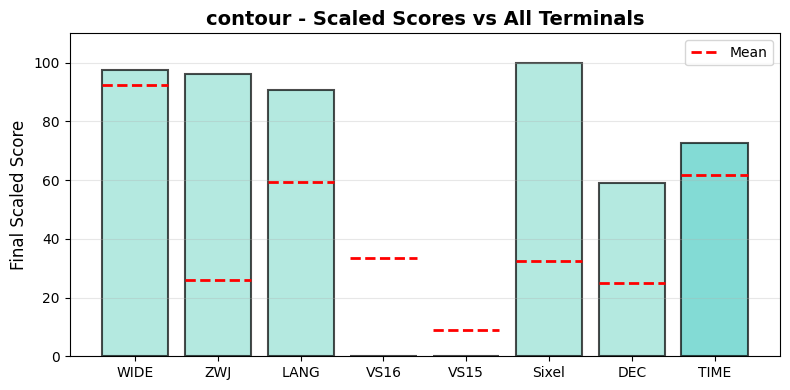

.. _contour:

contour
-------

Tested Software version 0.6.2-master-5b1ad5be on Linux.
The homepage URL of this terminal is https://contour-terminal.org/.
Full results available at ucs-detect_ repository path
`data/linux-contour-0.6.2-master-5b1ad5be.yaml <https://github.com/jquast/ucs-detect/blob/master/data/linux-contour-0.6.2-master-5b1ad5be.yaml>`_.

.. _contourscores:

Score Breakdown
+++++++++++++++

Detailed breakdown of how scores are calculated for *contour*:

.. table::
   :class: sphinx-datatable

   ===  ==================================  ===========  ====================
     #  Score Type                          Raw Score    Final Scaled Score
   ===  ==================================  ===========  ====================
     1  :ref:`WIDE <contourwide>`           97.72%       97.7%
     2  :ref:`ZWJ <contourzwj>`             96.26%       96.3%
     3  :ref:`LANG <contourlang>`           94.25%       89.5%
     4  :ref:`VS16 <contourvs16>`           0.00%        0.0%
     5  :ref:`VS15 <contourvs15>`           0.00%        0.0%
     6  :ref:`Sixel <contoursixel>`         yes          100.0%
     7  :ref:`DEC Modes <contourdecmodes>`  39           59.1%
     8  :ref:`TIME <contourtime>`           182.40s      71.8%
   ===  ==================================  ===========  ====================

**Score Comparison Plot:**

The following plot shows how this terminal's scores compare to all other terminals tested.

   Scaled scores comparison across all metrics (normalized 0-100%)

**Final Scaled Score Calculation:**

- Raw Final Score: 64.43%
  (weighted average of all raw scores: WIDE + ZWJ + LANG + VS16 + VS15 + Sixel + DEC Modes + 0.5*TIME)
  the categorized 'average' absolute support level of this terminal
  Note: DEC Modes and TIME are normalized to 0-1 range before averaging.
  TIME is weighted at 0.5 (half as powerful as other metrics).

- Final Scaled Score: 74.7%
  (normalized across all terminals tested).
  *Final Scaled scores* are normalized (0-100%) relative to all terminals tested

**WIDE Score Details:**

Wide character support calculation:
- Total successful codepoints: 6725
- Total codepoints tested: 6882
- Best matching Unicode version: 16.0.0
- Formula: 6725 / 6882
- Result: 97.72%

**ZWJ Score Details:**

Emoji ZWJ (Zero-Width Joiner) support calculation:
- Total successful sequences: 1391
- Total sequences tested: 1445
- Best matching Emoji version: 17.0
- Formula: 1391 / 1445
- Result: 96.26%

**VS16 Score Details:**

Variation Selector-16 support calculation:
- Errors: 213 of 213 codepoints tested
- Success rate: 0.0%
- Formula: 0.0 / 100
- Result: 0.00%

**VS15 Score Details:**

Variation Selector-15 support calculation:
- Errors: 158 of 158 codepoints tested
- Success rate: 0.0%
- Formula: 0.0 / 100
- Result: 0.00%

**Sixel Score Details:**

Sixel graphics support: **yes**

Sixel support is determined by the terminal's response to the Device Attributes
(DA1) query. Terminals that include '4' in their DA1 extensions response support
Sixel graphics protocol.

**DEC Modes Score Details:**

DEC Private Modes support calculation:
- Changeable modes: 39
- Total modes tested: 157
- Raw score: 39 modes
- Scaled: normalized against max changeable modes across all terminals

**TIME Score Details:**

Test execution time:
- Elapsed time: 182.40 seconds
- Note: This is a raw measurement; lower is better
- Scaled score uses inverse log10 scaling across all terminals
- Scaled result: 71.8%

**LANG Score Details (Geometric Mean):**

Geometric mean calculation:
- Formula: (p₁ × p₂ × ... × pₙ)^(1/n) where n = 118 languages
- About `geometric mean <https://en.wikipedia.org/wiki/Geometric_mean>`_
- Result: 94.25%

.. _contourwide:

Wide character support
++++++++++++++++++++++

The best wide unicode table version for contour appears to be 
**16.0.0**, this is from a summary of the following
results:

.. table::
   :class: sphinx-datatable

   =========  ==========  =========  =============
   version      n_errors    n_total  pct_success
   =========  ==========  =========  =============
   '9.0.0'             0       5000  100.0%
   '10.0.0'            0        745  100.0%
   '11.0.0'            0         72  100.0%
   '12.0.0'            0         76  100.0%
   '12.1.0'            0          1  100.0%
   '13.0.0'            0        552  100.0%
   '14.0.0'            0         54  100.0%
   '15.0.0'            0         22  100.0%
   '15.1.0'            0          5  100.0%
   '16.0.0'            0        198  100.0%
   '17.0.0'          157        157  0.0%
   =========  ==========  =========  =============

Sequence of a WIDE character from Unicode Version 17.0.0, from midpoint of alignment failure records:

.. table::
   :class: sphinx-datatable

   ===  =================================================  =============  ==========  =========  ======
     #  Codepoint                                          Python         Category      wcwidth  Name
   ===  =================================================  =============  ==========  =========  ======
     1  `U+00018DAB <https://codepoints.net/U+00018DAB>`_  '\\U00018dab'  Cn                  2  na
   ===  =================================================  =============  ==========  =========  ======

Total codepoints: 1

- Shell test using `printf(1)`_, ``'|'`` should align in output::

        $ printf "\xf0\x98\xb6\xab|\\n12|\\n"
        𘶫|
        12|

- python `wcwidth.wcswidth()`_ measures width 2,
  while *contour* measures width 1.

.. _contourzwj:

Emoji ZWJ support
+++++++++++++++++

The best Emoji ZWJ table version for *contour* appears to be 
**17.0**, this is from a summary of the following
results:

.. table::
   :class: sphinx-datatable

   =========  ==========  =========  =============
   version      n_errors    n_total  pct_success
   =========  ==========  =========  =============
   '2.0'               1         22  95.5%
   '4.0'              49        579  91.5%
   '5.0'               0        100  100.0%
   '11.0'              0         73  100.0%
   '12.0'              0        112  100.0%
   '12.1'              0        165  100.0%
   '13.0'              1         51  98.0%
   '13.1'              2         83  97.6%
   '14.0'              0         20  100.0%
   '15.0'              0          1  100.0%
   '15.1'              1        109  99.1%
   '17.0'              0        130  100.0%
   =========  ==========  =========  =============

Sequence of an Emoji ZWJ Sequence from Emoji Version 15.1, from midpoint of alignment failure records:

.. table::
   :class: sphinx-datatable

   ===  =================================================  =============  ==========  =========  =====================
     #  Codepoint                                          Python         Category      wcwidth  Name
   ===  =================================================  =============  ==========  =========  =====================
     1  `U+26D3 <https://codepoints.net/U+26D3>`_          '\\u26d3'      So                  1  CHAINS
     2  `U+FE0F <https://codepoints.net/U+FE0F>`_          '\\ufe0f'      Mn                  0  VARIATION SELECTOR-16
     3  `U+200D <https://codepoints.net/U+200D>`_          '\\u200d'      Cf                  0  ZERO WIDTH JOINER
     4  `U+0001F4A5 <https://codepoints.net/U+0001F4A5>`_  '\\U0001f4a5'  So                  2  COLLISION SYMBOL
   ===  =================================================  =============  ==========  =========  =====================

Total codepoints: 4

- Shell test using `printf(1)`_, ``'|'`` should align in output::

        $ printf "\xe2\x9b\x93\xef\xb8\x8f\xe2\x80\x8d\xf0\x9f\x92\xa5|\\n12|\\n"
        ⛓️‍💥|
        12|

- python `wcwidth.wcswidth()`_ measures width 2,
  while *contour* measures width 1.

.. _contourvs16:

Variation Selector-16 support
+++++++++++++++++++++++++++++

Emoji VS-16 results for *contour* is 213 errors
out of 213 total codepoints tested, 0.0% success.
Sequence of a NARROW Emoji made WIDE by *Variation Selector-16*, from midpoint of alignment failure records:

.. table::
   :class: sphinx-datatable

   ===  =========================================  =========  ==========  =========  =====================
     #  Codepoint                                  Python     Category      wcwidth  Name
   ===  =========================================  =========  ==========  =========  =====================
     1  `U+2733 <https://codepoints.net/U+2733>`_  '\\u2733'  So                  1  EIGHT SPOKED ASTERISK
     2  `U+FE0F <https://codepoints.net/U+FE0F>`_  '\\ufe0f'  Mn                  0  VARIATION SELECTOR-16
   ===  =========================================  =========  ==========  =========  =====================

Total codepoints: 2

- Shell test using `printf(1)`_, ``'|'`` should align in output::

        $ printf "\xe2\x9c\xb3\xef\xb8\x8f|\\n12|\\n"
        ✳️|
        12|

- python `wcwidth.wcswidth()`_ measures width 2,
  while *contour* measures width 1.

.. _contourvs15:

Variation Selector-15 support
+++++++++++++++++++++++++++++

Emoji VS-15 results for *contour* is 158 errors
out of 158 total codepoints tested, 0.0% success.
Sequence of a WIDE Emoji made NARROW by *Variation Selector-15*, from midpoint of alignment failure records:

.. table::
   :class: sphinx-datatable

   ===  =================================================  =============  ==========  =========  =====================
     #  Codepoint                                          Python         Category      wcwidth  Name
   ===  =================================================  =============  ==========  =========  =====================
     1  `U+0001F3AE <https://codepoints.net/U+0001F3AE>`_  '\\U0001f3ae'  So                  2  VIDEO GAME
     2  `U+FE0E <https://codepoints.net/U+FE0E>`_          '\\ufe0e'      Mn                  0  VARIATION SELECTOR-15
   ===  =================================================  =============  ==========  =========  =====================

Total codepoints: 2

- Shell test using `printf(1)`_, ``'|'`` should align in output::

        $ printf "\xf0\x9f\x8e\xae\xef\xb8\x8e|\\n1|\\n"
        🎮︎|
        1|

- python `wcwidth.wcswidth()`_ measures width 1,
  while *contour* measures width 2.

.. _contoursixel:

Sixel Graphics Support
++++++++++++++++++++++

*contour* **supports Sixel graphics protocol**.

Sixel support is determined by the terminal's response to the Device Attributes
(DA1) query. Terminals that include '4' in their DA1 extensions response indicate
support for the Sixel graphics protocol, which allows inline image rendering.

**Device Attributes Response:**

- Extensions reported: 1, 4, 8, 22, 28, 52, 314
- Sixel indicator ('4'): present

.. _contourlang:

Language Support
++++++++++++++++

The following 97 languages were tested with 100% success:

(Jinan), (Yeonbyeon), Aja, Amarakaeri, Arabic, Standard, Assyrian Neo-Aramaic, Baatonum, Bamun, Belanda Viri, Bhojpuri, Bora, Catalan (2), Chakma, Chickasaw, Chinantec, Chiltepec, Chinese, Gan, Chinese, Hakka, Chinese, Jinyu, Chinese, Mandarin (Beijing), Chinese, Mandarin (Guiyang), Chinese, Mandarin (Harbin), Chinese, Mandarin (Nanjing), Chinese, Mandarin (Tianjin), Chinese, Mandarin (Traditional), Chinese, Min Nan, Chinese, Wu, Chinese, Xiang, Chinese, Yue, Colorado, Dagaare, Southern, Dangme, Dari, Dendi, Dinka, Northeastern, Ditammari, Dzongkha, Evenki, Farsi, Western, Fon, French (Welche), Ga, Gen, Gilyak, Gujarati, Gumuz, Hindi, Japanese, Japanese (Osaka), Japanese (Tokyo), Javanese (Javanese), Kannada, Khmer, Central, Lamnso', Lingala (tones), Magahi, Maithili, Maldivian, Maori (2), Mazahua Central, Mirandese, Mixtec, Metlatónoc, Mòoré, Nanai, Navajo, Nuosu, Orok, Otomi, Mezquital, Panjabi, Eastern, Panjabi, Western, Pashto, Northern, Picard, Pular (Adlam), Saint Lucian Creole French, Sanskrit, Sanskrit (Grantha), Secoya, Seraiki, Shipibo-Conibo, Siona, South Azerbaijani, Tagalog (Tagalog), Tai Dam, Tamang, Eastern, Tamazight, Central Atlas, Tamil, Tamil (Sri Lanka), Telugu, Tem, Ticuna, Uduk, Veps, Vietnamese, Vietnamese (Han nom), Waama, Yiddish, Eastern, Yoruba, Éwé.

The following 21 languages are not fully supported:

.. table::
   :class: sphinx-datatable

   ============================================================================  ==========  =========  =============
   lang                                                                            n_errors    n_total  pct_success
   ============================================================================  ==========  =========  =============
   :ref:`Shan <contourlangshan>`                                                        864        915  5.6%
   :ref:`Khün <contourlangkhn>`                                                         303        442  31.4%
   :ref:`Burmese <contourlangburmese>`                                                  819       1223  33.0%
   :ref:`Mon <contourlangmon>`                                                          593        946  37.3%
   :ref:`Lao <contourlanglao>`                                                           77        426  81.9%
   :ref:`Thai (2) <contourlangthai2>`                                                    56        313  82.1%
   :ref:`Thai <contourlangthai>`                                                         52        341  84.8%
   :ref:`Mongolian, Halh (Mongolian) <contourlangmongolianhalhmongolian>`                 3         33  90.9%
   :ref:`Malayalam <contourlangmalayalam>`                                              109       1630  93.3%
   :ref:`Sinhala <contourlangsinhala>`                                                  107       1655  93.5%
   :ref:`Yaneshaʼ <contourlangyanesha>`                                                 114       2536  95.5%
   :ref:`Chinese, Mandarin (Simplified) <contourlangchinesemandarinsimplified>`           1        225  99.6%
   :ref:`Marathi <contourlangmarathi>`                                                    5       1614  99.7%
   :ref:`Nepali <contourlangnepali>`                                                      3       1385  99.8%
   :ref:`Bengali <contourlangbengali>`                                                    3       1413  99.8%
   :ref:`Kabyle <contourlangkabyle>`                                                      2       1815  99.9%
   :ref:`Korean <contourlangkorean>`                                                      1       1185  99.9%
   :ref:`Fur <contourlangfur>`                                                            1       1838  99.9%
   :ref:`Urdu <contourlangurdu>`                                                          1       2237  100.0%
   :ref:`Urdu (2) <contourlangurdu2>`                                                     1       2251  100.0%
   :ref:`Tibetan, Central <contourlangtibetancentral>`                                    1       3174  100.0%
   ============================================================================  ==========  =========  =============

.. _contourlangshan:

Shan
^^^^

Sequence of language *Shan* from midpoint of alignment failure records:

.. table::
   :class: sphinx-datatable

   ===  =========================================  =========  ==========  =========  ================================
     #  Codepoint                                  Python     Category      wcwidth  Name
   ===  =========================================  =========  ==========  =========  ================================
     1  `U+101C <https://codepoints.net/U+101C>`_  '\\u101c'  Lo                  1  MYANMAR LETTER LA
     2  `U+102D <https://codepoints.net/U+102D>`_  '\\u102d'  Mn                  0  MYANMAR VOWEL SIGN I
     3  `U+1075 <https://codepoints.net/U+1075>`_  '\\u1075'  Lo                  1  MYANMAR LETTER SHAN KA
     4  `U+103A <https://codepoints.net/U+103A>`_  '\\u103a'  Mn                  0  MYANMAR SIGN ASAT
     5  `U+1088 <https://codepoints.net/U+1088>`_  '\\u1088'  Mc                  0  MYANMAR SIGN SHAN TONE-3
     6  `U+1015 <https://codepoints.net/U+1015>`_  '\\u1015'  Lo                  1  MYANMAR LETTER PA
     7  `U+102D <https://codepoints.net/U+102D>`_  '\\u102d'  Mn                  0  MYANMAR VOWEL SIGN I
     8  `U+102F <https://codepoints.net/U+102F>`_  '\\u102f'  Mn                  0  MYANMAR VOWEL SIGN U
     9  `U+107C <https://codepoints.net/U+107C>`_  '\\u107c'  Lo                  1  MYANMAR LETTER SHAN NA
    10  `U+103A <https://codepoints.net/U+103A>`_  '\\u103a'  Mn                  0  MYANMAR SIGN ASAT
    11  `U+107D <https://codepoints.net/U+107D>`_  '\\u107d'  Lo                  1  MYANMAR LETTER SHAN PHA
    12  `U+1062 <https://codepoints.net/U+1062>`_  '\\u1062'  Mc                  0  MYANMAR VOWEL SIGN SGAW KAREN EU
    13  `U+101D <https://codepoints.net/U+101D>`_  '\\u101d'  Lo                  1  MYANMAR LETTER WA
    14  `U+103A <https://codepoints.net/U+103A>`_  '\\u103a'  Mn                  0  MYANMAR SIGN ASAT
    15  `U+1087 <https://codepoints.net/U+1087>`_  '\\u1087'  Mc                  0  MYANMAR SIGN SHAN TONE-2
   ===  =========================================  =========  ==========  =========  ================================

Total codepoints: 15

- Shell test using `printf(1)`_, ``'|'`` should align in output::

        $ printf "\xe1\x80\x9c\xe1\x80\xad\xe1\x81\xb5\xe1\x80\xba\xe1\x82\x88\xe1\x80\x95\xe1\x80\xad\xe1\x80\xaf\xe1\x81\xbc\xe1\x80\xba\xe1\x81\xbd\xe1\x81\xa2\xe1\x80\x9d\xe1\x80\xba\xe1\x82\x87|\\n123456|\\n"
        လိၵ်ႈပိုၼ်ၽၢဝ်ႇ|
        123456|

- python `wcwidth.wcswidth()`_ measures width 6,
  while *contour* measures width 9.

.. _contourlangkhn:

Khün
^^^^

Sequence of language *Khün* from midpoint of alignment failure records:

.. table::
   :class: sphinx-datatable

   ===  =========================================  =========  ==========  =========  ===========================
     #  Codepoint                                  Python     Category      wcwidth  Name
   ===  =========================================  =========  ==========  =========  ===========================
     1  `U+1A20 <https://codepoints.net/U+1A20>`_  '\\u1a20'  Lo                  1  TAI THAM LETTER HIGH KA
     2  `U+1A32 <https://codepoints.net/U+1A32>`_  '\\u1a32'  Lo                  1  TAI THAM LETTER HIGH TA
     3  `U+1A65 <https://codepoints.net/U+1A65>`_  '\\u1a65'  Mn                  0  TAI THAM VOWEL SIGN I
     4  `U+1A20 <https://codepoints.net/U+1A20>`_  '\\u1a20'  Lo                  1  TAI THAM LETTER HIGH KA
     5  `U+1A63 <https://codepoints.net/U+1A63>`_  '\\u1a63'  Mc                  0  TAI THAM VOWEL SIGN AA
     6  `U+1A45 <https://codepoints.net/U+1A45>`_  '\\u1a45'  Lo                  1  TAI THAM LETTER WA
     7  `U+1A64 <https://codepoints.net/U+1A64>`_  '\\u1a64'  Mc                  0  TAI THAM VOWEL SIGN TALL AA
     8  `U+1A75 <https://codepoints.net/U+1A75>`_  '\\u1a75'  Mn                  0  TAI THAM SIGN TONE-1
     9  `U+1A2F <https://codepoints.net/U+1A2F>`_  '\\u1a2f'  Lo                  1  TAI THAM LETTER DA
    10  `U+1A60 <https://codepoints.net/U+1A60>`_  '\\u1a60'  Mn                  0  TAI THAM SIGN SAKOT
    11  `U+1A45 <https://codepoints.net/U+1A45>`_  '\\u1a45'  Lo                  1  TAI THAM LETTER WA
    12  `U+1A60 <https://codepoints.net/U+1A60>`_  '\\u1a60'  Mn                  0  TAI THAM SIGN SAKOT
    13  `U+1A3F <https://codepoints.net/U+1A3F>`_  '\\u1a3f'  Lo                  1  TAI THAM LETTER LOW YA
    14  `U+1A62 <https://codepoints.net/U+1A62>`_  '\\u1a62'  Mn                  0  TAI THAM VOWEL SIGN MAI SAT
    15  `U+1A3E <https://codepoints.net/U+1A3E>`_  '\\u1a3e'  Lo                  1  TAI THAM LETTER MA
    16  `U+1A36 <https://codepoints.net/U+1A36>`_  '\\u1a36'  Lo                  1  TAI THAM LETTER NA
    17  `U+1A69 <https://codepoints.net/U+1A69>`_  '\\u1a69'  Mn                  0  TAI THAM VOWEL SIGN U
    18  `U+1A54 <https://codepoints.net/U+1A54>`_  '\\u1a54'  Lo                  1  TAI THAM LETTER GREAT SA
    19  `U+1A29 <https://codepoints.net/U+1A29>`_  '\\u1a29'  Lo                  1  TAI THAM LETTER LOW CA
    20  `U+1A63 <https://codepoints.net/U+1A63>`_  '\\u1a63'  Mc                  0  TAI THAM VOWEL SIGN AA
    21  `U+1A60 <https://codepoints.net/U+1A60>`_  '\\u1a60'  Mn                  0  TAI THAM SIGN SAKOT
    22  `U+1A32 <https://codepoints.net/U+1A32>`_  '\\u1a32'  Lo                  1  TAI THAM LETTER HIGH TA
   ===  =========================================  =========  ==========  =========  ===========================

Total codepoints: 22

- Shell test using `printf(1)`_, ``'|'`` should align in output::

        $ printf "\xe1\xa8\xa0\xe1\xa8\xb2\xe1\xa9\xa5\xe1\xa8\xa0\xe1\xa9\xa3\xe1\xa9\x85\xe1\xa9\xa4\xe1\xa9\xb5\xe1\xa8\xaf\xe1\xa9\xa0\xe1\xa9\x85\xe1\xa9\xa0\xe1\xa8\xbf\xe1\xa9\xa2\xe1\xa8\xbe\xe1\xa8\xb6\xe1\xa9\xa9\xe1\xa9\x94\xe1\xa8\xa9\xe1\xa9\xa3\xe1\xa9\xa0\xe1\xa8\xb2|\\n123456789012|\\n"
        ᨠᨲᩥᨠᩣᩅᩤ᩵ᨯ᩠ᩅ᩠ᨿᩢᨾᨶᩩᩔᨩᩣ᩠ᨲ|
        123456789012|

- python `wcwidth.wcswidth()`_ measures width 12,
  while *contour* measures width 15.

.. _contourlangburmese:

Burmese
^^^^^^^

Sequence of language *Burmese* from midpoint of alignment failure records:

.. table::
   :class: sphinx-datatable

   ===  =========================================  =========  ==========  =========  ================================
     #  Codepoint                                  Python     Category      wcwidth  Name
   ===  =========================================  =========  ==========  =========  ================================
     1  `U+1021 <https://codepoints.net/U+1021>`_  '\\u1021'  Lo                  1  MYANMAR LETTER A
     2  `U+1015 <https://codepoints.net/U+1015>`_  '\\u1015'  Lo                  1  MYANMAR LETTER PA
     3  `U+103C <https://codepoints.net/U+103C>`_  '\\u103c'  Mc                  0  MYANMAR CONSONANT SIGN MEDIAL RA
     4  `U+100A <https://codepoints.net/U+100A>`_  '\\u100a'  Lo                  1  MYANMAR LETTER NNYA
     5  `U+103A <https://codepoints.net/U+103A>`_  '\\u103a'  Mn                  0  MYANMAR SIGN ASAT
     6  `U+1015 <https://codepoints.net/U+1015>`_  '\\u1015'  Lo                  1  MYANMAR LETTER PA
     7  `U+103C <https://codepoints.net/U+103C>`_  '\\u103c'  Mc                  0  MYANMAR CONSONANT SIGN MEDIAL RA
     8  `U+100A <https://codepoints.net/U+100A>`_  '\\u100a'  Lo                  1  MYANMAR LETTER NNYA
     9  `U+103A <https://codepoints.net/U+103A>`_  '\\u103a'  Mn                  0  MYANMAR SIGN ASAT
    10  `U+1006 <https://codepoints.net/U+1006>`_  '\\u1006'  Lo                  1  MYANMAR LETTER CHA
    11  `U+102D <https://codepoints.net/U+102D>`_  '\\u102d'  Mn                  0  MYANMAR VOWEL SIGN I
    12  `U+102F <https://codepoints.net/U+102F>`_  '\\u102f'  Mn                  0  MYANMAR VOWEL SIGN U
    13  `U+1004 <https://codepoints.net/U+1004>`_  '\\u1004'  Lo                  1  MYANMAR LETTER NGA
    14  `U+103A <https://codepoints.net/U+103A>`_  '\\u103a'  Mn                  0  MYANMAR SIGN ASAT
    15  `U+101B <https://codepoints.net/U+101B>`_  '\\u101b'  Lo                  1  MYANMAR LETTER RA
    16  `U+102C <https://codepoints.net/U+102C>`_  '\\u102c'  Mc                  0  MYANMAR VOWEL SIGN AA
   ===  =========================================  =========  ==========  =========  ================================

Total codepoints: 16

- Shell test using `printf(1)`_, ``'|'`` should align in output::

        $ printf "\xe1\x80\xa1\xe1\x80\x95\xe1\x80\xbc\xe1\x80\x8a\xe1\x80\xba\xe1\x80\x95\xe1\x80\xbc\xe1\x80\x8a\xe1\x80\xba\xe1\x80\x86\xe1\x80\xad\xe1\x80\xaf\xe1\x80\x84\xe1\x80\xba\xe1\x80\x9b\xe1\x80\xac|\\n12345678|\\n"
        အပြည်ပြည်ဆိုင်ရာ|
        12345678|

- python `wcwidth.wcswidth()`_ measures width 8,
  while *contour* measures width 9.

.. _contourlangmon:

Mon
^^^

Sequence of language *Mon* from midpoint of alignment failure records:

.. table::
   :class: sphinx-datatable

   ===  =========================================  =========  ==========  =========  ======================
     #  Codepoint                                  Python     Category      wcwidth  Name
   ===  =========================================  =========  ==========  =========  ======================
     1  `U+101C <https://codepoints.net/U+101C>`_  '\\u101c'  Lo                  1  MYANMAR LETTER LA
     2  `U+102D <https://codepoints.net/U+102D>`_  '\\u102d'  Mn                  0  MYANMAR VOWEL SIGN I
     3  `U+1000 <https://codepoints.net/U+1000>`_  '\\u1000'  Lo                  1  MYANMAR LETTER KA
     4  `U+103A <https://codepoints.net/U+103A>`_  '\\u103a'  Mn                  0  MYANMAR SIGN ASAT
     5  `U+101C <https://codepoints.net/U+101C>`_  '\\u101c'  Lo                  1  MYANMAR LETTER LA
     6  `U+101C <https://codepoints.net/U+101C>`_  '\\u101c'  Lo                  1  MYANMAR LETTER LA
     7  `U+1031 <https://codepoints.net/U+1031>`_  '\\u1031'  Mc                  0  MYANMAR VOWEL SIGN E
     8  `U+102C <https://codepoints.net/U+102C>`_  '\\u102c'  Mc                  0  MYANMAR VOWEL SIGN AA
     9  `U+105A <https://codepoints.net/U+105A>`_  '\\u105a'  Lo                  1  MYANMAR LETTER MON NGA
    10  `U+103A <https://codepoints.net/U+103A>`_  '\\u103a'  Mn                  0  MYANMAR SIGN ASAT
   ===  =========================================  =========  ==========  =========  ======================

Total codepoints: 10

- Shell test using `printf(1)`_, ``'|'`` should align in output::

        $ printf "\xe1\x80\x9c\xe1\x80\xad\xe1\x80\x80\xe1\x80\xba\xe1\x80\x9c\xe1\x80\x9c\xe1\x80\xb1\xe1\x80\xac\xe1\x81\x9a\xe1\x80\xba|\\n12345|\\n"
        လိက်လလောၚ်|
        12345|

- python `wcwidth.wcswidth()`_ measures width 5,
  while *contour* measures width 6.

.. _contourlanglao:

Lao
^^^

Sequence of language *Lao* from midpoint of alignment failure records:

.. table::
   :class: sphinx-datatable

   ===  =========================================  =========  ==========  =========  ======================
     #  Codepoint                                  Python     Category      wcwidth  Name
   ===  =========================================  =========  ==========  =========  ======================
     1  `U+0EA7 <https://codepoints.net/U+0EA7>`_  '\\u0ea7'  Lo                  1  LAO LETTER WO
     2  `U+0EB4 <https://codepoints.net/U+0EB4>`_  '\\u0eb4'  Mn                  0  LAO VOWEL SIGN I
     3  `U+0E88 <https://codepoints.net/U+0E88>`_  '\\u0e88'  Lo                  1  LAO LETTER CO
     4  `U+0EB2 <https://codepoints.net/U+0EB2>`_  '\\u0eb2'  Lo                  1  LAO VOWEL SIGN AA
     5  `U+0E99 <https://codepoints.net/U+0E99>`_  '\\u0e99'  Lo                  1  LAO LETTER NO
     6  `U+0EAA <https://codepoints.net/U+0EAA>`_  '\\u0eaa'  Lo                  1  LAO LETTER SO SUNG
     7  `U+0EB5 <https://codepoints.net/U+0EB5>`_  '\\u0eb5'  Mn                  0  LAO VOWEL SIGN II
     8  `U+0EC8 <https://codepoints.net/U+0EC8>`_  '\\u0ec8'  Mn                  0  LAO TONE MAI EK
     9  `U+0E87 <https://codepoints.net/U+0E87>`_  '\\u0e87'  Lo                  1  LAO LETTER NGO
    10  `U+0EAA <https://codepoints.net/U+0EAA>`_  '\\u0eaa'  Lo                  1  LAO LETTER SO SUNG
    11  `U+0EB3 <https://codepoints.net/U+0EB3>`_  '\\u0eb3'  Lo                  1  LAO VOWEL SIGN AM
    12  `U+0E84 <https://codepoints.net/U+0E84>`_  '\\u0e84'  Lo                  1  LAO LETTER KHO TAM
    13  `U+0EB1 <https://codepoints.net/U+0EB1>`_  '\\u0eb1'  Mn                  0  LAO VOWEL SIGN MAI KAN
    14  `U+0E99 <https://codepoints.net/U+0E99>`_  '\\u0e99'  Lo                  1  LAO LETTER NO
    15  `U+0EC3 <https://codepoints.net/U+0EC3>`_  '\\u0ec3'  Lo                  1  LAO VOWEL SIGN AY
    16  `U+0E99 <https://codepoints.net/U+0E99>`_  '\\u0e99'  Lo                  1  LAO LETTER NO
    17  `U+0EC2 <https://codepoints.net/U+0EC2>`_  '\\u0ec2'  Lo                  1  LAO VOWEL SIGN O
    18  `U+0EAE <https://codepoints.net/U+0EAE>`_  '\\u0eae'  Lo                  1  LAO LETTER HO TAM
    19  `U+0E87 <https://codepoints.net/U+0E87>`_  '\\u0e87'  Lo                  1  LAO LETTER NGO
    20  `U+0EAE <https://codepoints.net/U+0EAE>`_  '\\u0eae'  Lo                  1  LAO LETTER HO TAM
    21  `U+0EBD <https://codepoints.net/U+0EBD>`_  '\\u0ebd'  Lo                  1  LAO SEMIVOWEL SIGN NYO
    22  `U+0E99 <https://codepoints.net/U+0E99>`_  '\\u0e99'  Lo                  1  LAO LETTER NO
   ===  =========================================  =========  ==========  =========  ======================

Total codepoints: 22

- Shell test using `printf(1)`_, ``'|'`` should align in output::

        $ printf "\xe0\xba\xa7\xe0\xba\xb4\xe0\xba\x88\xe0\xba\xb2\xe0\xba\x99\xe0\xba\xaa\xe0\xba\xb5\xe0\xbb\x88\xe0\xba\x87\xe0\xba\xaa\xe0\xba\xb3\xe0\xba\x84\xe0\xba\xb1\xe0\xba\x99\xe0\xbb\x83\xe0\xba\x99\xe0\xbb\x82\xe0\xba\xae\xe0\xba\x87\xe0\xba\xae\xe0\xba\xbd\xe0\xba\x99|\\n123456789012345678|\\n"
        ວິຈານສີ່ງສຳຄັນໃນໂຮງຮຽນ|
        123456789012345678|

- python `wcwidth.wcswidth()`_ measures width 18,
  while *contour* measures width 17.

.. _contourlangthai2:

Thai (2)
^^^^^^^^

Sequence of language *Thai (2)* from midpoint of alignment failure records:

.. table::
   :class: sphinx-datatable

   ===  =========================================  =========  ==========  =========  ===========================
     #  Codepoint                                  Python     Category      wcwidth  Name
   ===  =========================================  =========  ==========  =========  ===========================
     1  `U+0E42 <https://codepoints.net/U+0E42>`_  '\\u0e42'  Lo                  1  THAI CHARACTER SARA O
     2  `U+0E14 <https://codepoints.net/U+0E14>`_  '\\u0e14'  Lo                  1  THAI CHARACTER DO DEK
     3  `U+0E22 <https://codepoints.net/U+0E22>`_  '\\u0e22'  Lo                  1  THAI CHARACTER YO YAK
     4  `U+0E17 <https://codepoints.net/U+0E17>`_  '\\u0e17'  Lo                  1  THAI CHARACTER THO THAHAN
     5  `U+0E35 <https://codepoints.net/U+0E35>`_  '\\u0e35'  Mn                  0  THAI CHARACTER SARA II
     6  `U+0E48 <https://codepoints.net/U+0E48>`_  '\\u0e48'  Mn                  0  THAI CHARACTER MAI EK
     7  `U+0E01 <https://codepoints.net/U+0E01>`_  '\\u0e01'  Lo                  1  THAI CHARACTER KO KAI
     8  `U+0E32 <https://codepoints.net/U+0E32>`_  '\\u0e32'  Lo                  1  THAI CHARACTER SARA AA
     9  `U+0E23 <https://codepoints.net/U+0E23>`_  '\\u0e23'  Lo                  1  THAI CHARACTER RO RUA
    10  `U+0E22 <https://codepoints.net/U+0E22>`_  '\\u0e22'  Lo                  1  THAI CHARACTER YO YAK
    11  `U+0E2D <https://codepoints.net/U+0E2D>`_  '\\u0e2d'  Lo                  1  THAI CHARACTER O ANG
    12  `U+0E21 <https://codepoints.net/U+0E21>`_  '\\u0e21'  Lo                  1  THAI CHARACTER MO MA
    13  `U+0E23 <https://codepoints.net/U+0E23>`_  '\\u0e23'  Lo                  1  THAI CHARACTER RO RUA
    14  `U+0E31 <https://codepoints.net/U+0E31>`_  '\\u0e31'  Mn                  0  THAI CHARACTER MAI HAN-AKAT
    15  `U+0E1A <https://codepoints.net/U+0E1A>`_  '\\u0e1a'  Lo                  1  THAI CHARACTER BO BAIMAI
    16  `U+0E28 <https://codepoints.net/U+0E28>`_  '\\u0e28'  Lo                  1  THAI CHARACTER SO SALA
    17  `U+0E31 <https://codepoints.net/U+0E31>`_  '\\u0e31'  Mn                  0  THAI CHARACTER MAI HAN-AKAT
    18  `U+0E01 <https://codepoints.net/U+0E01>`_  '\\u0e01'  Lo                  1  THAI CHARACTER KO KAI
    19  `U+0E14 <https://codepoints.net/U+0E14>`_  '\\u0e14'  Lo                  1  THAI CHARACTER DO DEK
    20  `U+0E34 <https://codepoints.net/U+0E34>`_  '\\u0e34'  Mn                  0  THAI CHARACTER SARA I
    21  `U+0E4C <https://codepoints.net/U+0E4C>`_  '\\u0e4c'  Mn                  0  THAI CHARACTER THANTHAKHAT
    22  `U+0E28 <https://codepoints.net/U+0E28>`_  '\\u0e28'  Lo                  1  THAI CHARACTER SO SALA
    23  `U+0E23 <https://codepoints.net/U+0E23>`_  '\\u0e23'  Lo                  1  THAI CHARACTER RO RUA
    24  `U+0E35 <https://codepoints.net/U+0E35>`_  '\\u0e35'  Mn                  0  THAI CHARACTER SARA II
    25  `U+0E41 <https://codepoints.net/U+0E41>`_  '\\u0e41'  Lo                  1  THAI CHARACTER SARA AE
    26  `U+0E15 <https://codepoints.net/U+0E15>`_  '\\u0e15'  Lo                  1  THAI CHARACTER TO TAO
    27  `U+0E48 <https://codepoints.net/U+0E48>`_  '\\u0e48'  Mn                  0  THAI CHARACTER MAI EK
    28  `U+0E01 <https://codepoints.net/U+0E01>`_  '\\u0e01'  Lo                  1  THAI CHARACTER KO KAI
    29  `U+0E33 <https://codepoints.net/U+0E33>`_  '\\u0e33'  Lo                  1  THAI CHARACTER SARA AM
    30  `U+0E40 <https://codepoints.net/U+0E40>`_  '\\u0e40'  Lo                  1  THAI CHARACTER SARA E
    31  `U+0E19 <https://codepoints.net/U+0E19>`_  '\\u0e19'  Lo                  1  THAI CHARACTER NO NU
    32  `U+0E34 <https://codepoints.net/U+0E34>`_  '\\u0e34'  Mn                  0  THAI CHARACTER SARA I
    33  `U+0E14 <https://codepoints.net/U+0E14>`_  '\\u0e14'  Lo                  1  THAI CHARACTER DO DEK
   ===  =========================================  =========  ==========  =========  ===========================

Total codepoints: 33

- Shell test using `printf(1)`_, ``'|'`` should align in output::

        $ printf "\xe0\xb9\x82\xe0\xb8\x94\xe0\xb8\xa2\xe0\xb8\x97\xe0\xb8\xb5\xe0\xb9\x88\xe0\xb8\x81\xe0\xb8\xb2\xe0\xb8\xa3\xe0\xb8\xa2\xe0\xb8\xad\xe0\xb8\xa1\xe0\xb8\xa3\xe0\xb8\xb1\xe0\xb8\x9a\xe0\xb8\xa8\xe0\xb8\xb1\xe0\xb8\x81\xe0\xb8\x94\xe0\xb8\xb4\xe0\xb9\x8c\xe0\xb8\xa8\xe0\xb8\xa3\xe0\xb8\xb5\xe0\xb9\x81\xe0\xb8\x95\xe0\xb9\x88\xe0\xb8\x81\xe0\xb8\xb3\xe0\xb9\x80\xe0\xb8\x99\xe0\xb8\xb4\xe0\xb8\x94|\\n123456789012345678901234|\\n"
        โดยที่การยอมรับศักดิ์ศรีแต่กำเนิด|
        123456789012345678901234|

- python `wcwidth.wcswidth()`_ measures width 24,
  while *contour* measures width 23.

.. _contourlangthai:

Thai
^^^^

Sequence of language *Thai* from midpoint of alignment failure records:

.. table::
   :class: sphinx-datatable

   ===  =========================================  =========  ==========  =========  ==========================
     #  Codepoint                                  Python     Category      wcwidth  Name
   ===  =========================================  =========  ==========  =========  ==========================
     1  `U+0E04 <https://codepoints.net/U+0E04>`_  '\\u0e04'  Lo                  1  THAI CHARACTER KHO KHWAI
     2  `U+0E33 <https://codepoints.net/U+0E33>`_  '\\u0e33'  Lo                  1  THAI CHARACTER SARA AM
     3  `U+0E1B <https://codepoints.net/U+0E1B>`_  '\\u0e1b'  Lo                  1  THAI CHARACTER PO PLA
     4  `U+0E23 <https://codepoints.net/U+0E23>`_  '\\u0e23'  Lo                  1  THAI CHARACTER RO RUA
     5  `U+0E32 <https://codepoints.net/U+0E32>`_  '\\u0e32'  Lo                  1  THAI CHARACTER SARA AA
     6  `U+0E23 <https://codepoints.net/U+0E23>`_  '\\u0e23'  Lo                  1  THAI CHARACTER RO RUA
     7  `U+0E20 <https://codepoints.net/U+0E20>`_  '\\u0e20'  Lo                  1  THAI CHARACTER PHO SAMPHAO
   ===  =========================================  =========  ==========  =========  ==========================

Total codepoints: 7

- Shell test using `printf(1)`_, ``'|'`` should align in output::

        $ printf "\xe0\xb8\x84\xe0\xb8\xb3\xe0\xb8\x9b\xe0\xb8\xa3\xe0\xb8\xb2\xe0\xb8\xa3\xe0\xb8\xa0|\\n1234567|\\n"
        คำปรารภ|
        1234567|

- python `wcwidth.wcswidth()`_ measures width 7,
  while *contour* measures width 6.

.. _contourlangmongolianhalhmongolian:

Mongolian, Halh (Mongolian)
^^^^^^^^^^^^^^^^^^^^^^^^^^^

Sequence of language *Mongolian, Halh (Mongolian)* from midpoint of alignment failure records:

.. table::
   :class: sphinx-datatable

   ===  =========================================  =========  ==========  =========  =========================
     #  Codepoint                                  Python     Category      wcwidth  Name
   ===  =========================================  =========  ==========  =========  =========================
     1  `U+1828 <https://codepoints.net/U+1828>`_  '\\u1828'  Lo                  1  MONGOLIAN LETTER NA
     2  `U+1821 <https://codepoints.net/U+1821>`_  '\\u1821'  Lo                  1  MONGOLIAN LETTER E
     3  `U+1837 <https://codepoints.net/U+1837>`_  '\\u1837'  Lo                  1  MONGOLIAN LETTER RA
     4  `U+180E <https://codepoints.net/U+180E>`_  '\\u180e'  Cf                  0  MONGOLIAN VOWEL SEPARATOR
     5  `U+1821 <https://codepoints.net/U+1821>`_  '\\u1821'  Lo                  1  MONGOLIAN LETTER E
   ===  =========================================  =========  ==========  =========  =========================

Total codepoints: 5

- Shell test using `printf(1)`_, ``'|'`` should align in output::

        $ printf "\xe1\xa0\xa8\xe1\xa0\xa1\xe1\xa0\xb7\xe1\xa0\x8e\xe1\xa0\xa1|\\n1234|\\n"
        ᠨᠡᠷ᠎ᠡ|
        1234|

- python `wcwidth.wcswidth()`_ measures width 4,
  while *contour* measures width 5.

.. _contourlangmalayalam:

Malayalam
^^^^^^^^^

Sequence of language *Malayalam* from midpoint of alignment failure records:

.. table::
   :class: sphinx-datatable

   ===  =========================================  =========  ==========  =========  =======================
     #  Codepoint                                  Python     Category      wcwidth  Name
   ===  =========================================  =========  ==========  =========  =======================
     1  `U+0D38 <https://codepoints.net/U+0D38>`_  '\\u0d38'  Lo                  1  MALAYALAM LETTER SA
     2  `U+0D30 <https://codepoints.net/U+0D30>`_  '\\u0d30'  Lo                  1  MALAYALAM LETTER RA
     3  `U+0D4D <https://codepoints.net/U+0D4D>`_  '\\u0d4d'  Mn                  0  MALAYALAM SIGN VIRAMA
     4  `U+200D <https://codepoints.net/U+200D>`_  '\\u200d'  Cf                  0  ZERO WIDTH JOINER
     5  `U+0D35 <https://codepoints.net/U+0D35>`_  '\\u0d35'  Lo                  1  MALAYALAM LETTER VA
     6  `U+0D4D <https://codepoints.net/U+0D4D>`_  '\\u0d4d'  Mn                  0  MALAYALAM SIGN VIRAMA
     7  `U+0D35 <https://codepoints.net/U+0D35>`_  '\\u0d35'  Lo                  1  MALAYALAM LETTER VA
     8  `U+0D24 <https://codepoints.net/U+0D24>`_  '\\u0d24'  Lo                  1  MALAYALAM LETTER TA
     9  `U+0D4B <https://codepoints.net/U+0D4B>`_  '\\u0d4b'  Mc                  0  MALAYALAM VOWEL SIGN OO
    10  `U+0D28 <https://codepoints.net/U+0D28>`_  '\\u0d28'  Lo                  1  MALAYALAM LETTER NA
    11  `U+0D4D <https://codepoints.net/U+0D4D>`_  '\\u0d4d'  Mn                  0  MALAYALAM SIGN VIRAMA
    12  `U+0D2E <https://codepoints.net/U+0D2E>`_  '\\u0d2e'  Lo                  1  MALAYALAM LETTER MA
    13  `U+0D41 <https://codepoints.net/U+0D41>`_  '\\u0d41'  Mn                  0  MALAYALAM VOWEL SIGN U
    14  `U+0D16 <https://codepoints.net/U+0D16>`_  '\\u0d16'  Lo                  1  MALAYALAM LETTER KHA
    15  `U+0D2E <https://codepoints.net/U+0D2E>`_  '\\u0d2e'  Lo                  1  MALAYALAM LETTER MA
    16  `U+0D3E <https://codepoints.net/U+0D3E>`_  '\\u0d3e'  Mc                  0  MALAYALAM VOWEL SIGN AA
    17  `U+0D2F <https://codepoints.net/U+0D2F>`_  '\\u0d2f'  Lo                  1  MALAYALAM LETTER YA
   ===  =========================================  =========  ==========  =========  =======================

Total codepoints: 17

- Shell test using `printf(1)`_, ``'|'`` should align in output::

        $ printf "\xe0\xb4\xb8\xe0\xb4\xb0\xe0\xb5\x8d\xe2\x80\x8d\xe0\xb4\xb5\xe0\xb5\x8d\xe0\xb4\xb5\xe0\xb4\xa4\xe0\xb5\x8b\xe0\xb4\xa8\xe0\xb5\x8d\xe0\xb4\xae\xe0\xb5\x81\xe0\xb4\x96\xe0\xb4\xae\xe0\xb4\xbe\xe0\xb4\xaf|\\n123456789|\\n"
        സര്‍വ്വതോന്മുഖമായ|
        123456789|

- python `wcwidth.wcswidth()`_ measures width 9,
  while *contour* measures width 10.

.. _contourlangsinhala:

Sinhala
^^^^^^^

Sequence of language *Sinhala* from midpoint of alignment failure records:

.. table::
   :class: sphinx-datatable

   ===  =========================================  =========  ==========  =========  =================================
     #  Codepoint                                  Python     Category      wcwidth  Name
   ===  =========================================  =========  ==========  =========  =================================
     1  `U+0DB4 <https://codepoints.net/U+0DB4>`_  '\\u0db4'  Lo                  1  SINHALA LETTER ALPAPRAANA PAYANNA
     2  `U+0DCA <https://codepoints.net/U+0DCA>`_  '\\u0dca'  Mn                  0  SINHALA SIGN AL-LAKUNA
     3  `U+200D <https://codepoints.net/U+200D>`_  '\\u200d'  Cf                  0  ZERO WIDTH JOINER
     4  `U+0DBB <https://codepoints.net/U+0DBB>`_  '\\u0dbb'  Lo                  1  SINHALA LETTER RAYANNA
     5  `U+0D9A <https://codepoints.net/U+0D9A>`_  '\\u0d9a'  Lo                  1  SINHALA LETTER ALPAPRAANA KAYANNA
     6  `U+0DCF <https://codepoints.net/U+0DCF>`_  '\\u0dcf'  Mc                  0  SINHALA VOWEL SIGN AELA-PILLA
     7  `U+0DC1 <https://codepoints.net/U+0DC1>`_  '\\u0dc1'  Lo                  1  SINHALA LETTER TAALUJA SAYANNA
     8  `U+0DB1 <https://codepoints.net/U+0DB1>`_  '\\u0db1'  Lo                  1  SINHALA LETTER DANTAJA NAYANNA
     9  `U+0DBA <https://codepoints.net/U+0DBA>`_  '\\u0dba'  Lo                  1  SINHALA LETTER YAYANNA
   ===  =========================================  =========  ==========  =========  =================================

Total codepoints: 9

- Shell test using `printf(1)`_, ``'|'`` should align in output::

        $ printf "\xe0\xb6\xb4\xe0\xb7\x8a\xe2\x80\x8d\xe0\xb6\xbb\xe0\xb6\x9a\xe0\xb7\x8f\xe0\xb7\x81\xe0\xb6\xb1\xe0\xb6\xba|\\n12345|\\n"
        ප්‍රකාශනය|
        12345|

- python `wcwidth.wcswidth()`_ measures width 5,
  while *contour* measures width 6.

.. _contourlangyanesha:

Yaneshaʼ
^^^^^^^^

Sequence of language *Yaneshaʼ* from midpoint of alignment failure records:

.. table::
   :class: sphinx-datatable

   ===  =========================================  =========  ==========  =========  ====================
     #  Codepoint                                  Python     Category      wcwidth  Name
   ===  =========================================  =========  ==========  =========  ====================
     1  `U+0303 <https://codepoints.net/U+0303>`_  '\\u0303'  Mn                  0  COMBINING TILDE
     2  `U+0061 <https://codepoints.net/U+0061>`_  'a'        Ll                  1  LATIN SMALL LETTER A
     3  `U+006C <https://codepoints.net/U+006C>`_  'l'        Ll                  1  LATIN SMALL LETTER L
     4  `U+006C <https://codepoints.net/U+006C>`_  'l'        Ll                  1  LATIN SMALL LETTER L
     5  `U+006F <https://codepoints.net/U+006F>`_  'o'        Ll                  1  LATIN SMALL LETTER O
     6  `U+0068 <https://codepoints.net/U+0068>`_  'h'        Ll                  1  LATIN SMALL LETTER H
     7  `U+0075 <https://codepoints.net/U+0075>`_  'u'        Ll                  1  LATIN SMALL LETTER U
     8  `U+0065 <https://codepoints.net/U+0065>`_  'e'        Ll                  1  LATIN SMALL LETTER E
     9  `U+006E <https://codepoints.net/U+006E>`_  'n'        Ll                  1  LATIN SMALL LETTER N
   ===  =========================================  =========  ==========  =========  ====================

Total codepoints: 9

- Shell test using `printf(1)`_, ``'|'`` should align in output::

        $ printf "\xcc\x83allohuen|\\n12345678|\\n"
        ̃allohuen|
        12345678|

- python `wcwidth.wcswidth()`_ measures width 8,
  while *contour* measures width 9.

.. _contourlangchinesemandarinsimplified:

Chinese, Mandarin (Simplified)
^^^^^^^^^^^^^^^^^^^^^^^^^^^^^^

Sequence of language *Chinese, Mandarin (Simplified)* from midpoint of alignment failure records:

.. table::
   :class: sphinx-datatable

   ===  =========================================  =========  ==========  =========  ==========================
     #  Codepoint                                  Python     Category      wcwidth  Name
   ===  =========================================  =========  ==========  =========  ==========================
     1  `U+5E76 <https://codepoints.net/U+5E76>`_  '\\u5e76'  Lo                  2  CJK UNIFIED IDEOGRAPH-5E76
     2  `U+4E14 <https://codepoints.net/U+4E14>`_  '\\u4e14'  Lo                  2  CJK UNIFIED IDEOGRAPH-4E14
     3  `U+201C <https://codepoints.net/U+201C>`_  '\\u201c'  Pi                  1  LEFT DOUBLE QUOTATION MARK
     4  `U+4E0D <https://codepoints.net/U+4E0D>`_  '\\u4e0d'  Lo                  2  CJK UNIFIED IDEOGRAPH-4E0D
     5  `U+5206 <https://codepoints.net/U+5206>`_  '\\u5206'  Lo                  2  CJK UNIFIED IDEOGRAPH-5206
     6  `U+56FD <https://codepoints.net/U+56FD>`_  '\\u56fd'  Lo                  2  CJK UNIFIED IDEOGRAPH-56FD
     7  `U+5BB6 <https://codepoints.net/U+5BB6>`_  '\\u5bb6'  Lo                  2  CJK UNIFIED IDEOGRAPH-5BB6
     8  `U+6216 <https://codepoints.net/U+6216>`_  '\\u6216'  Lo                  2  CJK UNIFIED IDEOGRAPH-6216
     9  `U+9886 <https://codepoints.net/U+9886>`_  '\\u9886'  Lo                  2  CJK UNIFIED IDEOGRAPH-9886
    10  `U+571F <https://codepoints.net/U+571F>`_  '\\u571f'  Lo                  2  CJK UNIFIED IDEOGRAPH-571F
    11  `U+7684 <https://codepoints.net/U+7684>`_  '\\u7684'  Lo                  2  CJK UNIFIED IDEOGRAPH-7684
    12  `U+653F <https://codepoints.net/U+653F>`_  '\\u653f'  Lo                  2  CJK UNIFIED IDEOGRAPH-653F
    13  `U+6CBB <https://codepoints.net/U+6CBB>`_  '\\u6cbb'  Lo                  2  CJK UNIFIED IDEOGRAPH-6CBB
    14  `U+5730 <https://codepoints.net/U+5730>`_  '\\u5730'  Lo                  2  CJK UNIFIED IDEOGRAPH-5730
    15  `U+4F4D <https://codepoints.net/U+4F4D>`_  '\\u4f4d'  Lo                  2  CJK UNIFIED IDEOGRAPH-4F4D
   ===  =========================================  =========  ==========  =========  ==========================

Total codepoints: 15

- Shell test using `printf(1)`_, ``'|'`` should align in output::

        $ printf "\xe5\xb9\xb6\xe4\xb8\x94\xe2\x80\x9c\xe4\xb8\x8d\xe5\x88\x86\xe5\x9b\xbd\xe5\xae\xb6\xe6\x88\x96\xe9\xa2\x86\xe5\x9c\x9f\xe7\x9a\x84\xe6\x94\xbf\xe6\xb2\xbb\xe5\x9c\xb0\xe4\xbd\x8d|\\n12345678901234567890123456789|\\n"
        并且“不分国家或领土的政治地位|
        12345678901234567890123456789|

- python `wcwidth.wcswidth()`_ measures width 29,
  while *contour* measures width 30.

.. _contourlangmarathi:

Marathi
^^^^^^^

Sequence of language *Marathi* from midpoint of alignment failure records:

.. table::
   :class: sphinx-datatable

   ===  =========================================  =========  ==========  =========  ========================
     #  Codepoint                                  Python     Category      wcwidth  Name
   ===  =========================================  =========  ==========  =========  ========================
     1  `U+0915 <https://codepoints.net/U+0915>`_  '\\u0915'  Lo                  1  DEVANAGARI LETTER KA
     2  `U+0930 <https://codepoints.net/U+0930>`_  '\\u0930'  Lo                  1  DEVANAGARI LETTER RA
     3  `U+0923 <https://codepoints.net/U+0923>`_  '\\u0923'  Lo                  1  DEVANAGARI LETTER NNA
     4  `U+094D <https://codepoints.net/U+094D>`_  '\\u094d'  Mn                  0  DEVANAGARI SIGN VIRAMA
     5  `U+092F <https://codepoints.net/U+092F>`_  '\\u092f'  Lo                  1  DEVANAGARI LETTER YA
     6  `U+093E <https://codepoints.net/U+093E>`_  '\\u093e'  Mc                  0  DEVANAGARI VOWEL SIGN AA
     7  `U+0930 <https://codepoints.net/U+0930>`_  '\\u0930'  Lo                  1  DEVANAGARI LETTER RA
     8  `U+094D <https://codepoints.net/U+094D>`_  '\\u094d'  Mn                  0  DEVANAGARI SIGN VIRAMA
     9  `U+200D <https://codepoints.net/U+200D>`_  '\\u200d'  Cf                  0  ZERO WIDTH JOINER
    10  `U+092F <https://codepoints.net/U+092F>`_  '\\u092f'  Lo                  1  DEVANAGARI LETTER YA
    11  `U+093E <https://codepoints.net/U+093E>`_  '\\u093e'  Mc                  0  DEVANAGARI VOWEL SIGN AA
   ===  =========================================  =========  ==========  =========  ========================

Total codepoints: 11

- Shell test using `printf(1)`_, ``'|'`` should align in output::

        $ printf "\xe0\xa4\x95\xe0\xa4\xb0\xe0\xa4\xa3\xe0\xa5\x8d\xe0\xa4\xaf\xe0\xa4\xbe\xe0\xa4\xb0\xe0\xa5\x8d\xe2\x80\x8d\xe0\xa4\xaf\xe0\xa4\xbe|\\n12345|\\n"
        करण्यार्‍या|
        12345|

- python `wcwidth.wcswidth()`_ measures width 5,
  while *contour* measures width 6.

.. _contourlangnepali:

Nepali
^^^^^^

Sequence of language *Nepali* from midpoint of alignment failure records:

.. table::
   :class: sphinx-datatable

   ===  =========================================  =========  ==========  =========  ========================
     #  Codepoint                                  Python     Category      wcwidth  Name
   ===  =========================================  =========  ==========  =========  ========================
     1  `U+092A <https://codepoints.net/U+092A>`_  '\\u092a'  Lo                  1  DEVANAGARI LETTER PA
     2  `U+0941 <https://codepoints.net/U+0941>`_  '\\u0941'  Mn                  0  DEVANAGARI VOWEL SIGN U
     3  `U+0930 <https://codepoints.net/U+0930>`_  '\\u0930'  Lo                  1  DEVANAGARI LETTER RA
     4  `U+094D <https://codepoints.net/U+094D>`_  '\\u094d'  Mn                  0  DEVANAGARI SIGN VIRAMA
     5  `U+200D <https://codepoints.net/U+200D>`_  '\\u200d'  Cf                  0  ZERO WIDTH JOINER
     6  `U+092F <https://codepoints.net/U+092F>`_  '\\u092f'  Lo                  1  DEVANAGARI LETTER YA
     7  `U+093E <https://codepoints.net/U+093E>`_  '\\u093e'  Mc                  0  DEVANAGARI VOWEL SIGN AA
     8  `U+0907 <https://codepoints.net/U+0907>`_  '\\u0907'  Lo                  1  DEVANAGARI LETTER I
     9  `U+090F <https://codepoints.net/U+090F>`_  '\\u090f'  Lo                  1  DEVANAGARI LETTER E
    10  `U+0915 <https://codepoints.net/U+0915>`_  '\\u0915'  Lo                  1  DEVANAGARI LETTER KA
    11  `U+094B <https://codepoints.net/U+094B>`_  '\\u094b'  Mc                  0  DEVANAGARI VOWEL SIGN O
   ===  =========================================  =========  ==========  =========  ========================

Total codepoints: 11

- Shell test using `printf(1)`_, ``'|'`` should align in output::

        $ printf "\xe0\xa4\xaa\xe0\xa5\x81\xe0\xa4\xb0\xe0\xa5\x8d\xe2\x80\x8d\xe0\xa4\xaf\xe0\xa4\xbe\xe0\xa4\x87\xe0\xa4\x8f\xe0\xa4\x95\xe0\xa5\x8b|\\n12345|\\n"
        पुर्‍याइएको|
        12345|

- python `wcwidth.wcswidth()`_ measures width 5,
  while *contour* measures width 6.

.. _contourlangbengali:

Bengali
^^^^^^^

Sequence of language *Bengali* from midpoint of alignment failure records:

.. table::
   :class: sphinx-datatable

   ===  =========================================  =========  ==========  =========  =====================
     #  Codepoint                                  Python     Category      wcwidth  Name
   ===  =========================================  =========  ==========  =========  =====================
     1  `U+0989 <https://codepoints.net/U+0989>`_  '\\u0989'  Lo                  1  BENGALI LETTER U
     2  `U+09A4 <https://codepoints.net/U+09A4>`_  '\\u09a4'  Lo                  1  BENGALI LETTER TA
     3  `U+09CD <https://codepoints.net/U+09CD>`_  '\\u09cd'  Mn                  0  BENGALI SIGN VIRAMA
     4  `U+200D <https://codepoints.net/U+200D>`_  '\\u200d'  Cf                  0  ZERO WIDTH JOINER
     5  `U+09AA <https://codepoints.net/U+09AA>`_  '\\u09aa'  Lo                  1  BENGALI LETTER PA
     6  `U+09C0 <https://codepoints.net/U+09C0>`_  '\\u09c0'  Mc                  0  BENGALI VOWEL SIGN II
     7  `U+09A1 <https://codepoints.net/U+09A1>`_  '\\u09a1'  Lo                  1  BENGALI LETTER DDA
     8  `U+09BC <https://codepoints.net/U+09BC>`_  '\\u09bc'  Mn                  0  BENGALI SIGN NUKTA
     9  `U+09A8 <https://codepoints.net/U+09A8>`_  '\\u09a8'  Lo                  1  BENGALI LETTER NA
    10  `U+09C7 <https://codepoints.net/U+09C7>`_  '\\u09c7'  Mc                  0  BENGALI VOWEL SIGN E
    11  `U+09B0 <https://codepoints.net/U+09B0>`_  '\\u09b0'  Lo                  1  BENGALI LETTER RA
   ===  =========================================  =========  ==========  =========  =====================

Total codepoints: 11

- Shell test using `printf(1)`_, ``'|'`` should align in output::

        $ printf "\xe0\xa6\x89\xe0\xa6\xa4\xe0\xa7\x8d\xe2\x80\x8d\xe0\xa6\xaa\xe0\xa7\x80\xe0\xa6\xa1\xe0\xa6\xbc\xe0\xa6\xa8\xe0\xa7\x87\xe0\xa6\xb0|\\n12345|\\n"
        উত্‍পীড়নের|
        12345|

- python `wcwidth.wcswidth()`_ measures width 5,
  while *contour* measures width 6.

.. _contourlangkabyle:

Kabyle
^^^^^^

Sequence of language *Kabyle* from midpoint of alignment failure records:

.. table::
   :class: sphinx-datatable

   ===  =========================================  =========  ==========  =========  ===================================
     #  Codepoint                                  Python     Category      wcwidth  Name
   ===  =========================================  =========  ==========  =========  ===================================
     1  `U+0323 <https://codepoints.net/U+0323>`_  '\\u0323'  Mn                  0  COMBINING DOT BELOW
     2  `U+0065 <https://codepoints.net/U+0065>`_  'e'        Ll                  1  LATIN SMALL LETTER E
     3  `U+0323 <https://codepoints.net/U+0323>`_  '\\u0323'  Mn                  0  COMBINING DOT BELOW
     4  `U+1E5B <https://codepoints.net/U+1E5B>`_  '\\u1e5b'  Ll                  1  LATIN SMALL LETTER R WITH DOT BELOW
     5  `U+1E5B <https://codepoints.net/U+1E5B>`_  '\\u1e5b'  Ll                  1  LATIN SMALL LETTER R WITH DOT BELOW
     6  `U+0065 <https://codepoints.net/U+0065>`_  'e'        Ll                  1  LATIN SMALL LETTER E
     7  `U+006D <https://codepoints.net/U+006D>`_  'm'        Ll                  1  LATIN SMALL LETTER M
   ===  =========================================  =========  ==========  =========  ===================================

Total codepoints: 7

- Shell test using `printf(1)`_, ``'|'`` should align in output::

        $ printf "\xcc\xa3e\xcc\xa3\xe1\xb9\x9b\xe1\xb9\x9bem|\\n12345|\\n"
        ̣ẹṛṛem|
        12345|

- python `wcwidth.wcswidth()`_ measures width 5,
  while *contour* measures width 6.

.. _contourlangkorean:

Korean
^^^^^^

Sequence of language *Korean* from midpoint of alignment failure records:

.. table::
   :class: sphinx-datatable

   ===  =========================================  =========  ==========  =========  ======================
     #  Codepoint                                  Python     Category      wcwidth  Name
   ===  =========================================  =========  ==========  =========  ======================
     1  `U+BCF4 <https://codepoints.net/U+BCF4>`_  '\\ubcf4'  Lo                  2  HANGUL SYLLABLE BO
     2  `U+D1B5 <https://codepoints.net/U+D1B5>`_  '\\ud1b5'  Lo                  2  HANGUL SYLLABLE TONG
     3  `U+00B7 <https://codepoints.net/U+00B7>`_  '\\xb7'    Po                  1  MIDDLE DOT
     4  `U+D3C9 <https://codepoints.net/U+D3C9>`_  '\\ud3c9'  Lo                  2  HANGUL SYLLABLE PYEONG
     5  `U+B4F1 <https://codepoints.net/U+B4F1>`_  '\\ub4f1'  Lo                  2  HANGUL SYLLABLE DEUNG
   ===  =========================================  =========  ==========  =========  ======================

Total codepoints: 5

- Shell test using `printf(1)`_, ``'|'`` should align in output::

        $ printf "\xeb\xb3\xb4\xed\x86\xb5\xc2\xb7\xed\x8f\x89\xeb\x93\xb1|\\n123456789|\\n"
        보통·평등|
        123456789|

- python `wcwidth.wcswidth()`_ measures width 9,
  while *contour* measures width 10.

.. _contourlangfur:

Fur
^^^

Sequence of language *Fur* from midpoint of alignment failure records:

.. table::
   :class: sphinx-datatable

   ===  =========================================  =========  ==========  =========  ================================
     #  Codepoint                                  Python     Category      wcwidth  Name
   ===  =========================================  =========  ==========  =========  ================================
     1  `U+0331 <https://codepoints.net/U+0331>`_  '\\u0331'  Mn                  0  COMBINING MACRON BELOW
     2  `U+0301 <https://codepoints.net/U+0301>`_  '\\u0301'  Mn                  0  COMBINING ACUTE ACCENT
     3  `U+006C <https://codepoints.net/U+006C>`_  'l'        Ll                  1  LATIN SMALL LETTER L
     4  `U+0064 <https://codepoints.net/U+0064>`_  'd'        Ll                  1  LATIN SMALL LETTER D
     5  `U+0268 <https://codepoints.net/U+0268>`_  '\\u0268'  Ll                  1  LATIN SMALL LETTER I WITH STROKE
     6  `U+A78C <https://codepoints.net/U+A78C>`_  '\\ua78c'  Ll                  1  LATIN SMALL LETTER SALTILLO
     7  `U+014B <https://codepoints.net/U+014B>`_  '\\u014b'  Ll                  1  LATIN SMALL LETTER ENG
   ===  =========================================  =========  ==========  =========  ================================

Total codepoints: 7

- Shell test using `printf(1)`_, ``'|'`` should align in output::

        $ printf "\xcc\xb1\xcc\x81ld\xc9\xa8\xea\x9e\x8c\xc5\x8b|\\n12345|\\n"
        ̱́ldɨꞌŋ|
        12345|

- python `wcwidth.wcswidth()`_ measures width 5,
  while *contour* measures width 6.

.. _contourlangurdu:

Urdu
^^^^

Sequence of language *Urdu* from midpoint of alignment failure records:

.. table::
   :class: sphinx-datatable

   ===  =========================================  =========  ==========  =========  =================================
     #  Codepoint                                  Python     Category      wcwidth  Name
   ===  =========================================  =========  ==========  =========  =================================
     1  `U+0601 <https://codepoints.net/U+0601>`_  '\\u0601'  Cf                  0  ARABIC SIGN SANAH
     2  `U+06F1 <https://codepoints.net/U+06F1>`_  '\\u06f1'  Nd                  1  EXTENDED ARABIC-INDIC DIGIT ONE
     3  `U+06F9 <https://codepoints.net/U+06F9>`_  '\\u06f9'  Nd                  1  EXTENDED ARABIC-INDIC DIGIT NINE
     4  `U+06F4 <https://codepoints.net/U+06F4>`_  '\\u06f4'  Nd                  1  EXTENDED ARABIC-INDIC DIGIT FOUR
     5  `U+06F8 <https://codepoints.net/U+06F8>`_  '\\u06f8'  Nd                  1  EXTENDED ARABIC-INDIC DIGIT EIGHT
     6  `U+0621 <https://codepoints.net/U+0621>`_  '\\u0621'  Lo                  1  ARABIC LETTER HAMZA
   ===  =========================================  =========  ==========  =========  =================================

Total codepoints: 6

- Shell test using `printf(1)`_, ``'|'`` should align in output::

        $ printf "\xd8\x81\xdb\xb1\xdb\xb9\xdb\xb4\xdb\xb8\xd8\xa1|\\n12345|\\n"
        ؁۱۹۴۸ء|
        12345|

- python `wcwidth.wcswidth()`_ measures width 5,
  while *contour* measures width 4.

.. _contourlangurdu2:

Urdu (2)
^^^^^^^^

Sequence of language *Urdu (2)* from midpoint of alignment failure records:

.. table::
   :class: sphinx-datatable

   ===  =========================================  =========  ==========  =========  =================================
     #  Codepoint                                  Python     Category      wcwidth  Name
   ===  =========================================  =========  ==========  =========  =================================
     1  `U+0601 <https://codepoints.net/U+0601>`_  '\\u0601'  Cf                  0  ARABIC SIGN SANAH
     2  `U+06F1 <https://codepoints.net/U+06F1>`_  '\\u06f1'  Nd                  1  EXTENDED ARABIC-INDIC DIGIT ONE
     3  `U+06F9 <https://codepoints.net/U+06F9>`_  '\\u06f9'  Nd                  1  EXTENDED ARABIC-INDIC DIGIT NINE
     4  `U+06F4 <https://codepoints.net/U+06F4>`_  '\\u06f4'  Nd                  1  EXTENDED ARABIC-INDIC DIGIT FOUR
     5  `U+06F8 <https://codepoints.net/U+06F8>`_  '\\u06f8'  Nd                  1  EXTENDED ARABIC-INDIC DIGIT EIGHT
     6  `U+0621 <https://codepoints.net/U+0621>`_  '\\u0621'  Lo                  1  ARABIC LETTER HAMZA
   ===  =========================================  =========  ==========  =========  =================================

Total codepoints: 6

- Shell test using `printf(1)`_, ``'|'`` should align in output::

        $ printf "\xd8\x81\xdb\xb1\xdb\xb9\xdb\xb4\xdb\xb8\xd8\xa1|\\n12345|\\n"
        ؁۱۹۴۸ء|
        12345|

- python `wcwidth.wcswidth()`_ measures width 5,
  while *contour* measures width 4.

.. _contourlangtibetancentral:

Tibetan, Central
^^^^^^^^^^^^^^^^

Sequence of language *Tibetan, Central* from midpoint of alignment failure records:

.. table::
   :class: sphinx-datatable

   ===  =========================================  =========  ==========  =========  ====================
     #  Codepoint                                  Python     Category      wcwidth  Name
   ===  =========================================  =========  ==========  =========  ====================
     1  `U+0F7C <https://codepoints.net/U+0F7C>`_  '\\u0f7c'  Mn                  0  TIBETAN VOWEL SIGN O
     2  `U+0F42 <https://codepoints.net/U+0F42>`_  '\\u0f42'  Lo                  1  TIBETAN LETTER GA
     3  `U+0F66 <https://codepoints.net/U+0F66>`_  '\\u0f66'  Lo                  1  TIBETAN LETTER SA
   ===  =========================================  =========  ==========  =========  ====================

Total codepoints: 3

- Shell test using `printf(1)`_, ``'|'`` should align in output::

        $ printf "\xe0\xbd\xbc\xe0\xbd\x82\xe0\xbd\xa6|\\n12|\\n"
        ོགས|
        12|

- python `wcwidth.wcswidth()`_ measures width 2,
  while *contour* measures width 3.

.. _contourdecmodes:

DEC Private Modes Support
+++++++++++++++++++++++++

DEC private modes results for *contour*: 39 changeable modes
of 39 supported out of 157 total modes tested (24.8% support, 24.8% changeable).

Complete list of DEC private modes tested:

.. table::
   :class: sphinx-datatable

   ======  =============================  =======================================================================  ===========  ============  =========
     Mode  Name                           Description                                                              Supported    Changeable    Enabled
   ======  =============================  =======================================================================  ===========  ============  =========
        1  DECCKM                         Cursor Keys Mode                                                         Yes          Yes           No
        2  DECANM                         ANSI/VT52 Mode                                                           Yes          Yes           No
        3  DECCOLM                        Column Mode                                                              Yes          Yes           No
        4  DECSCLM                        Scrolling Mode                                                           Yes          Yes           No
        5  DECSCNM                        Screen Mode (light or dark screen)                                       Yes          Yes           No
        6  DECOM                          Origin Mode                                                              Yes          Yes           No
        7  DECAWM                         Auto Wrap Mode                                                           Yes          Yes           Yes
        8  DECARM                         Auto Repeat Mode                                                         No           No            No
        9  DECINLM                        Interlace Mode / Mouse X10 tracking                                      Yes          Yes           No
       10  DECEDM                         Editing Mode / Show toolbar (rxvt)                                       Yes          Yes           No
       11  DECLTM                         Line Transmit Mode                                                       No           No            No
       12  DECKANAM                       Katakana Shift Mode / Blinking cursor (xterm)                            Yes          Yes           No
       13  DECSCFDM                       Space Compression/Field Delimiter Mode / Start blinking cursor (xterm)   No           No            No
       14  DECTEM                         Transmit Execution Mode / Enable XOR of blinking cursor control (xterm)  No           No            No
       16  DECEKEM                        Edit Key Execution Mode                                                  No           No            No
       18  DECPFF                         Print Form Feed                                                          No           No            No
       19  DECPEX                         Printer Extent                                                           Yes          Yes           No
       20  OV1                            Overstrike                                                               No           No            No
       21  BA1                            Local BASIC                                                              No           No            No
       22  BA2                            Host BASIC                                                               No           No            No
       23  PK1                            Programmable Keypad                                                      No           No            No
       24  AH1                            Auto Hardcopy                                                            No           No            No
       25  DECTCEM                        Text Cursor Enable Mode                                                  Yes          Yes           Yes
       27  DECPSP                         Proportional Spacing                                                     No           No            No
       29  DECPSM                         Pitch Select Mode                                                        No           No            No
       30  SHOW_SCROLLBAR_RXVT            Show scrollbar (rxvt)                                                    Yes          Yes           No
       34  DECRLM                         Cursor Right to Left Mode                                                No           No            No
       35  DECHEBM                        Hebrew (Keyboard) Mode / Enable font-shifting functions (rxvt)           No           No            No
       36  DECHEM                         Hebrew Encoding Mode                                                     No           No            No
       38  DECTEK                         Tektronix 4010/4014 Mode                                                 No           No            No
       40  DECCRNLM                       Carriage Return/New Line Mode / Allow 80⇒132 mode (xterm)                Yes          Yes           No
       41  DECUPM                         Unidirectional Print Mode / more(1) fix (xterm)                          No           No            No
       42  DECNRCM                        National Replacement Character Set Mode                                  No           No            No
       43  DECGEPM                        Graphics Expanded Print Mode                                             No           No            No
       44  DECGPCM                        Graphics Print Color Mode / Turn on margin bell (xterm)                  No           No            No
       45  DECGPCS                        Graphics Print Color Syntax / Reverse-wraparound mode (xterm)            No           No            No
       46  DECGPBM                        Graphics Print Background Mode / Start logging (xterm)                   Yes          Yes           No
       47  DECGRPM                        Graphics Rotated Print Mode / Use Alternate Screen Buffer (xterm)        Yes          Yes           No
       49  DECTHAIM                       Thai Input Mode                                                          No           No            No
       50  DECTHAICM                      Thai Cursor Mode                                                         No           No            No
       51  DECBWRM                        Black/White Reversal Mode                                                No           No            No
       52  DECOPM                         Origin Placement Mode                                                    No           No            No
       53  DEC131TM                       VT131 Transmit Mode                                                      No           No            No
       55  DECBPM                         Bold Page Mode                                                           No           No            No
       57  DECNAKB                        Greek/N-A Keyboard Mapping Mode                                          No           No            No
       58  DECIPEM                        Enter IBM Proprinter Emulation Mode                                      No           No            No
       59  DECKKDM                        Kanji/Katakana Display Mode                                              No           No            No
       60  DECHCCM                        Horizontal Cursor Coupling                                               No           No            No
       61  DECVCCM                        Vertical Cursor Coupling Mode                                            No           No            No
       64  DECPCCM                        Page Cursor Coupling Mode                                                No           No            No
       65  DECBCMM                        Business Color Matching Mode                                             No           No            No
       66  DECNKM                         Numeric Keypad Mode                                                      No           No            No
       67  DECBKM                         Backarrow Key Mode                                                       No           No            No
       68  DECKBUM                        Keyboard Usage Mode                                                      No           No            No
       69  DECVSSM                        Vertical Split Screen Mode / DECLRMM - Left Right Margin Mode            Yes          Yes           No
       70  DECFPM                         Force Plot Mode                                                          No           No            No
       73  DECXRLM                        Transmission Rate Limiting                                               No           No            No
       80  DECSDM                         Sixel Display Mode                                                       Yes          Yes           No
       81  DECKPM                         Key Position Mode                                                        No           No            No
       83  WY_52_LINE                     52 line mode (WY-370)                                                    No           No            No
       84  WYENAT_OFF                     Erasable/nonerasable WYENAT Off attribute select (WY-370)                No           No            No
       85  REPLACEMENT_CHAR_COLOR         Replacement character color (WY-370)                                     No           No            No
       90  DECTHAISCM                     Thai Space Compensating Mode                                             No           No            No
       95  DECNCSM                        No Clearing Screen on Column Change Mode                                 No           No            No
       96  DECRLCM                        Right to Left Copy Mode                                                  No           No            No
       97  DECCRTSM                       CRT Save Mode                                                            No           No            No
       98  DECARSM                        Auto Resize Mode                                                         No           No            No
       99  DECMCM                         Modem Control Mode                                                       No           No            No
      100  DECAAM                         Auto Answerback Mode                                                     No           No            No
      101  DECCANSM                       Conceal Answerback Message Mode                                          No           No            No
      102  DECNULM                        Ignore Null Mode                                                         No           No            No
      103  DECHDPXM                       Half Duplex Mode                                                         No           No            No
      104  DECESKM                        Secondary Keyboard Language Mode                                         No           No            No
      106  DECOSCNM                       Overscan Mode                                                            No           No            No
      108  DECNUMLK                       NumLock Mode                                                             No           No            No
      109  DECCAPSLK                      Caps Lock Mode                                                           No           No            No
      110  DECKLHIM                       Keyboard LEDs Host Indicator Mode                                        No           No            No
      111  DECFWM                         Framed Windows Mode                                                      No           No            No
      112  DECRPL                         Review Previous Lines Mode                                               No           No            No
      113  DECHWUM                        Host Wake-Up Mode                                                        No           No            No
      114  DECATCUM                       Alternate Text Color Underline Mode                                      No           No            No
      115  DECATCBM                       Alternate Text Color Blink Mode                                          No           No            No
      116  DECBBSM                        Bold and Blink Style Mode                                                No           No            No
      117  DECECM                         Erase Color Mode                                                         No           No            No
     1000  MOUSE_REPORT_CLICK             Send Mouse X & Y on button press                                         Yes          Yes           No
     1001  MOUSE_HILITE_TRACKING          Use Hilite Mouse Tracking                                                Yes          Yes           No
     1002  MOUSE_REPORT_DRAG              Use Cell Motion Mouse Tracking                                           Yes          Yes           No
     1003  MOUSE_ALL_MOTION               Use All Motion Mouse Tracking                                            Yes          Yes           No
     1004  FOCUS_IN_OUT_EVENTS            Send FocusIn/FocusOut events                                             Yes          Yes           No
     1005  MOUSE_EXTENDED_UTF8            Enable UTF-8 Mouse Mode                                                  Yes          Yes           No
     1006  MOUSE_EXTENDED_SGR             Enable SGR Mouse Mode                                                    Yes          Yes           No
     1007  ALT_SCROLL_XTERM               Enable Alternate Scroll Mode                                             Yes          Yes           No
     1010  SCROLL_ON_TTY_OUTPUT_RXVT      Scroll to bottom on tty output                                           No           No            No
     1011  SCROLL_ON_KEYPRESS_RXVT        Scroll to bottom on key press                                            No           No            No
     1014  FAST_SCROLL                    Enable fastScroll resource                                               No           No            No
     1015  MOUSE_URXVT                    Enable urxvt Mouse Mode                                                  Yes          Yes           No
     1016  MOUSE_SGR_PIXELS               Enable SGR Mouse PixelMode                                               Yes          Yes           No
     1021  BOLD_ITALIC_HIGH_INTENSITY     Bold/italic implies high intensity                                       No           No            No
     1034  META_SETS_EIGHTH_BIT           Interpret "meta" key                                                     No           No            No
     1035  MODIFIERS_ALT_NUMLOCK          Enable special modifiers for Alt and NumLock keys                        No           No            No
     1036  META_SENDS_ESC                 Send ESC when Meta modifies a key                                        No           No            No
     1037  KP_DELETE_SENDS_DEL            Send DEL from the editing-keypad Delete key                              No           No            No
     1039  ALT_SENDS_ESC                  Send ESC when Alt modifies a key                                         No           No            No
     1040  KEEP_SELECTION_NO_HILITE       Keep selection even if not highlighted                                   No           No            No
     1041  USE_CLIPBOARD_SELECTION        Use the CLIPBOARD selection                                              No           No            No
     1042  URGENCY_ON_CTRL_G              Enable Urgency window manager hint when Control-G is received            No           No            No
     1043  RAISE_ON_CTRL_G                Enable raising of the window when Control-G is received                  No           No            No
     1044  REUSE_CLIPBOARD_DATA           Reuse the most recent data copied to CLIPBOARD                           No           No            No
     1045  EXTENDED_REVERSE_WRAPAROUND    Extended Reverse-wraparound mode (XTREVWRAP2)                            No           No            No
     1046  ALT_SCREEN_BUFFER_SWITCH       Enable switching to/from Alternate Screen Buffer                         No           No            No
     1047  ALT_SCREEN_BUFFER_XTERM        Use Alternate Screen Buffer                                              No           No            No
     1048  SAVE_CURSOR_DECSC              Save cursor as in DECSC                                                  Yes          Yes           No
     1049  ALT_SCREEN_AND_SAVE_CLEAR      Save cursor as in DECSC and use alternate screen buffer                  Yes          Yes           No
     1050  TERMINFO_FUNC_KEY_MODE         Set terminfo/termcap function-key mode                                   No           No            No
     1051  SUN_FUNC_KEY_MODE              Set Sun function-key mode                                                No           No            No
     1052  HP_FUNC_KEY_MODE               Set HP function-key mode                                                 No           No            No
     1053  SCO_FUNC_KEY_MODE              Set SCO function-key mode                                                No           No            No
     1060  LEGACY_KBD_X11R6               Set legacy keyboard emulation, i.e, X11R6                                No           No            No
     1061  VT220_KBD_EMULATION            Set VT220 keyboard emulation                                             No           No            No
     1070  SIXEL_PRIVATE_PALETTE          Use private color registers for each graphic                             Yes          Yes           No
     1243  BIDI_ARROW_KEY_SWAPPING        Arrow keys swapping (BiDi)                                               No           No            No
     1337  ITERM2_REPORT_KEY_UP           Report Key Up                                                            No           No            No
     2001  READLINE_MOUSE_BUTTON_1        Enable readline mouse button-1                                           No           No            No
     2002  READLINE_MOUSE_BUTTON_2        Enable readline mouse button-2                                           No           No            No
     2003  READLINE_MOUSE_BUTTON_3        Enable readline mouse button-3                                           No           No            No
     2004  BRACKETED_PASTE                Set bracketed paste mode                                                 Yes          Yes           No
     2005  READLINE_CHARACTER_QUOTING     Enable readline character-quoting                                        No           No            No
     2006  READLINE_NEWLINE_PASTING       Enable readline newline pasting                                          No           No            No
     2026  SYNCHRONIZED_OUTPUT            Synchronized Output                                                      Yes          Yes           No
     2027  GRAPHEME_CLUSTERING            Grapheme Clustering                                                      Yes          Yes           Yes
     2028  TEXT_REFLOW                    Text reflow                                                              Yes          Yes           Yes
     2029  PASSIVE_MOUSE_TRACKING         Passive Mouse Tracking                                                   Yes          Yes           No
     2030  REPORT_GRID_CELL_SELECTION     Report grid cell selection                                               Yes          Yes           No
     2031  COLOR_PALETTE_UPDATES          Color palette updates                                                    Yes          Yes           No
     2048  IN_BAND_WINDOW_RESIZE          In-Band Window Resize Notifications                                      No           No            No
     2500  MIRROR_BOX_DRAWING             Mirror box drawing characters                                            No           No            No
     2501  BIDI_AUTODETECTION             BiDi autodetection                                                       No           No            No
     7700  AMBIGUOUS_WIDTH_REPORTING      Ambiguous width reporting                                                No           No            No
     7711  SCROLL_MARKERS                 Scroll markers (prompt start)                                            No           No            No
     7723  REWRAP_ON_RESIZE_MINTTY        Rewrap on resize                                                         No           No            No
     7727  APPLICATION_ESCAPE_KEY         Application escape key mode                                              No           No            No
     7728  ESC_KEY_SENDS_BACKSLASH        Send ^\ instead of the standard ^[ for the ESC key                       No           No            No
     7730  GRAPHICS_POSITION              Graphics position                                                        No           No            No
     7765  ALT_MODIFIED_MOUSEWHEEL        Alt-modified mousewheel mode                                             No           No            No
     7766  SHOW_HIDE_SCROLLBAR            Show/hide scrollbar                                                      No           No            No
     7767  FONT_CHANGE_REPORTING          Font change reporting                                                    No           No            No
     7780  GRAPHICS_POSITION_2            Graphics position                                                        No           No            No
     7783  SHORTCUT_KEY_MODE              Shortcut key mode                                                        No           No            No
     7786  MOUSEWHEEL_REPORTING           Mousewheel reporting                                                     No           No            No
     7787  APPLICATION_MOUSEWHEEL         Application mousewheel mode                                              No           No            No
     7796  BIDI_CURRENT_LINE              BiDi on current line                                                     No           No            No
     8200  TTCTH                          Terminal-to-Computer Talk-back Handler                                   No           No            No
     8452  SIXEL_SCROLLING_LEAVES_CURSOR  Sixel scrolling leaves cursor to right of graphic                        Yes          Yes           Yes
     8800  CHARACTER_MAPPING_SERVICE      enable/disable character mapping service                                 No           No            No
     8840  AMBIGUOUS_WIDTH_DOUBLE_WIDTH   Treat ambiguous width characters as double-width                         No           No            No
     9001  WIN32_INPUT_MODE               win32-input-mode                                                         No           No            No
    19997  KITTY_HANDLE_CTRL_C_Z          Handle Ctrl-C/Ctrl-Z mode                                                No           No            No
   ======  =============================  =======================================================================  ===========  ============  =========

**Summary**: 39 changeable, 118 not changeable.

.. _contourreproduce:

Reproduction
++++++++++++

To reproduce these results for *contour*, install and run ucs-detect_
with the following commands::

    pip install ucs-detect
    ucs-detect --save-yaml=linux-contour-0.6.2-master-5b1ad5be.yaml \
        --limit-codepoints=5000 \
        --limit-words=5000 \
        --limit-errors=1000

.. _contourtime:

Test Execution Time
+++++++++++++++++++

The test suite completed in **182.40 seconds** (182s).

This time measurement represents the total duration of the test execution,
including all Unicode wide character tests, emoji ZWJ sequences, variation
selectors, language support checks, and DEC mode detection.

.. _`printf(1)`: https://www.man7.org/linux/man-pages/man1/printf.1.html
.. _`wcwidth.wcswidth()`: https://wcwidth.readthedocs.io/en/latest/intro.html
.. _`ucs-detect`: https://github.com/jquast/ucs-detect
.. _`DEC Private Modes`: https://blessed.readthedocs.io/en/latest/dec_modes.html
