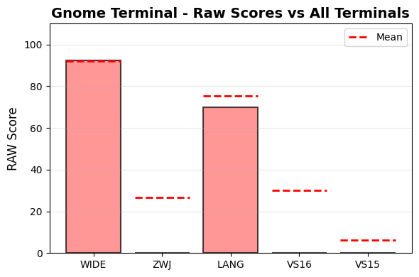
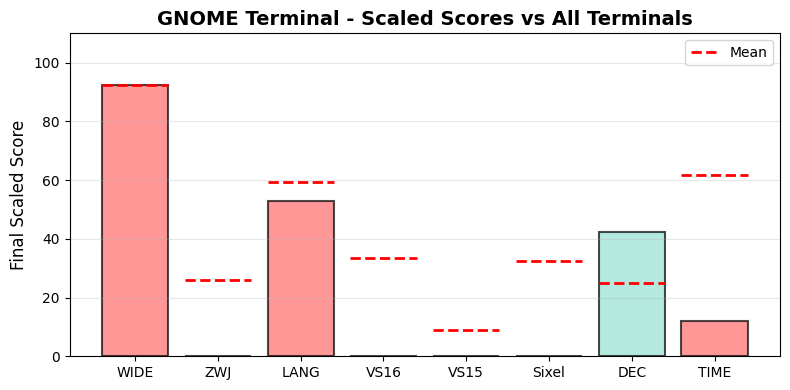

.. _gnometerminal:

Gnome Terminal
--------------

Tested Software version 3.52.0(VTE/7600) on Linux.
The homepage URL of this terminal is https://help.gnome.org/users/gnome-terminal/stable/.
Full results available at ucs-detect_ repository path
`data/linux-gnome-terminal-3.52.0.yaml <https://github.com/jquast/ucs-detect/blob/master/data/linux-gnome-terminal-3.52.0.yaml>`_.

.. _gnometerminalscores:

Score Breakdown
+++++++++++++++

Detailed breakdown of how scores are calculated for *Gnome Terminal*:

.. table::
   :class: sphinx-datatable

   ===  ========================================  ===========  ==============
     #  Score Type                                Raw Score    Scaled Score
   ===  ========================================  ===========  ==============
     1  :ref:`WIDE <gnometerminalwide>`           92.48%       92.3%
     2  :ref:`ZWJ <gnometerminalzwj>`             0.24%        0.2%
     3  :ref:`LANG <gnometerminallang>`           69.92%       44.2%
     4  :ref:`VS16 <gnometerminalvs16>`           0.00%        0.0%
     5  :ref:`VS15 <gnometerminalvs15>`           0.00%        0.0%
     6  :ref:`DEC Modes <gnometerminaldecmodes>`  28           42.4%
     7  :ref:`TIME <gnometerminaltime>`           7755.84s     10.7%
   ===  ========================================  ===========  ==============

**Score Comparison Plots:**

The following plots show how this terminal's scores compare to all other terminals tested.

   Raw scores comparison across metrics (WIDE, ZWJ, LANG, VS16, VS15)

   Scaled scores comparison across metrics (normalized 0-100%)

**Final Score Calculation:**

- Raw Final Score: 30.82%
  (average of all raw scores: WIDE + ZWJ + LANG + VS16 + VS15 + DEC Modes + TIME) / 7
  the categorized 'average' absolute support level of this terminal
  Note: DEC Modes and TIME are normalized to 0-1 range before averaging

- Scaled Final Score: 1.2%
  (normalized across all terminals tested).
  *Scaled scores* are normalized (0-100%) relative to all terminals tested

**WIDE Score Details:**

Wide character support calculation:
- Total successful codepoints: 2522
- Total codepoints tested: 2727
- Best matching Unicode version: 15.0.0
- Formula: 2522 / 2727
- Result: 92.48%

**ZWJ Score Details:**

Emoji ZWJ (Zero-Width Joiner) support calculation:
- Total successful sequences: 2
- Total sequences tested: 850
- Best matching Emoji version: None
- Formula: 2 / 850
- Result: 0.24%

**VS16 Score Details:**

Variation Selector-16 support calculation:
- Errors: 100 of 100 codepoints tested
- Success rate: 0.0%
- Formula: 0.0 / 100
- Result: 0.00%

**VS15 Score Details:**

Variation Selector-15 support calculation:
- Errors: 100 of 100 codepoints tested
- Success rate: 0.0%
- Formula: 0.0 / 100
- Result: 0.00%

**DEC Modes Score Details:**

DEC Private Modes support calculation:
- Changeable modes: 28
- Total modes tested: 157
- Raw score: 28 modes
- Scaled: normalized against max changeable modes across all terminals

**TIME Score Details:**

Test execution time:
- Elapsed time: 7755.84 seconds
- Note: This is a raw measurement; lower is better
- Scaled score uses inverse log10 scaling across all terminals
- Scaled result: 10.7%

**LANG Score Details (Geometric Mean):**

Geometric mean calculation:
- Formula: (p₁ × p₂ × ... × pₙ)^(1/n) where n = 119 languages
- About `geometric mean <https://en.wikipedia.org/wiki/Geometric_mean>`_
- Result: 69.92%

.. _gnometerminalwide:

Wide character support
++++++++++++++++++++++

The best wide unicode table version for Gnome Terminal appears to be 
**15.0.0**, this is from a summary of the following
results:

.. table::
   :class: sphinx-datatable

   =========  ==========  =========  =============
   version      n_errors    n_total  pct_success
   =========  ==========  =========  =============
   '9.0.0'             0       1000  100.0%
   '10.0.0'            0        745  100.0%
   '11.0.0'            0         72  100.0%
   '12.0.0'            0         76  100.0%
   '12.1.0'            0          1  100.0%
   '13.0.0'            0        552  100.0%
   '14.0.0'            0         54  100.0%
   '15.0.0'            0         22  100.0%
   '15.1.0'            5          5  0.0%
   '16.0.0'          100        100  0.0%
   '17.0.0'          100        100  0.0%
   =========  ==========  =========  =============

Sequence of a WIDE character from Unicode Version 17.0.0, from midpoint of alignment failure records:

.. table::
   :class: sphinx-datatable

   ===  =================================================  =============  ==========  =========  ======
     #  Codepoint                                          Python         Category      wcwidth  Name
   ===  =================================================  =============  ==========  =========  ======
     1  `U+00018D8F <https://codepoints.net/U+00018D8F>`_  '\\U00018d8f'  Cn                  2  na
   ===  =================================================  =============  ==========  =========  ======

Total codepoints: 1

- Shell test using `printf(1)`_, ``'|'`` should align in output::

        $ printf "\xf0\x98\xb6\x8f|\\n12|\\n"
        𘶏|
        12|

- python `wcwidth.wcswidth()`_ measures width 2,
  while *Gnome Terminal* measures width 1.

.. _gnometerminalzwj:

Emoji ZWJ support
+++++++++++++++++

The best Emoji ZWJ table version for *Gnome Terminal* appears to be 
**None**, this is from a summary of the following
results:

.. table::
   :class: sphinx-datatable

   =========  ==========  =========  =============
   version      n_errors    n_total  pct_success
   =========  ==========  =========  =============
   '2.0'              21         22  4.5%
   '4.0'             100        100  0.0%
   '5.0'             100        100  0.0%
   '11.0'             73         73  0.0%
   '12.0'            100        100  0.0%
   '12.1'            100        100  0.0%
   '13.0'             50         51  2.0%
   '13.1'             83         83  0.0%
   '14.0'             20         20  0.0%
   '15.0'              1          1  0.0%
   '15.1'            100        100  0.0%
   '17.0'            100        100  0.0%
   =========  ==========  =========  =============

Sequence of an Emoji ZWJ Sequence from Emoji Version 17.0, from midpoint of alignment failure records:

.. table::
   :class: sphinx-datatable

   ===  =================================================  =============  ==========  =========  =================================
     #  Codepoint                                          Python         Category      wcwidth  Name
   ===  =================================================  =============  ==========  =========  =================================
     1  `U+0001F469 <https://codepoints.net/U+0001F469>`_  '\\U0001f469'  So                  2  WOMAN
     2  `U+0001F3FC <https://codepoints.net/U+0001F3FC>`_  '\\U0001f3fc'  Sk                  0  EMOJI MODIFIER FITZPATRICK TYPE-3
     3  `U+200D <https://codepoints.net/U+200D>`_          '\\u200d'      Cf                  0  ZERO WIDTH JOINER
     4  `U+0001FAEF <https://codepoints.net/U+0001FAEF>`_  '\\U0001faef'  Cn                  2  na
     5  `U+200D <https://codepoints.net/U+200D>`_          '\\u200d'      Cf                  0  ZERO WIDTH JOINER
     6  `U+0001F469 <https://codepoints.net/U+0001F469>`_  '\\U0001f469'  So                  2  WOMAN
     7  `U+0001F3FE <https://codepoints.net/U+0001F3FE>`_  '\\U0001f3fe'  Sk                  0  EMOJI MODIFIER FITZPATRICK TYPE-5
   ===  =================================================  =============  ==========  =========  =================================

Total codepoints: 7

- Shell test using `printf(1)`_, ``'|'`` should align in output::

        $ printf "\xf0\x9f\x91\xa9\xf0\x9f\x8f\xbc\xe2\x80\x8d\xf0\x9f\xab\xaf\xe2\x80\x8d\xf0\x9f\x91\xa9\xf0\x9f\x8f\xbe|\\n12|\\n"
        👩🏼‍🫯‍👩🏾|
        12|

- python `wcwidth.wcswidth()`_ measures width 2,
  while *Gnome Terminal* measures width 9.

.. _gnometerminalvs16:

Variation Selector-16 support
+++++++++++++++++++++++++++++

Emoji VS-16 results for *Gnome Terminal* is 100 errors
out of 100 total codepoints tested, 0.0% success.
Sequence of a NARROW Emoji made WIDE by *Variation Selector-16*, from midpoint of alignment failure records:

.. table::
   :class: sphinx-datatable

   ===  =========================================  =========  ==========  =========  =====================
     #  Codepoint                                  Python     Category      wcwidth  Name
   ===  =========================================  =========  ==========  =========  =====================
     1  `U+2618 <https://codepoints.net/U+2618>`_  '\\u2618'  So                  1  SHAMROCK
     2  `U+FE0F <https://codepoints.net/U+FE0F>`_  '\\ufe0f'  Mn                  0  VARIATION SELECTOR-16
   ===  =========================================  =========  ==========  =========  =====================

Total codepoints: 2

- Shell test using `printf(1)`_, ``'|'`` should align in output::

        $ printf "\xe2\x98\x98\xef\xb8\x8f|\\n12|\\n"
        ☘️|
        12|

- python `wcwidth.wcswidth()`_ measures width 2,
  while *Gnome Terminal* measures width 1.

.. _gnometerminalvs15:

Variation Selector-15 support
+++++++++++++++++++++++++++++

Emoji VS-15 results for *Gnome Terminal* is 100 errors
out of 100 total codepoints tested, 0.0% success.
Sequence of a WIDE Emoji made NARROW by *Variation Selector-15*, from midpoint of alignment failure records:

.. table::
   :class: sphinx-datatable

   ===  =========================================  =========  ==========  =========  =============================
     #  Codepoint                                  Python     Category      wcwidth  Name
   ===  =========================================  =========  ==========  =========  =============================
     1  `U+2757 <https://codepoints.net/U+2757>`_  '\\u2757'  So                  2  HEAVY EXCLAMATION MARK SYMBOL
     2  `U+FE0E <https://codepoints.net/U+FE0E>`_  '\\ufe0e'  Mn                  0  VARIATION SELECTOR-15
   ===  =========================================  =========  ==========  =========  =============================

Total codepoints: 2

- Shell test using `printf(1)`_, ``'|'`` should align in output::

        $ printf "\xe2\x9d\x97\xef\xb8\x8e|\\n1|\\n"
        ❗︎|
        1|

- python `wcwidth.wcswidth()`_ measures width 1,
  while *Gnome Terminal* measures width 2.

.. _gnometerminallang:

Language Support
++++++++++++++++

The following 2 languages were tested with 100% success:

Mongolian, Halh (Mongolian), Tagalog (Tagalog).

The following 117 languages are not fully supported:

.. table::
   :class: sphinx-datatable

   ====================================================================================  ==========  =========  =============
   lang                                                                                    n_errors    n_total  pct_success
   ====================================================================================  ==========  =========  =============
   :ref:`Tamil <gnometerminallangtamil>`                                                        100        105  4.8%
   :ref:`Tamil (Sri Lanka) <gnometerminallangtamilsrilanka>`                                    100        105  4.8%
   :ref:`Shan <gnometerminallangshan>`                                                          100        106  5.7%
   :ref:`Sanskrit (Grantha) <gnometerminallangsanskritgrantha>`                                 100        107  6.5%
   :ref:`Javanese (Javanese) <gnometerminallangjavanesejavanese>`                               100        108  7.4%
   :ref:`Kannada <gnometerminallangkannada>`                                                    100        109  8.3%
   :ref:`Khmer, Central <gnometerminallangkhmercentral>`                                        100        114  12.3%
   :ref:`Malayalam <gnometerminallangmalayalam>`                                                100        114  12.3%
   :ref:`Bengali <gnometerminallangbengali>`                                                    100        115  13.0%
   :ref:`Burmese <gnometerminallangburmese>`                                                    100        115  13.0%
   :ref:`Khün <gnometerminallangkhn>`                                                           100        121  17.4%
   :ref:`Sanskrit <gnometerminallangsanskrit>`                                                  100        130  23.1%
   :ref:`Nepali <gnometerminallangnepali>`                                                      100        135  25.9%
   :ref:`Marathi <gnometerminallangmarathi>`                                                    100        136  26.5%
   :ref:`Tamang, Eastern <gnometerminallangtamangeastern>`                                       33         45  26.7%
   :ref:`Telugu <gnometerminallangtelugu>`                                                      100        141  29.1%
   :ref:`Gujarati <gnometerminallanggujarati>`                                                  100        143  30.1%
   :ref:`Mon <gnometerminallangmon>`                                                            100        145  31.0%
   :ref:`Hindi <gnometerminallanghindi>`                                                        100        146  31.5%
   :ref:`Maithili <gnometerminallangmaithili>`                                                  100        153  34.6%
   :ref:`Bhojpuri <gnometerminallangbhojpuri>`                                                  100        173  42.2%
   :ref:`Panjabi, Eastern <gnometerminallangpanjabieastern>`                                    100        173  42.2%
   :ref:`Sinhala <gnometerminallangsinhala>`                                                    100        175  42.9%
   :ref:`Magahi <gnometerminallangmagahi>`                                                      100        191  47.6%
   :ref:`Chakma <gnometerminallangchakma>`                                                      100        248  59.7%
   :ref:`Vietnamese (Han nom) <gnometerminallangvietnamesehannom>`                                5        199  97.5%
   :ref:`Chinese, Hakka <gnometerminallangchinesehakka>`                                          5        212  97.6%
   :ref:`Chinese, Mandarin (Tianjin) <gnometerminallangchinesemandarintianjin>`                   5        212  97.6%
   :ref:`Chinese, Min Nan <gnometerminallangchineseminnan>`                                       5        212  97.6%
   :ref:`Thai (2) <gnometerminallangthai2>`                                                       7        313  97.8%
   :ref:`Chinese, Mandarin (Simplified) <gnometerminallangchinesemandarinsimplified>`             5        225  97.8%
   :ref:`Japanese (Osaka) <gnometerminallangjapaneseosaka>`                                       6        308  98.1%
   :ref:`Chinese, Mandarin (Harbin) <gnometerminallangchinesemandarinharbin>`                     4        210  98.1%
   :ref:`Chinese, Yue <gnometerminallangchineseyue>`                                              4        210  98.1%
   :ref:`Chinese, Jinyu <gnometerminallangchinesejinyu>`                                          4        212  98.1%
   :ref:`Chinese, Mandarin (Nanjing) <gnometerminallangchinesemandarinnanjing>`                   4        212  98.1%
   :ref:`Chinese, Xiang <gnometerminallangchinesexiang>`                                          4        212  98.1%
   :ref:`Nuosu <gnometerminallangnuosu>`                                                          4        230  98.3%
   :ref:`Japanese <gnometerminallangjapanese>`                                                    5        299  98.3%
   :ref:`Japanese (Tokyo) <gnometerminallangjapanesetokyo>`                                       5        320  98.4%
   :ref:`Chinese, Mandarin (Traditional) <gnometerminallangchinesemandarintraditional>`           3        210  98.6%
   :ref:`Chinese, Mandarin (Beijing) <gnometerminallangchinesemandarinbeijing>`                   3        212  98.6%
   :ref:`Lao <gnometerminallanglao>`                                                              5        426  98.8%
   :ref:`(Jinan) <gnometerminallangjinan>`                                                        2        211  99.1%
   :ref:`Chinese, Gan <gnometerminallangchinesegan>`                                              2        211  99.1%
   :ref:`Chinese, Mandarin (Guiyang) <gnometerminallangchinesemandaringuiyang>`                   2        211  99.1%
   :ref:`Chinese, Wu <gnometerminallangchinesewu>`                                                2        211  99.1%
   :ref:`Thai <gnometerminallangthai>`                                                            3        341  99.1%
   :ref:`Chickasaw <gnometerminallangchickasaw>`                                                  4        554  99.3%
   :ref:`Bora <gnometerminallangbora>`                                                            7       1007  99.3%
   :ref:`Amarakaeri <gnometerminallangamarakaeri>`                                                6       1006  99.4%
   :ref:`Gumuz <gnometerminallanggumuz>`                                                          6       1006  99.4%
   :ref:`Nanai <gnometerminallangnanai>`                                                          6       1006  99.4%
   :ref:`Navajo <gnometerminallangnavajo>`                                                        6       1006  99.4%
   :ref:`Orok <gnometerminallangorok>`                                                            6       1006  99.4%
   :ref:`Shipibo-Conibo <gnometerminallangshipiboconibo>`                                         6       1006  99.4%
   :ref:`Veps <gnometerminallangveps>`                                                            6       1006  99.4%
   :ref:`Yaneshaʼ <gnometerminallangyanesha>`                                                     6       1006  99.4%
   :ref:`Evenki <gnometerminallangevenki>`                                                        5        899  99.4%
   :ref:`(Yeonbyeon) <gnometerminallangyeonbyeon>`                                                5       1005  99.5%
   :ref:`Colorado <gnometerminallangcolorado>`                                                    5       1005  99.5%
   :ref:`Gilyak <gnometerminallanggilyak>`                                                        5       1005  99.5%
   :ref:`Korean <gnometerminallangkorean>`                                                        5       1005  99.5%
   :ref:`Secoya <gnometerminallangsecoya>`                                                        5       1005  99.5%
   :ref:`Siona <gnometerminallangsiona>`                                                          5       1005  99.5%
   :ref:`South Azerbaijani <gnometerminallangsouthazerbaijani>`                                   5       1005  99.5%
   :ref:`Arabic, Standard <gnometerminallangarabicstandard>`                                      4       1004  99.6%
   :ref:`Assyrian Neo-Aramaic <gnometerminallangassyrianneoaramaic>`                              4       1004  99.6%
   :ref:`Catalan (2) <gnometerminallangcatalan2>`                                                 4       1004  99.6%
   :ref:`French (Welche) <gnometerminallangfrenchwelche>`                                         4       1004  99.6%
   :ref:`Fur <gnometerminallangfur>`                                                              4       1004  99.6%
   :ref:`Kabyle <gnometerminallangkabyle>`                                                        4       1004  99.6%
   :ref:`Lingala (tones) <gnometerminallanglingalatones>`                                         4       1004  99.6%
   :ref:`Maldivian <gnometerminallangmaldivian>`                                                  4       1004  99.6%
   :ref:`Mazahua Central <gnometerminallangmazahuacentral>`                                       4       1004  99.6%
   :ref:`Mirandese <gnometerminallangmirandese>`                                                  4       1004  99.6%
   :ref:`Mixtec, Metlatónoc <gnometerminallangmixtecmetlatnoc>`                                   4       1004  99.6%
   :ref:`Picard <gnometerminallangpicard>`                                                        4       1004  99.6%
   :ref:`Pular (Adlam) <gnometerminallangpularadlam>`                                             4       1004  99.6%
   :ref:`Saint Lucian Creole French <gnometerminallangsaintluciancreolefrench>`                   4       1004  99.6%
   :ref:`Tamazight, Central Atlas <gnometerminallangtamazightcentralatlas>`                       4       1004  99.6%
   :ref:`Tem <gnometerminallangtem>`                                                              4       1004  99.6%
   :ref:`Ticuna <gnometerminallangticuna>`                                                        4       1004  99.6%
   :ref:`Yiddish, Eastern <gnometerminallangyiddisheastern>`                                      4       1004  99.6%
   :ref:`Éwé <gnometerminallangw>`                                                                4       1004  99.6%
   :ref:`Waama <gnometerminallangwaama>`                                                          3       1000  99.7%
   :ref:`Aja <gnometerminallangaja>`                                                              3       1003  99.7%
   :ref:`Baatonum <gnometerminallangbaatonum>`                                                    3       1003  99.7%
   :ref:`Bamun <gnometerminallangbamun>`                                                          3       1003  99.7%
   :ref:`Belanda Viri <gnometerminallangbelandaviri>`                                             3       1003  99.7%
   :ref:`Chinantec, Chiltepec <gnometerminallangchinantecchiltepec>`                              3       1003  99.7%
   :ref:`Dagaare, Southern <gnometerminallangdagaaresouthern>`                                    3       1003  99.7%
   :ref:`Dari <gnometerminallangdari>`                                                            3       1003  99.7%
   :ref:`Dendi <gnometerminallangdendi>`                                                          3       1003  99.7%
   :ref:`Dinka, Northeastern <gnometerminallangdinkanortheastern>`                                3       1003  99.7%
   :ref:`Ditammari <gnometerminallangditammari>`                                                  3       1003  99.7%
   :ref:`Farsi, Western <gnometerminallangfarsiwestern>`                                          3       1003  99.7%
   :ref:`Fon <gnometerminallangfon>`                                                              3       1003  99.7%
   :ref:`Ga <gnometerminallangga>`                                                                3       1003  99.7%
   :ref:`Gen <gnometerminallanggen>`                                                              3       1003  99.7%
   :ref:`Lamnso' <gnometerminallanglamnso>`                                                       3       1003  99.7%
   :ref:`Maori (2) <gnometerminallangmaori2>`                                                     3       1003  99.7%
   :ref:`Mòoré <gnometerminallangmor>`                                                            3       1003  99.7%
   :ref:`Otomi, Mezquital <gnometerminallangotomimezquital>`                                      3       1003  99.7%
   :ref:`Panjabi, Western <gnometerminallangpanjabiwestern>`                                      3       1003  99.7%
   :ref:`Pashto, Northern <gnometerminallangpashtonorthern>`                                      3       1003  99.7%
   :ref:`Seraiki <gnometerminallangseraiki>`                                                      3       1003  99.7%
   :ref:`Serer-Sine <gnometerminallangserersine>`                                                 3       1003  99.7%
   :ref:`Uduk <gnometerminallanguduk>`                                                            3       1003  99.7%
   :ref:`Urdu <gnometerminallangurdu>`                                                            3       1003  99.7%
   :ref:`Urdu (2) <gnometerminallangurdu2>`                                                       3       1003  99.7%
   :ref:`Vietnamese <gnometerminallangvietnamese>`                                                3       1003  99.7%
   :ref:`Yoruba <gnometerminallangyoruba>`                                                        3       1003  99.7%
   :ref:`Dangme <gnometerminallangdangme>`                                                        2       1002  99.8%
   :ref:`Dzongkha <gnometerminallangdzongkha>`                                                    2       1002  99.8%
   :ref:`Tai Dam <gnometerminallangtaidam>`                                                       2       1002  99.8%
   :ref:`Tibetan, Central <gnometerminallangtibetancentral>`                                      2       1002  99.8%
   ====================================================================================  ==========  =========  =============

.. _gnometerminallangtamil:

Tamil
^^^^^

Sequence of language *Tamil* from midpoint of alignment failure records:

.. table::
   :class: sphinx-datatable

   ===  =========================================  =========  ==========  =========  ==================
     #  Codepoint                                  Python     Category      wcwidth  Name
   ===  =========================================  =========  ==========  =========  ==================
     1  `U+0BAE <https://codepoints.net/U+0BAE>`_  '\\u0bae'  Lo                  1  TAMIL LETTER MA
     2  `U+0BA9 <https://codepoints.net/U+0BA9>`_  '\\u0ba9'  Lo                  1  TAMIL LETTER NNNA
     3  `U+0BBF <https://codepoints.net/U+0BBF>`_  '\\u0bbf'  Mc                  0  TAMIL VOWEL SIGN I
     4  `U+0BA4 <https://codepoints.net/U+0BA4>`_  '\\u0ba4'  Lo                  1  TAMIL LETTER TA
   ===  =========================================  =========  ==========  =========  ==================

Total codepoints: 4

- Shell test using `printf(1)`_, ``'|'`` should align in output::

        $ printf "\xe0\xae\xae\xe0\xae\xa9\xe0\xae\xbf\xe0\xae\xa4|\\n123|\\n"
        மனித|
        123|

- python `wcwidth.wcswidth()`_ measures width 3,
  while *Gnome Terminal* measures width 4.

.. _gnometerminallangtamilsrilanka:

Tamil (Sri Lanka)
^^^^^^^^^^^^^^^^^

Sequence of language *Tamil (Sri Lanka)* from midpoint of alignment failure records:

.. table::
   :class: sphinx-datatable

   ===  =========================================  =========  ==========  =========  ==================
     #  Codepoint                                  Python     Category      wcwidth  Name
   ===  =========================================  =========  ==========  =========  ==================
     1  `U+0BAE <https://codepoints.net/U+0BAE>`_  '\\u0bae'  Lo                  1  TAMIL LETTER MA
     2  `U+0BA9 <https://codepoints.net/U+0BA9>`_  '\\u0ba9'  Lo                  1  TAMIL LETTER NNNA
     3  `U+0BBF <https://codepoints.net/U+0BBF>`_  '\\u0bbf'  Mc                  0  TAMIL VOWEL SIGN I
     4  `U+0BA4 <https://codepoints.net/U+0BA4>`_  '\\u0ba4'  Lo                  1  TAMIL LETTER TA
   ===  =========================================  =========  ==========  =========  ==================

Total codepoints: 4

- Shell test using `printf(1)`_, ``'|'`` should align in output::

        $ printf "\xe0\xae\xae\xe0\xae\xa9\xe0\xae\xbf\xe0\xae\xa4|\\n123|\\n"
        மனித|
        123|

- python `wcwidth.wcswidth()`_ measures width 3,
  while *Gnome Terminal* measures width 4.

.. _gnometerminallangshan:

Shan
^^^^

Sequence of language *Shan* from midpoint of alignment failure records:

.. table::
   :class: sphinx-datatable

   ===  =========================================  =========  ==========  =========  ================================
     #  Codepoint                                  Python     Category      wcwidth  Name
   ===  =========================================  =========  ==========  =========  ================================
     1  `U+101C <https://codepoints.net/U+101C>`_  '\\u101c'  Lo                  1  MYANMAR LETTER LA
     2  `U+102D <https://codepoints.net/U+102D>`_  '\\u102d'  Mn                  0  MYANMAR VOWEL SIGN I
     3  `U+1075 <https://codepoints.net/U+1075>`_  '\\u1075'  Lo                  1  MYANMAR LETTER SHAN KA
     4  `U+103A <https://codepoints.net/U+103A>`_  '\\u103a'  Mn                  0  MYANMAR SIGN ASAT
     5  `U+1088 <https://codepoints.net/U+1088>`_  '\\u1088'  Mc                  0  MYANMAR SIGN SHAN TONE-3
     6  `U+1015 <https://codepoints.net/U+1015>`_  '\\u1015'  Lo                  1  MYANMAR LETTER PA
     7  `U+102D <https://codepoints.net/U+102D>`_  '\\u102d'  Mn                  0  MYANMAR VOWEL SIGN I
     8  `U+102F <https://codepoints.net/U+102F>`_  '\\u102f'  Mn                  0  MYANMAR VOWEL SIGN U
     9  `U+107C <https://codepoints.net/U+107C>`_  '\\u107c'  Lo                  1  MYANMAR LETTER SHAN NA
    10  `U+103A <https://codepoints.net/U+103A>`_  '\\u103a'  Mn                  0  MYANMAR SIGN ASAT
    11  `U+107D <https://codepoints.net/U+107D>`_  '\\u107d'  Lo                  1  MYANMAR LETTER SHAN PHA
    12  `U+1062 <https://codepoints.net/U+1062>`_  '\\u1062'  Mc                  0  MYANMAR VOWEL SIGN SGAW KAREN EU
    13  `U+101D <https://codepoints.net/U+101D>`_  '\\u101d'  Lo                  1  MYANMAR LETTER WA
    14  `U+103A <https://codepoints.net/U+103A>`_  '\\u103a'  Mn                  0  MYANMAR SIGN ASAT
    15  `U+1087 <https://codepoints.net/U+1087>`_  '\\u1087'  Mc                  0  MYANMAR SIGN SHAN TONE-2
   ===  =========================================  =========  ==========  =========  ================================

Total codepoints: 15

- Shell test using `printf(1)`_, ``'|'`` should align in output::

        $ printf "\xe1\x80\x9c\xe1\x80\xad\xe1\x81\xb5\xe1\x80\xba\xe1\x82\x88\xe1\x80\x95\xe1\x80\xad\xe1\x80\xaf\xe1\x81\xbc\xe1\x80\xba\xe1\x81\xbd\xe1\x81\xa2\xe1\x80\x9d\xe1\x80\xba\xe1\x82\x87|\\n123456|\\n"
        လိၵ်ႈပိုၼ်ၽၢဝ်ႇ|
        123456|

- python `wcwidth.wcswidth()`_ measures width 6,
  while *Gnome Terminal* measures width 9.

.. _gnometerminallangsanskritgrantha:

Sanskrit (Grantha)
^^^^^^^^^^^^^^^^^^

Sequence of language *Sanskrit (Grantha)* from midpoint of alignment failure records:

.. table::
   :class: sphinx-datatable

   ===  =================================================  =============  ==========  =========  =====================
     #  Codepoint                                          Python         Category      wcwidth  Name
   ===  =================================================  =============  ==========  =========  =====================
     1  `U+0001132E <https://codepoints.net/U+0001132E>`_  '\\U0001132e'  Lo                  1  GRANTHA LETTER MA
     2  `U+0001133E <https://codepoints.net/U+0001133E>`_  '\\U0001133e'  Mc                  0  GRANTHA VOWEL SIGN AA
     3  `U+00011328 <https://codepoints.net/U+00011328>`_  '\\U00011328'  Lo                  1  GRANTHA LETTER NA
     4  `U+00011335 <https://codepoints.net/U+00011335>`_  '\\U00011335'  Lo                  1  GRANTHA LETTER VA
     5  `U+0001133E <https://codepoints.net/U+0001133E>`_  '\\U0001133e'  Mc                  0  GRANTHA VOWEL SIGN AA
     6  `U+00011327 <https://codepoints.net/U+00011327>`_  '\\U00011327'  Lo                  1  GRANTHA LETTER DHA
     7  `U+0001133F <https://codepoints.net/U+0001133F>`_  '\\U0001133f'  Mc                  0  GRANTHA VOWEL SIGN I
     8  `U+00011315 <https://codepoints.net/U+00011315>`_  '\\U00011315'  Lo                  1  GRANTHA LETTER KA
     9  `U+0001133E <https://codepoints.net/U+0001133E>`_  '\\U0001133e'  Mc                  0  GRANTHA VOWEL SIGN AA
    10  `U+00011330 <https://codepoints.net/U+00011330>`_  '\\U00011330'  Lo                  1  GRANTHA LETTER RA
    11  `U+0001133E <https://codepoints.net/U+0001133E>`_  '\\U0001133e'  Mc                  0  GRANTHA VOWEL SIGN AA
    12  `U+00011323 <https://codepoints.net/U+00011323>`_  '\\U00011323'  Lo                  1  GRANTHA LETTER NNA
    13  `U+0001133E <https://codepoints.net/U+0001133E>`_  '\\U0001133e'  Mc                  0  GRANTHA VOWEL SIGN AA
    14  `U+00011302 <https://codepoints.net/U+00011302>`_  '\\U00011302'  Mc                  0  GRANTHA SIGN ANUSVARA
   ===  =================================================  =============  ==========  =========  =====================

Total codepoints: 14

- Shell test using `printf(1)`_, ``'|'`` should align in output::

        $ printf "\xf0\x91\x8c\xae\xf0\x91\x8c\xbe\xf0\x91\x8c\xa8\xf0\x91\x8c\xb5\xf0\x91\x8c\xbe\xf0\x91\x8c\xa7\xf0\x91\x8c\xbf\xf0\x91\x8c\x95\xf0\x91\x8c\xbe\xf0\x91\x8c\xb0\xf0\x91\x8c\xbe\xf0\x91\x8c\xa3\xf0\x91\x8c\xbe\xf0\x91\x8c\x82|\\n1234567|\\n"
        𑌮𑌾𑌨𑌵𑌾𑌧𑌿𑌕𑌾𑌰𑌾𑌣𑌾𑌂|
        1234567|

- python `wcwidth.wcswidth()`_ measures width 7,
  while *Gnome Terminal* measures width 14.

.. _gnometerminallangjavanesejavanese:

Javanese (Javanese)
^^^^^^^^^^^^^^^^^^^

Sequence of language *Javanese (Javanese)* from midpoint of alignment failure records:

.. table::
   :class: sphinx-datatable

   ===  =========================================  =========  ==========  =========  ========================
     #  Codepoint                                  Python     Category      wcwidth  Name
   ===  =========================================  =========  ==========  =========  ========================
     1  `U+A9B2 <https://codepoints.net/U+A9B2>`_  '\\ua9b2'  Lo                  1  JAVANESE LETTER HA
     2  `U+A9B8 <https://codepoints.net/U+A9B8>`_  '\\ua9b8'  Mn                  0  JAVANESE VOWEL SIGN SUKU
     3  `U+A9A9 <https://codepoints.net/U+A9A9>`_  '\\ua9a9'  Lo                  1  JAVANESE LETTER MA
     4  `U+A9A0 <https://codepoints.net/U+A9A0>`_  '\\ua9a0'  Lo                  1  JAVANESE LETTER TA
   ===  =========================================  =========  ==========  =========  ========================

Total codepoints: 4

- Shell test using `printf(1)`_, ``'|'`` should align in output::

        $ printf "\xea\xa6\xb2\xea\xa6\xb8\xea\xa6\xa9\xea\xa6\xa0|\\n123|\\n"
        ꦲꦸꦩꦠ|
        123|

- python `wcwidth.wcswidth()`_ measures width 3,
  while *Gnome Terminal* measures width 4.

.. _gnometerminallangkannada:

Kannada
^^^^^^^

Sequence of language *Kannada* from midpoint of alignment failure records:

.. table::
   :class: sphinx-datatable

   ===  =========================================  =========  ==========  =========  =====================
     #  Codepoint                                  Python     Category      wcwidth  Name
   ===  =========================================  =========  ==========  =========  =====================
     1  `U+0CAE <https://codepoints.net/U+0CAE>`_  '\\u0cae'  Lo                  1  KANNADA LETTER MA
     2  `U+0CBE <https://codepoints.net/U+0CBE>`_  '\\u0cbe'  Mc                  0  KANNADA VOWEL SIGN AA
     3  `U+0CA8 <https://codepoints.net/U+0CA8>`_  '\\u0ca8'  Lo                  1  KANNADA LETTER NA
     4  `U+0CB5 <https://codepoints.net/U+0CB5>`_  '\\u0cb5'  Lo                  1  KANNADA LETTER VA
   ===  =========================================  =========  ==========  =========  =====================

Total codepoints: 4

- Shell test using `printf(1)`_, ``'|'`` should align in output::

        $ printf "\xe0\xb2\xae\xe0\xb2\xbe\xe0\xb2\xa8\xe0\xb2\xb5|\\n123|\\n"
        ಮಾನವ|
        123|

- python `wcwidth.wcswidth()`_ measures width 3,
  while *Gnome Terminal* measures width 4.

.. _gnometerminallangkhmercentral:

Khmer, Central
^^^^^^^^^^^^^^

Sequence of language *Khmer, Central* from midpoint of alignment failure records:

.. table::
   :class: sphinx-datatable

   ===  =========================================  =========  ==========  =========  ===================
     #  Codepoint                                  Python     Category      wcwidth  Name
   ===  =========================================  =========  ==========  =========  ===================
     1  `U+179F <https://codepoints.net/U+179F>`_  '\\u179f'  Lo                  1  KHMER LETTER SA
     2  `U+17C1 <https://codepoints.net/U+17C1>`_  '\\u17c1'  Mc                  0  KHMER VOWEL SIGN E
     3  `U+1785 <https://codepoints.net/U+1785>`_  '\\u1785'  Lo                  1  KHMER LETTER CA
     4  `U+1780 <https://codepoints.net/U+1780>`_  '\\u1780'  Lo                  1  KHMER LETTER KA
     5  `U+17D2 <https://codepoints.net/U+17D2>`_  '\\u17d2'  Mn                  0  KHMER SIGN COENG
     6  `U+178A <https://codepoints.net/U+178A>`_  '\\u178a'  Lo                  1  KHMER LETTER DA
     7  `U+17B8 <https://codepoints.net/U+17B8>`_  '\\u17b8'  Mn                  0  KHMER VOWEL SIGN II
     8  `U+1794 <https://codepoints.net/U+1794>`_  '\\u1794'  Lo                  1  KHMER LETTER BA
     9  `U+17D2 <https://codepoints.net/U+17D2>`_  '\\u17d2'  Mn                  0  KHMER SIGN COENG
    10  `U+179A <https://codepoints.net/U+179A>`_  '\\u179a'  Lo                  1  KHMER LETTER RO
    11  `U+1780 <https://codepoints.net/U+1780>`_  '\\u1780'  Lo                  1  KHMER LETTER KA
    12  `U+17B6 <https://codepoints.net/U+17B6>`_  '\\u17b6'  Mc                  0  KHMER VOWEL SIGN AA
    13  `U+179F <https://codepoints.net/U+179F>`_  '\\u179f'  Lo                  1  KHMER LETTER SA
    14  `U+1787 <https://codepoints.net/U+1787>`_  '\\u1787'  Lo                  1  KHMER LETTER CO
    15  `U+17B6 <https://codepoints.net/U+17B6>`_  '\\u17b6'  Mc                  0  KHMER VOWEL SIGN AA
    16  `U+179F <https://codepoints.net/U+179F>`_  '\\u179f'  Lo                  1  KHMER LETTER SA
    17  `U+1780 <https://codepoints.net/U+1780>`_  '\\u1780'  Lo                  1  KHMER LETTER KA
    18  `U+179B <https://codepoints.net/U+179B>`_  '\\u179b'  Lo                  1  KHMER LETTER LO
    19  `U+179F <https://codepoints.net/U+179F>`_  '\\u179f'  Lo                  1  KHMER LETTER SA
    20  `U+17D2 <https://codepoints.net/U+17D2>`_  '\\u17d2'  Mn                  0  KHMER SIGN COENG
    21  `U+178A <https://codepoints.net/U+178A>`_  '\\u178a'  Lo                  1  KHMER LETTER DA
    22  `U+17B8 <https://codepoints.net/U+17B8>`_  '\\u17b8'  Mn                  0  KHMER VOWEL SIGN II
    23  `U+1796 <https://codepoints.net/U+1796>`_  '\\u1796'  Lo                  1  KHMER LETTER PO
    24  `U+17B8 <https://codepoints.net/U+17B8>`_  '\\u17b8'  Mn                  0  KHMER VOWEL SIGN II
    25  `U+179F <https://codepoints.net/U+179F>`_  '\\u179f'  Lo                  1  KHMER LETTER SA
    26  `U+17B7 <https://codepoints.net/U+17B7>`_  '\\u17b7'  Mn                  0  KHMER VOWEL SIGN I
    27  `U+1791 <https://codepoints.net/U+1791>`_  '\\u1791'  Lo                  1  KHMER LETTER TO
    28  `U+17D2 <https://codepoints.net/U+17D2>`_  '\\u17d2'  Mn                  0  KHMER SIGN COENG
    29  `U+1792 <https://codepoints.net/U+1792>`_  '\\u1792'  Lo                  1  KHMER LETTER THO
    30  `U+17B7 <https://codepoints.net/U+17B7>`_  '\\u17b7'  Mn                  0  KHMER VOWEL SIGN I
    31  `U+1798 <https://codepoints.net/U+1798>`_  '\\u1798'  Lo                  1  KHMER LETTER MO
    32  `U+1793 <https://codepoints.net/U+1793>`_  '\\u1793'  Lo                  1  KHMER LETTER NO
    33  `U+17BB <https://codepoints.net/U+17BB>`_  '\\u17bb'  Mn                  0  KHMER VOWEL SIGN U
    34  `U+179F <https://codepoints.net/U+179F>`_  '\\u179f'  Lo                  1  KHMER LETTER SA
    35  `U+17D2 <https://codepoints.net/U+17D2>`_  '\\u17d2'  Mn                  0  KHMER SIGN COENG
    36  `U+179F <https://codepoints.net/U+179F>`_  '\\u179f'  Lo                  1  KHMER LETTER SA
   ===  =========================================  =========  ==========  =========  ===================

Total codepoints: 36

- Shell test using `printf(1)`_, ``'|'`` should align in output::

        $ printf "\xe1\x9e\x9f\xe1\x9f\x81\xe1\x9e\x85\xe1\x9e\x80\xe1\x9f\x92\xe1\x9e\x8a\xe1\x9e\xb8\xe1\x9e\x94\xe1\x9f\x92\xe1\x9e\x9a\xe1\x9e\x80\xe1\x9e\xb6\xe1\x9e\x9f\xe1\x9e\x87\xe1\x9e\xb6\xe1\x9e\x9f\xe1\x9e\x80\xe1\x9e\x9b\xe1\x9e\x9f\xe1\x9f\x92\xe1\x9e\x8a\xe1\x9e\xb8\xe1\x9e\x96\xe1\x9e\xb8\xe1\x9e\x9f\xe1\x9e\xb7\xe1\x9e\x91\xe1\x9f\x92\xe1\x9e\x92\xe1\x9e\xb7\xe1\x9e\x98\xe1\x9e\x93\xe1\x9e\xbb\xe1\x9e\x9f\xe1\x9f\x92\xe1\x9e\x9f|\\n1234567890123456789012|\\n"
        សេចក្ដីប្រកាសជាសកលស្ដីពីសិទ្ធិមនុស្ស|
        1234567890123456789012|

- python `wcwidth.wcswidth()`_ measures width 22,
  while *Gnome Terminal* measures width 25.

.. _gnometerminallangmalayalam:

Malayalam
^^^^^^^^^

Sequence of language *Malayalam* from midpoint of alignment failure records:

.. table::
   :class: sphinx-datatable

   ===  =========================================  =========  ==========  =========  =======================
     #  Codepoint                                  Python     Category      wcwidth  Name
   ===  =========================================  =========  ==========  =========  =======================
     1  `U+0D2E <https://codepoints.net/U+0D2E>`_  '\\u0d2e'  Lo                  1  MALAYALAM LETTER MA
     2  `U+0D28 <https://codepoints.net/U+0D28>`_  '\\u0d28'  Lo                  1  MALAYALAM LETTER NA
     3  `U+0D41 <https://codepoints.net/U+0D41>`_  '\\u0d41'  Mn                  0  MALAYALAM VOWEL SIGN U
     4  `U+0D37 <https://codepoints.net/U+0D37>`_  '\\u0d37'  Lo                  1  MALAYALAM LETTER SSA
     5  `U+0D4D <https://codepoints.net/U+0D4D>`_  '\\u0d4d'  Mn                  0  MALAYALAM SIGN VIRAMA
     6  `U+0D2F <https://codepoints.net/U+0D2F>`_  '\\u0d2f'  Lo                  1  MALAYALAM LETTER YA
     7  `U+0D3E <https://codepoints.net/U+0D3E>`_  '\\u0d3e'  Mc                  0  MALAYALAM VOWEL SIGN AA
     8  `U+0D35 <https://codepoints.net/U+0D35>`_  '\\u0d35'  Lo                  1  MALAYALAM LETTER VA
     9  `U+0D15 <https://codepoints.net/U+0D15>`_  '\\u0d15'  Lo                  1  MALAYALAM LETTER KA
    10  `U+0D3E <https://codepoints.net/U+0D3E>`_  '\\u0d3e'  Mc                  0  MALAYALAM VOWEL SIGN AA
    11  `U+0D36 <https://codepoints.net/U+0D36>`_  '\\u0d36'  Lo                  1  MALAYALAM LETTER SHA
    12  `U+0D19 <https://codepoints.net/U+0D19>`_  '\\u0d19'  Lo                  1  MALAYALAM LETTER NGA
    13  `U+0D4D <https://codepoints.net/U+0D4D>`_  '\\u0d4d'  Mn                  0  MALAYALAM SIGN VIRAMA
    14  `U+0D19 <https://codepoints.net/U+0D19>`_  '\\u0d19'  Lo                  1  MALAYALAM LETTER NGA
    15  `U+0D33 <https://codepoints.net/U+0D33>`_  '\\u0d33'  Lo                  1  MALAYALAM LETTER LLA
    16  `U+0D46 <https://codepoints.net/U+0D46>`_  '\\u0d46'  Mc                  0  MALAYALAM VOWEL SIGN E
    17  `U+0D15 <https://codepoints.net/U+0D15>`_  '\\u0d15'  Lo                  1  MALAYALAM LETTER KA
    18  `U+0D4D <https://codepoints.net/U+0D4D>`_  '\\u0d4d'  Mn                  0  MALAYALAM SIGN VIRAMA
    19  `U+0D15 <https://codepoints.net/U+0D15>`_  '\\u0d15'  Lo                  1  MALAYALAM LETTER KA
    20  `U+0D41 <https://codepoints.net/U+0D41>`_  '\\u0d41'  Mn                  0  MALAYALAM VOWEL SIGN U
    21  `U+0D31 <https://codepoints.net/U+0D31>`_  '\\u0d31'  Lo                  1  MALAYALAM LETTER RRA
    22  `U+0D3F <https://codepoints.net/U+0D3F>`_  '\\u0d3f'  Mc                  0  MALAYALAM VOWEL SIGN I
    23  `U+0D15 <https://codepoints.net/U+0D15>`_  '\\u0d15'  Lo                  1  MALAYALAM LETTER KA
    24  `U+0D4D <https://codepoints.net/U+0D4D>`_  '\\u0d4d'  Mn                  0  MALAYALAM SIGN VIRAMA
    25  `U+0D15 <https://codepoints.net/U+0D15>`_  '\\u0d15'  Lo                  1  MALAYALAM LETTER KA
    26  `U+0D41 <https://codepoints.net/U+0D41>`_  '\\u0d41'  Mn                  0  MALAYALAM VOWEL SIGN U
    27  `U+0D28 <https://codepoints.net/U+0D28>`_  '\\u0d28'  Lo                  1  MALAYALAM LETTER NA
    28  `U+0D4D <https://codepoints.net/U+0D4D>`_  '\\u0d4d'  Mn                  0  MALAYALAM SIGN VIRAMA
    29  `U+0D28 <https://codepoints.net/U+0D28>`_  '\\u0d28'  Lo                  1  MALAYALAM LETTER NA
   ===  =========================================  =========  ==========  =========  =======================

Total codepoints: 29

- Shell test using `printf(1)`_, ``'|'`` should align in output::

        $ printf "\xe0\xb4\xae\xe0\xb4\xa8\xe0\xb5\x81\xe0\xb4\xb7\xe0\xb5\x8d\xe0\xb4\xaf\xe0\xb4\xbe\xe0\xb4\xb5\xe0\xb4\x95\xe0\xb4\xbe\xe0\xb4\xb6\xe0\xb4\x99\xe0\xb5\x8d\xe0\xb4\x99\xe0\xb4\xb3\xe0\xb5\x86\xe0\xb4\x95\xe0\xb5\x8d\xe0\xb4\x95\xe0\xb5\x81\xe0\xb4\xb1\xe0\xb4\xbf\xe0\xb4\x95\xe0\xb5\x8d\xe0\xb4\x95\xe0\xb5\x81\xe0\xb4\xa8\xe0\xb5\x8d\xe0\xb4\xa8|\\n12345678901234567|\\n"
        മനുഷ്യാവകാശങ്ങളെക്കുറിക്കുന്ന|
        12345678901234567|

- python `wcwidth.wcswidth()`_ measures width 17,
  while *Gnome Terminal* measures width 21.

.. _gnometerminallangbengali:

Bengali
^^^^^^^

Sequence of language *Bengali* from midpoint of alignment failure records:

.. table::
   :class: sphinx-datatable

   ===  =========================================  =========  ==========  =========  =====================
     #  Codepoint                                  Python     Category      wcwidth  Name
   ===  =========================================  =========  ==========  =========  =====================
     1  `U+09AE <https://codepoints.net/U+09AE>`_  '\\u09ae'  Lo                  1  BENGALI LETTER MA
     2  `U+09BE <https://codepoints.net/U+09BE>`_  '\\u09be'  Mc                  0  BENGALI VOWEL SIGN AA
     3  `U+09A8 <https://codepoints.net/U+09A8>`_  '\\u09a8'  Lo                  1  BENGALI LETTER NA
     4  `U+09AC <https://codepoints.net/U+09AC>`_  '\\u09ac'  Lo                  1  BENGALI LETTER BA
     5  `U+09BE <https://codepoints.net/U+09BE>`_  '\\u09be'  Mc                  0  BENGALI VOWEL SIGN AA
     6  `U+09A7 <https://codepoints.net/U+09A7>`_  '\\u09a7'  Lo                  1  BENGALI LETTER DHA
     7  `U+09BF <https://codepoints.net/U+09BF>`_  '\\u09bf'  Mc                  0  BENGALI VOWEL SIGN I
     8  `U+0995 <https://codepoints.net/U+0995>`_  '\\u0995'  Lo                  1  BENGALI LETTER KA
     9  `U+09BE <https://codepoints.net/U+09BE>`_  '\\u09be'  Mc                  0  BENGALI VOWEL SIGN AA
    10  `U+09B0 <https://codepoints.net/U+09B0>`_  '\\u09b0'  Lo                  1  BENGALI LETTER RA
    11  `U+09C7 <https://codepoints.net/U+09C7>`_  '\\u09c7'  Mc                  0  BENGALI VOWEL SIGN E
    12  `U+09B0 <https://codepoints.net/U+09B0>`_  '\\u09b0'  Lo                  1  BENGALI LETTER RA
   ===  =========================================  =========  ==========  =========  =====================

Total codepoints: 12

- Shell test using `printf(1)`_, ``'|'`` should align in output::

        $ printf "\xe0\xa6\xae\xe0\xa6\xbe\xe0\xa6\xa8\xe0\xa6\xac\xe0\xa6\xbe\xe0\xa6\xa7\xe0\xa6\xbf\xe0\xa6\x95\xe0\xa6\xbe\xe0\xa6\xb0\xe0\xa7\x87\xe0\xa6\xb0|\\n1234567|\\n"
        মানবাধিকারের|
        1234567|

- python `wcwidth.wcswidth()`_ measures width 7,
  while *Gnome Terminal* measures width 12.

.. _gnometerminallangburmese:

Burmese
^^^^^^^

Sequence of language *Burmese* from midpoint of alignment failure records:

.. table::
   :class: sphinx-datatable

   ===  =========================================  =========  ==========  =========  ================================
     #  Codepoint                                  Python     Category      wcwidth  Name
   ===  =========================================  =========  ==========  =========  ================================
     1  `U+1021 <https://codepoints.net/U+1021>`_  '\\u1021'  Lo                  1  MYANMAR LETTER A
     2  `U+1015 <https://codepoints.net/U+1015>`_  '\\u1015'  Lo                  1  MYANMAR LETTER PA
     3  `U+103C <https://codepoints.net/U+103C>`_  '\\u103c'  Mc                  0  MYANMAR CONSONANT SIGN MEDIAL RA
     4  `U+100A <https://codepoints.net/U+100A>`_  '\\u100a'  Lo                  1  MYANMAR LETTER NNYA
     5  `U+103A <https://codepoints.net/U+103A>`_  '\\u103a'  Mn                  0  MYANMAR SIGN ASAT
     6  `U+1015 <https://codepoints.net/U+1015>`_  '\\u1015'  Lo                  1  MYANMAR LETTER PA
     7  `U+103C <https://codepoints.net/U+103C>`_  '\\u103c'  Mc                  0  MYANMAR CONSONANT SIGN MEDIAL RA
     8  `U+100A <https://codepoints.net/U+100A>`_  '\\u100a'  Lo                  1  MYANMAR LETTER NNYA
     9  `U+103A <https://codepoints.net/U+103A>`_  '\\u103a'  Mn                  0  MYANMAR SIGN ASAT
    10  `U+1006 <https://codepoints.net/U+1006>`_  '\\u1006'  Lo                  1  MYANMAR LETTER CHA
    11  `U+102D <https://codepoints.net/U+102D>`_  '\\u102d'  Mn                  0  MYANMAR VOWEL SIGN I
    12  `U+102F <https://codepoints.net/U+102F>`_  '\\u102f'  Mn                  0  MYANMAR VOWEL SIGN U
    13  `U+1004 <https://codepoints.net/U+1004>`_  '\\u1004'  Lo                  1  MYANMAR LETTER NGA
    14  `U+103A <https://codepoints.net/U+103A>`_  '\\u103a'  Mn                  0  MYANMAR SIGN ASAT
    15  `U+101B <https://codepoints.net/U+101B>`_  '\\u101b'  Lo                  1  MYANMAR LETTER RA
    16  `U+102C <https://codepoints.net/U+102C>`_  '\\u102c'  Mc                  0  MYANMAR VOWEL SIGN AA
   ===  =========================================  =========  ==========  =========  ================================

Total codepoints: 16

- Shell test using `printf(1)`_, ``'|'`` should align in output::

        $ printf "\xe1\x80\xa1\xe1\x80\x95\xe1\x80\xbc\xe1\x80\x8a\xe1\x80\xba\xe1\x80\x95\xe1\x80\xbc\xe1\x80\x8a\xe1\x80\xba\xe1\x80\x86\xe1\x80\xad\xe1\x80\xaf\xe1\x80\x84\xe1\x80\xba\xe1\x80\x9b\xe1\x80\xac|\\n12345678|\\n"
        အပြည်ပြည်ဆိုင်ရာ|
        12345678|

- python `wcwidth.wcswidth()`_ measures width 8,
  while *Gnome Terminal* measures width 11.

.. _gnometerminallangkhn:

Khün
^^^^

Sequence of language *Khün* from midpoint of alignment failure records:

.. table::
   :class: sphinx-datatable

   ===  =========================================  =========  ==========  =========  ===========================
     #  Codepoint                                  Python     Category      wcwidth  Name
   ===  =========================================  =========  ==========  =========  ===========================
     1  `U+1A20 <https://codepoints.net/U+1A20>`_  '\\u1a20'  Lo                  1  TAI THAM LETTER HIGH KA
     2  `U+1A32 <https://codepoints.net/U+1A32>`_  '\\u1a32'  Lo                  1  TAI THAM LETTER HIGH TA
     3  `U+1A65 <https://codepoints.net/U+1A65>`_  '\\u1a65'  Mn                  0  TAI THAM VOWEL SIGN I
     4  `U+1A20 <https://codepoints.net/U+1A20>`_  '\\u1a20'  Lo                  1  TAI THAM LETTER HIGH KA
     5  `U+1A63 <https://codepoints.net/U+1A63>`_  '\\u1a63'  Mc                  0  TAI THAM VOWEL SIGN AA
     6  `U+1A45 <https://codepoints.net/U+1A45>`_  '\\u1a45'  Lo                  1  TAI THAM LETTER WA
     7  `U+1A64 <https://codepoints.net/U+1A64>`_  '\\u1a64'  Mc                  0  TAI THAM VOWEL SIGN TALL AA
     8  `U+1A75 <https://codepoints.net/U+1A75>`_  '\\u1a75'  Mn                  0  TAI THAM SIGN TONE-1
     9  `U+1A2F <https://codepoints.net/U+1A2F>`_  '\\u1a2f'  Lo                  1  TAI THAM LETTER DA
    10  `U+1A60 <https://codepoints.net/U+1A60>`_  '\\u1a60'  Mn                  0  TAI THAM SIGN SAKOT
    11  `U+1A45 <https://codepoints.net/U+1A45>`_  '\\u1a45'  Lo                  1  TAI THAM LETTER WA
    12  `U+1A60 <https://codepoints.net/U+1A60>`_  '\\u1a60'  Mn                  0  TAI THAM SIGN SAKOT
    13  `U+1A3F <https://codepoints.net/U+1A3F>`_  '\\u1a3f'  Lo                  1  TAI THAM LETTER LOW YA
    14  `U+1A62 <https://codepoints.net/U+1A62>`_  '\\u1a62'  Mn                  0  TAI THAM VOWEL SIGN MAI SAT
    15  `U+1A3E <https://codepoints.net/U+1A3E>`_  '\\u1a3e'  Lo                  1  TAI THAM LETTER MA
    16  `U+1A36 <https://codepoints.net/U+1A36>`_  '\\u1a36'  Lo                  1  TAI THAM LETTER NA
    17  `U+1A69 <https://codepoints.net/U+1A69>`_  '\\u1a69'  Mn                  0  TAI THAM VOWEL SIGN U
    18  `U+1A54 <https://codepoints.net/U+1A54>`_  '\\u1a54'  Lo                  1  TAI THAM LETTER GREAT SA
    19  `U+1A29 <https://codepoints.net/U+1A29>`_  '\\u1a29'  Lo                  1  TAI THAM LETTER LOW CA
    20  `U+1A63 <https://codepoints.net/U+1A63>`_  '\\u1a63'  Mc                  0  TAI THAM VOWEL SIGN AA
    21  `U+1A60 <https://codepoints.net/U+1A60>`_  '\\u1a60'  Mn                  0  TAI THAM SIGN SAKOT
    22  `U+1A32 <https://codepoints.net/U+1A32>`_  '\\u1a32'  Lo                  1  TAI THAM LETTER HIGH TA
   ===  =========================================  =========  ==========  =========  ===========================

Total codepoints: 22

- Shell test using `printf(1)`_, ``'|'`` should align in output::

        $ printf "\xe1\xa8\xa0\xe1\xa8\xb2\xe1\xa9\xa5\xe1\xa8\xa0\xe1\xa9\xa3\xe1\xa9\x85\xe1\xa9\xa4\xe1\xa9\xb5\xe1\xa8\xaf\xe1\xa9\xa0\xe1\xa9\x85\xe1\xa9\xa0\xe1\xa8\xbf\xe1\xa9\xa2\xe1\xa8\xbe\xe1\xa8\xb6\xe1\xa9\xa9\xe1\xa9\x94\xe1\xa8\xa9\xe1\xa9\xa3\xe1\xa9\xa0\xe1\xa8\xb2|\\n123456789012|\\n"
        ᨠᨲᩥᨠᩣᩅᩤ᩵ᨯ᩠ᩅ᩠ᨿᩢᨾᨶᩩᩔᨩᩣ᩠ᨲ|
        123456789012|

- python `wcwidth.wcswidth()`_ measures width 12,
  while *Gnome Terminal* measures width 15.

.. _gnometerminallangsanskrit:

Sanskrit
^^^^^^^^

Sequence of language *Sanskrit* from midpoint of alignment failure records:

.. table::
   :class: sphinx-datatable

   ===  =========================================  =========  ==========  =========  ========================
     #  Codepoint                                  Python     Category      wcwidth  Name
   ===  =========================================  =========  ==========  =========  ========================
     1  `U+092E <https://codepoints.net/U+092E>`_  '\\u092e'  Lo                  1  DEVANAGARI LETTER MA
     2  `U+093E <https://codepoints.net/U+093E>`_  '\\u093e'  Mc                  0  DEVANAGARI VOWEL SIGN AA
     3  `U+0928 <https://codepoints.net/U+0928>`_  '\\u0928'  Lo                  1  DEVANAGARI LETTER NA
     4  `U+0935 <https://codepoints.net/U+0935>`_  '\\u0935'  Lo                  1  DEVANAGARI LETTER VA
     5  `U+093E <https://codepoints.net/U+093E>`_  '\\u093e'  Mc                  0  DEVANAGARI VOWEL SIGN AA
     6  `U+0927 <https://codepoints.net/U+0927>`_  '\\u0927'  Lo                  1  DEVANAGARI LETTER DHA
     7  `U+093F <https://codepoints.net/U+093F>`_  '\\u093f'  Mc                  0  DEVANAGARI VOWEL SIGN I
     8  `U+0915 <https://codepoints.net/U+0915>`_  '\\u0915'  Lo                  1  DEVANAGARI LETTER KA
     9  `U+093E <https://codepoints.net/U+093E>`_  '\\u093e'  Mc                  0  DEVANAGARI VOWEL SIGN AA
    10  `U+0930 <https://codepoints.net/U+0930>`_  '\\u0930'  Lo                  1  DEVANAGARI LETTER RA
    11  `U+093E <https://codepoints.net/U+093E>`_  '\\u093e'  Mc                  0  DEVANAGARI VOWEL SIGN AA
    12  `U+0923 <https://codepoints.net/U+0923>`_  '\\u0923'  Lo                  1  DEVANAGARI LETTER NNA
    13  `U+093E <https://codepoints.net/U+093E>`_  '\\u093e'  Mc                  0  DEVANAGARI VOWEL SIGN AA
    14  `U+0902 <https://codepoints.net/U+0902>`_  '\\u0902'  Mn                  0  DEVANAGARI SIGN ANUSVARA
   ===  =========================================  =========  ==========  =========  ========================

Total codepoints: 14

- Shell test using `printf(1)`_, ``'|'`` should align in output::

        $ printf "\xe0\xa4\xae\xe0\xa4\xbe\xe0\xa4\xa8\xe0\xa4\xb5\xe0\xa4\xbe\xe0\xa4\xa7\xe0\xa4\xbf\xe0\xa4\x95\xe0\xa4\xbe\xe0\xa4\xb0\xe0\xa4\xbe\xe0\xa4\xa3\xe0\xa4\xbe\xe0\xa4\x82|\\n1234567|\\n"
        मानवाधिकाराणां|
        1234567|

- python `wcwidth.wcswidth()`_ measures width 7,
  while *Gnome Terminal* measures width 13.

.. _gnometerminallangnepali:

Nepali
^^^^^^

Sequence of language *Nepali* from midpoint of alignment failure records:

.. table::
   :class: sphinx-datatable

   ===  =========================================  =========  ==========  =========  ========================
     #  Codepoint                                  Python     Category      wcwidth  Name
   ===  =========================================  =========  ==========  =========  ========================
     1  `U+092E <https://codepoints.net/U+092E>`_  '\\u092e'  Lo                  1  DEVANAGARI LETTER MA
     2  `U+093E <https://codepoints.net/U+093E>`_  '\\u093e'  Mc                  0  DEVANAGARI VOWEL SIGN AA
     3  `U+0928 <https://codepoints.net/U+0928>`_  '\\u0928'  Lo                  1  DEVANAGARI LETTER NA
     4  `U+0935 <https://codepoints.net/U+0935>`_  '\\u0935'  Lo                  1  DEVANAGARI LETTER VA
   ===  =========================================  =========  ==========  =========  ========================

Total codepoints: 4

- Shell test using `printf(1)`_, ``'|'`` should align in output::

        $ printf "\xe0\xa4\xae\xe0\xa4\xbe\xe0\xa4\xa8\xe0\xa4\xb5|\\n123|\\n"
        मानव|
        123|

- python `wcwidth.wcswidth()`_ measures width 3,
  while *Gnome Terminal* measures width 4.

.. _gnometerminallangmarathi:

Marathi
^^^^^^^

Sequence of language *Marathi* from midpoint of alignment failure records:

.. table::
   :class: sphinx-datatable

   ===  =========================================  =========  ==========  =========  ========================
     #  Codepoint                                  Python     Category      wcwidth  Name
   ===  =========================================  =========  ==========  =========  ========================
     1  `U+092E <https://codepoints.net/U+092E>`_  '\\u092e'  Lo                  1  DEVANAGARI LETTER MA
     2  `U+093E <https://codepoints.net/U+093E>`_  '\\u093e'  Mc                  0  DEVANAGARI VOWEL SIGN AA
     3  `U+0928 <https://codepoints.net/U+0928>`_  '\\u0928'  Lo                  1  DEVANAGARI LETTER NA
     4  `U+0935 <https://codepoints.net/U+0935>`_  '\\u0935'  Lo                  1  DEVANAGARI LETTER VA
     5  `U+0940 <https://codepoints.net/U+0940>`_  '\\u0940'  Mc                  0  DEVANAGARI VOWEL SIGN II
   ===  =========================================  =========  ==========  =========  ========================

Total codepoints: 5

- Shell test using `printf(1)`_, ``'|'`` should align in output::

        $ printf "\xe0\xa4\xae\xe0\xa4\xbe\xe0\xa4\xa8\xe0\xa4\xb5\xe0\xa5\x80|\\n123|\\n"
        मानवी|
        123|

- python `wcwidth.wcswidth()`_ measures width 3,
  while *Gnome Terminal* measures width 5.

.. _gnometerminallangtamangeastern:

Tamang, Eastern
^^^^^^^^^^^^^^^

Sequence of language *Tamang, Eastern* from midpoint of alignment failure records:

.. table::
   :class: sphinx-datatable

   ===  =========================================  =========  ==========  =========  ========================
     #  Codepoint                                  Python     Category      wcwidth  Name
   ===  =========================================  =========  ==========  =========  ========================
     1  `U+092E <https://codepoints.net/U+092E>`_  '\\u092e'  Lo                  1  DEVANAGARI LETTER MA
     2  `U+094D <https://codepoints.net/U+094D>`_  '\\u094d'  Mn                  0  DEVANAGARI SIGN VIRAMA
     3  `U+0939 <https://codepoints.net/U+0939>`_  '\\u0939'  Lo                  1  DEVANAGARI LETTER HA
     4  `U+0940 <https://codepoints.net/U+0940>`_  '\\u0940'  Mc                  0  DEVANAGARI VOWEL SIGN II
     5  `U+0938 <https://codepoints.net/U+0938>`_  '\\u0938'  Lo                  1  DEVANAGARI LETTER SA
     6  `U+0947 <https://codepoints.net/U+0947>`_  '\\u0947'  Mn                  0  DEVANAGARI VOWEL SIGN E
   ===  =========================================  =========  ==========  =========  ========================

Total codepoints: 6

- Shell test using `printf(1)`_, ``'|'`` should align in output::

        $ printf "\xe0\xa4\xae\xe0\xa5\x8d\xe0\xa4\xb9\xe0\xa5\x80\xe0\xa4\xb8\xe0\xa5\x87|\\n123|\\n"
        म्हीसे|
        123|

- python `wcwidth.wcswidth()`_ measures width 3,
  while *Gnome Terminal* measures width 4.

.. _gnometerminallangtelugu:

Telugu
^^^^^^

Sequence of language *Telugu* from midpoint of alignment failure records:

.. table::
   :class: sphinx-datatable

   ===  =========================================  =========  ==========  =========  ====================
     #  Codepoint                                  Python     Category      wcwidth  Name
   ===  =========================================  =========  ==========  =========  ====================
     1  `U+0C2E <https://codepoints.net/U+0C2E>`_  '\\u0c2e'  Lo                  1  TELUGU LETTER MA
     2  `U+0C3E <https://codepoints.net/U+0C3E>`_  '\\u0c3e'  Mn                  0  TELUGU VOWEL SIGN AA
     3  `U+0C28 <https://codepoints.net/U+0C28>`_  '\\u0c28'  Lo                  1  TELUGU LETTER NA
     4  `U+0C35 <https://codepoints.net/U+0C35>`_  '\\u0c35'  Lo                  1  TELUGU LETTER VA
     5  `U+0C38 <https://codepoints.net/U+0C38>`_  '\\u0c38'  Lo                  1  TELUGU LETTER SA
     6  `U+0C4D <https://codepoints.net/U+0C4D>`_  '\\u0c4d'  Mn                  0  TELUGU SIGN VIRAMA
     7  `U+0C35 <https://codepoints.net/U+0C35>`_  '\\u0c35'  Lo                  1  TELUGU LETTER VA
     8  `U+0C24 <https://codepoints.net/U+0C24>`_  '\\u0c24'  Lo                  1  TELUGU LETTER TA
     9  `U+0C4D <https://codepoints.net/U+0C4D>`_  '\\u0c4d'  Mn                  0  TELUGU SIGN VIRAMA
    10  `U+0C35 <https://codepoints.net/U+0C35>`_  '\\u0c35'  Lo                  1  TELUGU LETTER VA
    11  `U+0C2E <https://codepoints.net/U+0C2E>`_  '\\u0c2e'  Lo                  1  TELUGU LETTER MA
    12  `U+0C41 <https://codepoints.net/U+0C41>`_  '\\u0c41'  Mc                  0  TELUGU VOWEL SIGN U
    13  `U+0C32 <https://codepoints.net/U+0C32>`_  '\\u0c32'  Lo                  1  TELUGU LETTER LA
   ===  =========================================  =========  ==========  =========  ====================

Total codepoints: 13

- Shell test using `printf(1)`_, ``'|'`` should align in output::

        $ printf "\xe0\xb0\xae\xe0\xb0\xbe\xe0\xb0\xa8\xe0\xb0\xb5\xe0\xb0\xb8\xe0\xb1\x8d\xe0\xb0\xb5\xe0\xb0\xa4\xe0\xb1\x8d\xe0\xb0\xb5\xe0\xb0\xae\xe0\xb1\x81\xe0\xb0\xb2|\\n123456789|\\n"
        మానవస్వత్వముల|
        123456789|

- python `wcwidth.wcswidth()`_ measures width 9,
  while *Gnome Terminal* measures width 10.

.. _gnometerminallanggujarati:

Gujarati
^^^^^^^^

Sequence of language *Gujarati* from midpoint of alignment failure records:

.. table::
   :class: sphinx-datatable

   ===  =========================================  =========  ==========  =========  ======================
     #  Codepoint                                  Python     Category      wcwidth  Name
   ===  =========================================  =========  ==========  =========  ======================
     1  `U+0AAE <https://codepoints.net/U+0AAE>`_  '\\u0aae'  Lo                  1  GUJARATI LETTER MA
     2  `U+0ABE <https://codepoints.net/U+0ABE>`_  '\\u0abe'  Mc                  0  GUJARATI VOWEL SIGN AA
     3  `U+0AA8 <https://codepoints.net/U+0AA8>`_  '\\u0aa8'  Lo                  1  GUJARATI LETTER NA
     4  `U+0AB5 <https://codepoints.net/U+0AB5>`_  '\\u0ab5'  Lo                  1  GUJARATI LETTER VA
   ===  =========================================  =========  ==========  =========  ======================

Total codepoints: 4

- Shell test using `printf(1)`_, ``'|'`` should align in output::

        $ printf "\xe0\xaa\xae\xe0\xaa\xbe\xe0\xaa\xa8\xe0\xaa\xb5|\\n123|\\n"
        માનવ|
        123|

- python `wcwidth.wcswidth()`_ measures width 3,
  while *Gnome Terminal* measures width 4.

.. _gnometerminallangmon:

Mon
^^^

Sequence of language *Mon* from midpoint of alignment failure records:

.. table::
   :class: sphinx-datatable

   ===  =========================================  =========  ==========  =========  ======================
     #  Codepoint                                  Python     Category      wcwidth  Name
   ===  =========================================  =========  ==========  =========  ======================
     1  `U+101C <https://codepoints.net/U+101C>`_  '\\u101c'  Lo                  1  MYANMAR LETTER LA
     2  `U+102D <https://codepoints.net/U+102D>`_  '\\u102d'  Mn                  0  MYANMAR VOWEL SIGN I
     3  `U+1000 <https://codepoints.net/U+1000>`_  '\\u1000'  Lo                  1  MYANMAR LETTER KA
     4  `U+103A <https://codepoints.net/U+103A>`_  '\\u103a'  Mn                  0  MYANMAR SIGN ASAT
     5  `U+101C <https://codepoints.net/U+101C>`_  '\\u101c'  Lo                  1  MYANMAR LETTER LA
     6  `U+101C <https://codepoints.net/U+101C>`_  '\\u101c'  Lo                  1  MYANMAR LETTER LA
     7  `U+1031 <https://codepoints.net/U+1031>`_  '\\u1031'  Mc                  0  MYANMAR VOWEL SIGN E
     8  `U+102C <https://codepoints.net/U+102C>`_  '\\u102c'  Mc                  0  MYANMAR VOWEL SIGN AA
     9  `U+105A <https://codepoints.net/U+105A>`_  '\\u105a'  Lo                  1  MYANMAR LETTER MON NGA
    10  `U+103A <https://codepoints.net/U+103A>`_  '\\u103a'  Mn                  0  MYANMAR SIGN ASAT
   ===  =========================================  =========  ==========  =========  ======================

Total codepoints: 10

- Shell test using `printf(1)`_, ``'|'`` should align in output::

        $ printf "\xe1\x80\x9c\xe1\x80\xad\xe1\x80\x80\xe1\x80\xba\xe1\x80\x9c\xe1\x80\x9c\xe1\x80\xb1\xe1\x80\xac\xe1\x81\x9a\xe1\x80\xba|\\n12345|\\n"
        လိက်လလောၚ်|
        12345|

- python `wcwidth.wcswidth()`_ measures width 5,
  while *Gnome Terminal* measures width 7.

.. _gnometerminallanghindi:

Hindi
^^^^^

Sequence of language *Hindi* from midpoint of alignment failure records:

.. table::
   :class: sphinx-datatable

   ===  =========================================  =========  ==========  =========  ========================
     #  Codepoint                                  Python     Category      wcwidth  Name
   ===  =========================================  =========  ==========  =========  ========================
     1  `U+092E <https://codepoints.net/U+092E>`_  '\\u092e'  Lo                  1  DEVANAGARI LETTER MA
     2  `U+093E <https://codepoints.net/U+093E>`_  '\\u093e'  Mc                  0  DEVANAGARI VOWEL SIGN AA
     3  `U+0928 <https://codepoints.net/U+0928>`_  '\\u0928'  Lo                  1  DEVANAGARI LETTER NA
     4  `U+0935 <https://codepoints.net/U+0935>`_  '\\u0935'  Lo                  1  DEVANAGARI LETTER VA
   ===  =========================================  =========  ==========  =========  ========================

Total codepoints: 4

- Shell test using `printf(1)`_, ``'|'`` should align in output::

        $ printf "\xe0\xa4\xae\xe0\xa4\xbe\xe0\xa4\xa8\xe0\xa4\xb5|\\n123|\\n"
        मानव|
        123|

- python `wcwidth.wcswidth()`_ measures width 3,
  while *Gnome Terminal* measures width 4.

.. _gnometerminallangmaithili:

Maithili
^^^^^^^^

Sequence of language *Maithili* from midpoint of alignment failure records:

.. table::
   :class: sphinx-datatable

   ===  =========================================  =========  ==========  =========  ========================
     #  Codepoint                                  Python     Category      wcwidth  Name
   ===  =========================================  =========  ==========  =========  ========================
     1  `U+0938 <https://codepoints.net/U+0938>`_  '\\u0938'  Lo                  1  DEVANAGARI LETTER SA
     2  `U+093E <https://codepoints.net/U+093E>`_  '\\u093e'  Mc                  0  DEVANAGARI VOWEL SIGN AA
     3  `U+0930 <https://codepoints.net/U+0930>`_  '\\u0930'  Lo                  1  DEVANAGARI LETTER RA
     4  `U+094D <https://codepoints.net/U+094D>`_  '\\u094d'  Mn                  0  DEVANAGARI SIGN VIRAMA
     5  `U+0935 <https://codepoints.net/U+0935>`_  '\\u0935'  Lo                  1  DEVANAGARI LETTER VA
     6  `U+092D <https://codepoints.net/U+092D>`_  '\\u092d'  Lo                  1  DEVANAGARI LETTER BHA
     7  `U+094C <https://codepoints.net/U+094C>`_  '\\u094c'  Mc                  0  DEVANAGARI VOWEL SIGN AU
     8  `U+092E <https://codepoints.net/U+092E>`_  '\\u092e'  Lo                  1  DEVANAGARI LETTER MA
   ===  =========================================  =========  ==========  =========  ========================

Total codepoints: 8

- Shell test using `printf(1)`_, ``'|'`` should align in output::

        $ printf "\xe0\xa4\xb8\xe0\xa4\xbe\xe0\xa4\xb0\xe0\xa5\x8d\xe0\xa4\xb5\xe0\xa4\xad\xe0\xa5\x8c\xe0\xa4\xae|\\n12345|\\n"
        सार्वभौम|
        12345|

- python `wcwidth.wcswidth()`_ measures width 5,
  while *Gnome Terminal* measures width 7.

.. _gnometerminallangbhojpuri:

Bhojpuri
^^^^^^^^

Sequence of language *Bhojpuri* from midpoint of alignment failure records:

.. table::
   :class: sphinx-datatable

   ===  =========================================  =========  ==========  =========  ========================
     #  Codepoint                                  Python     Category      wcwidth  Name
   ===  =========================================  =========  ==========  =========  ========================
     1  `U+092E <https://codepoints.net/U+092E>`_  '\\u092e'  Lo                  1  DEVANAGARI LETTER MA
     2  `U+093E <https://codepoints.net/U+093E>`_  '\\u093e'  Mc                  0  DEVANAGARI VOWEL SIGN AA
     3  `U+0928 <https://codepoints.net/U+0928>`_  '\\u0928'  Lo                  1  DEVANAGARI LETTER NA
     4  `U+0935 <https://codepoints.net/U+0935>`_  '\\u0935'  Lo                  1  DEVANAGARI LETTER VA
     5  `U+093E <https://codepoints.net/U+093E>`_  '\\u093e'  Mc                  0  DEVANAGARI VOWEL SIGN AA
     6  `U+0927 <https://codepoints.net/U+0927>`_  '\\u0927'  Lo                  1  DEVANAGARI LETTER DHA
     7  `U+093F <https://codepoints.net/U+093F>`_  '\\u093f'  Mc                  0  DEVANAGARI VOWEL SIGN I
     8  `U+0915 <https://codepoints.net/U+0915>`_  '\\u0915'  Lo                  1  DEVANAGARI LETTER KA
     9  `U+093E <https://codepoints.net/U+093E>`_  '\\u093e'  Mc                  0  DEVANAGARI VOWEL SIGN AA
    10  `U+0930 <https://codepoints.net/U+0930>`_  '\\u0930'  Lo                  1  DEVANAGARI LETTER RA
   ===  =========================================  =========  ==========  =========  ========================

Total codepoints: 10

- Shell test using `printf(1)`_, ``'|'`` should align in output::

        $ printf "\xe0\xa4\xae\xe0\xa4\xbe\xe0\xa4\xa8\xe0\xa4\xb5\xe0\xa4\xbe\xe0\xa4\xa7\xe0\xa4\xbf\xe0\xa4\x95\xe0\xa4\xbe\xe0\xa4\xb0|\\n123456|\\n"
        मानवाधिकार|
        123456|

- python `wcwidth.wcswidth()`_ measures width 6,
  while *Gnome Terminal* measures width 10.

.. _gnometerminallangpanjabieastern:

Panjabi, Eastern
^^^^^^^^^^^^^^^^

Sequence of language *Panjabi, Eastern* from midpoint of alignment failure records:

.. table::
   :class: sphinx-datatable

   ===  =========================================  =========  ==========  =========  ======================
     #  Codepoint                                  Python     Category      wcwidth  Name
   ===  =========================================  =========  ==========  =========  ======================
     1  `U+0A2E <https://codepoints.net/U+0A2E>`_  '\\u0a2e'  Lo                  1  GURMUKHI LETTER MA
     2  `U+0A28 <https://codepoints.net/U+0A28>`_  '\\u0a28'  Lo                  1  GURMUKHI LETTER NA
     3  `U+0A41 <https://codepoints.net/U+0A41>`_  '\\u0a41'  Mn                  0  GURMUKHI VOWEL SIGN U
     4  `U+0A71 <https://codepoints.net/U+0A71>`_  '\\u0a71'  Mn                  0  GURMUKHI ADDAK
     5  `U+0A16 <https://codepoints.net/U+0A16>`_  '\\u0a16'  Lo                  1  GURMUKHI LETTER KHA
     6  `U+0A40 <https://codepoints.net/U+0A40>`_  '\\u0a40'  Mc                  0  GURMUKHI VOWEL SIGN II
   ===  =========================================  =========  ==========  =========  ======================

Total codepoints: 6

- Shell test using `printf(1)`_, ``'|'`` should align in output::

        $ printf "\xe0\xa8\xae\xe0\xa8\xa8\xe0\xa9\x81\xe0\xa9\xb1\xe0\xa8\x96\xe0\xa9\x80|\\n123|\\n"
        ਮਨੁੱਖੀ|
        123|

- python `wcwidth.wcswidth()`_ measures width 3,
  while *Gnome Terminal* measures width 4.

.. _gnometerminallangsinhala:

Sinhala
^^^^^^^

Sequence of language *Sinhala* from midpoint of alignment failure records:

.. table::
   :class: sphinx-datatable

   ===  =========================================  =========  ==========  =========  ==============================
     #  Codepoint                                  Python     Category      wcwidth  Name
   ===  =========================================  =========  ==========  =========  ==============================
     1  `U+0DB8 <https://codepoints.net/U+0DB8>`_  '\\u0db8'  Lo                  1  SINHALA LETTER MAYANNA
     2  `U+0DCF <https://codepoints.net/U+0DCF>`_  '\\u0dcf'  Mc                  0  SINHALA VOWEL SIGN AELA-PILLA
     3  `U+0DB1 <https://codepoints.net/U+0DB1>`_  '\\u0db1'  Lo                  1  SINHALA LETTER DANTAJA NAYANNA
     4  `U+0DC0 <https://codepoints.net/U+0DC0>`_  '\\u0dc0'  Lo                  1  SINHALA LETTER VAYANNA
   ===  =========================================  =========  ==========  =========  ==============================

Total codepoints: 4

- Shell test using `printf(1)`_, ``'|'`` should align in output::

        $ printf "\xe0\xb6\xb8\xe0\xb7\x8f\xe0\xb6\xb1\xe0\xb7\x80|\\n123|\\n"
        මානව|
        123|

- python `wcwidth.wcswidth()`_ measures width 3,
  while *Gnome Terminal* measures width 4.

.. _gnometerminallangmagahi:

Magahi
^^^^^^

Sequence of language *Magahi* from midpoint of alignment failure records:

.. table::
   :class: sphinx-datatable

   ===  =========================================  =========  ==========  =========  ========================
     #  Codepoint                                  Python     Category      wcwidth  Name
   ===  =========================================  =========  ==========  =========  ========================
     1  `U+092E <https://codepoints.net/U+092E>`_  '\\u092e'  Lo                  1  DEVANAGARI LETTER MA
     2  `U+093E <https://codepoints.net/U+093E>`_  '\\u093e'  Mc                  0  DEVANAGARI VOWEL SIGN AA
     3  `U+0928 <https://codepoints.net/U+0928>`_  '\\u0928'  Lo                  1  DEVANAGARI LETTER NA
     4  `U+0935 <https://codepoints.net/U+0935>`_  '\\u0935'  Lo                  1  DEVANAGARI LETTER VA
     5  `U+093E <https://codepoints.net/U+093E>`_  '\\u093e'  Mc                  0  DEVANAGARI VOWEL SIGN AA
     6  `U+0927 <https://codepoints.net/U+0927>`_  '\\u0927'  Lo                  1  DEVANAGARI LETTER DHA
     7  `U+093F <https://codepoints.net/U+093F>`_  '\\u093f'  Mc                  0  DEVANAGARI VOWEL SIGN I
     8  `U+0915 <https://codepoints.net/U+0915>`_  '\\u0915'  Lo                  1  DEVANAGARI LETTER KA
     9  `U+093E <https://codepoints.net/U+093E>`_  '\\u093e'  Mc                  0  DEVANAGARI VOWEL SIGN AA
    10  `U+0930 <https://codepoints.net/U+0930>`_  '\\u0930'  Lo                  1  DEVANAGARI LETTER RA
   ===  =========================================  =========  ==========  =========  ========================

Total codepoints: 10

- Shell test using `printf(1)`_, ``'|'`` should align in output::

        $ printf "\xe0\xa4\xae\xe0\xa4\xbe\xe0\xa4\xa8\xe0\xa4\xb5\xe0\xa4\xbe\xe0\xa4\xa7\xe0\xa4\xbf\xe0\xa4\x95\xe0\xa4\xbe\xe0\xa4\xb0|\\n123456|\\n"
        मानवाधिकार|
        123456|

- python `wcwidth.wcswidth()`_ measures width 6,
  while *Gnome Terminal* measures width 10.

.. _gnometerminallangchakma:

Chakma
^^^^^^

Sequence of language *Chakma* from midpoint of alignment failure records:

.. table::
   :class: sphinx-datatable

   ===  =================================================  =============  ==========  =========  ====================
     #  Codepoint                                          Python         Category      wcwidth  Name
   ===  =================================================  =============  ==========  =========  ====================
     1  `U+0001111F <https://codepoints.net/U+0001111F>`_  '\\U0001111f'  Lo                  1  CHAKMA LETTER MAA
     2  `U+0001111A <https://codepoints.net/U+0001111A>`_  '\\U0001111a'  Lo                  1  CHAKMA LETTER NAA
     3  `U+0001112C <https://codepoints.net/U+0001112C>`_  '\\U0001112c'  Mc                  0  CHAKMA VOWEL SIGN E
     4  `U+0001112D <https://codepoints.net/U+0001112D>`_  '\\U0001112d'  Mn                  0  CHAKMA VOWEL SIGN AI
     5  `U+00011103 <https://codepoints.net/U+00011103>`_  '\\U00011103'  Lo                  1  CHAKMA LETTER AA
     6  `U+00011107 <https://codepoints.net/U+00011107>`_  '\\U00011107'  Lo                  1  CHAKMA LETTER KAA
     7  `U+00011134 <https://codepoints.net/U+00011134>`_  '\\U00011134'  Mn                  0  CHAKMA MAAYYAA
     8  `U+00011107 <https://codepoints.net/U+00011107>`_  '\\U00011107'  Lo                  1  CHAKMA LETTER KAA
     9  `U+00011125 <https://codepoints.net/U+00011125>`_  '\\U00011125'  Lo                  1  CHAKMA LETTER SAA
    10  `U+00011127 <https://codepoints.net/U+00011127>`_  '\\U00011127'  Mn                  0  CHAKMA VOWEL SIGN A
    11  `U+00011101 <https://codepoints.net/U+00011101>`_  '\\U00011101'  Mn                  0  CHAKMA SIGN ANUSVARA
    12  `U+00011122 <https://codepoints.net/U+00011122>`_  '\\U00011122'  Lo                  1  CHAKMA LETTER RAA
    13  `U+00011134 <https://codepoints.net/U+00011134>`_  '\\U00011134'  Mn                  0  CHAKMA MAAYYAA
   ===  =================================================  =============  ==========  =========  ====================

Total codepoints: 13

- Shell test using `printf(1)`_, ``'|'`` should align in output::

        $ printf "\xf0\x91\x84\x9f\xf0\x91\x84\x9a\xf0\x91\x84\xac\xf0\x91\x84\xad\xf0\x91\x84\x83\xf0\x91\x84\x87\xf0\x91\x84\xb4\xf0\x91\x84\x87\xf0\x91\x84\xa5\xf0\x91\x84\xa7\xf0\x91\x84\x81\xf0\x91\x84\xa2\xf0\x91\x84\xb4|\\n1234567|\\n"
        𑄟𑄚𑄬𑄭𑄃𑄇𑄴𑄇𑄥𑄧𑄁𑄢𑄴|
        1234567|

- python `wcwidth.wcswidth()`_ measures width 7,
  while *Gnome Terminal* measures width 8.

.. _gnometerminallangvietnamesehannom:

Vietnamese (Han nom)
^^^^^^^^^^^^^^^^^^^^

Sequence of language *Vietnamese (Han nom)* from midpoint of alignment failure records:

.. table::
   :class: sphinx-datatable

   ===  =================================================  =============  ==========  =========  ===========================
     #  Codepoint                                          Python         Category      wcwidth  Name
   ===  =================================================  =============  ==========  =========  ===========================
     1  `U+00025A9D <https://codepoints.net/U+00025A9D>`_  '\\U00025a9d'  Lo                  2  CJK UNIFIED IDEOGRAPH-25A9D
     2  `U+7BC4 <https://codepoints.net/U+7BC4>`_          '\\u7bc4'      Lo                  2  CJK UNIFIED IDEOGRAPH-7BC4
     3  `U+570D <https://codepoints.net/U+570D>`_          '\\u570d'      Lo                  2  CJK UNIFIED IDEOGRAPH-570D
     4  `U+570B <https://codepoints.net/U+570B>`_          '\\u570b'      Lo                  2  CJK UNIFIED IDEOGRAPH-570B
     5  `U+5BB6 <https://codepoints.net/U+5BB6>`_          '\\u5bb6'      Lo                  2  CJK UNIFIED IDEOGRAPH-5BB6
     6  `U+548D <https://codepoints.net/U+548D>`_          '\\u548d'      Lo                  2  CJK UNIFIED IDEOGRAPH-548D
     7  `U+570B <https://codepoints.net/U+570B>`_          '\\u570b'      Lo                  2  CJK UNIFIED IDEOGRAPH-570B
     8  `U+969B <https://codepoints.net/U+969B>`_          '\\u969b'      Lo                  2  CJK UNIFIED IDEOGRAPH-969B
   ===  =================================================  =============  ==========  =========  ===========================

Total codepoints: 8

- Shell test using `printf(1)`_, ``'|'`` should align in output::

        $ printf "\xf0\xa5\xaa\x9d\xe7\xaf\x84\xe5\x9c\x8d\xe5\x9c\x8b\xe5\xae\xb6\xe5\x92\x8d\xe5\x9c\x8b\xe9\x9a\x9b|\\n1234567890123456|\\n"
        𥪝範圍國家咍國際|
        1234567890123456|

- python `wcwidth.wcswidth()`_ measures width 16,
  while *Gnome Terminal* measures width -30.

.. _gnometerminallangchinesehakka:

Chinese, Hakka
^^^^^^^^^^^^^^

Sequence of language *Chinese, Hakka* from midpoint of alignment failure records:

.. table::
   :class: sphinx-datatable

   ===  =========================================  =========  ==========  =========  ==========================
     #  Codepoint                                  Python     Category      wcwidth  Name
   ===  =========================================  =========  ==========  =========  ==========================
     1  `U+4EBA <https://codepoints.net/U+4EBA>`_  '\\u4eba'  Lo                  2  CJK UNIFIED IDEOGRAPH-4EBA
     2  `U+4EBA <https://codepoints.net/U+4EBA>`_  '\\u4eba'  Lo                  2  CJK UNIFIED IDEOGRAPH-4EBA
     3  `U+751F <https://codepoints.net/U+751F>`_  '\\u751f'  Lo                  2  CJK UNIFIED IDEOGRAPH-751F
     4  `U+800C <https://codepoints.net/U+800C>`_  '\\u800c'  Lo                  2  CJK UNIFIED IDEOGRAPH-800C
     5  `U+81EA <https://codepoints.net/U+81EA>`_  '\\u81ea'  Lo                  2  CJK UNIFIED IDEOGRAPH-81EA
     6  `U+7531 <https://codepoints.net/U+7531>`_  '\\u7531'  Lo                  2  CJK UNIFIED IDEOGRAPH-7531
   ===  =========================================  =========  ==========  =========  ==========================

Total codepoints: 6

- Shell test using `printf(1)`_, ``'|'`` should align in output::

        $ printf "\xe4\xba\xba\xe4\xba\xba\xe7\x94\x9f\xe8\x80\x8c\xe8\x87\xaa\xe7\x94\xb1|\\n123456789012|\\n"
        人人生而自由|
        123456789012|

- python `wcwidth.wcswidth()`_ measures width 12,
  while *Gnome Terminal* measures width 5.

.. _gnometerminallangchinesemandarintianjin:

Chinese, Mandarin (Tianjin)
^^^^^^^^^^^^^^^^^^^^^^^^^^^

Sequence of language *Chinese, Mandarin (Tianjin)* from midpoint of alignment failure records:

.. table::
   :class: sphinx-datatable

   ===  =========================================  =========  ==========  =========  ==========================
     #  Codepoint                                  Python     Category      wcwidth  Name
   ===  =========================================  =========  ==========  =========  ==========================
     1  `U+5E76 <https://codepoints.net/U+5E76>`_  '\\u5e76'  Lo                  2  CJK UNIFIED IDEOGRAPH-5E76
     2  `U+901A <https://codepoints.net/U+901A>`_  '\\u901a'  Lo                  2  CJK UNIFIED IDEOGRAPH-901A
     3  `U+8FC7 <https://codepoints.net/U+8FC7>`_  '\\u8fc7'  Lo                  2  CJK UNIFIED IDEOGRAPH-8FC7
     4  `U+56FD <https://codepoints.net/U+56FD>`_  '\\u56fd'  Lo                  2  CJK UNIFIED IDEOGRAPH-56FD
     5  `U+5BB6 <https://codepoints.net/U+5BB6>`_  '\\u5bb6'  Lo                  2  CJK UNIFIED IDEOGRAPH-5BB6
     6  `U+7684 <https://codepoints.net/U+7684>`_  '\\u7684'  Lo                  2  CJK UNIFIED IDEOGRAPH-7684
     7  `U+548C <https://codepoints.net/U+548C>`_  '\\u548c'  Lo                  2  CJK UNIFIED IDEOGRAPH-548C
     8  `U+56FD <https://codepoints.net/U+56FD>`_  '\\u56fd'  Lo                  2  CJK UNIFIED IDEOGRAPH-56FD
     9  `U+9645 <https://codepoints.net/U+9645>`_  '\\u9645'  Lo                  2  CJK UNIFIED IDEOGRAPH-9645
    10  `U+7684 <https://codepoints.net/U+7684>`_  '\\u7684'  Lo                  2  CJK UNIFIED IDEOGRAPH-7684
    11  `U+6E10 <https://codepoints.net/U+6E10>`_  '\\u6e10'  Lo                  2  CJK UNIFIED IDEOGRAPH-6E10
    12  `U+8FDB <https://codepoints.net/U+8FDB>`_  '\\u8fdb'  Lo                  2  CJK UNIFIED IDEOGRAPH-8FDB
    13  `U+63AA <https://codepoints.net/U+63AA>`_  '\\u63aa'  Lo                  2  CJK UNIFIED IDEOGRAPH-63AA
    14  `U+65BD <https://codepoints.net/U+65BD>`_  '\\u65bd'  Lo                  2  CJK UNIFIED IDEOGRAPH-65BD
   ===  =========================================  =========  ==========  =========  ==========================

Total codepoints: 14

- Shell test using `printf(1)`_, ``'|'`` should align in output::

        $ printf "\xe5\xb9\xb6\xe9\x80\x9a\xe8\xbf\x87\xe5\x9b\xbd\xe5\xae\xb6\xe7\x9a\x84\xe5\x92\x8c\xe5\x9b\xbd\xe9\x99\x85\xe7\x9a\x84\xe6\xb8\x90\xe8\xbf\x9b\xe6\x8e\xaa\xe6\x96\xbd|\\n1234567890123456789012345678|\\n"
        并通过国家的和国际的渐进措施|
        1234567890123456789012345678|

- python `wcwidth.wcswidth()`_ measures width 28,
  while *Gnome Terminal* measures width -12.

.. _gnometerminallangchineseminnan:

Chinese, Min Nan
^^^^^^^^^^^^^^^^

Sequence of language *Chinese, Min Nan* from midpoint of alignment failure records:

.. table::
   :class: sphinx-datatable

   ===  =========================================  =========  ==========  =========  ==========================
     #  Codepoint                                  Python     Category      wcwidth  Name
   ===  =========================================  =========  ==========  =========  ==========================
     1  `U+7B2C <https://codepoints.net/U+7B2C>`_  '\\u7b2c'  Lo                  2  CJK UNIFIED IDEOGRAPH-7B2C
     2  `U+4E8C <https://codepoints.net/U+4E8C>`_  '\\u4e8c'  Lo                  2  CJK UNIFIED IDEOGRAPH-4E8C
     3  `U+6761 <https://codepoints.net/U+6761>`_  '\\u6761'  Lo                  2  CJK UNIFIED IDEOGRAPH-6761
   ===  =========================================  =========  ==========  =========  ==========================

Total codepoints: 3

- Shell test using `printf(1)`_, ``'|'`` should align in output::

        $ printf "\xe7\xac\xac\xe4\xba\x8c\xe6\x9d\xa1|\\n123456|\\n"
        第二条|
        123456|

- python `wcwidth.wcswidth()`_ measures width 6,
  while *Gnome Terminal* measures width -20.

.. _gnometerminallangthai2:

Thai (2)
^^^^^^^^

Sequence of language *Thai (2)* from midpoint of alignment failure records:

.. table::
   :class: sphinx-datatable

   ===  =========================================  =========  ==========  =========  ===========================
     #  Codepoint                                  Python     Category      wcwidth  Name
   ===  =========================================  =========  ==========  =========  ===========================
     1  `U+0E1A <https://codepoints.net/U+0E1A>`_  '\\u0e1a'  Lo                  1  THAI CHARACTER BO BAIMAI
     2  `U+0E31 <https://codepoints.net/U+0E31>`_  '\\u0e31'  Mn                  0  THAI CHARACTER MAI HAN-AKAT
     3  `U+0E14 <https://codepoints.net/U+0E14>`_  '\\u0e14'  Lo                  1  THAI CHARACTER DO DEK
     4  `U+0E19 <https://codepoints.net/U+0E19>`_  '\\u0e19'  Lo                  1  THAI CHARACTER NO NU
     5  `U+0E35 <https://codepoints.net/U+0E35>`_  '\\u0e35'  Mn                  0  THAI CHARACTER SARA II
     6  `U+0E49 <https://codepoints.net/U+0E49>`_  '\\u0e49'  Mn                  0  THAI CHARACTER MAI THO
   ===  =========================================  =========  ==========  =========  ===========================

Total codepoints: 6

- Shell test using `printf(1)`_, ``'|'`` should align in output::

        $ printf "\xe0\xb8\x9a\xe0\xb8\xb1\xe0\xb8\x94\xe0\xb8\x99\xe0\xb8\xb5\xe0\xb9\x89|\\n123|\\n"
        บัดนี้|
        123|

- python `wcwidth.wcswidth()`_ measures width 3,
  while *Gnome Terminal* measures width -2.

.. _gnometerminallangchinesemandarinsimplified:

Chinese, Mandarin (Simplified)
^^^^^^^^^^^^^^^^^^^^^^^^^^^^^^

Sequence of language *Chinese, Mandarin (Simplified)* from midpoint of alignment failure records:

.. table::
   :class: sphinx-datatable

   ===  =========================================  =========  ==========  =========  ==========================
     #  Codepoint                                  Python     Category      wcwidth  Name
   ===  =========================================  =========  ==========  =========  ==========================
     1  `U+5927 <https://codepoints.net/U+5927>`_  '\\u5927'  Lo                  2  CJK UNIFIED IDEOGRAPH-5927
     2  `U+4F1A <https://codepoints.net/U+4F1A>`_  '\\u4f1a'  Lo                  2  CJK UNIFIED IDEOGRAPH-4F1A
   ===  =========================================  =========  ==========  =========  ==========================

Total codepoints: 2

- Shell test using `printf(1)`_, ``'|'`` should align in output::

        $ printf "\xe5\xa4\xa7\xe4\xbc\x9a|\\n1234|\\n"
        大会|
        1234|

- python `wcwidth.wcswidth()`_ measures width 4,
  while *Gnome Terminal* measures width -4.

.. _gnometerminallangjapaneseosaka:

Japanese (Osaka)
^^^^^^^^^^^^^^^^

Sequence of language *Japanese (Osaka)* from midpoint of alignment failure records:

.. table::
   :class: sphinx-datatable

   ===  =========================================  =========  ==========  =========  ==================
     #  Codepoint                                  Python     Category      wcwidth  Name
   ===  =========================================  =========  ==========  =========  ==================
     1  `U+307E <https://codepoints.net/U+307E>`_  '\\u307e'  Lo                  2  HIRAGANA LETTER MA
     2  `U+305F <https://codepoints.net/U+305F>`_  '\\u305f'  Lo                  2  HIRAGANA LETTER TA
   ===  =========================================  =========  ==========  =========  ==================

Total codepoints: 2

- Shell test using `printf(1)`_, ``'|'`` should align in output::

        $ printf "\xe3\x81\xbe\xe3\x81\x9f|\\n1234|\\n"
        また|
        1234|

- python `wcwidth.wcswidth()`_ measures width 4,
  while *Gnome Terminal* measures width -20.

.. _gnometerminallangchinesemandarinharbin:

Chinese, Mandarin (Harbin)
^^^^^^^^^^^^^^^^^^^^^^^^^^

Sequence of language *Chinese, Mandarin (Harbin)* from midpoint of alignment failure records:

.. table::
   :class: sphinx-datatable

   ===  =========================================  =========  ==========  =========  ==========================
     #  Codepoint                                  Python     Category      wcwidth  Name
   ===  =========================================  =========  ==========  =========  ==========================
     1  `U+7B2C <https://codepoints.net/U+7B2C>`_  '\\u7b2c'  Lo                  2  CJK UNIFIED IDEOGRAPH-7B2C
     2  `U+4E8C <https://codepoints.net/U+4E8C>`_  '\\u4e8c'  Lo                  2  CJK UNIFIED IDEOGRAPH-4E8C
     3  `U+6761 <https://codepoints.net/U+6761>`_  '\\u6761'  Lo                  2  CJK UNIFIED IDEOGRAPH-6761
   ===  =========================================  =========  ==========  =========  ==========================

Total codepoints: 3

- Shell test using `printf(1)`_, ``'|'`` should align in output::

        $ printf "\xe7\xac\xac\xe4\xba\x8c\xe6\x9d\xa1|\\n123456|\\n"
        第二条|
        123456|

- python `wcwidth.wcswidth()`_ measures width 6,
  while *Gnome Terminal* measures width -20.

.. _gnometerminallangchineseyue:

Chinese, Yue
^^^^^^^^^^^^

Sequence of language *Chinese, Yue* from midpoint of alignment failure records:

.. table::
   :class: sphinx-datatable

   ===  =========================================  =========  ==========  =========  ==========================
     #  Codepoint                                  Python     Category      wcwidth  Name
   ===  =========================================  =========  ==========  =========  ==========================
     1  `U+4EBA <https://codepoints.net/U+4EBA>`_  '\\u4eba'  Lo                  2  CJK UNIFIED IDEOGRAPH-4EBA
     2  `U+4EBA <https://codepoints.net/U+4EBA>`_  '\\u4eba'  Lo                  2  CJK UNIFIED IDEOGRAPH-4EBA
     3  `U+751F <https://codepoints.net/U+751F>`_  '\\u751f'  Lo                  2  CJK UNIFIED IDEOGRAPH-751F
     4  `U+800C <https://codepoints.net/U+800C>`_  '\\u800c'  Lo                  2  CJK UNIFIED IDEOGRAPH-800C
     5  `U+5E73 <https://codepoints.net/U+5E73>`_  '\\u5e73'  Lo                  2  CJK UNIFIED IDEOGRAPH-5E73
     6  `U+7B49 <https://codepoints.net/U+7B49>`_  '\\u7b49'  Lo                  2  CJK UNIFIED IDEOGRAPH-7B49
   ===  =========================================  =========  ==========  =========  ==========================

Total codepoints: 6

- Shell test using `printf(1)`_, ``'|'`` should align in output::

        $ printf "\xe4\xba\xba\xe4\xba\xba\xe7\x94\x9f\xe8\x80\x8c\xe5\xb9\xb3\xe7\xad\x89|\\n123456789012|\\n"
        人人生而平等|
        123456789012|

- python `wcwidth.wcswidth()`_ measures width 12,
  while *Gnome Terminal* measures width 5.

.. _gnometerminallangchinesejinyu:

Chinese, Jinyu
^^^^^^^^^^^^^^

Sequence of language *Chinese, Jinyu* from midpoint of alignment failure records:

.. table::
   :class: sphinx-datatable

   ===  =========================================  =========  ==========  =========  ==========================
     #  Codepoint                                  Python     Category      wcwidth  Name
   ===  =========================================  =========  ==========  =========  ==========================
     1  `U+4EBA <https://codepoints.net/U+4EBA>`_  '\\u4eba'  Lo                  2  CJK UNIFIED IDEOGRAPH-4EBA
     2  `U+4EBA <https://codepoints.net/U+4EBA>`_  '\\u4eba'  Lo                  2  CJK UNIFIED IDEOGRAPH-4EBA
     3  `U+751F <https://codepoints.net/U+751F>`_  '\\u751f'  Lo                  2  CJK UNIFIED IDEOGRAPH-751F
     4  `U+800C <https://codepoints.net/U+800C>`_  '\\u800c'  Lo                  2  CJK UNIFIED IDEOGRAPH-800C
     5  `U+81EA <https://codepoints.net/U+81EA>`_  '\\u81ea'  Lo                  2  CJK UNIFIED IDEOGRAPH-81EA
     6  `U+7531 <https://codepoints.net/U+7531>`_  '\\u7531'  Lo                  2  CJK UNIFIED IDEOGRAPH-7531
   ===  =========================================  =========  ==========  =========  ==========================

Total codepoints: 6

- Shell test using `printf(1)`_, ``'|'`` should align in output::

        $ printf "\xe4\xba\xba\xe4\xba\xba\xe7\x94\x9f\xe8\x80\x8c\xe8\x87\xaa\xe7\x94\xb1|\\n123456789012|\\n"
        人人生而自由|
        123456789012|

- python `wcwidth.wcswidth()`_ measures width 12,
  while *Gnome Terminal* measures width 5.

.. _gnometerminallangchinesemandarinnanjing:

Chinese, Mandarin (Nanjing)
^^^^^^^^^^^^^^^^^^^^^^^^^^^

Sequence of language *Chinese, Mandarin (Nanjing)* from midpoint of alignment failure records:

.. table::
   :class: sphinx-datatable

   ===  =========================================  =========  ==========  =========  ==========================
     #  Codepoint                                  Python     Category      wcwidth  Name
   ===  =========================================  =========  ==========  =========  ==========================
     1  `U+5927 <https://codepoints.net/U+5927>`_  '\\u5927'  Lo                  2  CJK UNIFIED IDEOGRAPH-5927
     2  `U+5BB6 <https://codepoints.net/U+5BB6>`_  '\\u5bb6'  Lo                  2  CJK UNIFIED IDEOGRAPH-5BB6
     3  `U+751F <https://codepoints.net/U+751F>`_  '\\u751f'  Lo                  2  CJK UNIFIED IDEOGRAPH-751F
     4  `U+800C <https://codepoints.net/U+800C>`_  '\\u800c'  Lo                  2  CJK UNIFIED IDEOGRAPH-800C
     5  `U+81EA <https://codepoints.net/U+81EA>`_  '\\u81ea'  Lo                  2  CJK UNIFIED IDEOGRAPH-81EA
     6  `U+7531 <https://codepoints.net/U+7531>`_  '\\u7531'  Lo                  2  CJK UNIFIED IDEOGRAPH-7531
   ===  =========================================  =========  ==========  =========  ==========================

Total codepoints: 6

- Shell test using `printf(1)`_, ``'|'`` should align in output::

        $ printf "\xe5\xa4\xa7\xe5\xae\xb6\xe7\x94\x9f\xe8\x80\x8c\xe8\x87\xaa\xe7\x94\xb1|\\n123456789012|\\n"
        大家生而自由|
        123456789012|

- python `wcwidth.wcswidth()`_ measures width 12,
  while *Gnome Terminal* measures width 5.

.. _gnometerminallangchinesexiang:

Chinese, Xiang
^^^^^^^^^^^^^^

Sequence of language *Chinese, Xiang* from midpoint of alignment failure records:

.. table::
   :class: sphinx-datatable

   ===  =========================================  =========  ==========  =========  ==========================
     #  Codepoint                                  Python     Category      wcwidth  Name
   ===  =========================================  =========  ==========  =========  ==========================
     1  `U+4EBA <https://codepoints.net/U+4EBA>`_  '\\u4eba'  Lo                  2  CJK UNIFIED IDEOGRAPH-4EBA
     2  `U+4EBA <https://codepoints.net/U+4EBA>`_  '\\u4eba'  Lo                  2  CJK UNIFIED IDEOGRAPH-4EBA
     3  `U+751F <https://codepoints.net/U+751F>`_  '\\u751f'  Lo                  2  CJK UNIFIED IDEOGRAPH-751F
     4  `U+800C <https://codepoints.net/U+800C>`_  '\\u800c'  Lo                  2  CJK UNIFIED IDEOGRAPH-800C
     5  `U+81EA <https://codepoints.net/U+81EA>`_  '\\u81ea'  Lo                  2  CJK UNIFIED IDEOGRAPH-81EA
     6  `U+7531 <https://codepoints.net/U+7531>`_  '\\u7531'  Lo                  2  CJK UNIFIED IDEOGRAPH-7531
   ===  =========================================  =========  ==========  =========  ==========================

Total codepoints: 6

- Shell test using `printf(1)`_, ``'|'`` should align in output::

        $ printf "\xe4\xba\xba\xe4\xba\xba\xe7\x94\x9f\xe8\x80\x8c\xe8\x87\xaa\xe7\x94\xb1|\\n123456789012|\\n"
        人人生而自由|
        123456789012|

- python `wcwidth.wcswidth()`_ measures width 12,
  while *Gnome Terminal* measures width 5.

.. _gnometerminallangnuosu:

Nuosu
^^^^^

Sequence of language *Nuosu* from midpoint of alignment failure records:

.. table::
   :class: sphinx-datatable

   ===  =========================================  =========  ==========  =========  ================
     #  Codepoint                                  Python     Category      wcwidth  Name
   ===  =========================================  =========  ==========  =========  ================
     1  `U+A44D <https://codepoints.net/U+A44D>`_  '\\ua44d'  Lo                  2  YI SYLLABLE NYIP
     2  `U+A3E2 <https://codepoints.net/U+A3E2>`_  '\\ua3e2'  Lo                  2  YI SYLLABLE JI
     3  `U+A3E1 <https://codepoints.net/U+A3E1>`_  '\\ua3e1'  Lo                  2  YI SYLLABLE JIX
     4  `U+A320 <https://codepoints.net/U+A320>`_  '\\ua320'  Lo                  2  YI SYLLABLE SU
   ===  =========================================  =========  ==========  =========  ================

Total codepoints: 4

- Shell test using `printf(1)`_, ``'|'`` should align in output::

        $ printf "\xea\x91\x8d\xea\x8f\xa2\xea\x8f\xa1\xea\x8c\xa0|\\n12345678|\\n"
        ꑍꏢꏡꌠ|
        12345678|

- python `wcwidth.wcswidth()`_ measures width 8,
  while *Gnome Terminal* measures width -14.

.. _gnometerminallangjapanese:

Japanese
^^^^^^^^

Sequence of language *Japanese* from midpoint of alignment failure records:

.. table::
   :class: sphinx-datatable

   ===  =========================================  =========  ==========  =========  ==========================
     #  Codepoint                                  Python     Category      wcwidth  Name
   ===  =========================================  =========  ==========  =========  ==========================
     1  `U+7B2C <https://codepoints.net/U+7B2C>`_  '\\u7b2c'  Lo                  2  CJK UNIFIED IDEOGRAPH-7B2C
     2  `U+FF17 <https://codepoints.net/U+FF17>`_  '\\uff17'  Nd                  2  FULLWIDTH DIGIT SEVEN
     3  `U+6761 <https://codepoints.net/U+6761>`_  '\\u6761'  Lo                  2  CJK UNIFIED IDEOGRAPH-6761
   ===  =========================================  =========  ==========  =========  ==========================

Total codepoints: 3

- Shell test using `printf(1)`_, ``'|'`` should align in output::

        $ printf "\xe7\xac\xac\xef\xbc\x97\xe6\x9d\xa1|\\n123456|\\n"
        第７条|
        123456|

- python `wcwidth.wcswidth()`_ measures width 6,
  while *Gnome Terminal* measures width -24.

.. _gnometerminallangjapanesetokyo:

Japanese (Tokyo)
^^^^^^^^^^^^^^^^

Sequence of language *Japanese (Tokyo)* from midpoint of alignment failure records:

.. table::
   :class: sphinx-datatable

   ===  =========================================  =========  ==========  =========  ==========================
     #  Codepoint                                  Python     Category      wcwidth  Name
   ===  =========================================  =========  ==========  =========  ==========================
     1  `U+7B2C <https://codepoints.net/U+7B2C>`_  '\\u7b2c'  Lo                  2  CJK UNIFIED IDEOGRAPH-7B2C
     2  `U+FF17 <https://codepoints.net/U+FF17>`_  '\\uff17'  Nd                  2  FULLWIDTH DIGIT SEVEN
     3  `U+6761 <https://codepoints.net/U+6761>`_  '\\u6761'  Lo                  2  CJK UNIFIED IDEOGRAPH-6761
   ===  =========================================  =========  ==========  =========  ==========================

Total codepoints: 3

- Shell test using `printf(1)`_, ``'|'`` should align in output::

        $ printf "\xe7\xac\xac\xef\xbc\x97\xe6\x9d\xa1|\\n123456|\\n"
        第７条|
        123456|

- python `wcwidth.wcswidth()`_ measures width 6,
  while *Gnome Terminal* measures width -22.

.. _gnometerminallangchinesemandarintraditional:

Chinese, Mandarin (Traditional)
^^^^^^^^^^^^^^^^^^^^^^^^^^^^^^^

Sequence of language *Chinese, Mandarin (Traditional)* from midpoint of alignment failure records:

.. table::
   :class: sphinx-datatable

   ===  =========================================  =========  ==========  =========  ==========================
     #  Codepoint                                  Python     Category      wcwidth  Name
   ===  =========================================  =========  ==========  =========  ==========================
     1  `U+5211 <https://codepoints.net/U+5211>`_  '\\u5211'  Lo                  2  CJK UNIFIED IDEOGRAPH-5211
     2  `U+7F70 <https://codepoints.net/U+7F70>`_  '\\u7f70'  Lo                  2  CJK UNIFIED IDEOGRAPH-7F70
     3  `U+4E0D <https://codepoints.net/U+4E0D>`_  '\\u4e0d'  Lo                  2  CJK UNIFIED IDEOGRAPH-4E0D
     4  `U+5F97 <https://codepoints.net/U+5F97>`_  '\\u5f97'  Lo                  2  CJK UNIFIED IDEOGRAPH-5F97
     5  `U+91CD <https://codepoints.net/U+91CD>`_  '\\u91cd'  Lo                  2  CJK UNIFIED IDEOGRAPH-91CD
     6  `U+65BC <https://codepoints.net/U+65BC>`_  '\\u65bc'  Lo                  2  CJK UNIFIED IDEOGRAPH-65BC
     7  `U+72AF <https://codepoints.net/U+72AF>`_  '\\u72af'  Lo                  2  CJK UNIFIED IDEOGRAPH-72AF
     8  `U+7F6A <https://codepoints.net/U+7F6A>`_  '\\u7f6a'  Lo                  2  CJK UNIFIED IDEOGRAPH-7F6A
     9  `U+6642 <https://codepoints.net/U+6642>`_  '\\u6642'  Lo                  2  CJK UNIFIED IDEOGRAPH-6642
    10  `U+9069 <https://codepoints.net/U+9069>`_  '\\u9069'  Lo                  2  CJK UNIFIED IDEOGRAPH-9069
    11  `U+7528 <https://codepoints.net/U+7528>`_  '\\u7528'  Lo                  2  CJK UNIFIED IDEOGRAPH-7528
    12  `U+7684 <https://codepoints.net/U+7684>`_  '\\u7684'  Lo                  2  CJK UNIFIED IDEOGRAPH-7684
    13  `U+6CD5 <https://codepoints.net/U+6CD5>`_  '\\u6cd5'  Lo                  2  CJK UNIFIED IDEOGRAPH-6CD5
    14  `U+5F8B <https://codepoints.net/U+5F8B>`_  '\\u5f8b'  Lo                  2  CJK UNIFIED IDEOGRAPH-5F8B
    15  `U+898F <https://codepoints.net/U+898F>`_  '\\u898f'  Lo                  2  CJK UNIFIED IDEOGRAPH-898F
    16  `U+5B9A <https://codepoints.net/U+5B9A>`_  '\\u5b9a'  Lo                  2  CJK UNIFIED IDEOGRAPH-5B9A
   ===  =========================================  =========  ==========  =========  ==========================

Total codepoints: 16

- Shell test using `printf(1)`_, ``'|'`` should align in output::

        $ printf "\xe5\x88\x91\xe7\xbd\xb0\xe4\xb8\x8d\xe5\xbe\x97\xe9\x87\x8d\xe6\x96\xbc\xe7\x8a\xaf\xe7\xbd\xaa\xe6\x99\x82\xe9\x81\xa9\xe7\x94\xa8\xe7\x9a\x84\xe6\xb3\x95\xe5\xbe\x8b\xe8\xa6\x8f\xe5\xae\x9a|\\n12345678901234567890123456789012|\\n"
        刑罰不得重於犯罪時適用的法律規定|
        12345678901234567890123456789012|

- python `wcwidth.wcswidth()`_ measures width 32,
  while *Gnome Terminal* measures width 12.

.. _gnometerminallangchinesemandarinbeijing:

Chinese, Mandarin (Beijing)
^^^^^^^^^^^^^^^^^^^^^^^^^^^

Sequence of language *Chinese, Mandarin (Beijing)* from midpoint of alignment failure records:

.. table::
   :class: sphinx-datatable

   ===  =========================================  =========  ==========  =========  ==========================
     #  Codepoint                                  Python     Category      wcwidth  Name
   ===  =========================================  =========  ==========  =========  ==========================
     1  `U+4EBA <https://codepoints.net/U+4EBA>`_  '\\u4eba'  Lo                  2  CJK UNIFIED IDEOGRAPH-4EBA
     2  `U+4EBA <https://codepoints.net/U+4EBA>`_  '\\u4eba'  Lo                  2  CJK UNIFIED IDEOGRAPH-4EBA
     3  `U+751F <https://codepoints.net/U+751F>`_  '\\u751f'  Lo                  2  CJK UNIFIED IDEOGRAPH-751F
     4  `U+800C <https://codepoints.net/U+800C>`_  '\\u800c'  Lo                  2  CJK UNIFIED IDEOGRAPH-800C
     5  `U+81EA <https://codepoints.net/U+81EA>`_  '\\u81ea'  Lo                  2  CJK UNIFIED IDEOGRAPH-81EA
     6  `U+7531 <https://codepoints.net/U+7531>`_  '\\u7531'  Lo                  2  CJK UNIFIED IDEOGRAPH-7531
   ===  =========================================  =========  ==========  =========  ==========================

Total codepoints: 6

- Shell test using `printf(1)`_, ``'|'`` should align in output::

        $ printf "\xe4\xba\xba\xe4\xba\xba\xe7\x94\x9f\xe8\x80\x8c\xe8\x87\xaa\xe7\x94\xb1|\\n123456789012|\\n"
        人人生而自由|
        123456789012|

- python `wcwidth.wcswidth()`_ measures width 12,
  while *Gnome Terminal* measures width 5.

.. _gnometerminallanglao:

Lao
^^^

Sequence of language *Lao* from midpoint of alignment failure records:

.. table::
   :class: sphinx-datatable

   ===  =========================================  =========  ==========  =========  =================
     #  Codepoint                                  Python     Category      wcwidth  Name
   ===  =========================================  =========  ==========  =========  =================
     1  `U+0E94 <https://codepoints.net/U+0E94>`_  '\\u0e94'  Lo                  1  LAO LETTER DO
     2  `U+0EB4 <https://codepoints.net/U+0EB4>`_  '\\u0eb4'  Mn                  0  LAO VOWEL SIGN I
     3  `U+0E99 <https://codepoints.net/U+0E99>`_  '\\u0e99'  Lo                  1  LAO LETTER NO
     4  `U+0EC1 <https://codepoints.net/U+0EC1>`_  '\\u0ec1'  Lo                  1  LAO VOWEL SIGN EI
     5  `U+0E94 <https://codepoints.net/U+0E94>`_  '\\u0e94'  Lo                  1  LAO LETTER DO
     6  `U+0E99 <https://codepoints.net/U+0E99>`_  '\\u0e99'  Lo                  1  LAO LETTER NO
   ===  =========================================  =========  ==========  =========  =================

Total codepoints: 6

- Shell test using `printf(1)`_, ``'|'`` should align in output::

        $ printf "\xe0\xba\x94\xe0\xba\xb4\xe0\xba\x99\xe0\xbb\x81\xe0\xba\x94\xe0\xba\x99|\\n12345|\\n"
        ດິນແດນ|
        12345|

- python `wcwidth.wcswidth()`_ measures width 5,
  while *Gnome Terminal* measures width 4.

.. _gnometerminallangjinan:

(Jinan)
^^^^^^^

Sequence of language *(Jinan)* from midpoint of alignment failure records:

.. table::
   :class: sphinx-datatable

   ===  =========================================  =========  ==========  =========  ==========================
     #  Codepoint                                  Python     Category      wcwidth  Name
   ===  =========================================  =========  ==========  =========  ==========================
     1  `U+662F <https://codepoints.net/U+662F>`_  '\\u662f'  Lo                  2  CJK UNIFIED IDEOGRAPH-662F
     2  `U+4EBA <https://codepoints.net/U+4EBA>`_  '\\u4eba'  Lo                  2  CJK UNIFIED IDEOGRAPH-4EBA
     3  `U+90FD <https://codepoints.net/U+90FD>`_  '\\u90fd'  Lo                  2  CJK UNIFIED IDEOGRAPH-90FD
     4  `U+6709 <https://codepoints.net/U+6709>`_  '\\u6709'  Lo                  2  CJK UNIFIED IDEOGRAPH-6709
     5  `U+4E3A <https://codepoints.net/U+4E3A>`_  '\\u4e3a'  Lo                  2  CJK UNIFIED IDEOGRAPH-4E3A
     6  `U+7EF4 <https://codepoints.net/U+7EF4>`_  '\\u7ef4'  Lo                  2  CJK UNIFIED IDEOGRAPH-7EF4
     7  `U+62A4 <https://codepoints.net/U+62A4>`_  '\\u62a4'  Lo                  2  CJK UNIFIED IDEOGRAPH-62A4
     8  `U+5176 <https://codepoints.net/U+5176>`_  '\\u5176'  Lo                  2  CJK UNIFIED IDEOGRAPH-5176
     9  `U+5229 <https://codepoints.net/U+5229>`_  '\\u5229'  Lo                  2  CJK UNIFIED IDEOGRAPH-5229
    10  `U+76CA <https://codepoints.net/U+76CA>`_  '\\u76ca'  Lo                  2  CJK UNIFIED IDEOGRAPH-76CA
    11  `U+800C <https://codepoints.net/U+800C>`_  '\\u800c'  Lo                  2  CJK UNIFIED IDEOGRAPH-800C
    12  `U+7EC4 <https://codepoints.net/U+7EC4>`_  '\\u7ec4'  Lo                  2  CJK UNIFIED IDEOGRAPH-7EC4
    13  `U+7EC7 <https://codepoints.net/U+7EC7>`_  '\\u7ec7'  Lo                  2  CJK UNIFIED IDEOGRAPH-7EC7
    14  `U+548C <https://codepoints.net/U+548C>`_  '\\u548c'  Lo                  2  CJK UNIFIED IDEOGRAPH-548C
    15  `U+53C2 <https://codepoints.net/U+53C2>`_  '\\u53c2'  Lo                  2  CJK UNIFIED IDEOGRAPH-53C2
    16  `U+52A0 <https://codepoints.net/U+52A0>`_  '\\u52a0'  Lo                  2  CJK UNIFIED IDEOGRAPH-52A0
    17  `U+5DE5 <https://codepoints.net/U+5DE5>`_  '\\u5de5'  Lo                  2  CJK UNIFIED IDEOGRAPH-5DE5
    18  `U+4F1A <https://codepoints.net/U+4F1A>`_  '\\u4f1a'  Lo                  2  CJK UNIFIED IDEOGRAPH-4F1A
    19  `U+7684 <https://codepoints.net/U+7684>`_  '\\u7684'  Lo                  2  CJK UNIFIED IDEOGRAPH-7684
    20  `U+6743 <https://codepoints.net/U+6743>`_  '\\u6743'  Lo                  2  CJK UNIFIED IDEOGRAPH-6743
    21  `U+5229 <https://codepoints.net/U+5229>`_  '\\u5229'  Lo                  2  CJK UNIFIED IDEOGRAPH-5229
   ===  =========================================  =========  ==========  =========  ==========================

Total codepoints: 21

- Shell test using `printf(1)`_, ``'|'`` should align in output::

        $ printf "\xe6\x98\xaf\xe4\xba\xba\xe9\x83\xbd\xe6\x9c\x89\xe4\xb8\xba\xe7\xbb\xb4\xe6\x8a\xa4\xe5\x85\xb6\xe5\x88\xa9\xe7\x9b\x8a\xe8\x80\x8c\xe7\xbb\x84\xe7\xbb\x87\xe5\x92\x8c\xe5\x8f\x82\xe5\x8a\xa0\xe5\xb7\xa5\xe4\xbc\x9a\xe7\x9a\x84\xe6\x9d\x83\xe5\x88\xa9|\\n123456789012345678901234567890123456789012|\\n"
        是人都有为维护其利益而组织和参加工会的权利|
        123456789012345678901234567890123456789012|

- python `wcwidth.wcswidth()`_ measures width 42,
  while *Gnome Terminal* measures width 12.

.. _gnometerminallangchinesegan:

Chinese, Gan
^^^^^^^^^^^^

Sequence of language *Chinese, Gan* from midpoint of alignment failure records:

.. table::
   :class: sphinx-datatable

   ===  =========================================  =========  ==========  =========  ==========================
     #  Codepoint                                  Python     Category      wcwidth  Name
   ===  =========================================  =========  ==========  =========  ==========================
     1  `U+7B2C <https://codepoints.net/U+7B2C>`_  '\\u7b2c'  Lo                  2  CJK UNIFIED IDEOGRAPH-7B2C
     2  `U+5341 <https://codepoints.net/U+5341>`_  '\\u5341'  Lo                  2  CJK UNIFIED IDEOGRAPH-5341
     3  `U+4E00 <https://codepoints.net/U+4E00>`_  '\\u4e00'  Lo                  2  CJK UNIFIED IDEOGRAPH-4E00
     4  `U+6761 <https://codepoints.net/U+6761>`_  '\\u6761'  Lo                  2  CJK UNIFIED IDEOGRAPH-6761
   ===  =========================================  =========  ==========  =========  ==========================

Total codepoints: 4

- Shell test using `printf(1)`_, ``'|'`` should align in output::

        $ printf "\xe7\xac\xac\xe5\x8d\x81\xe4\xb8\x80\xe6\x9d\xa1|\\n12345678|\\n"
        第十一条|
        12345678|

- python `wcwidth.wcswidth()`_ measures width 8,
  while *Gnome Terminal* measures width -40.

.. _gnometerminallangchinesemandaringuiyang:

Chinese, Mandarin (Guiyang)
^^^^^^^^^^^^^^^^^^^^^^^^^^^

Sequence of language *Chinese, Mandarin (Guiyang)* from midpoint of alignment failure records:

.. table::
   :class: sphinx-datatable

   ===  =========================================  =========  ==========  =========  ==========================
     #  Codepoint                                  Python     Category      wcwidth  Name
   ===  =========================================  =========  ==========  =========  ==========================
     1  `U+4EE5 <https://codepoints.net/U+4EE5>`_  '\\u4ee5'  Lo                  2  CJK UNIFIED IDEOGRAPH-4EE5
     2  `U+53CA <https://codepoints.net/U+53CA>`_  '\\u53ca'  Lo                  2  CJK UNIFIED IDEOGRAPH-53CA
     3  `U+5355 <https://codepoints.net/U+5355>`_  '\\u5355'  Lo                  2  CJK UNIFIED IDEOGRAPH-5355
     4  `U+72EC <https://codepoints.net/U+72EC>`_  '\\u72ec'  Lo                  2  CJK UNIFIED IDEOGRAPH-72EC
     5  `U+6216 <https://codepoints.net/U+6216>`_  '\\u6216'  Lo                  2  CJK UNIFIED IDEOGRAPH-6216
     6  `U+96C6 <https://codepoints.net/U+96C6>`_  '\\u96c6'  Lo                  2  CJK UNIFIED IDEOGRAPH-96C6
     7  `U+4F53 <https://codepoints.net/U+4F53>`_  '\\u4f53'  Lo                  2  CJK UNIFIED IDEOGRAPH-4F53
   ===  =========================================  =========  ==========  =========  ==========================

Total codepoints: 7

- Shell test using `printf(1)`_, ``'|'`` should align in output::

        $ printf "\xe4\xbb\xa5\xe5\x8f\x8a\xe5\x8d\x95\xe7\x8b\xac\xe6\x88\x96\xe9\x9b\x86\xe4\xbd\x93|\\n12345678901234|\\n"
        以及单独或集体|
        12345678901234|

- python `wcwidth.wcswidth()`_ measures width 14,
  while *Gnome Terminal* measures width -46.

.. _gnometerminallangchinesewu:

Chinese, Wu
^^^^^^^^^^^

Sequence of language *Chinese, Wu* from midpoint of alignment failure records:

.. table::
   :class: sphinx-datatable

   ===  =========================================  =========  ==========  =========  ==========================
     #  Codepoint                                  Python     Category      wcwidth  Name
   ===  =========================================  =========  ==========  =========  ==========================
     1  `U+4EBA <https://codepoints.net/U+4EBA>`_  '\\u4eba'  Lo                  2  CJK UNIFIED IDEOGRAPH-4EBA
     2  `U+4EBA <https://codepoints.net/U+4EBA>`_  '\\u4eba'  Lo                  2  CJK UNIFIED IDEOGRAPH-4EBA
     3  `U+6709 <https://codepoints.net/U+6709>`_  '\\u6709'  Lo                  2  CJK UNIFIED IDEOGRAPH-6709
     4  `U+601D <https://codepoints.net/U+601D>`_  '\\u601d'  Lo                  2  CJK UNIFIED IDEOGRAPH-601D
     5  `U+60F3 <https://codepoints.net/U+60F3>`_  '\\u60f3'  Lo                  2  CJK UNIFIED IDEOGRAPH-60F3
   ===  =========================================  =========  ==========  =========  ==========================

Total codepoints: 5

- Shell test using `printf(1)`_, ``'|'`` should align in output::

        $ printf "\xe4\xba\xba\xe4\xba\xba\xe6\x9c\x89\xe6\x80\x9d\xe6\x83\xb3|\\n1234567890|\\n"
        人人有思想|
        1234567890|

- python `wcwidth.wcswidth()`_ measures width 10,
  while *Gnome Terminal* measures width 2.

.. _gnometerminallangthai:

Thai
^^^^

Sequence of language *Thai* from midpoint of alignment failure records:

.. table::
   :class: sphinx-datatable

   ===  =========================================  =========  ==========  =========  ===========================
     #  Codepoint                                  Python     Category      wcwidth  Name
   ===  =========================================  =========  ==========  =========  ===========================
     1  `U+0E40 <https://codepoints.net/U+0E40>`_  '\\u0e40'  Lo                  1  THAI CHARACTER SARA E
     2  `U+0E2D <https://codepoints.net/U+0E2D>`_  '\\u0e2d'  Lo                  1  THAI CHARACTER O ANG
     3  `U+0E01 <https://codepoints.net/U+0E01>`_  '\\u0e01'  Lo                  1  THAI CHARACTER KO KAI
     4  `U+0E0A <https://codepoints.net/U+0E0A>`_  '\\u0e0a'  Lo                  1  THAI CHARACTER CHO CHANG
     5  `U+0E19 <https://codepoints.net/U+0E19>`_  '\\u0e19'  Lo                  1  THAI CHARACTER NO NU
     6  `U+0E17 <https://codepoints.net/U+0E17>`_  '\\u0e17'  Lo                  1  THAI CHARACTER THO THAHAN
     7  `U+0E38 <https://codepoints.net/U+0E38>`_  '\\u0e38'  Mn                  0  THAI CHARACTER SARA U
     8  `U+0E01 <https://codepoints.net/U+0E01>`_  '\\u0e01'  Lo                  1  THAI CHARACTER KO KAI
     9  `U+0E04 <https://codepoints.net/U+0E04>`_  '\\u0e04'  Lo                  1  THAI CHARACTER KHO KHWAI
    10  `U+0E19 <https://codepoints.net/U+0E19>`_  '\\u0e19'  Lo                  1  THAI CHARACTER NO NU
    11  `U+0E41 <https://codepoints.net/U+0E41>`_  '\\u0e41'  Lo                  1  THAI CHARACTER SARA AE
    12  `U+0E25 <https://codepoints.net/U+0E25>`_  '\\u0e25'  Lo                  1  THAI CHARACTER LO LING
    13  `U+0E30 <https://codepoints.net/U+0E30>`_  '\\u0e30'  Lo                  1  THAI CHARACTER SARA A
    14  `U+0E2D <https://codepoints.net/U+0E2D>`_  '\\u0e2d'  Lo                  1  THAI CHARACTER O ANG
    15  `U+0E07 <https://codepoints.net/U+0E07>`_  '\\u0e07'  Lo                  1  THAI CHARACTER NGO NGU
    16  `U+0E04 <https://codepoints.net/U+0E04>`_  '\\u0e04'  Lo                  1  THAI CHARACTER KHO KHWAI
    17  `U+0E4C <https://codepoints.net/U+0E4C>`_  '\\u0e4c'  Mn                  0  THAI CHARACTER THANTHAKHAT
    18  `U+0E01 <https://codepoints.net/U+0E01>`_  '\\u0e01'  Lo                  1  THAI CHARACTER KO KAI
    19  `U+0E32 <https://codepoints.net/U+0E32>`_  '\\u0e32'  Lo                  1  THAI CHARACTER SARA AA
    20  `U+0E23 <https://codepoints.net/U+0E23>`_  '\\u0e23'  Lo                  1  THAI CHARACTER RO RUA
    21  `U+0E0A <https://codepoints.net/U+0E0A>`_  '\\u0e0a'  Lo                  1  THAI CHARACTER CHO CHANG
    22  `U+0E2D <https://codepoints.net/U+0E2D>`_  '\\u0e2d'  Lo                  1  THAI CHARACTER O ANG
    23  `U+0E07 <https://codepoints.net/U+0E07>`_  '\\u0e07'  Lo                  1  THAI CHARACTER NGO NGU
    24  `U+0E2A <https://codepoints.net/U+0E2A>`_  '\\u0e2a'  Lo                  1  THAI CHARACTER SO SUA
    25  `U+0E31 <https://codepoints.net/U+0E31>`_  '\\u0e31'  Mn                  0  THAI CHARACTER MAI HAN-AKAT
    26  `U+0E07 <https://codepoints.net/U+0E07>`_  '\\u0e07'  Lo                  1  THAI CHARACTER NGO NGU
    27  `U+0E04 <https://codepoints.net/U+0E04>`_  '\\u0e04'  Lo                  1  THAI CHARACTER KHO KHWAI
    28  `U+0E21 <https://codepoints.net/U+0E21>`_  '\\u0e21'  Lo                  1  THAI CHARACTER MO MA
    29  `U+0E17 <https://codepoints.net/U+0E17>`_  '\\u0e17'  Lo                  1  THAI CHARACTER THO THAHAN
    30  `U+0E38 <https://codepoints.net/U+0E38>`_  '\\u0e38'  Mn                  0  THAI CHARACTER SARA U
    31  `U+0E01 <https://codepoints.net/U+0E01>`_  '\\u0e01'  Lo                  1  THAI CHARACTER KO KAI
    32  `U+0E2D <https://codepoints.net/U+0E2D>`_  '\\u0e2d'  Lo                  1  THAI CHARACTER O ANG
    33  `U+0E07 <https://codepoints.net/U+0E07>`_  '\\u0e07'  Lo                  1  THAI CHARACTER NGO NGU
    34  `U+0E04 <https://codepoints.net/U+0E04>`_  '\\u0e04'  Lo                  1  THAI CHARACTER KHO KHWAI
    35  `U+0E4C <https://codepoints.net/U+0E4C>`_  '\\u0e4c'  Mn                  0  THAI CHARACTER THANTHAKHAT
    36  `U+0E01 <https://codepoints.net/U+0E01>`_  '\\u0e01'  Lo                  1  THAI CHARACTER KO KAI
    37  `U+0E32 <https://codepoints.net/U+0E32>`_  '\\u0e32'  Lo                  1  THAI CHARACTER SARA AA
    38  `U+0E23 <https://codepoints.net/U+0E23>`_  '\\u0e23'  Lo                  1  THAI CHARACTER RO RUA
   ===  =========================================  =========  ==========  =========  ===========================

Total codepoints: 38

- Shell test using `printf(1)`_, ``'|'`` should align in output::

        $ printf "\xe0\xb9\x80\xe0\xb8\xad\xe0\xb8\x81\xe0\xb8\x8a\xe0\xb8\x99\xe0\xb8\x97\xe0\xb8\xb8\xe0\xb8\x81\xe0\xb8\x84\xe0\xb8\x99\xe0\xb9\x81\xe0\xb8\xa5\xe0\xb8\xb0\xe0\xb8\xad\xe0\xb8\x87\xe0\xb8\x84\xe0\xb9\x8c\xe0\xb8\x81\xe0\xb8\xb2\xe0\xb8\xa3\xe0\xb8\x8a\xe0\xb8\xad\xe0\xb8\x87\xe0\xb8\xaa\xe0\xb8\xb1\xe0\xb8\x87\xe0\xb8\x84\xe0\xb8\xa1\xe0\xb8\x97\xe0\xb8\xb8\xe0\xb8\x81\xe0\xb8\xad\xe0\xb8\x87\xe0\xb8\x84\xe0\xb9\x8c\xe0\xb8\x81\xe0\xb8\xb2\xe0\xb8\xa3|\\n123456789012345678901234567890123|\\n"
        เอกชนทุกคนและองค์การชองสังคมทุกองค์การ|
        123456789012345678901234567890123|

- python `wcwidth.wcswidth()`_ measures width 33,
  while *Gnome Terminal* measures width 14.

.. _gnometerminallangchickasaw:

Chickasaw
^^^^^^^^^

Sequence of language *Chickasaw* from midpoint of alignment failure records:

.. table::
   :class: sphinx-datatable

   ===  =========================================  =========  ==========  =========  ======================
     #  Codepoint                                  Python     Category      wcwidth  Name
   ===  =========================================  =========  ==========  =========  ======================
     1  `U+006E <https://codepoints.net/U+006E>`_  'n'        Ll                  1  LATIN SMALL LETTER N
     2  `U+0061 <https://codepoints.net/U+0061>`_  'a'        Ll                  1  LATIN SMALL LETTER A
     3  `U+006E <https://codepoints.net/U+006E>`_  'n'        Ll                  1  LATIN SMALL LETTER N
     4  `U+006E <https://codepoints.net/U+006E>`_  'n'        Ll                  1  LATIN SMALL LETTER N
     5  `U+0061 <https://codepoints.net/U+0061>`_  'a'        Ll                  1  LATIN SMALL LETTER A
     6  `U+006B <https://codepoints.net/U+006B>`_  'k'        Ll                  1  LATIN SMALL LETTER K
     7  `U+0061 <https://codepoints.net/U+0061>`_  'a'        Ll                  1  LATIN SMALL LETTER A
     8  `U+0331 <https://codepoints.net/U+0331>`_  '\\u0331'  Mn                  0  COMBINING MACRON BELOW
   ===  =========================================  =========  ==========  =========  ======================

Total codepoints: 8

- Shell test using `printf(1)`_, ``'|'`` should align in output::

        $ printf "nannaka\xcc\xb1|\\n1234567|\\n"
        nannaka̱|
        1234567|

- python `wcwidth.wcswidth()`_ measures width 7,
  while *Gnome Terminal* measures width 1.

.. _gnometerminallangbora:

Bora
^^^^

Sequence of language *Bora* from midpoint of alignment failure records:

.. table::
   :class: sphinx-datatable

   ===  =========================================  ========  ==========  =========  =================================
     #  Codepoint                                  Python    Category      wcwidth  Name
   ===  =========================================  ========  ==========  =========  =================================
     1  `U+00C1 <https://codepoints.net/U+00C1>`_  '\\xc1'   Lu                  1  LATIN CAPITAL LETTER A WITH ACUTE
     2  `U+003B <https://codepoints.net/U+003B>`_  ';'       Po                  1  SEMICOLON
     3  `U+0072 <https://codepoints.net/U+0072>`_  'r'       Ll                  1  LATIN SMALL LETTER R
     4  `U+006F <https://codepoints.net/U+006F>`_  'o'       Ll                  1  LATIN SMALL LETTER O
     5  `U+006E <https://codepoints.net/U+006E>`_  'n'       Ll                  1  LATIN SMALL LETTER N
     6  `U+0065 <https://codepoints.net/U+0065>`_  'e'       Ll                  1  LATIN SMALL LETTER E
   ===  =========================================  ========  ==========  =========  =================================

Total codepoints: 6

- Shell test using `printf(1)`_, ``'|'`` should align in output::

        $ printf "\xc3\x81;rone|\\n123456|\\n"
        Á;rone|
        123456|

- python `wcwidth.wcswidth()`_ measures width 6,
  while *Gnome Terminal* measures width -15.

.. _gnometerminallangamarakaeri:

Amarakaeri
^^^^^^^^^^

Sequence of language *Amarakaeri* from midpoint of alignment failure records:

.. table::
   :class: sphinx-datatable

   ===  =========================================  ========  ==========  =========  ====================
     #  Codepoint                                  Python    Category      wcwidth  Name
   ===  =========================================  ========  ==========  =========  ====================
     1  `U+006F <https://codepoints.net/U+006F>`_  'o'       Ll                  1  LATIN SMALL LETTER O
     2  `U+0027 <https://codepoints.net/U+0027>`_  "'"       Po                  1  APOSTROPHE
     3  `U+006D <https://codepoints.net/U+006D>`_  'm'       Ll                  1  LATIN SMALL LETTER M
     4  `U+0061 <https://codepoints.net/U+0061>`_  'a'       Ll                  1  LATIN SMALL LETTER A
     5  `U+0064 <https://codepoints.net/U+0064>`_  'd'       Ll                  1  LATIN SMALL LETTER D
     6  `U+006F <https://codepoints.net/U+006F>`_  'o'       Ll                  1  LATIN SMALL LETTER O
     7  `U+0079 <https://codepoints.net/U+0079>`_  'y'       Ll                  1  LATIN SMALL LETTER Y
     8  `U+0061 <https://codepoints.net/U+0061>`_  'a'       Ll                  1  LATIN SMALL LETTER A
     9  `U+0079 <https://codepoints.net/U+0079>`_  'y'       Ll                  1  LATIN SMALL LETTER Y
    10  `U+002E <https://codepoints.net/U+002E>`_  '.'       Po                  1  FULL STOP
   ===  =========================================  ========  ==========  =========  ====================

Total codepoints: 10

- Shell test using `printf(1)`_, ``'|'`` should align in output::

        $ printf "o'madoyay.|\\n1234567890|\\n"
        o'madoyay.|
        1234567890|

- python `wcwidth.wcswidth()`_ measures width 10,
  while *Gnome Terminal* measures width 0.

.. _gnometerminallanggumuz:

Gumuz
^^^^^

Sequence of language *Gumuz* from midpoint of alignment failure records:

.. table::
   :class: sphinx-datatable

   ===  =========================================  ========  ==========  =========  ====================
     #  Codepoint                                  Python    Category      wcwidth  Name
   ===  =========================================  ========  ==========  =========  ====================
     1  `U+006B <https://codepoints.net/U+006B>`_  'k'       Ll                  1  LATIN SMALL LETTER K
     2  `U+006F <https://codepoints.net/U+006F>`_  'o'       Ll                  1  LATIN SMALL LETTER O
     3  `U+0077 <https://codepoints.net/U+0077>`_  'w'       Ll                  1  LATIN SMALL LETTER W
     4  `U+006F <https://codepoints.net/U+006F>`_  'o'       Ll                  1  LATIN SMALL LETTER O
     5  `U+006D <https://codepoints.net/U+006D>`_  'm'       Ll                  1  LATIN SMALL LETTER M
     6  `U+0061 <https://codepoints.net/U+0061>`_  'a'       Ll                  1  LATIN SMALL LETTER A
   ===  =========================================  ========  ==========  =========  ====================

Total codepoints: 6

- Shell test using `printf(1)`_, ``'|'`` should align in output::

        $ printf "kowoma|\\n123456|\\n"
        kowoma|
        123456|

- python `wcwidth.wcswidth()`_ measures width 6,
  while *Gnome Terminal* measures width 0.

.. _gnometerminallangnanai:

Nanai
^^^^^

Sequence of language *Nanai* from midpoint of alignment failure records:

.. table::
   :class: sphinx-datatable

   ===  =========================================  =========  ==========  =========  =========================
     #  Codepoint                                  Python     Category      wcwidth  Name
   ===  =========================================  =========  ==========  =========  =========================
     1  `U+043D <https://codepoints.net/U+043D>`_  '\\u043d'  Ll                  1  CYRILLIC SMALL LETTER EN
     2  `U+0435 <https://codepoints.net/U+0435>`_  '\\u0435'  Ll                  1  CYRILLIC SMALL LETTER IE
     3  `U+0308 <https://codepoints.net/U+0308>`_  '\\u0308'  Mn                  0  COMBINING DIAERESIS
     4  `U+0430 <https://codepoints.net/U+0430>`_  '\\u0430'  Ll                  1  CYRILLIC SMALL LETTER A
     5  `U+043D <https://codepoints.net/U+043D>`_  '\\u043d'  Ll                  1  CYRILLIC SMALL LETTER EN
     6  `U+0447 <https://codepoints.net/U+0447>`_  '\\u0447'  Ll                  1  CYRILLIC SMALL LETTER CHE
     7  `U+0438 <https://codepoints.net/U+0438>`_  '\\u0438'  Ll                  1  CYRILLIC SMALL LETTER I
   ===  =========================================  =========  ==========  =========  =========================

Total codepoints: 7

- Shell test using `printf(1)`_, ``'|'`` should align in output::

        $ printf "\xd0\xbd\xd0\xb5\xcc\x88\xd0\xb0\xd0\xbd\xd1\x87\xd0\xb8|\\n123456|\\n"
        нёанчи|
        123456|

- python `wcwidth.wcswidth()`_ measures width 6,
  while *Gnome Terminal* measures width -6.

.. _gnometerminallangnavajo:

Navajo
^^^^^^

Sequence of language *Navajo* from midpoint of alignment failure records:

.. table::
   :class: sphinx-datatable

   ===  =========================================  ========  ==========  =========  ===============================
     #  Codepoint                                  Python    Category      wcwidth  Name
   ===  =========================================  ========  ==========  =========  ===============================
     1  `U+006E <https://codepoints.net/U+006E>`_  'n'       Ll                  1  LATIN SMALL LETTER N
     2  `U+00E1 <https://codepoints.net/U+00E1>`_  '\\xe1'   Ll                  1  LATIN SMALL LETTER A WITH ACUTE
     3  `U+00E1 <https://codepoints.net/U+00E1>`_  '\\xe1'   Ll                  1  LATIN SMALL LETTER A WITH ACUTE
     4  `U+0073 <https://codepoints.net/U+0073>`_  's'       Ll                  1  LATIN SMALL LETTER S
   ===  =========================================  ========  ==========  =========  ===============================

Total codepoints: 4

- Shell test using `printf(1)`_, ``'|'`` should align in output::

        $ printf "n\xc3\xa1\xc3\xa1s|\\n1234|\\n"
        náás|
        1234|

- python `wcwidth.wcswidth()`_ measures width 4,
  while *Gnome Terminal* measures width -5.

.. _gnometerminallangorok:

Orok
^^^^

Sequence of language *Orok* from midpoint of alignment failure records:

.. table::
   :class: sphinx-datatable

   ===  =========================================  =========  ==========  =========  =========================
     #  Codepoint                                  Python     Category      wcwidth  Name
   ===  =========================================  =========  ==========  =========  =========================
     1  `U+0433 <https://codepoints.net/U+0433>`_  '\\u0433'  Ll                  1  CYRILLIC SMALL LETTER GHE
     2  `U+044D <https://codepoints.net/U+044D>`_  '\\u044d'  Ll                  1  CYRILLIC SMALL LETTER E
     3  `U+0432 <https://codepoints.net/U+0432>`_  '\\u0432'  Ll                  1  CYRILLIC SMALL LETTER VE
     4  `U+0443 <https://codepoints.net/U+0443>`_  '\\u0443'  Ll                  1  CYRILLIC SMALL LETTER U
   ===  =========================================  =========  ==========  =========  =========================

Total codepoints: 4

- Shell test using `printf(1)`_, ``'|'`` should align in output::

        $ printf "\xd0\xb3\xd1\x8d\xd0\xb2\xd1\x83|\\n1234|\\n"
        гэву|
        1234|

- python `wcwidth.wcswidth()`_ measures width 4,
  while *Gnome Terminal* measures width -7.

.. _gnometerminallangshipiboconibo:

Shipibo-Conibo
^^^^^^^^^^^^^^

Sequence of language *Shipibo-Conibo* from midpoint of alignment failure records:

.. table::
   :class: sphinx-datatable

   ===  =========================================  ========  ==========  =========  ====================
     #  Codepoint                                  Python    Category      wcwidth  Name
   ===  =========================================  ========  ==========  =========  ====================
     1  `U+0068 <https://codepoints.net/U+0068>`_  'h'       Ll                  1  LATIN SMALL LETTER H
     2  `U+0075 <https://codepoints.net/U+0075>`_  'u'       Ll                  1  LATIN SMALL LETTER U
     3  `U+0065 <https://codepoints.net/U+0065>`_  'e'       Ll                  1  LATIN SMALL LETTER E
     4  `U+0074 <https://codepoints.net/U+0074>`_  't'       Ll                  1  LATIN SMALL LETTER T
     5  `U+0073 <https://codepoints.net/U+0073>`_  's'       Ll                  1  LATIN SMALL LETTER S
     6  `U+0061 <https://codepoints.net/U+0061>`_  'a'       Ll                  1  LATIN SMALL LETTER A
     7  `U+0062 <https://codepoints.net/U+0062>`_  'b'       Ll                  1  LATIN SMALL LETTER B
     8  `U+006F <https://codepoints.net/U+006F>`_  'o'       Ll                  1  LATIN SMALL LETTER O
   ===  =========================================  ========  ==========  =========  ====================

Total codepoints: 8

- Shell test using `printf(1)`_, ``'|'`` should align in output::

        $ printf "huetsabo|\\n12345678|\\n"
        huetsabo|
        12345678|

- python `wcwidth.wcswidth()`_ measures width 8,
  while *Gnome Terminal* measures width -2.

.. _gnometerminallangveps:

Veps
^^^^

Sequence of language *Veps* from midpoint of alignment failure records:

.. table::
   :class: sphinx-datatable

   ===  =========================================  =========  ==========  =========  ===================================
     #  Codepoint                                  Python     Category      wcwidth  Name
   ===  =========================================  =========  ==========  =========  ===================================
     1  `U+0070 <https://codepoints.net/U+0070>`_  'p'        Ll                  1  LATIN SMALL LETTER P
     2  `U+0069 <https://codepoints.net/U+0069>`_  'i'        Ll                  1  LATIN SMALL LETTER I
     3  `U+0064 <https://codepoints.net/U+0064>`_  'd'        Ll                  1  LATIN SMALL LETTER D
     4  `U+00E4 <https://codepoints.net/U+00E4>`_  '\\xe4'    Ll                  1  LATIN SMALL LETTER A WITH DIAERESIS
     5  `U+006D <https://codepoints.net/U+006D>`_  'm'        Ll                  1  LATIN SMALL LETTER M
     6  `U+0069 <https://codepoints.net/U+0069>`_  'i'        Ll                  1  LATIN SMALL LETTER I
     7  `U+017E <https://codepoints.net/U+017E>`_  '\\u017e'  Ll                  1  LATIN SMALL LETTER Z WITH CARON
     8  `U+0065 <https://codepoints.net/U+0065>`_  'e'        Ll                  1  LATIN SMALL LETTER E
     9  `U+0073 <https://codepoints.net/U+0073>`_  's'        Ll                  1  LATIN SMALL LETTER S
   ===  =========================================  =========  ==========  =========  ===================================

Total codepoints: 9

- Shell test using `printf(1)`_, ``'|'`` should align in output::

        $ printf "pid\xc3\xa4mi\xc5\xbees|\\n123456789|\\n"
        pidämižes|
        123456789|

- python `wcwidth.wcswidth()`_ measures width 9,
  while *Gnome Terminal* measures width 3.

.. _gnometerminallangyanesha:

Yaneshaʼ
^^^^^^^^

Sequence of language *Yaneshaʼ* from midpoint of alignment failure records:

.. table::
   :class: sphinx-datatable

   ===  =========================================  ========  ==========  =========  ===============================
     #  Codepoint                                  Python    Category      wcwidth  Name
   ===  =========================================  ========  ==========  =========  ===============================
     1  `U+00F1 <https://codepoints.net/U+00F1>`_  '\\xf1'   Ll                  1  LATIN SMALL LETTER N WITH TILDE
     2  `U+0065 <https://codepoints.net/U+0065>`_  'e'       Ll                  1  LATIN SMALL LETTER E
     3  `U+00F1 <https://codepoints.net/U+00F1>`_  '\\xf1'   Ll                  1  LATIN SMALL LETTER N WITH TILDE
     4  `U+0074 <https://codepoints.net/U+0074>`_  't'       Ll                  1  LATIN SMALL LETTER T
   ===  =========================================  ========  ==========  =========  ===============================

Total codepoints: 4

- Shell test using `printf(1)`_, ``'|'`` should align in output::

        $ printf "\xc3\xb1e\xc3\xb1t|\\n1234|\\n"
        ñeñt|
        1234|

- python `wcwidth.wcswidth()`_ measures width 4,
  while *Gnome Terminal* measures width -2.

.. _gnometerminallangevenki:

Evenki
^^^^^^

Sequence of language *Evenki* from midpoint of alignment failure records:

.. table::
   :class: sphinx-datatable

   ===  =========================================  =========  ==========  =========  =========================
     #  Codepoint                                  Python     Category      wcwidth  Name
   ===  =========================================  =========  ==========  =========  =========================
     1  `U+0434 <https://codepoints.net/U+0434>`_  '\\u0434'  Ll                  1  CYRILLIC SMALL LETTER DE
     2  `U+044F <https://codepoints.net/U+044F>`_  '\\u044f'  Ll                  1  CYRILLIC SMALL LETTER YA
     3  `U+0432 <https://codepoints.net/U+0432>`_  '\\u0432'  Ll                  1  CYRILLIC SMALL LETTER VE
     4  `U+0443 <https://codepoints.net/U+0443>`_  '\\u0443'  Ll                  1  CYRILLIC SMALL LETTER U
     5  `U+0447 <https://codepoints.net/U+0447>`_  '\\u0447'  Ll                  1  CYRILLIC SMALL LETTER CHE
     6  `U+0430 <https://codepoints.net/U+0430>`_  '\\u0430'  Ll                  1  CYRILLIC SMALL LETTER A
     7  `U+0434 <https://codepoints.net/U+0434>`_  '\\u0434'  Ll                  1  CYRILLIC SMALL LETTER DE
     8  `U+044F <https://codepoints.net/U+044F>`_  '\\u044f'  Ll                  1  CYRILLIC SMALL LETTER YA
     9  `U+043D <https://codepoints.net/U+043D>`_  '\\u043d'  Ll                  1  CYRILLIC SMALL LETTER EN
    10  `U+0430 <https://codepoints.net/U+0430>`_  '\\u0430'  Ll                  1  CYRILLIC SMALL LETTER A
   ===  =========================================  =========  ==========  =========  =========================

Total codepoints: 10

- Shell test using `printf(1)`_, ``'|'`` should align in output::

        $ printf "\xd0\xb4\xd1\x8f\xd0\xb2\xd1\x83\xd1\x87\xd0\xb0\xd0\xb4\xd1\x8f\xd0\xbd\xd0\xb0|\\n1234567890|\\n"
        дявучадяна|
        1234567890|

- python `wcwidth.wcswidth()`_ measures width 10,
  while *Gnome Terminal* measures width -2.

.. _gnometerminallangyeonbyeon:

(Yeonbyeon)
^^^^^^^^^^^

Sequence of language *(Yeonbyeon)* from midpoint of alignment failure records:

.. table::
   :class: sphinx-datatable

   ===  =========================================  =========  ==========  =========  ====================
     #  Codepoint                                  Python     Category      wcwidth  Name
   ===  =========================================  =========  ==========  =========  ====================
     1  `U+C788 <https://codepoints.net/U+C788>`_  '\\uc788'  Lo                  2  HANGUL SYLLABLE ISS
     2  `U+B294 <https://codepoints.net/U+B294>`_  '\\ub294'  Lo                  2  HANGUL SYLLABLE NEUN
     3  `U+B2E4 <https://codepoints.net/U+B2E4>`_  '\\ub2e4'  Lo                  2  HANGUL SYLLABLE DA
   ===  =========================================  =========  ==========  =========  ====================

Total codepoints: 3

- Shell test using `printf(1)`_, ``'|'`` should align in output::

        $ printf "\xec\x9e\x88\xeb\x8a\x94\xeb\x8b\xa4|\\n123456|\\n"
        있는다|
        123456|

- python `wcwidth.wcswidth()`_ measures width 6,
  while *Gnome Terminal* measures width -2.

.. _gnometerminallangcolorado:

Colorado
^^^^^^^^

Sequence of language *Colorado* from midpoint of alignment failure records:

.. table::
   :class: sphinx-datatable

   ===  =========================================  ========  ==========  =========  ====================
     #  Codepoint                                  Python    Category      wcwidth  Name
   ===  =========================================  ========  ==========  =========  ====================
     1  `U+0065 <https://codepoints.net/U+0065>`_  'e'       Ll                  1  LATIN SMALL LETTER E
     2  `U+006B <https://codepoints.net/U+006B>`_  'k'       Ll                  1  LATIN SMALL LETTER K
     3  `U+0065 <https://codepoints.net/U+0065>`_  'e'       Ll                  1  LATIN SMALL LETTER E
     4  `U+002E <https://codepoints.net/U+002E>`_  '.'       Po                  1  FULL STOP
   ===  =========================================  ========  ==========  =========  ====================

Total codepoints: 4

- Shell test using `printf(1)`_, ``'|'`` should align in output::

        $ printf "eke.|\\n1234|\\n"
        eke.|
        1234|

- python `wcwidth.wcswidth()`_ measures width 4,
  while *Gnome Terminal* measures width -3.

.. _gnometerminallanggilyak:

Gilyak
^^^^^^

Sequence of language *Gilyak* from midpoint of alignment failure records:

.. table::
   :class: sphinx-datatable

   ===  =========================================  =========  ==========  =========  =============================
     #  Codepoint                                  Python     Category      wcwidth  Name
   ===  =========================================  =========  ==========  =========  =============================
     1  `U+043D <https://codepoints.net/U+043D>`_  '\\u043d'  Ll                  1  CYRILLIC SMALL LETTER EN
     2  `U+044B <https://codepoints.net/U+044B>`_  '\\u044b'  Ll                  1  CYRILLIC SMALL LETTER YERU
     3  `U+0439 <https://codepoints.net/U+0439>`_  '\\u0439'  Ll                  1  CYRILLIC SMALL LETTER SHORT I
     4  `U+043D <https://codepoints.net/U+043D>`_  '\\u043d'  Ll                  1  CYRILLIC SMALL LETTER EN
     5  `U+044B <https://codepoints.net/U+044B>`_  '\\u044b'  Ll                  1  CYRILLIC SMALL LETTER YERU
     6  `U+043D <https://codepoints.net/U+043D>`_  '\\u043d'  Ll                  1  CYRILLIC SMALL LETTER EN
     7  `U+0434 <https://codepoints.net/U+0434>`_  '\\u0434'  Ll                  1  CYRILLIC SMALL LETTER DE
     8  `U+003B <https://codepoints.net/U+003B>`_  ';'        Po                  1  SEMICOLON
   ===  =========================================  =========  ==========  =========  =============================

Total codepoints: 8

- Shell test using `printf(1)`_, ``'|'`` should align in output::

        $ printf "\xd0\xbd\xd1\x8b\xd0\xb9\xd0\xbd\xd1\x8b\xd0\xbd\xd0\xb4;|\\n12345678|\\n"
        ныйнынд;|
        12345678|

- python `wcwidth.wcswidth()`_ measures width 8,
  while *Gnome Terminal* measures width 3.

.. _gnometerminallangkorean:

Korean
^^^^^^

Sequence of language *Korean* from midpoint of alignment failure records:

.. table::
   :class: sphinx-datatable

   ===  =========================================  =========  ==========  =========  =====================
     #  Codepoint                                  Python     Category      wcwidth  Name
   ===  =========================================  =========  ==========  =========  =====================
     1  `U+B178 <https://codepoints.net/U+B178>`_  '\\ub178'  Lo                  2  HANGUL SYLLABLE NO
     2  `U+B825 <https://codepoints.net/U+B825>`_  '\\ub825'  Lo                  2  HANGUL SYLLABLE RYEOG
     3  `U+D558 <https://codepoints.net/U+D558>`_  '\\ud558'  Lo                  2  HANGUL SYLLABLE HA
     4  `U+B3C4 <https://codepoints.net/U+B3C4>`_  '\\ub3c4'  Lo                  2  HANGUL SYLLABLE DO
     5  `U+B85D <https://codepoints.net/U+B85D>`_  '\\ub85d'  Lo                  2  HANGUL SYLLABLE ROG
   ===  =========================================  =========  ==========  =========  =====================

Total codepoints: 5

- Shell test using `printf(1)`_, ``'|'`` should align in output::

        $ printf "\xeb\x85\xb8\xeb\xa0\xa5\xed\x95\x98\xeb\x8f\x84\xeb\xa1\x9d|\\n1234567890|\\n"
        노력하도록|
        1234567890|

- python `wcwidth.wcswidth()`_ measures width 10,
  while *Gnome Terminal* measures width 0.

.. _gnometerminallangsecoya:

Secoya
^^^^^^

Sequence of language *Secoya* from midpoint of alignment failure records:

.. table::
   :class: sphinx-datatable

   ===  =========================================  ========  ==========  =========  ====================
     #  Codepoint                                  Python    Category      wcwidth  Name
   ===  =========================================  ========  ==========  =========  ====================
     1  `U+0064 <https://codepoints.net/U+0064>`_  'd'       Ll                  1  LATIN SMALL LETTER D
     2  `U+0065 <https://codepoints.net/U+0065>`_  'e'       Ll                  1  LATIN SMALL LETTER E
     3  `U+0027 <https://codepoints.net/U+0027>`_  "'"       Po                  1  APOSTROPHE
     4  `U+006F <https://codepoints.net/U+006F>`_  'o'       Ll                  1  LATIN SMALL LETTER O
     5  `U+0079 <https://codepoints.net/U+0079>`_  'y'       Ll                  1  LATIN SMALL LETTER Y
     6  `U+0065 <https://codepoints.net/U+0065>`_  'e'       Ll                  1  LATIN SMALL LETTER E
     7  `U+0072 <https://codepoints.net/U+0072>`_  'r'       Ll                  1  LATIN SMALL LETTER R
     8  `U+0065 <https://codepoints.net/U+0065>`_  'e'       Ll                  1  LATIN SMALL LETTER E
     9  `U+0070 <https://codepoints.net/U+0070>`_  'p'       Ll                  1  LATIN SMALL LETTER P
    10  `U+0061 <https://codepoints.net/U+0061>`_  'a'       Ll                  1  LATIN SMALL LETTER A
   ===  =========================================  ========  ==========  =========  ====================

Total codepoints: 10

- Shell test using `printf(1)`_, ``'|'`` should align in output::

        $ printf "de'oyerepa|\\n1234567890|\\n"
        de'oyerepa|
        1234567890|

- python `wcwidth.wcswidth()`_ measures width 10,
  while *Gnome Terminal* measures width 2.

.. _gnometerminallangsiona:

Siona
^^^^^

Sequence of language *Siona* from midpoint of alignment failure records:

.. table::
   :class: sphinx-datatable

   ===  =========================================  =========  ==========  =========  ======================
     #  Codepoint                                  Python     Category      wcwidth  Name
   ===  =========================================  =========  ==========  =========  ======================
     1  `U+0062 <https://codepoints.net/U+0062>`_  'b'        Ll                  1  LATIN SMALL LETTER B
     2  `U+0061 <https://codepoints.net/U+0061>`_  'a'        Ll                  1  LATIN SMALL LETTER A
     3  `U+0069 <https://codepoints.net/U+0069>`_  'i'        Ll                  1  LATIN SMALL LETTER I
     4  `U+0331 <https://codepoints.net/U+0331>`_  '\\u0331'  Mn                  0  COMBINING MACRON BELOW
   ===  =========================================  =========  ==========  =========  ======================

Total codepoints: 4

- Shell test using `printf(1)`_, ``'|'`` should align in output::

        $ printf "bai\xcc\xb1|\\n123|\\n"
        bai̱|
        123|

- python `wcwidth.wcswidth()`_ measures width 3,
  while *Gnome Terminal* measures width -5.

.. _gnometerminallangsouthazerbaijani:

South Azerbaijani
^^^^^^^^^^^^^^^^^

Sequence of language *South Azerbaijani* from midpoint of alignment failure records:

.. table::
   :class: sphinx-datatable

   ===  =========================================  ========  ==========  =========  ======================
     #  Codepoint                                  Python    Category      wcwidth  Name
   ===  =========================================  ========  ==========  =========  ======================
     1  `U+004D <https://codepoints.net/U+004D>`_  'M'       Lu                  1  LATIN CAPITAL LETTER M
     2  `U+0069 <https://codepoints.net/U+0069>`_  'i'       Ll                  1  LATIN SMALL LETTER I
     3  `U+006C <https://codepoints.net/U+006C>`_  'l'       Ll                  1  LATIN SMALL LETTER L
     4  `U+006C <https://codepoints.net/U+006C>`_  'l'       Ll                  1  LATIN SMALL LETTER L
     5  `U+0065 <https://codepoints.net/U+0065>`_  'e'       Ll                  1  LATIN SMALL LETTER E
     6  `U+0074 <https://codepoints.net/U+0074>`_  't'       Ll                  1  LATIN SMALL LETTER T
     7  `U+006C <https://codepoints.net/U+006C>`_  'l'       Ll                  1  LATIN SMALL LETTER L
     8  `U+0065 <https://codepoints.net/U+0065>`_  'e'       Ll                  1  LATIN SMALL LETTER E
     9  `U+0072 <https://codepoints.net/U+0072>`_  'r'       Ll                  1  LATIN SMALL LETTER R
   ===  =========================================  ========  ==========  =========  ======================

Total codepoints: 9

- Shell test using `printf(1)`_, ``'|'`` should align in output::

        $ printf "Milletler|\\n123456789|\\n"
        Milletler|
        123456789|

- python `wcwidth.wcswidth()`_ measures width 9,
  while *Gnome Terminal* measures width 0.

.. _gnometerminallangarabicstandard:

Arabic, Standard
^^^^^^^^^^^^^^^^

Sequence of language *Arabic, Standard* from midpoint of alignment failure records:

.. table::
   :class: sphinx-datatable

   ===  =========================================  =========  ==========  =========  ===================================
     #  Codepoint                                  Python     Category      wcwidth  Name
   ===  =========================================  =========  ==========  =========  ===================================
     1  `U+0625 <https://codepoints.net/U+0625>`_  '\\u0625'  Lo                  1  ARABIC LETTER ALEF WITH HAMZA BELOW
     2  `U+062C <https://codepoints.net/U+062C>`_  '\\u062c'  Lo                  1  ARABIC LETTER JEEM
     3  `U+0631 <https://codepoints.net/U+0631>`_  '\\u0631'  Lo                  1  ARABIC LETTER REH
     4  `U+0627 <https://codepoints.net/U+0627>`_  '\\u0627'  Lo                  1  ARABIC LETTER ALEF
     5  `U+0621 <https://codepoints.net/U+0621>`_  '\\u0621'  Lo                  1  ARABIC LETTER HAMZA
     6  `U+0627 <https://codepoints.net/U+0627>`_  '\\u0627'  Lo                  1  ARABIC LETTER ALEF
     7  `U+062A <https://codepoints.net/U+062A>`_  '\\u062a'  Lo                  1  ARABIC LETTER TEH
   ===  =========================================  =========  ==========  =========  ===================================

Total codepoints: 7

- Shell test using `printf(1)`_, ``'|'`` should align in output::

        $ printf "\xd8\xa5\xd8\xac\xd8\xb1\xd8\xa7\xd8\xa1\xd8\xa7\xd8\xaa|\\n1234567|\\n"
        إجراءات|
        1234567|

- python `wcwidth.wcswidth()`_ measures width 7,
  while *Gnome Terminal* measures width 1.

.. _gnometerminallangassyrianneoaramaic:

Assyrian Neo-Aramaic
^^^^^^^^^^^^^^^^^^^^

Sequence of language *Assyrian Neo-Aramaic* from midpoint of alignment failure records:

.. table::
   :class: sphinx-datatable

   ===  =========================================  =========  ==========  =========  ===================
     #  Codepoint                                  Python     Category      wcwidth  Name
   ===  =========================================  =========  ==========  =========  ===================
     1  `U+0718 <https://codepoints.net/U+0718>`_  '\\u0718'  Lo                  1  SYRIAC LETTER WAW
     2  `U+071A <https://codepoints.net/U+071A>`_  '\\u071a'  Lo                  1  SYRIAC LETTER HETH
     3  `U+0710 <https://codepoints.net/U+0710>`_  '\\u0710'  Lo                  1  SYRIAC LETTER ALAPH
     4  `U+072A <https://codepoints.net/U+072A>`_  '\\u072a'  Lo                  1  SYRIAC LETTER RISH
     5  `U+0718 <https://codepoints.net/U+0718>`_  '\\u0718'  Lo                  1  SYRIAC LETTER WAW
     6  `U+072C <https://codepoints.net/U+072C>`_  '\\u072c'  Lo                  1  SYRIAC LETTER TAW
     7  `U+0710 <https://codepoints.net/U+0710>`_  '\\u0710'  Lo                  1  SYRIAC LETTER ALAPH
   ===  =========================================  =========  ==========  =========  ===================

Total codepoints: 7

- Shell test using `printf(1)`_, ``'|'`` should align in output::

        $ printf "\xdc\x98\xdc\x9a\xdc\x90\xdc\xaa\xdc\x98\xdc\xac\xdc\x90|\\n1234567|\\n"
        ܘܚܐܪܘܬܐ|
        1234567|

- python `wcwidth.wcswidth()`_ measures width 7,
  while *Gnome Terminal* measures width 2.

.. _gnometerminallangcatalan2:

Catalan (2)
^^^^^^^^^^^

Sequence of language *Catalan (2)* from midpoint of alignment failure records:

.. table::
   :class: sphinx-datatable

   ===  =========================================  ========  ==========  =========  ====================
     #  Codepoint                                  Python    Category      wcwidth  Name
   ===  =========================================  ========  ==========  =========  ====================
     1  `U+0065 <https://codepoints.net/U+0065>`_  'e'       Ll                  1  LATIN SMALL LETTER E
     2  `U+006C <https://codepoints.net/U+006C>`_  'l'       Ll                  1  LATIN SMALL LETTER L
   ===  =========================================  ========  ==========  =========  ====================

Total codepoints: 2

- Shell test using `printf(1)`_, ``'|'`` should align in output::

        $ printf "el|\\n12|\\n"
        el|
        12|

- python `wcwidth.wcswidth()`_ measures width 2,
  while *Gnome Terminal* measures width -6.

.. _gnometerminallangfrenchwelche:

French (Welche)
^^^^^^^^^^^^^^^

Sequence of language *French (Welche)* from midpoint of alignment failure records:

.. table::
   :class: sphinx-datatable

   ===  =========================================  =========  ==========  =========  ===========================
     #  Codepoint                                  Python     Category      wcwidth  Name
   ===  =========================================  =========  ==========  =========  ===========================
     1  `U+006B <https://codepoints.net/U+006B>`_  'k'        Ll                  1  LATIN SMALL LETTER K
     2  `U+2019 <https://codepoints.net/U+2019>`_  '\\u2019'  Pf                  1  RIGHT SINGLE QUOTATION MARK
     3  `U+006C <https://codepoints.net/U+006C>`_  'l'        Ll                  1  LATIN SMALL LETTER L
     4  `U+0065 <https://codepoints.net/U+0065>`_  'e'        Ll                  1  LATIN SMALL LETTER E
     5  `U+0301 <https://codepoints.net/U+0301>`_  '\\u0301'  Mn                  0  COMBINING ACUTE ACCENT
   ===  =========================================  =========  ==========  =========  ===========================

Total codepoints: 5

- Shell test using `printf(1)`_, ``'|'`` should align in output::

        $ printf "k\xe2\x80\x99le\xcc\x81|\\n1234|\\n"
        k’lé|
        1234|

- python `wcwidth.wcswidth()`_ measures width 4,
  while *Gnome Terminal* measures width -1.

.. _gnometerminallangfur:

Fur
^^^

Sequence of language *Fur* from midpoint of alignment failure records:

.. table::
   :class: sphinx-datatable

   ===  =========================================  ========  ==========  =========  ===============================
     #  Codepoint                                  Python    Category      wcwidth  Name
   ===  =========================================  ========  ==========  =========  ===============================
     1  `U+0079 <https://codepoints.net/U+0079>`_  'y'       Ll                  1  LATIN SMALL LETTER Y
     2  `U+00E9 <https://codepoints.net/U+00E9>`_  '\\xe9'   Ll                  1  LATIN SMALL LETTER E WITH ACUTE
     3  `U+002D <https://codepoints.net/U+002D>`_  '-'       Pd                  1  HYPHEN-MINUS
     4  `U+0069 <https://codepoints.net/U+0069>`_  'i'       Ll                  1  LATIN SMALL LETTER I
     5  `U+0069 <https://codepoints.net/U+0069>`_  'i'       Ll                  1  LATIN SMALL LETTER I
   ===  =========================================  ========  ==========  =========  ===============================

Total codepoints: 5

- Shell test using `printf(1)`_, ``'|'`` should align in output::

        $ printf "y\xc3\xa9-ii|\\n12345|\\n"
        yé-ii|
        12345|

- python `wcwidth.wcswidth()`_ measures width 5,
  while *Gnome Terminal* measures width 0.

.. _gnometerminallangkabyle:

Kabyle
^^^^^^

Sequence of language *Kabyle* from midpoint of alignment failure records:

.. table::
   :class: sphinx-datatable

   ===  =========================================  ========  ==========  =========  ====================
     #  Codepoint                                  Python    Category      wcwidth  Name
   ===  =========================================  ========  ==========  =========  ====================
     1  `U+0064 <https://codepoints.net/U+0064>`_  'd'       Ll                  1  LATIN SMALL LETTER D
     2  `U+0065 <https://codepoints.net/U+0065>`_  'e'       Ll                  1  LATIN SMALL LETTER E
     3  `U+0067 <https://codepoints.net/U+0067>`_  'g'       Ll                  1  LATIN SMALL LETTER G
     4  `U+002D <https://codepoints.net/U+002D>`_  '-'       Pd                  1  HYPHEN-MINUS
     5  `U+0073 <https://codepoints.net/U+0073>`_  's'       Ll                  1  LATIN SMALL LETTER S
   ===  =========================================  ========  ==========  =========  ====================

Total codepoints: 5

- Shell test using `printf(1)`_, ``'|'`` should align in output::

        $ printf "deg-s|\\n12345|\\n"
        deg-s|
        12345|

- python `wcwidth.wcswidth()`_ measures width 5,
  while *Gnome Terminal* measures width -7.

.. _gnometerminallanglingalatones:

Lingala (tones)
^^^^^^^^^^^^^^^

Sequence of language *Lingala (tones)* from midpoint of alignment failure records:

.. table::
   :class: sphinx-datatable

   ===  =========================================  =========  ==========  =========  ======================
     #  Codepoint                                  Python     Category      wcwidth  Name
   ===  =========================================  =========  ==========  =========  ======================
     1  `U+0079 <https://codepoints.net/U+0079>`_  'y'        Ll                  1  LATIN SMALL LETTER Y
     2  `U+0061 <https://codepoints.net/U+0061>`_  'a'        Ll                  1  LATIN SMALL LETTER A
     3  `U+006E <https://codepoints.net/U+006E>`_  'n'        Ll                  1  LATIN SMALL LETTER N
     4  `U+0067 <https://codepoints.net/U+0067>`_  'g'        Ll                  1  LATIN SMALL LETTER G
     5  `U+006F <https://codepoints.net/U+006F>`_  'o'        Ll                  1  LATIN SMALL LETTER O
     6  `U+0301 <https://codepoints.net/U+0301>`_  '\\u0301'  Mn                  0  COMBINING ACUTE ACCENT
   ===  =========================================  =========  ==========  =========  ======================

Total codepoints: 6

- Shell test using `printf(1)`_, ``'|'`` should align in output::

        $ printf "yango\xcc\x81|\\n12345|\\n"
        yangó|
        12345|

- python `wcwidth.wcswidth()`_ measures width 5,
  while *Gnome Terminal* measures width -2.

.. _gnometerminallangmaldivian:

Maldivian
^^^^^^^^^

Sequence of language *Maldivian* from midpoint of alignment failure records:

.. table::
   :class: sphinx-datatable

   ===  =========================================  =========  ==========  =========  =======================
     #  Codepoint                                  Python     Category      wcwidth  Name
   ===  =========================================  =========  ==========  =========  =======================
     1  `U+0786 <https://codepoints.net/U+0786>`_  '\\u0786'  Lo                  1  THAANA LETTER KAAFU
     2  `U+07AA <https://codepoints.net/U+07AA>`_  '\\u07aa'  Mn                  0  THAANA UBUFILI
     3  `U+0783 <https://codepoints.net/U+0783>`_  '\\u0783'  Lo                  1  THAANA LETTER RAA
     4  `U+07AA <https://codepoints.net/U+07AA>`_  '\\u07aa'  Mn                  0  THAANA UBUFILI
     5  `U+0789 <https://codepoints.net/U+0789>`_  '\\u0789'  Lo                  1  THAANA LETTER MEEMU
     6  `U+07A6 <https://codepoints.net/U+07A6>`_  '\\u07a6'  Mn                  0  THAANA ABAFILI
     7  `U+0781 <https://codepoints.net/U+0781>`_  '\\u0781'  Lo                  1  THAANA LETTER SHAVIYANI
     8  `U+07B0 <https://codepoints.net/U+07B0>`_  '\\u07b0'  Mn                  0  THAANA SUKUN
   ===  =========================================  =========  ==========  =========  =======================

Total codepoints: 8

- Shell test using `printf(1)`_, ``'|'`` should align in output::

        $ printf "\xde\x86\xde\xaa\xde\x83\xde\xaa\xde\x89\xde\xa6\xde\x81\xde\xb0|\\n1234|\\n"
        ކުރުމަށް|
        1234|

- python `wcwidth.wcswidth()`_ measures width 4,
  while *Gnome Terminal* measures width 2.

.. _gnometerminallangmazahuacentral:

Mazahua Central
^^^^^^^^^^^^^^^

Sequence of language *Mazahua Central* from midpoint of alignment failure records:

.. table::
   :class: sphinx-datatable

   ===  =========================================  ========  ==========  =========  ====================
     #  Codepoint                                  Python    Category      wcwidth  Name
   ===  =========================================  ========  ==========  =========  ====================
     1  `U+0072 <https://codepoints.net/U+0072>`_  'r'       Ll                  1  LATIN SMALL LETTER R
     2  `U+0061 <https://codepoints.net/U+0061>`_  'a'       Ll                  1  LATIN SMALL LETTER A
   ===  =========================================  ========  ==========  =========  ====================

Total codepoints: 2

- Shell test using `printf(1)`_, ``'|'`` should align in output::

        $ printf "ra|\\n12|\\n"
        ra|
        12|

- python `wcwidth.wcswidth()`_ measures width 2,
  while *Gnome Terminal* measures width -3.

.. _gnometerminallangmirandese:

Mirandese
^^^^^^^^^

Sequence of language *Mirandese* from midpoint of alignment failure records:

.. table::
   :class: sphinx-datatable

   ===  =========================================  ========  ==========  =========  ====================
     #  Codepoint                                  Python    Category      wcwidth  Name
   ===  =========================================  ========  ==========  =========  ====================
     1  `U+0071 <https://codepoints.net/U+0071>`_  'q'       Ll                  1  LATIN SMALL LETTER Q
     2  `U+0075 <https://codepoints.net/U+0075>`_  'u'       Ll                  1  LATIN SMALL LETTER U
     3  `U+0065 <https://codepoints.net/U+0065>`_  'e'       Ll                  1  LATIN SMALL LETTER E
   ===  =========================================  ========  ==========  =========  ====================

Total codepoints: 3

- Shell test using `printf(1)`_, ``'|'`` should align in output::

        $ printf "que|\\n123|\\n"
        que|
        123|

- python `wcwidth.wcswidth()`_ measures width 3,
  while *Gnome Terminal* measures width -9.

.. _gnometerminallangmixtecmetlatnoc:

Mixtec, Metlatónoc
^^^^^^^^^^^^^^^^^^

Sequence of language *Mixtec, Metlatónoc* from midpoint of alignment failure records:

.. table::
   :class: sphinx-datatable

   ===  =========================================  ========  ==========  =========  ======================
     #  Codepoint                                  Python    Category      wcwidth  Name
   ===  =========================================  ========  ==========  =========  ======================
     1  `U+0054 <https://codepoints.net/U+0054>`_  'T'       Lu                  1  LATIN CAPITAL LETTER T
     2  `U+0065 <https://codepoints.net/U+0065>`_  'e'       Ll                  1  LATIN SMALL LETTER E
   ===  =========================================  ========  ==========  =========  ======================

Total codepoints: 2

- Shell test using `printf(1)`_, ``'|'`` should align in output::

        $ printf "Te|\\n12|\\n"
        Te|
        12|

- python `wcwidth.wcswidth()`_ measures width 2,
  while *Gnome Terminal* measures width -13.

.. _gnometerminallangpicard:

Picard
^^^^^^

Sequence of language *Picard* from midpoint of alignment failure records:

.. table::
   :class: sphinx-datatable

   ===  =========================================  ========  ==========  =========  ====================
     #  Codepoint                                  Python    Category      wcwidth  Name
   ===  =========================================  ========  ==========  =========  ====================
     1  `U+006C <https://codepoints.net/U+006C>`_  'l'       Ll                  1  LATIN SMALL LETTER L
     2  `U+0069 <https://codepoints.net/U+0069>`_  'i'       Ll                  1  LATIN SMALL LETTER I
   ===  =========================================  ========  ==========  =========  ====================

Total codepoints: 2

- Shell test using `printf(1)`_, ``'|'`` should align in output::

        $ printf "li|\\n12|\\n"
        li|
        12|

- python `wcwidth.wcswidth()`_ measures width 2,
  while *Gnome Terminal* measures width -12.

.. _gnometerminallangpularadlam:

Pular (Adlam)
^^^^^^^^^^^^^

Sequence of language *Pular (Adlam)* from midpoint of alignment failure records:

.. table::
   :class: sphinx-datatable

   ===  =================================================  =============  ==========  =========  =======================
     #  Codepoint                                          Python         Category      wcwidth  Name
   ===  =================================================  =============  ==========  =========  =======================
     1  `U+0001E933 <https://codepoints.net/U+0001E933>`_  '\\U0001e933'  Ll                  1  ADLAM SMALL LETTER KAF
     2  `U+0001E92B <https://codepoints.net/U+0001E92B>`_  '\\U0001e92b'  Ll                  1  ADLAM SMALL LETTER E
     3  `U+0001E945 <https://codepoints.net/U+0001E945>`_  '\\U0001e945'  Mn                  0  ADLAM VOWEL LENGTHENER
     4  `U+0001E931 <https://codepoints.net/U+0001E931>`_  '\\U0001e931'  Ll                  1  ADLAM SMALL LETTER WAW
     5  `U+0001E922 <https://codepoints.net/U+0001E922>`_  '\\U0001e922'  Ll                  1  ADLAM SMALL LETTER ALIF
     6  `U+0001E924 <https://codepoints.net/U+0001E924>`_  '\\U0001e924'  Ll                  1  ADLAM SMALL LETTER LAAM
   ===  =================================================  =============  ==========  =========  =======================

Total codepoints: 6

- Shell test using `printf(1)`_, ``'|'`` should align in output::

        $ printf "\xf0\x9e\xa4\xb3\xf0\x9e\xa4\xab\xf0\x9e\xa5\x85\xf0\x9e\xa4\xb1\xf0\x9e\xa4\xa2\xf0\x9e\xa4\xa4|\\n12345|\\n"
        𞤳𞤫𞥅𞤱𞤢𞤤|
        12345|

- python `wcwidth.wcswidth()`_ measures width 5,
  while *Gnome Terminal* measures width 2.

.. _gnometerminallangsaintluciancreolefrench:

Saint Lucian Creole French
^^^^^^^^^^^^^^^^^^^^^^^^^^

Sequence of language *Saint Lucian Creole French* from midpoint of alignment failure records:

.. table::
   :class: sphinx-datatable

   ===  =========================================  ========  ==========  =========  ====================
     #  Codepoint                                  Python    Category      wcwidth  Name
   ===  =========================================  ========  ==========  =========  ====================
     1  `U+0074 <https://codepoints.net/U+0074>`_  't'       Ll                  1  LATIN SMALL LETTER T
     2  `U+006F <https://codepoints.net/U+006F>`_  'o'       Ll                  1  LATIN SMALL LETTER O
     3  `U+0075 <https://codepoints.net/U+0075>`_  'u'       Ll                  1  LATIN SMALL LETTER U
     4  `U+0074 <https://codepoints.net/U+0074>`_  't'       Ll                  1  LATIN SMALL LETTER T
   ===  =========================================  ========  ==========  =========  ====================

Total codepoints: 4

- Shell test using `printf(1)`_, ``'|'`` should align in output::

        $ printf "tout|\\n1234|\\n"
        tout|
        1234|

- python `wcwidth.wcswidth()`_ measures width 4,
  while *Gnome Terminal* measures width -3.

.. _gnometerminallangtamazightcentralatlas:

Tamazight, Central Atlas
^^^^^^^^^^^^^^^^^^^^^^^^

Sequence of language *Tamazight, Central Atlas* from midpoint of alignment failure records:

.. table::
   :class: sphinx-datatable

   ===  =========================================  ========  ==========  =========  ====================
     #  Codepoint                                  Python    Category      wcwidth  Name
   ===  =========================================  ========  ==========  =========  ====================
     1  `U+0079 <https://codepoints.net/U+0079>`_  'y'       Ll                  1  LATIN SMALL LETTER Y
     2  `U+0065 <https://codepoints.net/U+0065>`_  'e'       Ll                  1  LATIN SMALL LETTER E
     3  `U+0064 <https://codepoints.net/U+0064>`_  'd'       Ll                  1  LATIN SMALL LETTER D
     4  `U+0064 <https://codepoints.net/U+0064>`_  'd'       Ll                  1  LATIN SMALL LETTER D
     5  `U+0075 <https://codepoints.net/U+0075>`_  'u'       Ll                  1  LATIN SMALL LETTER U
     6  `U+006B <https://codepoints.net/U+006B>`_  'k'       Ll                  1  LATIN SMALL LETTER K
     7  `U+006C <https://codepoints.net/U+006C>`_  'l'       Ll                  1  LATIN SMALL LETTER L
     8  `U+0065 <https://codepoints.net/U+0065>`_  'e'       Ll                  1  LATIN SMALL LETTER E
     9  `U+006E <https://codepoints.net/U+006E>`_  'n'       Ll                  1  LATIN SMALL LETTER N
   ===  =========================================  ========  ==========  =========  ====================

Total codepoints: 9

- Shell test using `printf(1)`_, ``'|'`` should align in output::

        $ printf "yedduklen|\\n123456789|\\n"
        yedduklen|
        123456789|

- python `wcwidth.wcswidth()`_ measures width 9,
  while *Gnome Terminal* measures width 2.

.. _gnometerminallangtem:

Tem
^^^

Sequence of language *Tem* from midpoint of alignment failure records:

.. table::
   :class: sphinx-datatable

   ===  =========================================  =========  ==========  =========  =========================
     #  Codepoint                                  Python     Category      wcwidth  Name
   ===  =========================================  =========  ==========  =========  =========================
     1  `U+006B <https://codepoints.net/U+006B>`_  'k'        Ll                  1  LATIN SMALL LETTER K
     2  `U+025B <https://codepoints.net/U+025B>`_  '\\u025b'  Ll                  1  LATIN SMALL LETTER OPEN E
     3  `U+0301 <https://codepoints.net/U+0301>`_  '\\u0301'  Mn                  0  COMBINING ACUTE ACCENT
     4  `U+025B <https://codepoints.net/U+025B>`_  '\\u025b'  Ll                  1  LATIN SMALL LETTER OPEN E
     5  `U+0301 <https://codepoints.net/U+0301>`_  '\\u0301'  Mn                  0  COMBINING ACUTE ACCENT
     6  `U+006E <https://codepoints.net/U+006E>`_  'n'        Ll                  1  LATIN SMALL LETTER N
     7  `U+0061 <https://codepoints.net/U+0061>`_  'a'        Ll                  1  LATIN SMALL LETTER A
   ===  =========================================  =========  ==========  =========  =========================

Total codepoints: 7

- Shell test using `printf(1)`_, ``'|'`` should align in output::

        $ printf "k\xc9\x9b\xcc\x81\xc9\x9b\xcc\x81na|\\n12345|\\n"
        kɛ́ɛ́na|
        12345|

- python `wcwidth.wcswidth()`_ measures width 5,
  while *Gnome Terminal* measures width -2.

.. _gnometerminallangticuna:

Ticuna
^^^^^^

Sequence of language *Ticuna* from midpoint of alignment failure records:

.. table::
   :class: sphinx-datatable

   ===  =========================================  ========  ==========  =========  ===================================
     #  Codepoint                                  Python    Category      wcwidth  Name
   ===  =========================================  ========  ==========  =========  ===================================
     1  `U+0052 <https://codepoints.net/U+0052>`_  'R'       Lu                  1  LATIN CAPITAL LETTER R
     2  `U+00FC <https://codepoints.net/U+00FC>`_  '\\xfc'   Ll                  1  LATIN SMALL LETTER U WITH DIAERESIS
   ===  =========================================  ========  ==========  =========  ===================================

Total codepoints: 2

- Shell test using `printf(1)`_, ``'|'`` should align in output::

        $ printf "R\xc3\xbc|\\n12|\\n"
        Rü|
        12|

- python `wcwidth.wcswidth()`_ measures width 2,
  while *Gnome Terminal* measures width -6.

.. _gnometerminallangyiddisheastern:

Yiddish, Eastern
^^^^^^^^^^^^^^^^

Sequence of language *Yiddish, Eastern* from midpoint of alignment failure records:

.. table::
   :class: sphinx-datatable

   ===  =========================================  =========  ==========  =========  ==================================
     #  Codepoint                                  Python     Category      wcwidth  Name
   ===  =========================================  =========  ==========  =========  ==================================
     1  `U+05E4 <https://codepoints.net/U+05E4>`_  '\\u05e4'  Lo                  1  HEBREW LETTER PE
     2  `U+05BF <https://codepoints.net/U+05BF>`_  '\\u05bf'  Mn                  0  HEBREW POINT RAFE
     3  `U+05E8 <https://codepoints.net/U+05E8>`_  '\\u05e8'  Lo                  1  HEBREW LETTER RESH
     4  `U+05F2 <https://codepoints.net/U+05F2>`_  '\\u05f2'  Lo                  1  HEBREW LIGATURE YIDDISH DOUBLE YOD
     5  `U+05B7 <https://codepoints.net/U+05B7>`_  '\\u05b7'  Mn                  0  HEBREW POINT PATAH
     6  `U+05D4 <https://codepoints.net/U+05D4>`_  '\\u05d4'  Lo                  1  HEBREW LETTER HE
     7  `U+05F2 <https://codepoints.net/U+05F2>`_  '\\u05f2'  Lo                  1  HEBREW LIGATURE YIDDISH DOUBLE YOD
     8  `U+05D8 <https://codepoints.net/U+05D8>`_  '\\u05d8'  Lo                  1  HEBREW LETTER TET
   ===  =========================================  =========  ==========  =========  ==================================

Total codepoints: 8

- Shell test using `printf(1)`_, ``'|'`` should align in output::

        $ printf "\xd7\xa4\xd6\xbf\xd7\xa8\xd7\xb2\xd6\xb7\xd7\x94\xd7\xb2\xd7\x98|\\n123456|\\n"
        פֿרײַהײט|
        123456|

- python `wcwidth.wcswidth()`_ measures width 6,
  while *Gnome Terminal* measures width -3.

.. _gnometerminallangw:

Éwé
^^^

Sequence of language *Éwé* from midpoint of alignment failure records:

.. table::
   :class: sphinx-datatable

   ===  =========================================  ========  ==========  =========  ====================
     #  Codepoint                                  Python    Category      wcwidth  Name
   ===  =========================================  ========  ==========  =========  ====================
     1  `U+0074 <https://codepoints.net/U+0074>`_  't'       Ll                  1  LATIN SMALL LETTER T
     2  `U+0061 <https://codepoints.net/U+0061>`_  'a'       Ll                  1  LATIN SMALL LETTER A
   ===  =========================================  ========  ==========  =========  ====================

Total codepoints: 2

- Shell test using `printf(1)`_, ``'|'`` should align in output::

        $ printf "ta|\\n12|\\n"
        ta|
        12|

- python `wcwidth.wcswidth()`_ measures width 2,
  while *Gnome Terminal* measures width -1.

.. _gnometerminallangwaama:

Waama
^^^^^

Sequence of language *Waama* from midpoint of alignment failure records:

.. table::
   :class: sphinx-datatable

   ===  =========================================  =========  ==========  =========  =========================
     #  Codepoint                                  Python     Category      wcwidth  Name
   ===  =========================================  =========  ==========  =========  =========================
     1  `U+0077 <https://codepoints.net/U+0077>`_  'w'        Ll                  1  LATIN SMALL LETTER W
     2  `U+025B <https://codepoints.net/U+025B>`_  '\\u025b'  Ll                  1  LATIN SMALL LETTER OPEN E
     3  `U+0303 <https://codepoints.net/U+0303>`_  '\\u0303'  Mn                  0  COMBINING TILDE
     4  `U+025B <https://codepoints.net/U+025B>`_  '\\u025b'  Ll                  1  LATIN SMALL LETTER OPEN E
     5  `U+006E <https://codepoints.net/U+006E>`_  'n'        Ll                  1  LATIN SMALL LETTER N
     6  `U+0075 <https://codepoints.net/U+0075>`_  'u'        Ll                  1  LATIN SMALL LETTER U
   ===  =========================================  =========  ==========  =========  =========================

Total codepoints: 6

- Shell test using `printf(1)`_, ``'|'`` should align in output::

        $ printf "w\xc9\x9b\xcc\x83\xc9\x9bnu|\\n12345|\\n"
        wɛ̃ɛnu|
        12345|

- python `wcwidth.wcswidth()`_ measures width 5,
  while *Gnome Terminal* measures width 3.

.. _gnometerminallangaja:

Aja
^^^

Sequence of language *Aja* from midpoint of alignment failure records:

.. table::
   :class: sphinx-datatable

   ===  =========================================  ========  ==========  =========  ====================
     #  Codepoint                                  Python    Category      wcwidth  Name
   ===  =========================================  ========  ==========  =========  ====================
     1  `U+006B <https://codepoints.net/U+006B>`_  'k'       Ll                  1  LATIN SMALL LETTER K
     2  `U+006F <https://codepoints.net/U+006F>`_  'o'       Ll                  1  LATIN SMALL LETTER O
     3  `U+0064 <https://codepoints.net/U+0064>`_  'd'       Ll                  1  LATIN SMALL LETTER D
     4  `U+006F <https://codepoints.net/U+006F>`_  'o'       Ll                  1  LATIN SMALL LETTER O
   ===  =========================================  ========  ==========  =========  ====================

Total codepoints: 4

- Shell test using `printf(1)`_, ``'|'`` should align in output::

        $ printf "kodo|\\n1234|\\n"
        kodo|
        1234|

- python `wcwidth.wcswidth()`_ measures width 4,
  while *Gnome Terminal* measures width -5.

.. _gnometerminallangbaatonum:

Baatonum
^^^^^^^^

Sequence of language *Baatonum* from midpoint of alignment failure records:

.. table::
   :class: sphinx-datatable

   ===  =========================================  ========  ==========  =========  ====================
     #  Codepoint                                  Python    Category      wcwidth  Name
   ===  =========================================  ========  ==========  =========  ====================
     1  `U+006B <https://codepoints.net/U+006B>`_  'k'       Ll                  1  LATIN SMALL LETTER K
     2  `U+0061 <https://codepoints.net/U+0061>`_  'a'       Ll                  1  LATIN SMALL LETTER A
   ===  =========================================  ========  ==========  =========  ====================

Total codepoints: 2

- Shell test using `printf(1)`_, ``'|'`` should align in output::

        $ printf "ka|\\n12|\\n"
        ka|
        12|

- python `wcwidth.wcswidth()`_ measures width 2,
  while *Gnome Terminal* measures width -6.

.. _gnometerminallangbamun:

Bamun
^^^^^

Sequence of language *Bamun* from midpoint of alignment failure records:

.. table::
   :class: sphinx-datatable

   ===  =========================================  =========  ==========  =========  ===========================
     #  Codepoint                                  Python     Category      wcwidth  Name
   ===  =========================================  =========  ==========  =========  ===========================
     1  `U+006E <https://codepoints.net/U+006E>`_  'n'        Ll                  1  LATIN SMALL LETTER N
     2  `U+0067 <https://codepoints.net/U+0067>`_  'g'        Ll                  1  LATIN SMALL LETTER G
     3  `U+0075 <https://codepoints.net/U+0075>`_  'u'        Ll                  1  LATIN SMALL LETTER U
     4  `U+0302 <https://codepoints.net/U+0302>`_  '\\u0302'  Mn                  0  COMBINING CIRCUMFLEX ACCENT
     5  `U+0072 <https://codepoints.net/U+0072>`_  'r'        Ll                  1  LATIN SMALL LETTER R
     6  `U+0065 <https://codepoints.net/U+0065>`_  'e'        Ll                  1  LATIN SMALL LETTER E
   ===  =========================================  =========  ==========  =========  ===========================

Total codepoints: 6

- Shell test using `printf(1)`_, ``'|'`` should align in output::

        $ printf "ngu\xcc\x82re|\\n12345|\\n"
        ngûre|
        12345|

- python `wcwidth.wcswidth()`_ measures width 5,
  while *Gnome Terminal* measures width 3.

.. _gnometerminallangbelandaviri:

Belanda Viri
^^^^^^^^^^^^

Sequence of language *Belanda Viri* from midpoint of alignment failure records:

.. table::
   :class: sphinx-datatable

   ===  =========================================  ========  ==========  =========  ===============================
     #  Codepoint                                  Python    Category      wcwidth  Name
   ===  =========================================  ========  ==========  =========  ===============================
     1  `U+0073 <https://codepoints.net/U+0073>`_  's'       Ll                  1  LATIN SMALL LETTER S
     2  `U+00F3 <https://codepoints.net/U+00F3>`_  '\\xf3'   Ll                  1  LATIN SMALL LETTER O WITH ACUTE
   ===  =========================================  ========  ==========  =========  ===============================

Total codepoints: 2

- Shell test using `printf(1)`_, ``'|'`` should align in output::

        $ printf "s\xc3\xb3|\\n12|\\n"
        só|
        12|

- python `wcwidth.wcswidth()`_ measures width 2,
  while *Gnome Terminal* measures width -2.

.. _gnometerminallangchinantecchiltepec:

Chinantec, Chiltepec
^^^^^^^^^^^^^^^^^^^^

Sequence of language *Chinantec, Chiltepec* from midpoint of alignment failure records:

.. table::
   :class: sphinx-datatable

   ===  =========================================  ========  ==========  =========  ====================
     #  Codepoint                                  Python    Category      wcwidth  Name
   ===  =========================================  ========  ==========  =========  ====================
     1  `U+0069 <https://codepoints.net/U+0069>`_  'i'       Ll                  1  LATIN SMALL LETTER I
     2  `U+006D <https://codepoints.net/U+006D>`_  'm'       Ll                  1  LATIN SMALL LETTER M
     3  `U+0061 <https://codepoints.net/U+0061>`_  'a'       Ll                  1  LATIN SMALL LETTER A
     4  `U+006B <https://codepoints.net/U+006B>`_  'k'       Ll                  1  LATIN SMALL LETTER K
     5  `U+0061 <https://codepoints.net/U+0061>`_  'a'       Ll                  1  LATIN SMALL LETTER A
     6  `U+006A <https://codepoints.net/U+006A>`_  'j'       Ll                  1  LATIN SMALL LETTER J
     7  `U+0075 <https://codepoints.net/U+0075>`_  'u'       Ll                  1  LATIN SMALL LETTER U
     8  `U+0061 <https://codepoints.net/U+0061>`_  'a'       Ll                  1  LATIN SMALL LETTER A
     9  `U+0027 <https://codepoints.net/U+0027>`_  "'"       Po                  1  APOSTROPHE
    10  `U+0073 <https://codepoints.net/U+0073>`_  's'       Ll                  1  LATIN SMALL LETTER S
    11  `U+002E <https://codepoints.net/U+002E>`_  '.'       Po                  1  FULL STOP
   ===  =========================================  ========  ==========  =========  ====================

Total codepoints: 11

- Shell test using `printf(1)`_, ``'|'`` should align in output::

        $ printf "imakajua's.|\\n12345678901|\\n"
        imakajua's.|
        12345678901|

- python `wcwidth.wcswidth()`_ measures width 11,
  while *Gnome Terminal* measures width 7.

.. _gnometerminallangdagaaresouthern:

Dagaare, Southern
^^^^^^^^^^^^^^^^^

Sequence of language *Dagaare, Southern* from midpoint of alignment failure records:

.. table::
   :class: sphinx-datatable

   ===  =========================================  ========  ==========  =========  ====================
     #  Codepoint                                  Python    Category      wcwidth  Name
   ===  =========================================  ========  ==========  =========  ====================
     1  `U+0079 <https://codepoints.net/U+0079>`_  'y'       Ll                  1  LATIN SMALL LETTER Y
     2  `U+0065 <https://codepoints.net/U+0065>`_  'e'       Ll                  1  LATIN SMALL LETTER E
     3  `U+006C <https://codepoints.net/U+006C>`_  'l'       Ll                  1  LATIN SMALL LETTER L
     4  `U+006B <https://codepoints.net/U+006B>`_  'k'       Ll                  1  LATIN SMALL LETTER K
     5  `U+0070 <https://codepoints.net/U+0070>`_  'p'       Ll                  1  LATIN SMALL LETTER P
     6  `U+006F <https://codepoints.net/U+006F>`_  'o'       Ll                  1  LATIN SMALL LETTER O
     7  `U+006E <https://codepoints.net/U+006E>`_  'n'       Ll                  1  LATIN SMALL LETTER N
     8  `U+0067 <https://codepoints.net/U+0067>`_  'g'       Ll                  1  LATIN SMALL LETTER G
   ===  =========================================  ========  ==========  =========  ====================

Total codepoints: 8

- Shell test using `printf(1)`_, ``'|'`` should align in output::

        $ printf "yelkpong|\\n12345678|\\n"
        yelkpong|
        12345678|

- python `wcwidth.wcswidth()`_ measures width 8,
  while *Gnome Terminal* measures width 5.

.. _gnometerminallangdari:

Dari
^^^^

Sequence of language *Dari* from midpoint of alignment failure records:

.. table::
   :class: sphinx-datatable

   ===  =========================================  =========  ==========  =========  =======================
     #  Codepoint                                  Python     Category      wcwidth  Name
   ===  =========================================  =========  ==========  =========  =======================
     1  `U+0628 <https://codepoints.net/U+0628>`_  '\\u0628'  Lo                  1  ARABIC LETTER BEH
     2  `U+0648 <https://codepoints.net/U+0648>`_  '\\u0648'  Lo                  1  ARABIC LETTER WAW
     3  `U+0633 <https://codepoints.net/U+0633>`_  '\\u0633'  Lo                  1  ARABIC LETTER SEEN
     4  `U+06CC <https://codepoints.net/U+06CC>`_  '\\u06cc'  Lo                  1  ARABIC LETTER FARSI YEH
     5  `U+0644 <https://codepoints.net/U+0644>`_  '\\u0644'  Lo                  1  ARABIC LETTER LAM
     6  `U+0647 <https://codepoints.net/U+0647>`_  '\\u0647'  Lo                  1  ARABIC LETTER HEH
     7  `U+0654 <https://codepoints.net/U+0654>`_  '\\u0654'  Mn                  0  ARABIC HAMZA ABOVE
   ===  =========================================  =========  ==========  =========  =======================

Total codepoints: 7

- Shell test using `printf(1)`_, ``'|'`` should align in output::

        $ printf "\xd8\xa8\xd9\x88\xd8\xb3\xdb\x8c\xd9\x84\xd9\x87\xd9\x94|\\n123456|\\n"
        بوسیلهٔ|
        123456|

- python `wcwidth.wcswidth()`_ measures width 6,
  while *Gnome Terminal* measures width 3.

.. _gnometerminallangdendi:

Dendi
^^^^^

Sequence of language *Dendi* from midpoint of alignment failure records:

.. table::
   :class: sphinx-datatable

   ===  =========================================  =========  ==========  =========  =========================
     #  Codepoint                                  Python     Category      wcwidth  Name
   ===  =========================================  =========  ==========  =========  =========================
     1  `U+006D <https://codepoints.net/U+006D>`_  'm'        Ll                  1  LATIN SMALL LETTER M
     2  `U+025B <https://codepoints.net/U+025B>`_  '\\u025b'  Ll                  1  LATIN SMALL LETTER OPEN E
     3  `U+025B <https://codepoints.net/U+025B>`_  '\\u025b'  Ll                  1  LATIN SMALL LETTER OPEN E
   ===  =========================================  =========  ==========  =========  =========================

Total codepoints: 3

- Shell test using `printf(1)`_, ``'|'`` should align in output::

        $ printf "m\xc9\x9b\xc9\x9b|\\n123|\\n"
        mɛɛ|
        123|

- python `wcwidth.wcswidth()`_ measures width 3,
  while *Gnome Terminal* measures width 1.

.. _gnometerminallangdinkanortheastern:

Dinka, Northeastern
^^^^^^^^^^^^^^^^^^^

Sequence of language *Dinka, Northeastern* from midpoint of alignment failure records:

.. table::
   :class: sphinx-datatable

   ===  =========================================  ========  ==========  =========  ====================
     #  Codepoint                                  Python    Category      wcwidth  Name
   ===  =========================================  ========  ==========  =========  ====================
     1  `U+0070 <https://codepoints.net/U+0070>`_  'p'       Ll                  1  LATIN SMALL LETTER P
     2  `U+0075 <https://codepoints.net/U+0075>`_  'u'       Ll                  1  LATIN SMALL LETTER U
     3  `U+006F <https://codepoints.net/U+006F>`_  'o'       Ll                  1  LATIN SMALL LETTER O
     4  `U+0075 <https://codepoints.net/U+0075>`_  'u'       Ll                  1  LATIN SMALL LETTER U
   ===  =========================================  ========  ==========  =========  ====================

Total codepoints: 4

- Shell test using `printf(1)`_, ``'|'`` should align in output::

        $ printf "puou|\\n1234|\\n"
        puou|
        1234|

- python `wcwidth.wcswidth()`_ measures width 4,
  while *Gnome Terminal* measures width -7.

.. _gnometerminallangditammari:

Ditammari
^^^^^^^^^

Sequence of language *Ditammari* from midpoint of alignment failure records:

.. table::
   :class: sphinx-datatable

   ===  =========================================  =========  ==========  =========  ===============================
     #  Codepoint                                  Python     Category      wcwidth  Name
   ===  =========================================  =========  ==========  =========  ===============================
     1  `U+006B <https://codepoints.net/U+006B>`_  'k'        Ll                  1  LATIN SMALL LETTER K
     2  `U+025B <https://codepoints.net/U+025B>`_  '\\u025b'  Ll                  1  LATIN SMALL LETTER OPEN E
     3  `U+0070 <https://codepoints.net/U+0070>`_  'p'        Ll                  1  LATIN SMALL LETTER P
     4  `U+00E3 <https://codepoints.net/U+00E3>`_  '\\xe3'    Ll                  1  LATIN SMALL LETTER A WITH TILDE
   ===  =========================================  =========  ==========  =========  ===============================

Total codepoints: 4

- Shell test using `printf(1)`_, ``'|'`` should align in output::

        $ printf "k\xc9\x9bp\xc3\xa3|\\n1234|\\n"
        kɛpã|
        1234|

- python `wcwidth.wcswidth()`_ measures width 4,
  while *Gnome Terminal* measures width -1.

.. _gnometerminallangfarsiwestern:

Farsi, Western
^^^^^^^^^^^^^^

Sequence of language *Farsi, Western* from midpoint of alignment failure records:

.. table::
   :class: sphinx-datatable

   ===  =========================================  =========  ==========  =========  =================
     #  Codepoint                                  Python     Category      wcwidth  Name
   ===  =========================================  =========  ==========  =========  =================
     1  `U+0648 <https://codepoints.net/U+0648>`_  '\\u0648'  Lo                  1  ARABIC LETTER WAW
   ===  =========================================  =========  ==========  =========  =================

Total codepoints: 1

- Shell test using `printf(1)`_, ``'|'`` should align in output::

        $ printf "\xd9\x88|\\n1|\\n"
        و|
        1|

- python `wcwidth.wcswidth()`_ measures width 1,
  while *Gnome Terminal* measures width -3.

.. _gnometerminallangfon:

Fon
^^^

Sequence of language *Fon* from midpoint of alignment failure records:

.. table::
   :class: sphinx-datatable

   ===  =========================================  =========  ==========  =========  ===============================
     #  Codepoint                                  Python     Category      wcwidth  Name
   ===  =========================================  =========  ==========  =========  ===============================
     1  `U+0256 <https://codepoints.net/U+0256>`_  '\\u0256'  Ll                  1  LATIN SMALL LETTER D WITH TAIL
     2  `U+00F3 <https://codepoints.net/U+00F3>`_  '\\xf3'    Ll                  1  LATIN SMALL LETTER O WITH ACUTE
   ===  =========================================  =========  ==========  =========  ===============================

Total codepoints: 2

- Shell test using `printf(1)`_, ``'|'`` should align in output::

        $ printf "\xc9\x96\xc3\xb3|\\n12|\\n"
        ɖó|
        12|

- python `wcwidth.wcswidth()`_ measures width 2,
  while *Gnome Terminal* measures width -1.

.. _gnometerminallangga:

Ga
^^

Sequence of language *Ga* from midpoint of alignment failure records:

.. table::
   :class: sphinx-datatable

   ===  =========================================  ========  ==========  =========  ====================
     #  Codepoint                                  Python    Category      wcwidth  Name
   ===  =========================================  ========  ==========  =========  ====================
     1  `U+006E <https://codepoints.net/U+006E>`_  'n'       Ll                  1  LATIN SMALL LETTER N
     2  `U+0069 <https://codepoints.net/U+0069>`_  'i'       Ll                  1  LATIN SMALL LETTER I
   ===  =========================================  ========  ==========  =========  ====================

Total codepoints: 2

- Shell test using `printf(1)`_, ``'|'`` should align in output::

        $ printf "ni|\\n12|\\n"
        ni|
        12|

- python `wcwidth.wcswidth()`_ measures width 2,
  while *Gnome Terminal* measures width -8.

.. _gnometerminallanggen:

Gen
^^^

Sequence of language *Gen* from midpoint of alignment failure records:

.. table::
   :class: sphinx-datatable

   ===  =========================================  =========  ==========  =========  ==============================
     #  Codepoint                                  Python     Category      wcwidth  Name
   ===  =========================================  =========  ==========  =========  ==============================
     1  `U+0067 <https://codepoints.net/U+0067>`_  'g'        Ll                  1  LATIN SMALL LETTER G
     2  `U+0061 <https://codepoints.net/U+0061>`_  'a'        Ll                  1  LATIN SMALL LETTER A
     3  `U+006E <https://codepoints.net/U+006E>`_  'n'        Ll                  1  LATIN SMALL LETTER N
     4  `U+0256 <https://codepoints.net/U+0256>`_  '\\u0256'  Ll                  1  LATIN SMALL LETTER D WITH TAIL
     5  `U+0065 <https://codepoints.net/U+0065>`_  'e'        Ll                  1  LATIN SMALL LETTER E
   ===  =========================================  =========  ==========  =========  ==============================

Total codepoints: 5

- Shell test using `printf(1)`_, ``'|'`` should align in output::

        $ printf "gan\xc9\x96e|\\n12345|\\n"
        ganɖe|
        12345|

- python `wcwidth.wcswidth()`_ measures width 5,
  while *Gnome Terminal* measures width -3.

.. _gnometerminallanglamnso:

Lamnso'
^^^^^^^

Sequence of language *Lamnso'* from midpoint of alignment failure records:

.. table::
   :class: sphinx-datatable

   ===  =========================================  =========  ==========  =========  ===============================
     #  Codepoint                                  Python     Category      wcwidth  Name
   ===  =========================================  =========  ==========  =========  ===============================
     1  `U+0053 <https://codepoints.net/U+0053>`_  'S'        Lu                  1  LATIN CAPITAL LETTER S
     2  `U+00E1 <https://codepoints.net/U+00E1>`_  '\\xe1'    Ll                  1  LATIN SMALL LETTER A WITH ACUTE
     3  `U+2019 <https://codepoints.net/U+2019>`_  '\\u2019'  Pf                  1  RIGHT SINGLE QUOTATION MARK
     4  `U+0079 <https://codepoints.net/U+0079>`_  'y'        Ll                  1  LATIN SMALL LETTER Y
     5  `U+0065 <https://codepoints.net/U+0065>`_  'e'        Ll                  1  LATIN SMALL LETTER E
     6  `U+00E9 <https://codepoints.net/U+00E9>`_  '\\xe9'    Ll                  1  LATIN SMALL LETTER E WITH ACUTE
   ===  =========================================  =========  ==========  =========  ===============================

Total codepoints: 6

- Shell test using `printf(1)`_, ``'|'`` should align in output::

        $ printf "S\xc3\xa1\xe2\x80\x99ye\xc3\xa9|\\n123456|\\n"
        Sá’yeé|
        123456|

- python `wcwidth.wcswidth()`_ measures width 6,
  while *Gnome Terminal* measures width 2.

.. _gnometerminallangmaori2:

Maori (2)
^^^^^^^^^

Sequence of language *Maori (2)* from midpoint of alignment failure records:

.. table::
   :class: sphinx-datatable

   ===  =========================================  ========  ==========  =========  ====================
     #  Codepoint                                  Python    Category      wcwidth  Name
   ===  =========================================  ========  ==========  =========  ====================
     1  `U+006F <https://codepoints.net/U+006F>`_  'o'       Ll                  1  LATIN SMALL LETTER O
   ===  =========================================  ========  ==========  =========  ====================

Total codepoints: 1

- Shell test using `printf(1)`_, ``'|'`` should align in output::

        $ printf "o|\\n1|\\n"
        o|
        1|

- python `wcwidth.wcswidth()`_ measures width 1,
  while *Gnome Terminal* measures width -10.

.. _gnometerminallangmor:

Mòoré
^^^^^

Sequence of language *Mòoré* from midpoint of alignment failure records:

.. table::
   :class: sphinx-datatable

   ===  =========================================  ========  ==========  =========  ====================
     #  Codepoint                                  Python    Category      wcwidth  Name
   ===  =========================================  ========  ==========  =========  ====================
     1  `U+006E <https://codepoints.net/U+006E>`_  'n'       Ll                  1  LATIN SMALL LETTER N
   ===  =========================================  ========  ==========  =========  ====================

Total codepoints: 1

- Shell test using `printf(1)`_, ``'|'`` should align in output::

        $ printf "n|\\n1|\\n"
        n|
        1|

- python `wcwidth.wcswidth()`_ measures width 1,
  while *Gnome Terminal* measures width -3.

.. _gnometerminallangotomimezquital:

Otomi, Mezquital
^^^^^^^^^^^^^^^^

Sequence of language *Otomi, Mezquital* from midpoint of alignment failure records:

.. table::
   :class: sphinx-datatable

   ===  =========================================  =========  ==========  =========  ======================
     #  Codepoint                                  Python     Category      wcwidth  Name
   ===  =========================================  =========  ==========  =========  ======================
     1  `U+0078 <https://codepoints.net/U+0078>`_  'x'        Ll                  1  LATIN SMALL LETTER X
     2  `U+0069 <https://codepoints.net/U+0069>`_  'i'        Ll                  1  LATIN SMALL LETTER I
     3  `U+006A <https://codepoints.net/U+006A>`_  'j'        Ll                  1  LATIN SMALL LETTER J
     4  `U+006D <https://codepoints.net/U+006D>`_  'm'        Ll                  1  LATIN SMALL LETTER M
     5  `U+006F <https://codepoints.net/U+006F>`_  'o'        Ll                  1  LATIN SMALL LETTER O
     6  `U+006A <https://codepoints.net/U+006A>`_  'j'        Ll                  1  LATIN SMALL LETTER J
     7  `U+006F <https://codepoints.net/U+006F>`_  'o'        Ll                  1  LATIN SMALL LETTER O
     8  `U+0331 <https://codepoints.net/U+0331>`_  '\\u0331'  Mn                  0  COMBINING MACRON BELOW
     9  `U+0069 <https://codepoints.net/U+0069>`_  'i'        Ll                  1  LATIN SMALL LETTER I
   ===  =========================================  =========  ==========  =========  ======================

Total codepoints: 9

- Shell test using `printf(1)`_, ``'|'`` should align in output::

        $ printf "xijmojo\xcc\xb1i|\\n12345678|\\n"
        xijmojo̱i|
        12345678|

- python `wcwidth.wcswidth()`_ measures width 8,
  while *Gnome Terminal* measures width 5.

.. _gnometerminallangpanjabiwestern:

Panjabi, Western
^^^^^^^^^^^^^^^^

Sequence of language *Panjabi, Western* from midpoint of alignment failure records:

.. table::
   :class: sphinx-datatable

   ===  =========================================  =========  ==========  =========  ===================================
     #  Codepoint                                  Python     Category      wcwidth  Name
   ===  =========================================  =========  ==========  =========  ===================================
     1  `U+0622 <https://codepoints.net/U+0622>`_  '\\u0622'  Lo                  1  ARABIC LETTER ALEF WITH MADDA ABOVE
     2  `U+0632 <https://codepoints.net/U+0632>`_  '\\u0632'  Lo                  1  ARABIC LETTER ZAIN
     3  `U+0627 <https://codepoints.net/U+0627>`_  '\\u0627'  Lo                  1  ARABIC LETTER ALEF
     4  `U+062F <https://codepoints.net/U+062F>`_  '\\u062f'  Lo                  1  ARABIC LETTER DAL
     5  `U+06CC <https://codepoints.net/U+06CC>`_  '\\u06cc'  Lo                  1  ARABIC LETTER FARSI YEH
     6  `U+060C <https://codepoints.net/U+060C>`_  '\\u060c'  Po                  1  ARABIC COMMA
   ===  =========================================  =========  ==========  =========  ===================================

Total codepoints: 6

- Shell test using `printf(1)`_, ``'|'`` should align in output::

        $ printf "\xd8\xa2\xd8\xb2\xd8\xa7\xd8\xaf\xdb\x8c\xd8\x8c|\\n123456|\\n"
        آزادی،|
        123456|

- python `wcwidth.wcswidth()`_ measures width 6,
  while *Gnome Terminal* measures width 4.

.. _gnometerminallangpashtonorthern:

Pashto, Northern
^^^^^^^^^^^^^^^^

Sequence of language *Pashto, Northern* from midpoint of alignment failure records:

.. table::
   :class: sphinx-datatable

   ===  =========================================  =========  ==========  =========  ===================
     #  Codepoint                                  Python     Category      wcwidth  Name
   ===  =========================================  =========  ==========  =========  ===================
     1  `U+062F <https://codepoints.net/U+062F>`_  '\\u062f'  Lo                  1  ARABIC LETTER DAL
     2  `U+0628 <https://codepoints.net/U+0628>`_  '\\u0628'  Lo                  1  ARABIC LETTER BEH
     3  `U+0634 <https://codepoints.net/U+0634>`_  '\\u0634'  Lo                  1  ARABIC LETTER SHEEN
     4  `U+0631 <https://codepoints.net/U+0631>`_  '\\u0631'  Lo                  1  ARABIC LETTER REH
     5  `U+064A <https://codepoints.net/U+064A>`_  '\\u064a'  Lo                  1  ARABIC LETTER YEH
   ===  =========================================  =========  ==========  =========  ===================

Total codepoints: 5

- Shell test using `printf(1)`_, ``'|'`` should align in output::

        $ printf "\xd8\xaf\xd8\xa8\xd8\xb4\xd8\xb1\xd9\x8a|\\n12345|\\n"
        دبشري|
        12345|

- python `wcwidth.wcswidth()`_ measures width 5,
  while *Gnome Terminal* measures width 0.

.. _gnometerminallangseraiki:

Seraiki
^^^^^^^

Sequence of language *Seraiki* from midpoint of alignment failure records:

.. table::
   :class: sphinx-datatable

   ===  =========================================  =========  ==========  =========  =================
     #  Codepoint                                  Python     Category      wcwidth  Name
   ===  =========================================  =========  ==========  =========  =================
     1  `U+0648 <https://codepoints.net/U+0648>`_  '\\u0648'  Lo                  1  ARABIC LETTER WAW
   ===  =========================================  =========  ==========  =========  =================

Total codepoints: 1

- Shell test using `printf(1)`_, ``'|'`` should align in output::

        $ printf "\xd9\x88|\\n1|\\n"
        و|
        1|

- python `wcwidth.wcswidth()`_ measures width 1,
  while *Gnome Terminal* measures width -2.

.. _gnometerminallangserersine:

Serer-Sine
^^^^^^^^^^

Sequence of language *Serer-Sine* from midpoint of alignment failure records:

.. table::
   :class: sphinx-datatable

   ===  =========================================  ========  ==========  =========  ====================
     #  Codepoint                                  Python    Category      wcwidth  Name
   ===  =========================================  ========  ==========  =========  ====================
     1  `U+0061 <https://codepoints.net/U+0061>`_  'a'       Ll                  1  LATIN SMALL LETTER A
     2  `U+006B <https://codepoints.net/U+006B>`_  'k'       Ll                  1  LATIN SMALL LETTER K
     3  `U+0065 <https://codepoints.net/U+0065>`_  'e'       Ll                  1  LATIN SMALL LETTER E
   ===  =========================================  ========  ==========  =========  ====================

Total codepoints: 3

- Shell test using `printf(1)`_, ``'|'`` should align in output::

        $ printf "ake|\\n123|\\n"
        ake|
        123|

- python `wcwidth.wcswidth()`_ measures width 3,
  while *Gnome Terminal* measures width -2.

.. _gnometerminallanguduk:

Uduk
^^^^

Sequence of language *Uduk* from midpoint of alignment failure records:

.. table::
   :class: sphinx-datatable

   ===  =========================================  ========  ==========  =========  ====================
     #  Codepoint                                  Python    Category      wcwidth  Name
   ===  =========================================  ========  ==========  =========  ====================
     1  `U+006B <https://codepoints.net/U+006B>`_  'k'       Ll                  1  LATIN SMALL LETTER K
     2  `U+0061 <https://codepoints.net/U+0061>`_  'a'       Ll                  1  LATIN SMALL LETTER A
   ===  =========================================  ========  ==========  =========  ====================

Total codepoints: 2

- Shell test using `printf(1)`_, ``'|'`` should align in output::

        $ printf "ka|\\n12|\\n"
        ka|
        12|

- python `wcwidth.wcswidth()`_ measures width 2,
  while *Gnome Terminal* measures width -5.

.. _gnometerminallangurdu:

Urdu
^^^^

Sequence of language *Urdu* from midpoint of alignment failure records:

.. table::
   :class: sphinx-datatable

   ===  =========================================  =========  ==========  =========  ==================
     #  Codepoint                                  Python     Category      wcwidth  Name
   ===  =========================================  =========  ==========  =========  ==================
     1  `U+0645 <https://codepoints.net/U+0645>`_  '\\u0645'  Lo                  1  ARABIC LETTER MEEM
     2  `U+0645 <https://codepoints.net/U+0645>`_  '\\u0645'  Lo                  1  ARABIC LETTER MEEM
     3  `U+0628 <https://codepoints.net/U+0628>`_  '\\u0628'  Lo                  1  ARABIC LETTER BEH
     4  `U+0631 <https://codepoints.net/U+0631>`_  '\\u0631'  Lo                  1  ARABIC LETTER REH
   ===  =========================================  =========  ==========  =========  ==================

Total codepoints: 4

- Shell test using `printf(1)`_, ``'|'`` should align in output::

        $ printf "\xd9\x85\xd9\x85\xd8\xa8\xd8\xb1|\\n1234|\\n"
        ممبر|
        1234|

- python `wcwidth.wcswidth()`_ measures width 4,
  while *Gnome Terminal* measures width 2.

.. _gnometerminallangurdu2:

Urdu (2)
^^^^^^^^

Sequence of language *Urdu (2)* from midpoint of alignment failure records:

.. table::
   :class: sphinx-datatable

   ===  =========================================  =========  ==========  =========  ==================
     #  Codepoint                                  Python     Category      wcwidth  Name
   ===  =========================================  =========  ==========  =========  ==================
     1  `U+0645 <https://codepoints.net/U+0645>`_  '\\u0645'  Lo                  1  ARABIC LETTER MEEM
     2  `U+0645 <https://codepoints.net/U+0645>`_  '\\u0645'  Lo                  1  ARABIC LETTER MEEM
     3  `U+0628 <https://codepoints.net/U+0628>`_  '\\u0628'  Lo                  1  ARABIC LETTER BEH
     4  `U+0631 <https://codepoints.net/U+0631>`_  '\\u0631'  Lo                  1  ARABIC LETTER REH
   ===  =========================================  =========  ==========  =========  ==================

Total codepoints: 4

- Shell test using `printf(1)`_, ``'|'`` should align in output::

        $ printf "\xd9\x85\xd9\x85\xd8\xa8\xd8\xb1|\\n1234|\\n"
        ممبر|
        1234|

- python `wcwidth.wcswidth()`_ measures width 4,
  while *Gnome Terminal* measures width 2.

.. _gnometerminallangvietnamese:

Vietnamese
^^^^^^^^^^

Sequence of language *Vietnamese* from midpoint of alignment failure records:

.. table::
   :class: sphinx-datatable

   ===  =========================================  ========  ==========  =========  ====================================
     #  Codepoint                                  Python    Category      wcwidth  Name
   ===  =========================================  ========  ==========  =========  ====================================
     1  `U+0074 <https://codepoints.net/U+0074>`_  't'       Ll                  1  LATIN SMALL LETTER T
     2  `U+00F4 <https://codepoints.net/U+00F4>`_  '\\xf4'   Ll                  1  LATIN SMALL LETTER O WITH CIRCUMFLEX
     3  `U+006E <https://codepoints.net/U+006E>`_  'n'       Ll                  1  LATIN SMALL LETTER N
   ===  =========================================  ========  ==========  =========  ====================================

Total codepoints: 3

- Shell test using `printf(1)`_, ``'|'`` should align in output::

        $ printf "t\xc3\xb4n|\\n123|\\n"
        tôn|
        123|

- python `wcwidth.wcswidth()`_ measures width 3,
  while *Gnome Terminal* measures width -2.

.. _gnometerminallangyoruba:

Yoruba
^^^^^^

Sequence of language *Yoruba* from midpoint of alignment failure records:

.. table::
   :class: sphinx-datatable

   ===  =========================================  ========  ==========  =========  ====================
     #  Codepoint                                  Python    Category      wcwidth  Name
   ===  =========================================  ========  ==========  =========  ====================
     1  `U+0074 <https://codepoints.net/U+0074>`_  't'       Ll                  1  LATIN SMALL LETTER T
     2  `U+0069 <https://codepoints.net/U+0069>`_  'i'       Ll                  1  LATIN SMALL LETTER I
   ===  =========================================  ========  ==========  =========  ====================

Total codepoints: 2

- Shell test using `printf(1)`_, ``'|'`` should align in output::

        $ printf "ti|\\n12|\\n"
        ti|
        12|

- python `wcwidth.wcswidth()`_ measures width 2,
  while *Gnome Terminal* measures width -4.

.. _gnometerminallangdangme:

Dangme
^^^^^^

Sequence of language *Dangme* from midpoint of alignment failure records:

.. table::
   :class: sphinx-datatable

   ===  =========================================  ========  ==========  =========  ====================
     #  Codepoint                                  Python    Category      wcwidth  Name
   ===  =========================================  ========  ==========  =========  ====================
     1  `U+0065 <https://codepoints.net/U+0065>`_  'e'       Ll                  1  LATIN SMALL LETTER E
   ===  =========================================  ========  ==========  =========  ====================

Total codepoints: 1

- Shell test using `printf(1)`_, ``'|'`` should align in output::

        $ printf "e|\\n1|\\n"
        e|
        1|

- python `wcwidth.wcswidth()`_ measures width 1,
  while *Gnome Terminal* measures width -1.

.. _gnometerminallangdzongkha:

Dzongkha
^^^^^^^^

Sequence of language *Dzongkha* from midpoint of alignment failure records:

.. table::
   :class: sphinx-datatable

   ===  =========================================  =========  ==========  =========  ==================
     #  Codepoint                                  Python     Category      wcwidth  Name
   ===  =========================================  =========  ==========  =========  ==================
     1  `U+0F51 <https://codepoints.net/U+0F51>`_  '\\u0f51'  Lo                  1  TIBETAN LETTER DA
     2  `U+0F56 <https://codepoints.net/U+0F56>`_  '\\u0f56'  Lo                  1  TIBETAN LETTER BA
     3  `U+0F44 <https://codepoints.net/U+0F44>`_  '\\u0f44'  Lo                  1  TIBETAN LETTER NGA
   ===  =========================================  =========  ==========  =========  ==================

Total codepoints: 3

- Shell test using `printf(1)`_, ``'|'`` should align in output::

        $ printf "\xe0\xbd\x91\xe0\xbd\x96\xe0\xbd\x84|\\n123|\\n"
        དབང|
        123|

- python `wcwidth.wcswidth()`_ measures width 3,
  while *Gnome Terminal* measures width 1.

.. _gnometerminallangtaidam:

Tai Dam
^^^^^^^

Sequence of language *Tai Dam* from midpoint of alignment failure records:

.. table::
   :class: sphinx-datatable

   ===  =========================================  =========  ==========  =========  ======================
     #  Codepoint                                  Python     Category      wcwidth  Name
   ===  =========================================  =========  ==========  =========  ======================
     1  `U+AABB <https://codepoints.net/U+AABB>`_  '\\uaabb'  Lo                  1  TAI VIET VOWEL AUE
     2  `U+AAAC <https://codepoints.net/U+AAAC>`_  '\\uaaac'  Lo                  1  TAI VIET LETTER LOW HO
   ===  =========================================  =========  ==========  =========  ======================

Total codepoints: 2

- Shell test using `printf(1)`_, ``'|'`` should align in output::

        $ printf "\xea\xaa\xbb\xea\xaa\xac|\\n12|\\n"
        ꪻꪬ|
        12|

- python `wcwidth.wcswidth()`_ measures width 2,
  while *Gnome Terminal* measures width -2.

.. _gnometerminallangtibetancentral:

Tibetan, Central
^^^^^^^^^^^^^^^^

Sequence of language *Tibetan, Central* from midpoint of alignment failure records:

.. table::
   :class: sphinx-datatable

   ===  =========================================  =========  ==========  =========  ==================
     #  Codepoint                                  Python     Category      wcwidth  Name
   ===  =========================================  =========  ==========  =========  ==================
     1  `U+0F62 <https://codepoints.net/U+0F62>`_  '\\u0f62'  Lo                  1  TIBETAN LETTER RA
     2  `U+0F44 <https://codepoints.net/U+0F44>`_  '\\u0f44'  Lo                  1  TIBETAN LETTER NGA
   ===  =========================================  =========  ==========  =========  ==================

Total codepoints: 2

- Shell test using `printf(1)`_, ``'|'`` should align in output::

        $ printf "\xe0\xbd\xa2\xe0\xbd\x84|\\n12|\\n"
        རང|
        12|

- python `wcwidth.wcswidth()`_ measures width 2,
  while *Gnome Terminal* measures width -2.

.. _gnometerminaldecmodes:

DEC Private Modes Support
+++++++++++++++++++++++++

DEC private modes results for *Gnome Terminal*: 28 changeable modes
of 128 supported out of 157 total modes tested (81.5% support, 17.8% changeable).

.. note::

   This terminal reports 92 modes as supported, but these modes
   are neither enabled nor changeable. This may sometimes be interpreted as
   not truly supporting these modes, as they cannot be toggled or utilized.

Complete list of DEC private modes tested:

.. table::
   :class: sphinx-datatable

   ======  =============================  =======================================================================  ===========  ============  =========
     Mode  Name                           Description                                                              Supported    Changeable    Enabled
   ======  =============================  =======================================================================  ===========  ============  =========
        1  DECCKM                         Cursor Keys Mode                                                         Yes          Yes           No
        2  DECANM                         ANSI/VT52 Mode                                                           Yes          No            Yes
        3  DECCOLM                        Column Mode                                                              Yes          Yes           No
        4  DECSCLM                        Scrolling Mode                                                           Yes          No            No
        5  DECSCNM                        Screen Mode (light or dark screen)                                       Yes          Yes           No
        6  DECOM                          Origin Mode                                                              Yes          Yes           No
        7  DECAWM                         Auto Wrap Mode                                                           Yes          Yes           Yes
        8  DECARM                         Auto Repeat Mode                                                         Yes          No            Yes
        9  DECINLM                        Interlace Mode / Mouse X10 tracking                                      Yes          Yes           No
       10  DECEDM                         Editing Mode / Show toolbar (rxvt)                                       Yes          No            No
       11  DECLTM                         Line Transmit Mode                                                       Yes          No            No
       12  DECKANAM                       Katakana Shift Mode / Blinking cursor (xterm)                            Yes          No            No
       13  DECSCFDM                       Space Compression/Field Delimiter Mode / Start blinking cursor (xterm)   Yes          No            No
       14  DECTEM                         Transmit Execution Mode / Enable XOR of blinking cursor control (xterm)  Yes          No            No
       16  DECEKEM                        Edit Key Execution Mode                                                  Yes          No            No
       18  DECPFF                         Print Form Feed                                                          Yes          No            No
       19  DECPEX                         Printer Extent                                                           Yes          No            No
       20  OV1                            Overstrike                                                               No           No            No
       21  BA1                            Local BASIC                                                              No           No            No
       22  BA2                            Host BASIC                                                               No           No            No
       23  PK1                            Programmable Keypad                                                      No           No            No
       24  AH1                            Auto Hardcopy                                                            No           No            No
       25  DECTCEM                        Text Cursor Enable Mode                                                  Yes          Yes           Yes
       27  DECPSP                         Proportional Spacing                                                     No           No            No
       29  DECPSM                         Pitch Select Mode                                                        No           No            No
       30  SHOW_SCROLLBAR_RXVT            Show scrollbar (rxvt)                                                    Yes          No            No
       34  DECRLM                         Cursor Right to Left Mode                                                Yes          No            No
       35  DECHEBM                        Hebrew (Keyboard) Mode / Enable font-shifting functions (rxvt)           Yes          No            No
       36  DECHEM                         Hebrew Encoding Mode                                                     Yes          No            No
       38  DECTEK                         Tektronix 4010/4014 Mode                                                 Yes          No            No
       40  DECCRNLM                       Carriage Return/New Line Mode / Allow 80⇒132 mode (xterm)                Yes          Yes           No
       41  DECUPM                         Unidirectional Print Mode / more(1) fix (xterm)                          Yes          No            No
       42  DECNRCM                        National Replacement Character Set Mode                                  Yes          No            No
       43  DECGEPM                        Graphics Expanded Print Mode                                             Yes          No            No
       44  DECGPCM                        Graphics Print Color Mode / Turn on margin bell (xterm)                  Yes          No            No
       45  DECGPCS                        Graphics Print Color Syntax / Reverse-wraparound mode (xterm)            Yes          No            No
       46  DECGPBM                        Graphics Print Background Mode / Start logging (xterm)                   Yes          No            No
       47  DECGRPM                        Graphics Rotated Print Mode / Use Alternate Screen Buffer (xterm)        Yes          Yes           No
       49  DECTHAIM                       Thai Input Mode                                                          No           No            No
       50  DECTHAICM                      Thai Cursor Mode                                                         No           No            No
       51  DECBWRM                        Black/White Reversal Mode                                                No           No            No
       52  DECOPM                         Origin Placement Mode                                                    No           No            No
       53  DEC131TM                       VT131 Transmit Mode                                                      Yes          No            No
       55  DECBPM                         Bold Page Mode                                                           No           No            No
       57  DECNAKB                        Greek/N-A Keyboard Mapping Mode                                          Yes          No            No
       58  DECIPEM                        Enter IBM Proprinter Emulation Mode                                      Yes          No            No
       59  DECKKDM                        Kanji/Katakana Display Mode                                              Yes          No            Yes
       60  DECHCCM                        Horizontal Cursor Coupling                                               Yes          No            No
       61  DECVCCM                        Vertical Cursor Coupling Mode                                            Yes          No            Yes
       64  DECPCCM                        Page Cursor Coupling Mode                                                Yes          No            Yes
       65  DECBCMM                        Business Color Matching Mode                                             No           No            No
       66  DECNKM                         Numeric Keypad Mode                                                      Yes          Yes           No
       67  DECBKM                         Backarrow Key Mode                                                       Yes          No            No
       68  DECKBUM                        Keyboard Usage Mode                                                      Yes          No            No
       69  DECVSSM                        Vertical Split Screen Mode / DECLRMM - Left Right Margin Mode            Yes          Yes           No
       70  DECFPM                         Force Plot Mode                                                          No           No            No
       73  DECXRLM                        Transmission Rate Limiting                                               Yes          No            No
       80  DECSDM                         Sixel Display Mode                                                       Yes          Yes           No
       81  DECKPM                         Key Position Mode                                                        Yes          No            No
       83  WY_52_LINE                     52 line mode (WY-370)                                                    Yes          No            No
       84  WYENAT_OFF                     Erasable/nonerasable WYENAT Off attribute select (WY-370)                Yes          No            No
       85  REPLACEMENT_CHAR_COLOR         Replacement character color (WY-370)                                     Yes          No            No
       90  DECTHAISCM                     Thai Space Compensating Mode                                             Yes          No            No
       95  DECNCSM                        No Clearing Screen on Column Change Mode                                 Yes          No            No
       96  DECRLCM                        Right to Left Copy Mode                                                  Yes          No            No
       97  DECCRTSM                       CRT Save Mode                                                            Yes          No            No
       98  DECARSM                        Auto Resize Mode                                                         Yes          No            No
       99  DECMCM                         Modem Control Mode                                                       Yes          No            No
      100  DECAAM                         Auto Answerback Mode                                                     Yes          No            No
      101  DECCANSM                       Conceal Answerback Message Mode                                          Yes          No            No
      102  DECNULM                        Ignore Null Mode                                                         Yes          No            No
      103  DECHDPXM                       Half Duplex Mode                                                         Yes          No            No
      104  DECESKM                        Secondary Keyboard Language Mode                                         Yes          No            No
      106  DECOSCNM                       Overscan Mode                                                            Yes          No            No
      108  DECNUMLK                       NumLock Mode                                                             Yes          No            No
      109  DECCAPSLK                      Caps Lock Mode                                                           Yes          No            No
      110  DECKLHIM                       Keyboard LEDs Host Indicator Mode                                        Yes          No            No
      111  DECFWM                         Framed Windows Mode                                                      Yes          No            No
      112  DECRPL                         Review Previous Lines Mode                                               Yes          No            Yes
      113  DECHWUM                        Host Wake-Up Mode                                                        Yes          No            No
      114  DECATCUM                       Alternate Text Color Underline Mode                                      Yes          No            No
      115  DECATCBM                       Alternate Text Color Blink Mode                                          Yes          No            No
      116  DECBBSM                        Bold and Blink Style Mode                                                Yes          No            No
      117  DECECM                         Erase Color Mode                                                         Yes          No            No
     1000  MOUSE_REPORT_CLICK             Send Mouse X & Y on button press                                         Yes          Yes           No
     1001  MOUSE_HILITE_TRACKING          Use Hilite Mouse Tracking                                                Yes          Yes           No
     1002  MOUSE_REPORT_DRAG              Use Cell Motion Mouse Tracking                                           Yes          Yes           No
     1003  MOUSE_ALL_MOTION               Use All Motion Mouse Tracking                                            Yes          Yes           No
     1004  FOCUS_IN_OUT_EVENTS            Send FocusIn/FocusOut events                                             Yes          Yes           No
     1005  MOUSE_EXTENDED_UTF8            Enable UTF-8 Mouse Mode                                                  Yes          No            No
     1006  MOUSE_EXTENDED_SGR             Enable SGR Mouse Mode                                                    Yes          Yes           No
     1007  ALT_SCROLL_XTERM               Enable Alternate Scroll Mode                                             Yes          Yes           Yes
     1010  SCROLL_ON_TTY_OUTPUT_RXVT      Scroll to bottom on tty output                                           Yes          No            No
     1011  SCROLL_ON_KEYPRESS_RXVT        Scroll to bottom on key press                                            Yes          No            No
     1014  FAST_SCROLL                    Enable fastScroll resource                                               Yes          No            No
     1015  MOUSE_URXVT                    Enable urxvt Mouse Mode                                                  Yes          No            No
     1016  MOUSE_SGR_PIXELS               Enable SGR Mouse PixelMode                                               Yes          No            No
     1021  BOLD_ITALIC_HIGH_INTENSITY     Bold/italic implies high intensity                                       Yes          No            Yes
     1034  META_SETS_EIGHTH_BIT           Interpret "meta" key                                                     Yes          No            No
     1035  MODIFIERS_ALT_NUMLOCK          Enable special modifiers for Alt and NumLock keys                        Yes          No            No
     1036  META_SENDS_ESC                 Send ESC when Meta modifies a key                                        Yes          Yes           Yes
     1037  KP_DELETE_SENDS_DEL            Send DEL from the editing-keypad Delete key                              Yes          No            No
     1039  ALT_SENDS_ESC                  Send ESC when Alt modifies a key                                         Yes          No            No
     1040  KEEP_SELECTION_NO_HILITE       Keep selection even if not highlighted                                   Yes          No            No
     1041  USE_CLIPBOARD_SELECTION        Use the CLIPBOARD selection                                              Yes          No            No
     1042  URGENCY_ON_CTRL_G              Enable Urgency window manager hint when Control-G is received            Yes          No            No
     1043  RAISE_ON_CTRL_G                Enable raising of the window when Control-G is received                  Yes          No            No
     1044  REUSE_CLIPBOARD_DATA           Reuse the most recent data copied to CLIPBOARD                           Yes          No            No
     1045  EXTENDED_REVERSE_WRAPAROUND    Extended Reverse-wraparound mode (XTREVWRAP2)                            No           No            No
     1046  ALT_SCREEN_BUFFER_SWITCH       Enable switching to/from Alternate Screen Buffer                         Yes          No            Yes
     1047  ALT_SCREEN_BUFFER_XTERM        Use Alternate Screen Buffer                                              Yes          Yes           No
     1048  SAVE_CURSOR_DECSC              Save cursor as in DECSC                                                  Yes          Yes           No
     1049  ALT_SCREEN_AND_SAVE_CLEAR      Save cursor as in DECSC and use alternate screen buffer                  Yes          Yes           No
     1050  TERMINFO_FUNC_KEY_MODE         Set terminfo/termcap function-key mode                                   Yes          No            No
     1051  SUN_FUNC_KEY_MODE              Set Sun function-key mode                                                Yes          No            No
     1052  HP_FUNC_KEY_MODE               Set HP function-key mode                                                 Yes          No            No
     1053  SCO_FUNC_KEY_MODE              Set SCO function-key mode                                                Yes          No            No
     1060  LEGACY_KBD_X11R6               Set legacy keyboard emulation, i.e, X11R6                                Yes          No            No
     1061  VT220_KBD_EMULATION            Set VT220 keyboard emulation                                             Yes          No            No
     1070  SIXEL_PRIVATE_PALETTE          Use private color registers for each graphic                             Yes          Yes           Yes
     1243  BIDI_ARROW_KEY_SWAPPING        Arrow keys swapping (BiDi)                                               Yes          Yes           Yes
     1337  ITERM2_REPORT_KEY_UP           Report Key Up                                                            No           No            No
     2001  READLINE_MOUSE_BUTTON_1        Enable readline mouse button-1                                           Yes          No            No
     2002  READLINE_MOUSE_BUTTON_2        Enable readline mouse button-2                                           Yes          No            No
     2003  READLINE_MOUSE_BUTTON_3        Enable readline mouse button-3                                           Yes          No            No
     2004  BRACKETED_PASTE                Set bracketed paste mode                                                 Yes          Yes           No
     2005  READLINE_CHARACTER_QUOTING     Enable readline character-quoting                                        Yes          No            No
     2006  READLINE_NEWLINE_PASTING       Enable readline newline pasting                                          Yes          No            No
     2026  SYNCHRONIZED_OUTPUT            Synchronized Output                                                      Yes          No            No
     2027  GRAPHEME_CLUSTERING            Grapheme Clustering                                                      No           No            No
     2028  TEXT_REFLOW                    Text reflow                                                              No           No            No
     2029  PASSIVE_MOUSE_TRACKING         Passive Mouse Tracking                                                   No           No            No
     2030  REPORT_GRID_CELL_SELECTION     Report grid cell selection                                               No           No            No
     2031  COLOR_PALETTE_UPDATES          Color palette updates                                                    No           No            No
     2048  IN_BAND_WINDOW_RESIZE          In-Band Window Resize Notifications                                      No           No            No
     2500  MIRROR_BOX_DRAWING             Mirror box drawing characters                                            Yes          Yes           No
     2501  BIDI_AUTODETECTION             BiDi autodetection                                                       Yes          Yes           No
     7700  AMBIGUOUS_WIDTH_REPORTING      Ambiguous width reporting                                                Yes          No            No
     7711  SCROLL_MARKERS                 Scroll markers (prompt start)                                            Yes          No            No
     7723  REWRAP_ON_RESIZE_MINTTY        Rewrap on resize                                                         No           No            No
     7727  APPLICATION_ESCAPE_KEY         Application escape key mode                                              Yes          No            No
     7728  ESC_KEY_SENDS_BACKSLASH        Send ^\ instead of the standard ^[ for the ESC key                       Yes          No            No
     7730  GRAPHICS_POSITION              Graphics position                                                        Yes          No            No
     7765  ALT_MODIFIED_MOUSEWHEEL        Alt-modified mousewheel mode                                             No           No            No
     7766  SHOW_HIDE_SCROLLBAR            Show/hide scrollbar                                                      Yes          No            No
     7767  FONT_CHANGE_REPORTING          Font change reporting                                                    Yes          No            No
     7780  GRAPHICS_POSITION_2            Graphics position                                                        No           No            No
     7783  SHORTCUT_KEY_MODE              Shortcut key mode                                                        Yes          No            No
     7786  MOUSEWHEEL_REPORTING           Mousewheel reporting                                                     Yes          No            No
     7787  APPLICATION_MOUSEWHEEL         Application mousewheel mode                                              Yes          No            No
     7796  BIDI_CURRENT_LINE              BiDi on current line                                                     Yes          No            No
     8200  TTCTH                          Terminal-to-Computer Talk-back Handler                                   No           No            No
     8452  SIXEL_SCROLLING_LEAVES_CURSOR  Sixel scrolling leaves cursor to right of graphic                        Yes          No            No
     8800  CHARACTER_MAPPING_SERVICE      enable/disable character mapping service                                 Yes          No            No
     8840  AMBIGUOUS_WIDTH_DOUBLE_WIDTH   Treat ambiguous width characters as double-width                         No           No            No
     9001  WIN32_INPUT_MODE               win32-input-mode                                                         No           No            No
    19997  KITTY_HANDLE_CTRL_C_Z          Handle Ctrl-C/Ctrl-Z mode                                                No           No            No
   ======  =============================  =======================================================================  ===========  ============  =========

**Summary**: 28 changeable, 129 not changeable.

.. _gnometerminalreproduce:

Reproduction
++++++++++++

To reproduce these results for *Gnome Terminal*, install and run ucs-detect_
with the following commands::

    pip install ucs-detect
    ucs-detect --save-yaml=linux-gnome-terminal-3.52.0.yaml \
        --limit-codepoints=1000 \
        --limit-words=1000 \
        --limit-errors=100

.. _gnometerminaltime:

Test Execution Time
+++++++++++++++++++

The test suite completed in **7755.84 seconds** (7755s).

This time measurement represents the total duration of the test execution,
including all Unicode wide character tests, emoji ZWJ sequences, variation
selectors, language support checks, and DEC mode detection.

.. _`printf(1)`: https://www.man7.org/linux/man-pages/man1/printf.1.html
.. _`wcwidth.wcswidth()`: https://wcwidth.readthedocs.io/en/latest/intro.html
.. _`ucs-detect`: https://github.com/jquast/ucs-detect
.. _`DEC Private Modes`: https://blessed.readthedocs.io/en/latest/dec_modes.html
