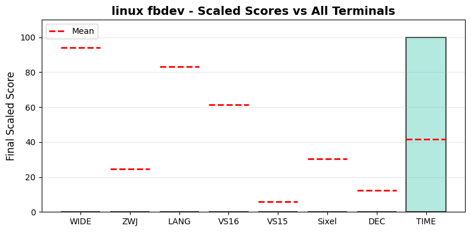

.. _linuxfbdev:

linux fbdev
-----------

Tested Software version 6.14.0-37 on Linux.
The homepage URL of this terminal is https://www.kernel.org/doc/Documentation/fb/fbcon.txt.
Full results available at ucs-detect_ repository path
`data/linuxfbdev.yaml <https://github.com/jquast/ucs-detect/blob/master/data/linuxfbdev.yaml>`_.

.. _linuxfbdevscores:

Score Breakdown
+++++++++++++++

Detailed breakdown of how scores are calculated for *linux fbdev*:

.. table::
   :class: sphinx-datatable

   ===  =====================================  ===========  ====================
     #  Score Type                             Raw Score    Final Scaled Score
   ===  =====================================  ===========  ====================
     1  :ref:`WIDE <linuxfbdevwide>`           0.00%        0.0%
     2  :ref:`ZWJ <linuxfbdevzwj>`             0.00%        0.0%
     3  :ref:`LANG <linuxfbdevlang>`           0.00%        0.0%
     4  :ref:`VS16 <linuxfbdevvs16>`           N/A          N/A
     5  :ref:`VS15 <linuxfbdevvs15>`           N/A          N/A
     6  :ref:`Sixel <linuxfbdevgraphics>`      no           0.0%
     7  :ref:`DEC Modes <linuxfbdevdecmodes>`  0            0.0%
     8  :ref:`TIME <linuxfbdevtime>`           0.01s        100.0%
   ===  =====================================  ===========  ====================

**Score Comparison Plot:**

The following plot shows how this terminal's scores compare to all other terminals tested.

   Scaled scores comparison across all metrics (normalized 0-100%)

**Final Scaled Score Calculation:**

- Raw Final Score: 11.11%
  (weighted average: WIDE + ZWJ + LANG + VS16 + VS15 + DEC Modes + 0.5*TIME)
  the categorized 'average' absolute support level of this terminal
  Note: DEC Modes and TIME are normalized to 0-1 range before averaging.
  TIME is weighted at 0.5 (half as powerful as other metrics).
  **Sixel support is NOT included in the final score** - it is tracked separately.

- Final Scaled Score: 2.1%
  (normalized across all terminals tested).
  *Final Scaled scores* are normalized (0-100%) relative to all terminals tested

**WIDE Score Details:**

No WIDE character support detected.

**ZWJ Score Details:**

No ZWJ support detected.

**VS16 Score Details:**

VS16 results not available.

**VS15 Score Details:**

VS15 results not available.

**Sixel Score Details:**

Sixel graphics support: **no**

Sixel support is determined by the terminal's response to the Device Attributes
(DA1) query. Terminals that include '4' in their DA1 extensions response support
Sixel graphics protocol.

**DEC Modes Score Details:**

DEC Private Modes support calculation:
- Changeable modes: 0
- Total modes tested: 0
- Raw score: 0 modes
- Scaled: normalized against max changeable modes across all terminals

**TIME Score Details:**

Test execution time:
- Elapsed time: 0.01 seconds
- Note: This is a raw measurement; lower is better
- Scaled score uses inverse log10 scaling across all terminals
- Scaled result: 100.0%

**LANG Score Details (Geometric Mean):**

.. _linuxfbdevwide:

Wide character support
++++++++++++++++++++++

Wide character results for *linux fbdev* are not available.

.. _linuxfbdevzwj:

Emoji ZWJ support
+++++++++++++++++

Emoji ZWJ results for *linux fbdev* are not available.

.. _linuxfbdevvs16:

Variation Selector-16 support
+++++++++++++++++++++++++++++

Emoji VS-16 results for *linux fbdev* are not available.

.. _linuxfbdevvs15:

Variation Selector-15 support
+++++++++++++++++++++++++++++

Emoji VS-15 results for *linux fbdev* are not available.

.. _linuxfbdevgraphics:

Graphics Protocol Support
+++++++++++++++++++++++++

*linux fbdev* does not report support for any graphics protocols.

**Detection Methods:**

- **Sixel** and **ReGIS**: Detected via the Device Attributes (DA1) query
  ``CSI c`` (``\x1b[c``). Extension code ``4`` indicates Sixel_ support,
  extension code ``3`` indicates ReGIS_ support.
- **Kitty graphics**: Detected by sending a Kitty graphics query and
  checking for an ``OK`` response.
- **iTerm2 inline images**: Detected via the iTerm2 capabilities query
  ``OSC 1337 ; Capabilities``.

**Device Attributes Response:**

- Extensions reported: none
- Sixel_ indicator (``4``): not present
- ReGIS_ indicator (``3``): not present

.. _Sixel: https://en.wikipedia.org/wiki/Sixel
.. _ReGIS: https://en.wikipedia.org/wiki/ReGIS
.. _`iTerm2 inline images`: https://iterm2.com/documentation-images.html
.. _`Kitty graphics protocol`: https://sw.kovidgoyal.net/kitty/graphics-protocol/

.. _linuxfbdevlang:

Language Support
++++++++++++++++

Language results for *linux fbdev* are not available.

.. _linuxfbdevdecmodes:

DEC Private Modes Support
+++++++++++++++++++++++++

This Terminal does not appear capable of reporting about any DEC Private modes.

.. _linuxfbdevkittykbd:

Kitty Keyboard Protocol
+++++++++++++++++++++++

*linux fbdev* does not support the `Kitty keyboard protocol`_.

.. _`Kitty keyboard protocol`: https://sw.kovidgoyal.net/kitty/keyboard-protocol/

.. _linuxfbdevxtgettcap:

XTGETTCAP (Terminfo Capabilities)
+++++++++++++++++++++++++++++++++

*linux fbdev* does not support the ``XTGETTCAP`` sequence.

.. _linuxfbdevreproduce:

Reproduction
++++++++++++

To reproduce these results for *linux fbdev*, install and run ucs-detect_
with the following commands::

    pip install ucs-detect
    ucs-detect --rerun data/linuxfbdev.yaml

.. _linuxfbdevtime:

Test Execution Time
+++++++++++++++++++

The test suite completed in **0.01 seconds** (0s).

This time measurement represents the total duration of the test execution,
including all Unicode wide character tests, emoji ZWJ sequences, variation
selectors, language support checks, and DEC mode detection.

.. _`printf(1)`: https://www.man7.org/linux/man-pages/man1/printf.1.html
.. _`wcwidth.wcswidth()`: https://wcwidth.readthedocs.io/en/latest/intro.html
.. _`ucs-detect`: https://github.com/jquast/ucs-detect
.. _`DEC Private Modes`: https://blessed.readthedocs.io/en/latest/dec_modes.html
