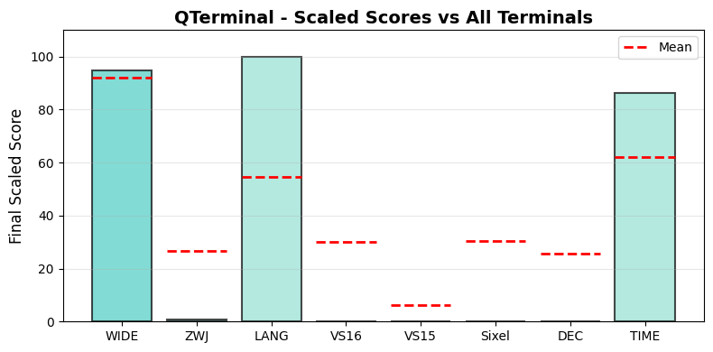

.. _qterminal:

QTerminal
---------

Tested Software version 1.4.0 on Linux.
The homepage URL of this terminal is https://github.com/lxqt/qterminal.
Full results available at ucs-detect_ repository path
`data/linux-QTerminal-1.4.0.yaml <https://github.com/jquast/ucs-detect/blob/master/data/linux-QTerminal-1.4.0.yaml>`_.

.. _qterminalscores:

Score Breakdown
+++++++++++++++

Detailed breakdown of how scores are calculated for *QTerminal*:

.. table::
   :class: sphinx-datatable

   ===  ====================================  ===========  ====================
     #  Score Type                            Raw Score    Final Scaled Score
   ===  ====================================  ===========  ====================
     1  :ref:`WIDE <qterminalwide>`           94.84%       94.7%
     2  :ref:`ZWJ <qterminalzwj>`             0.73%        0.7%
     3  :ref:`LANG <qterminallang>`           99.88%       100.0%
     4  :ref:`VS16 <qterminalvs16>`           0.00%        0.0%
     5  :ref:`VS15 <qterminalvs15>`           0.00%        0.0%
     6  :ref:`Sixel <qterminalsixel>`         no           0.0%
     7  :ref:`DEC Modes <qterminaldecmodes>`  0            0.0%
     8  :ref:`TIME <qterminaltime>`           75.43s       86.2%
   ===  ====================================  ===========  ====================

**Score Comparison Plot:**

The following plot shows how this terminal's scores compare to all other terminals tested.

   Scaled scores comparison across all metrics (normalized 0-100%)

**Final Scaled Score Calculation:**

- Raw Final Score: 31.80%
  (weighted average of all raw scores: WIDE + ZWJ + LANG + VS16 + VS15 + Sixel + DEC Modes + 0.5*TIME)
  the categorized 'average' absolute support level of this terminal
  Note: DEC Modes and TIME are normalized to 0-1 range before averaging.
  TIME is weighted at 0.5 (half as powerful as other metrics).

- Final Scaled Score: 11.5%
  (normalized across all terminals tested).
  *Final Scaled scores* are normalized (0-100%) relative to all terminals tested

**WIDE Score Details:**

Wide character support calculation:
- Total successful codepoints: 6527
- Total codepoints tested: 6882
- Best matching Unicode version: 15.1.0
- Formula: 6527 / 6882
- Result: 94.84%

**ZWJ Score Details:**

Emoji ZWJ (Zero-Width Joiner) support calculation:
- Total successful sequences: 10
- Total sequences tested: 1374
- Best matching Emoji version: None
- Formula: 10 / 1374
- Result: 0.73%

**VS16 Score Details:**

Variation Selector-16 support calculation:
- Errors: 213 of 213 codepoints tested
- Success rate: 0.0%
- Formula: 0.0 / 100
- Result: 0.00%

**VS15 Score Details:**

Variation Selector-15 support calculation:
- Errors: 158 of 158 codepoints tested
- Success rate: 0.0%
- Formula: 0.0 / 100
- Result: 0.00%

**Sixel Score Details:**

Sixel graphics support: **no**

Sixel support is determined by the terminal's response to the Device Attributes
(DA1) query. Terminals that include '4' in their DA1 extensions response support
Sixel graphics protocol.

**DEC Modes Score Details:**

DEC Private Modes support calculation:
- Changeable modes: 0
- Total modes tested: 0
- Raw score: 0 modes
- Scaled: normalized against max changeable modes across all terminals

**TIME Score Details:**

Test execution time:
- Elapsed time: 75.43 seconds
- Note: This is a raw measurement; lower is better
- Scaled score uses inverse log10 scaling across all terminals
- Scaled result: 86.2%

**LANG Score Details (Geometric Mean):**

Geometric mean calculation:
- Formula: (p₁ × p₂ × ... × pₙ)^(1/n) where n = 118 languages
- About `geometric mean <https://en.wikipedia.org/wiki/Geometric_mean>`_
- Result: 99.88%

.. _qterminalwide:

Wide character support
++++++++++++++++++++++

The best wide unicode table version for QTerminal appears to be 
**15.1.0**, this is from a summary of the following
results:

.. table::
   :class: sphinx-datatable

   =========  ==========  =========  =============
   version      n_errors    n_total  pct_success
   =========  ==========  =========  =============
   '9.0.0'             0       5000  100.0%
   '10.0.0'            0        745  100.0%
   '11.0.0'            0         72  100.0%
   '12.0.0'            0         76  100.0%
   '12.1.0'            0          1  100.0%
   '13.0.0'            0        552  100.0%
   '14.0.0'            0         54  100.0%
   '15.0.0'            0         22  100.0%
   '15.1.0'            0          5  100.0%
   '16.0.0'          198        198  0.0%
   '17.0.0'          157        157  0.0%
   =========  ==========  =========  =============

Sequence of a WIDE character from Unicode Version 17.0.0, from midpoint of alignment failure records:

.. table::
   :class: sphinx-datatable

   ===  =================================================  =============  ==========  =========  ======
     #  Codepoint                                          Python         Category      wcwidth  Name
   ===  =================================================  =============  ==========  =========  ======
     1  `U+00018DAB <https://codepoints.net/U+00018DAB>`_  '\\U00018dab'  Cn                  2  na
   ===  =================================================  =============  ==========  =========  ======

Total codepoints: 1

- Shell test using `printf(1)`_, ``'|'`` should align in output::

        $ printf "\xf0\x98\xb6\xab|\\n12|\\n"
        𘶫|
        12|

- python `wcwidth.wcswidth()`_ measures width 2,
  while *QTerminal* measures width 1.

.. _qterminalzwj:

Emoji ZWJ support
+++++++++++++++++

The best Emoji ZWJ table version for *QTerminal* appears to be 
**None**, this is from a summary of the following
results:

.. table::
   :class: sphinx-datatable

   =========  ==========  =========  =============
   version      n_errors    n_total  pct_success
   =========  ==========  =========  =============
   '2.0'              21         22  4.5%
   '4.0'             500        508  1.6%
   '5.0'             100        100  0.0%
   '11.0'             73         73  0.0%
   '12.0'            112        112  0.0%
   '12.1'            165        165  0.0%
   '13.0'             50         51  2.0%
   '13.1'             83         83  0.0%
   '14.0'             20         20  0.0%
   '15.0'              1          1  0.0%
   '15.1'            109        109  0.0%
   '17.0'            130        130  0.0%
   =========  ==========  =========  =============

Sequence of an Emoji ZWJ Sequence from Emoji Version 17.0, from midpoint of alignment failure records:

.. table::
   :class: sphinx-datatable

   ===  =================================================  =============  ==========  =========  =================================
     #  Codepoint                                          Python         Category      wcwidth  Name
   ===  =================================================  =============  ==========  =========  =================================
     1  `U+0001F469 <https://codepoints.net/U+0001F469>`_  '\\U0001f469'  So                  2  WOMAN
     2  `U+0001F3FE <https://codepoints.net/U+0001F3FE>`_  '\\U0001f3fe'  Sk                  0  EMOJI MODIFIER FITZPATRICK TYPE-5
     3  `U+200D <https://codepoints.net/U+200D>`_          '\\u200d'      Cf                  0  ZERO WIDTH JOINER
     4  `U+0001FAEF <https://codepoints.net/U+0001FAEF>`_  '\\U0001faef'  Cn                  2  na
     5  `U+200D <https://codepoints.net/U+200D>`_          '\\u200d'      Cf                  0  ZERO WIDTH JOINER
     6  `U+0001F469 <https://codepoints.net/U+0001F469>`_  '\\U0001f469'  So                  2  WOMAN
     7  `U+0001F3FF <https://codepoints.net/U+0001F3FF>`_  '\\U0001f3ff'  Sk                  0  EMOJI MODIFIER FITZPATRICK TYPE-6
   ===  =================================================  =============  ==========  =========  =================================

Total codepoints: 7

- Shell test using `printf(1)`_, ``'|'`` should align in output::

        $ printf "\xf0\x9f\x91\xa9\xf0\x9f\x8f\xbe\xe2\x80\x8d\xf0\x9f\xab\xaf\xe2\x80\x8d\xf0\x9f\x91\xa9\xf0\x9f\x8f\xbf|\\n12|\\n"
        👩🏾‍🫯‍👩🏿|
        12|

- python `wcwidth.wcswidth()`_ measures width 2,
  while *QTerminal* measures width 9.

.. _qterminalvs16:

Variation Selector-16 support
+++++++++++++++++++++++++++++

Emoji VS-16 results for *QTerminal* is 213 errors
out of 213 total codepoints tested, 0.0% success.
Sequence of a NARROW Emoji made WIDE by *Variation Selector-16*, from midpoint of alignment failure records:

.. table::
   :class: sphinx-datatable

   ===  =========================================  =========  ==========  =========  =====================
     #  Codepoint                                  Python     Category      wcwidth  Name
   ===  =========================================  =========  ==========  =========  =====================
     1  `U+2733 <https://codepoints.net/U+2733>`_  '\\u2733'  So                  1  EIGHT SPOKED ASTERISK
     2  `U+FE0F <https://codepoints.net/U+FE0F>`_  '\\ufe0f'  Mn                  0  VARIATION SELECTOR-16
   ===  =========================================  =========  ==========  =========  =====================

Total codepoints: 2

- Shell test using `printf(1)`_, ``'|'`` should align in output::

        $ printf "\xe2\x9c\xb3\xef\xb8\x8f|\\n12|\\n"
        ✳️|
        12|

- python `wcwidth.wcswidth()`_ measures width 2,
  while *QTerminal* measures width 1.

.. _qterminalvs15:

Variation Selector-15 support
+++++++++++++++++++++++++++++

Emoji VS-15 results for *QTerminal* is 158 errors
out of 158 total codepoints tested, 0.0% success.
Sequence of a WIDE Emoji made NARROW by *Variation Selector-15*, from midpoint of alignment failure records:

.. table::
   :class: sphinx-datatable

   ===  =================================================  =============  ==========  =========  =====================
     #  Codepoint                                          Python         Category      wcwidth  Name
   ===  =================================================  =============  ==========  =========  =====================
     1  `U+0001F3AE <https://codepoints.net/U+0001F3AE>`_  '\\U0001f3ae'  So                  2  VIDEO GAME
     2  `U+FE0E <https://codepoints.net/U+FE0E>`_          '\\ufe0e'      Mn                  0  VARIATION SELECTOR-15
   ===  =================================================  =============  ==========  =========  =====================

Total codepoints: 2

- Shell test using `printf(1)`_, ``'|'`` should align in output::

        $ printf "\xf0\x9f\x8e\xae\xef\xb8\x8e|\\n1|\\n"
        🎮︎|
        1|

- python `wcwidth.wcswidth()`_ measures width 1,
  while *QTerminal* measures width 2.

.. _qterminalsixel:

Sixel Graphics Support
++++++++++++++++++++++

*QTerminal* **does not support Sixel graphics protocol**.

Sixel support is determined by the terminal's response to the Device Attributes
(DA1) query. Terminals that include '4' in their DA1 extensions response indicate
support for the Sixel graphics protocol, which allows inline image rendering.

**Device Attributes Response:**

- Extensions reported: 2
- Sixel indicator ('4'): not present

.. _qterminallang:

Language Support
++++++++++++++++

The following 113 languages were tested with 100% success:

(Jinan), (Yeonbyeon), Aja, Amarakaeri, Arabic, Standard, Assyrian Neo-Aramaic, Baatonum, Bamun, Belanda Viri, Bhojpuri, Bora, Burmese, Catalan (2), Chakma, Chickasaw, Chinantec, Chiltepec, Chinese, Gan, Chinese, Hakka, Chinese, Jinyu, Chinese, Mandarin (Beijing), Chinese, Mandarin (Guiyang), Chinese, Mandarin (Harbin), Chinese, Mandarin (Nanjing), Chinese, Mandarin (Simplified), Chinese, Mandarin (Tianjin), Chinese, Mandarin (Traditional), Chinese, Min Nan, Chinese, Wu, Chinese, Xiang, Chinese, Yue, Colorado, Dagaare, Southern, Dangme, Dari, Dendi, Dinka, Northeastern, Ditammari, Dzongkha, Evenki, Farsi, Western, Fon, French (Welche), Fur, Ga, Gen, Gilyak, Gujarati, Gumuz, Hindi, Japanese, Japanese (Osaka), Japanese (Tokyo), Javanese (Javanese), Kabyle, Kannada, Khmer, Central, Khün, Korean, Lamnso', Lao, Lingala (tones), Magahi, Maithili, Maldivian, Maori (2), Mazahua Central, Mirandese, Mixtec, Metlatónoc, Mon, Mongolian, Halh (Mongolian), Mòoré, Nanai, Navajo, Nuosu, Orok, Otomi, Mezquital, Panjabi, Eastern, Panjabi, Western, Pashto, Northern, Picard, Pular (Adlam), Saint Lucian Creole French, Sanskrit, Sanskrit (Grantha), Secoya, Seraiki, Shan, Shipibo-Conibo, Siona, South Azerbaijani, Tagalog (Tagalog), Tai Dam, Tamang, Eastern, Tamazight, Central Atlas, Tamil, Tamil (Sri Lanka), Telugu, Tem, Thai, Thai (2), Tibetan, Central, Ticuna, Uduk, Urdu, Urdu (2), Veps, Vietnamese, Vietnamese (Han nom), Waama, Yaneshaʼ, Yiddish, Eastern, Yoruba, Éwé.

The following 5 languages are not fully supported:

.. table::
   :class: sphinx-datatable

   =========================================  ==========  =========  =============
   lang                                         n_errors    n_total  pct_success
   =========================================  ==========  =========  =============
   :ref:`Malayalam <qterminallangmalayalam>`         109       1630  93.3%
   :ref:`Sinhala <qterminallangsinhala>`             107       1655  93.5%
   :ref:`Marathi <qterminallangmarathi>`               5       1614  99.7%
   :ref:`Nepali <qterminallangnepali>`                 3       1385  99.8%
   :ref:`Bengali <qterminallangbengali>`               3       1413  99.8%
   =========================================  ==========  =========  =============

.. _qterminallangmalayalam:

Malayalam
^^^^^^^^^

Sequence of language *Malayalam* from midpoint of alignment failure records:

.. table::
   :class: sphinx-datatable

   ===  =========================================  =========  ==========  =========  =======================
     #  Codepoint                                  Python     Category      wcwidth  Name
   ===  =========================================  =========  ==========  =========  =======================
     1  `U+0D38 <https://codepoints.net/U+0D38>`_  '\\u0d38'  Lo                  1  MALAYALAM LETTER SA
     2  `U+0D30 <https://codepoints.net/U+0D30>`_  '\\u0d30'  Lo                  1  MALAYALAM LETTER RA
     3  `U+0D4D <https://codepoints.net/U+0D4D>`_  '\\u0d4d'  Mn                  0  MALAYALAM SIGN VIRAMA
     4  `U+200D <https://codepoints.net/U+200D>`_  '\\u200d'  Cf                  0  ZERO WIDTH JOINER
     5  `U+0D35 <https://codepoints.net/U+0D35>`_  '\\u0d35'  Lo                  1  MALAYALAM LETTER VA
     6  `U+0D4D <https://codepoints.net/U+0D4D>`_  '\\u0d4d'  Mn                  0  MALAYALAM SIGN VIRAMA
     7  `U+0D35 <https://codepoints.net/U+0D35>`_  '\\u0d35'  Lo                  1  MALAYALAM LETTER VA
     8  `U+0D24 <https://codepoints.net/U+0D24>`_  '\\u0d24'  Lo                  1  MALAYALAM LETTER TA
     9  `U+0D4B <https://codepoints.net/U+0D4B>`_  '\\u0d4b'  Mc                  0  MALAYALAM VOWEL SIGN OO
    10  `U+0D28 <https://codepoints.net/U+0D28>`_  '\\u0d28'  Lo                  1  MALAYALAM LETTER NA
    11  `U+0D4D <https://codepoints.net/U+0D4D>`_  '\\u0d4d'  Mn                  0  MALAYALAM SIGN VIRAMA
    12  `U+0D2E <https://codepoints.net/U+0D2E>`_  '\\u0d2e'  Lo                  1  MALAYALAM LETTER MA
    13  `U+0D41 <https://codepoints.net/U+0D41>`_  '\\u0d41'  Mn                  0  MALAYALAM VOWEL SIGN U
    14  `U+0D16 <https://codepoints.net/U+0D16>`_  '\\u0d16'  Lo                  1  MALAYALAM LETTER KHA
    15  `U+0D2E <https://codepoints.net/U+0D2E>`_  '\\u0d2e'  Lo                  1  MALAYALAM LETTER MA
    16  `U+0D3E <https://codepoints.net/U+0D3E>`_  '\\u0d3e'  Mc                  0  MALAYALAM VOWEL SIGN AA
    17  `U+0D2F <https://codepoints.net/U+0D2F>`_  '\\u0d2f'  Lo                  1  MALAYALAM LETTER YA
   ===  =========================================  =========  ==========  =========  =======================

Total codepoints: 17

- Shell test using `printf(1)`_, ``'|'`` should align in output::

        $ printf "\xe0\xb4\xb8\xe0\xb4\xb0\xe0\xb5\x8d\xe2\x80\x8d\xe0\xb4\xb5\xe0\xb5\x8d\xe0\xb4\xb5\xe0\xb4\xa4\xe0\xb5\x8b\xe0\xb4\xa8\xe0\xb5\x8d\xe0\xb4\xae\xe0\xb5\x81\xe0\xb4\x96\xe0\xb4\xae\xe0\xb4\xbe\xe0\xb4\xaf|\\n123456789|\\n"
        സര്‍വ്വതോന്മുഖമായ|
        123456789|

- python `wcwidth.wcswidth()`_ measures width 9,
  while *QTerminal* measures width 10.

.. _qterminallangsinhala:

Sinhala
^^^^^^^

Sequence of language *Sinhala* from midpoint of alignment failure records:

.. table::
   :class: sphinx-datatable

   ===  =========================================  =========  ==========  =========  =================================
     #  Codepoint                                  Python     Category      wcwidth  Name
   ===  =========================================  =========  ==========  =========  =================================
     1  `U+0DB4 <https://codepoints.net/U+0DB4>`_  '\\u0db4'  Lo                  1  SINHALA LETTER ALPAPRAANA PAYANNA
     2  `U+0DCA <https://codepoints.net/U+0DCA>`_  '\\u0dca'  Mn                  0  SINHALA SIGN AL-LAKUNA
     3  `U+200D <https://codepoints.net/U+200D>`_  '\\u200d'  Cf                  0  ZERO WIDTH JOINER
     4  `U+0DBB <https://codepoints.net/U+0DBB>`_  '\\u0dbb'  Lo                  1  SINHALA LETTER RAYANNA
     5  `U+0D9A <https://codepoints.net/U+0D9A>`_  '\\u0d9a'  Lo                  1  SINHALA LETTER ALPAPRAANA KAYANNA
     6  `U+0DCF <https://codepoints.net/U+0DCF>`_  '\\u0dcf'  Mc                  0  SINHALA VOWEL SIGN AELA-PILLA
     7  `U+0DC1 <https://codepoints.net/U+0DC1>`_  '\\u0dc1'  Lo                  1  SINHALA LETTER TAALUJA SAYANNA
     8  `U+0DB1 <https://codepoints.net/U+0DB1>`_  '\\u0db1'  Lo                  1  SINHALA LETTER DANTAJA NAYANNA
     9  `U+0DBA <https://codepoints.net/U+0DBA>`_  '\\u0dba'  Lo                  1  SINHALA LETTER YAYANNA
   ===  =========================================  =========  ==========  =========  =================================

Total codepoints: 9

- Shell test using `printf(1)`_, ``'|'`` should align in output::

        $ printf "\xe0\xb6\xb4\xe0\xb7\x8a\xe2\x80\x8d\xe0\xb6\xbb\xe0\xb6\x9a\xe0\xb7\x8f\xe0\xb7\x81\xe0\xb6\xb1\xe0\xb6\xba|\\n12345|\\n"
        ප්‍රකාශනය|
        12345|

- python `wcwidth.wcswidth()`_ measures width 5,
  while *QTerminal* measures width 6.

.. _qterminallangmarathi:

Marathi
^^^^^^^

Sequence of language *Marathi* from midpoint of alignment failure records:

.. table::
   :class: sphinx-datatable

   ===  =========================================  =========  ==========  =========  ========================
     #  Codepoint                                  Python     Category      wcwidth  Name
   ===  =========================================  =========  ==========  =========  ========================
     1  `U+0915 <https://codepoints.net/U+0915>`_  '\\u0915'  Lo                  1  DEVANAGARI LETTER KA
     2  `U+0930 <https://codepoints.net/U+0930>`_  '\\u0930'  Lo                  1  DEVANAGARI LETTER RA
     3  `U+0923 <https://codepoints.net/U+0923>`_  '\\u0923'  Lo                  1  DEVANAGARI LETTER NNA
     4  `U+094D <https://codepoints.net/U+094D>`_  '\\u094d'  Mn                  0  DEVANAGARI SIGN VIRAMA
     5  `U+092F <https://codepoints.net/U+092F>`_  '\\u092f'  Lo                  1  DEVANAGARI LETTER YA
     6  `U+093E <https://codepoints.net/U+093E>`_  '\\u093e'  Mc                  0  DEVANAGARI VOWEL SIGN AA
     7  `U+0930 <https://codepoints.net/U+0930>`_  '\\u0930'  Lo                  1  DEVANAGARI LETTER RA
     8  `U+094D <https://codepoints.net/U+094D>`_  '\\u094d'  Mn                  0  DEVANAGARI SIGN VIRAMA
     9  `U+200D <https://codepoints.net/U+200D>`_  '\\u200d'  Cf                  0  ZERO WIDTH JOINER
    10  `U+092F <https://codepoints.net/U+092F>`_  '\\u092f'  Lo                  1  DEVANAGARI LETTER YA
    11  `U+093E <https://codepoints.net/U+093E>`_  '\\u093e'  Mc                  0  DEVANAGARI VOWEL SIGN AA
   ===  =========================================  =========  ==========  =========  ========================

Total codepoints: 11

- Shell test using `printf(1)`_, ``'|'`` should align in output::

        $ printf "\xe0\xa4\x95\xe0\xa4\xb0\xe0\xa4\xa3\xe0\xa5\x8d\xe0\xa4\xaf\xe0\xa4\xbe\xe0\xa4\xb0\xe0\xa5\x8d\xe2\x80\x8d\xe0\xa4\xaf\xe0\xa4\xbe|\\n12345|\\n"
        करण्यार्‍या|
        12345|

- python `wcwidth.wcswidth()`_ measures width 5,
  while *QTerminal* measures width 6.

.. _qterminallangnepali:

Nepali
^^^^^^

Sequence of language *Nepali* from midpoint of alignment failure records:

.. table::
   :class: sphinx-datatable

   ===  =========================================  =========  ==========  =========  ========================
     #  Codepoint                                  Python     Category      wcwidth  Name
   ===  =========================================  =========  ==========  =========  ========================
     1  `U+092A <https://codepoints.net/U+092A>`_  '\\u092a'  Lo                  1  DEVANAGARI LETTER PA
     2  `U+0941 <https://codepoints.net/U+0941>`_  '\\u0941'  Mn                  0  DEVANAGARI VOWEL SIGN U
     3  `U+0930 <https://codepoints.net/U+0930>`_  '\\u0930'  Lo                  1  DEVANAGARI LETTER RA
     4  `U+094D <https://codepoints.net/U+094D>`_  '\\u094d'  Mn                  0  DEVANAGARI SIGN VIRAMA
     5  `U+200D <https://codepoints.net/U+200D>`_  '\\u200d'  Cf                  0  ZERO WIDTH JOINER
     6  `U+092F <https://codepoints.net/U+092F>`_  '\\u092f'  Lo                  1  DEVANAGARI LETTER YA
     7  `U+093E <https://codepoints.net/U+093E>`_  '\\u093e'  Mc                  0  DEVANAGARI VOWEL SIGN AA
     8  `U+0907 <https://codepoints.net/U+0907>`_  '\\u0907'  Lo                  1  DEVANAGARI LETTER I
     9  `U+090F <https://codepoints.net/U+090F>`_  '\\u090f'  Lo                  1  DEVANAGARI LETTER E
    10  `U+0915 <https://codepoints.net/U+0915>`_  '\\u0915'  Lo                  1  DEVANAGARI LETTER KA
    11  `U+094B <https://codepoints.net/U+094B>`_  '\\u094b'  Mc                  0  DEVANAGARI VOWEL SIGN O
   ===  =========================================  =========  ==========  =========  ========================

Total codepoints: 11

- Shell test using `printf(1)`_, ``'|'`` should align in output::

        $ printf "\xe0\xa4\xaa\xe0\xa5\x81\xe0\xa4\xb0\xe0\xa5\x8d\xe2\x80\x8d\xe0\xa4\xaf\xe0\xa4\xbe\xe0\xa4\x87\xe0\xa4\x8f\xe0\xa4\x95\xe0\xa5\x8b|\\n12345|\\n"
        पुर्‍याइएको|
        12345|

- python `wcwidth.wcswidth()`_ measures width 5,
  while *QTerminal* measures width 6.

.. _qterminallangbengali:

Bengali
^^^^^^^

Sequence of language *Bengali* from midpoint of alignment failure records:

.. table::
   :class: sphinx-datatable

   ===  =========================================  =========  ==========  =========  =====================
     #  Codepoint                                  Python     Category      wcwidth  Name
   ===  =========================================  =========  ==========  =========  =====================
     1  `U+0989 <https://codepoints.net/U+0989>`_  '\\u0989'  Lo                  1  BENGALI LETTER U
     2  `U+09A4 <https://codepoints.net/U+09A4>`_  '\\u09a4'  Lo                  1  BENGALI LETTER TA
     3  `U+09CD <https://codepoints.net/U+09CD>`_  '\\u09cd'  Mn                  0  BENGALI SIGN VIRAMA
     4  `U+200D <https://codepoints.net/U+200D>`_  '\\u200d'  Cf                  0  ZERO WIDTH JOINER
     5  `U+09AA <https://codepoints.net/U+09AA>`_  '\\u09aa'  Lo                  1  BENGALI LETTER PA
     6  `U+09C0 <https://codepoints.net/U+09C0>`_  '\\u09c0'  Mc                  0  BENGALI VOWEL SIGN II
     7  `U+09A1 <https://codepoints.net/U+09A1>`_  '\\u09a1'  Lo                  1  BENGALI LETTER DDA
     8  `U+09BC <https://codepoints.net/U+09BC>`_  '\\u09bc'  Mn                  0  BENGALI SIGN NUKTA
     9  `U+09A8 <https://codepoints.net/U+09A8>`_  '\\u09a8'  Lo                  1  BENGALI LETTER NA
    10  `U+09C7 <https://codepoints.net/U+09C7>`_  '\\u09c7'  Mc                  0  BENGALI VOWEL SIGN E
    11  `U+09B0 <https://codepoints.net/U+09B0>`_  '\\u09b0'  Lo                  1  BENGALI LETTER RA
   ===  =========================================  =========  ==========  =========  =====================

Total codepoints: 11

- Shell test using `printf(1)`_, ``'|'`` should align in output::

        $ printf "\xe0\xa6\x89\xe0\xa6\xa4\xe0\xa7\x8d\xe2\x80\x8d\xe0\xa6\xaa\xe0\xa7\x80\xe0\xa6\xa1\xe0\xa6\xbc\xe0\xa6\xa8\xe0\xa7\x87\xe0\xa6\xb0|\\n12345|\\n"
        উত্‍পীড়নের|
        12345|

- python `wcwidth.wcswidth()`_ measures width 5,
  while *QTerminal* measures width 6.

.. _qterminaldecmodes:

DEC Private Modes Support
+++++++++++++++++++++++++

This Terminal does not appear capable of reporting about any DEC Private modes.

.. _qterminalreproduce:

Reproduction
++++++++++++

To reproduce these results for *QTerminal*, install and run ucs-detect_
with the following commands::

    pip install ucs-detect
    ucs-detect --save-yaml=linux-QTerminal-1.4.0.yaml \
        --limit-codepoints=5000 \
        --limit-words=5000 \
        --limit-errors=500

.. _qterminaltime:

Test Execution Time
+++++++++++++++++++

The test suite completed in **75.43 seconds** (75s).

This time measurement represents the total duration of the test execution,
including all Unicode wide character tests, emoji ZWJ sequences, variation
selectors, language support checks, and DEC mode detection.

.. _`printf(1)`: https://www.man7.org/linux/man-pages/man1/printf.1.html
.. _`wcwidth.wcswidth()`: https://wcwidth.readthedocs.io/en/latest/intro.html
.. _`ucs-detect`: https://github.com/jquast/ucs-detect
.. _`DEC Private Modes`: https://blessed.readthedocs.io/en/latest/dec_modes.html
