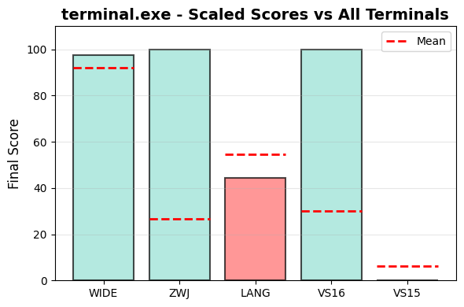

.. _terminalexe:

terminal.exe
------------

Tested Software version 1.23.12811.0 on Windows.
The homepage URL of this terminal is https://learn.microsoft.com/en-us/windows/terminal/.
Full results available at ucs-detect_ repository path
`data/terminalexe.yaml <https://github.com/jquast/ucs-detect/blob/master/data/terminalexe.yaml>`_.

.. _terminalexescores:

Score Breakdown
+++++++++++++++

Detailed breakdown of how scores are calculated for *terminal.exe*:

.. table::
   :class: sphinx-datatable

   ===  ======================================  ===========  ====================
     #  Score Type                              Raw Score    Final Scaled Score
   ===  ======================================  ===========  ====================
     1  :ref:`WIDE <terminalexewide>`           97.72%       97.7%
     2  :ref:`ZWJ <terminalexezwj>`             100.00%      100.0%
     3  :ref:`LANG <terminalexelang>`           69.96%       50.5%
     4  :ref:`VS16 <terminalexevs16>`           100.00%      100.0%
     5  :ref:`VS15 <terminalexevs15>`           0.00%        0.0%
     6  :ref:`Sixel <terminalexesixel>`         yes          100.0%
     7  :ref:`DEC Modes <terminalexedecmodes>`  26           39.4%
     8  :ref:`TIME <terminalexetime>`           1147.06s     43.8%
   ===  ======================================  ===========  ====================

**Score Comparison Plot:**

The following plot shows how this terminal's scores compare to all other terminals tested.

   Scaled scores comparison across all metrics (normalized 0-100%)

**Final Scaled Score Calculation:**

- Raw Final Score: 65.99%
  (weighted average: WIDE + ZWJ + LANG + VS16 + VS15 + DEC Modes + 0.5*TIME)
  the categorized 'average' absolute support level of this terminal
  Note: DEC Modes and TIME are normalized to 0-1 range before averaging.
  TIME is weighted at 0.5 (half as powerful as other metrics).
  **Sixel support is NOT included in the final score** - it is tracked separately.

- Final Scaled Score: 60.6%
  (normalized across all terminals tested).
  *Final Scaled scores* are normalized (0-100%) relative to all terminals tested

**WIDE Score Details:**

Wide character support calculation:
- Total successful codepoints: 6725
- Total codepoints tested: 6882
- Best matching Unicode version: 16.0.0
- Formula: 6725 / 6882
- Result: 97.72%

**ZWJ Score Details:**

Emoji ZWJ (Zero-Width Joiner) support calculation:
- Total successful sequences: 1445
- Total sequences tested: 1445
- Best matching Emoji version: 17.0
- Formula: 1445 / 1445
- Result: 100.00%

**VS16 Score Details:**

Variation Selector-16 support calculation:
- Errors: 0 of 213 codepoints tested
- Success rate: 100.0%
- Formula: 100.0 / 100
- Result: 100.00%

**VS15 Score Details:**

Variation Selector-15 support calculation:
- Errors: 158 of 158 codepoints tested
- Success rate: 0.0%
- Formula: 0.0 / 100
- Result: 0.00%

**Sixel Score Details:**

Sixel graphics support: **yes**

Sixel support is determined by the terminal's response to the Device Attributes
(DA1) query. Terminals that include '4' in their DA1 extensions response support
Sixel graphics protocol.

**DEC Modes Score Details:**

DEC Private Modes support calculation:
- Changeable modes: 26
- Total modes tested: 157
- Raw score: 26 modes
- Scaled: normalized against max changeable modes across all terminals

**TIME Score Details:**

Test execution time:
- Elapsed time: 1147.06 seconds
- Note: This is a raw measurement; lower is better
- Scaled score uses inverse log10 scaling across all terminals
- Scaled result: 43.8%

**LANG Score Details (Geometric Mean):**

Geometric mean calculation:
- Formula: (p₁ × p₂ × ... × pₙ)^(1/n) where n = 97 languages
- About `geometric mean <https://en.wikipedia.org/wiki/Geometric_mean>`_
- Result: 69.96%

.. _terminalexewide:

Wide character support
++++++++++++++++++++++

The best wide unicode table version for terminal.exe appears to be 
**16.0.0**, this is from a summary of the following
results:

.. table::
   :class: sphinx-datatable

   =========  ==========  =========  =============
   version      n_errors    n_total  pct_success
   =========  ==========  =========  =============
   '9.0.0'             0       5000  100.0%
   '10.0.0'            0        745  100.0%
   '11.0.0'            0         72  100.0%
   '12.0.0'            0         76  100.0%
   '12.1.0'            0          1  100.0%
   '13.0.0'            0        552  100.0%
   '14.0.0'            0         54  100.0%
   '15.0.0'            0         22  100.0%
   '15.1.0'            0          5  100.0%
   '16.0.0'            0        198  100.0%
   '17.0.0'          157        157  0.0%
   =========  ==========  =========  =============

Sequence of a WIDE character from Unicode Version 17.0.0, from midpoint of alignment failure records:

.. table::
   :class: sphinx-datatable

   ===  =================================================  =============  ==========  =========  ======
     #  Codepoint                                          Python         Category      wcwidth  Name
   ===  =================================================  =============  ==========  =========  ======
     1  `U+00018DAB <https://codepoints.net/U+00018DAB>`_  '\\U00018dab'  Cn                  2  na
   ===  =================================================  =============  ==========  =========  ======

Total codepoints: 1

- Shell test using `printf(1)`_, ``'|'`` should align in output::

        $ printf "\xf0\x98\xb6\xab|\\n12|\\n"
        𘶫|
        12|

- python `wcwidth.wcswidth()`_ measures width 2,
  while *terminal.exe* measures width 1.

.. _terminalexezwj:

Emoji ZWJ support
+++++++++++++++++

The best Emoji ZWJ table version for *terminal.exe* appears to be 
**17.0**, this is from a summary of the following
results:

.. table::
   :class: sphinx-datatable

   =========  ==========  =========  =============
   version      n_errors    n_total  pct_success
   =========  ==========  =========  =============
   '2.0'               0         22  100.0%
   '4.0'               0        579  100.0%
   '5.0'               0        100  100.0%
   '11.0'              0         73  100.0%
   '12.0'              0        112  100.0%
   '12.1'              0        165  100.0%
   '13.0'              0         51  100.0%
   '13.1'              0         83  100.0%
   '14.0'              0         20  100.0%
   '15.0'              0          1  100.0%
   '15.1'              0        109  100.0%
   '17.0'              0        130  100.0%
   =========  ==========  =========  =============

.. _terminalexevs16:

Variation Selector-16 support
+++++++++++++++++++++++++++++

Emoji VS-16 results for *terminal.exe* is 0 errors
out of 213 total codepoints tested, 100.0% success.
All codepoint combinations with Variation Selector-16 tested were successful.

.. _terminalexevs15:

Variation Selector-15 support
+++++++++++++++++++++++++++++

Emoji VS-15 results for *terminal.exe* is 158 errors
out of 158 total codepoints tested, 0.0% success.
Sequence of a WIDE Emoji made NARROW by *Variation Selector-15*, from midpoint of alignment failure records:

.. table::
   :class: sphinx-datatable

   ===  =================================================  =============  ==========  =========  =====================
     #  Codepoint                                          Python         Category      wcwidth  Name
   ===  =================================================  =============  ==========  =========  =====================
     1  `U+0001F3AE <https://codepoints.net/U+0001F3AE>`_  '\\U0001f3ae'  So                  2  VIDEO GAME
     2  `U+FE0E <https://codepoints.net/U+FE0E>`_          '\\ufe0e'      Mn                  0  VARIATION SELECTOR-15
   ===  =================================================  =============  ==========  =========  =====================

Total codepoints: 2

- Shell test using `printf(1)`_, ``'|'`` should align in output::

        $ printf "\xf0\x9f\x8e\xae\xef\xb8\x8e|\\n1|\\n"
        🎮︎|
        1|

- python `wcwidth.wcswidth()`_ measures width 1,
  while *terminal.exe* measures width 2.

.. _terminalexesixel:

Sixel Graphics Support
++++++++++++++++++++++

*terminal.exe* reports to **support Sixel graphics** by automatic sequence response.

**Sixel Support Categories:**

- **yes**: This terminal reports to support Sixel graphics by automatic sequence response.
- **no**: This terminal is not known to support Sixel graphics by automatic sequence response.
- **maybe**: This terminal does not report to support Sixel graphics in its default
  configuration by automatic sequence response.

**Detection Method:**

Sixel_ support is determined by the terminal's response to the Device Attributes (DA1)
query sequence ``CSI c`` (``\x1b[c``). The terminal responds with:

``CSI ? Psc ; Ps1 ; Ps2 ; ... ; Psn c``

Where ``Psc`` is the service class and ``Ps1`` through ``Psn`` are extension codes.
Terminals that include extension code ``4`` in their response indicate support for
the Sixel_ graphics, a complex legacy inline image rendering protocol.

**Device Attributes Response:**

- Extensions reported: 4, 6, 7, 14, 21, 22, 23, 24, 28, 32, 42, 52
- Sixel_ indicator (``4``): present

.. _Sixel: https://en.wikipedia.org/wiki/Sixel

.. _terminalexelang:

Language Support
++++++++++++++++

The following 59 languages were tested with 100% success:

Aja, Assyrian Neo-Aramaic, Baatonum, Bamun, Bora, Catalan (2), Chickasaw, Chinantec, Chiltepec, Chinese, Mandarin (Simplified), Dagaare, Southern, Dangme, Dari, Dendi, Dinka, Northeastern, Ditammari, Evenki, Farsi, Western, Fon, French (Welche), Fur, Ga, Gen, Gilyak, Gumuz, Kabyle, Korean, Lamnso', Lao, Lingala (tones), Maldivian, Maori (2), Mirandese, Mixtec, Metlatónoc, Mongolian, Halh (Mongolian), Mòoré, Nanai, Navajo, Orok, Panjabi, Western, Pashto, Northern, Pular (Adlam), Saint Lucian Creole French, Secoya, Seraiki, Siona, South Azerbaijani, Tagalog (Tagalog), Tai Dam, Tamazight, Central Atlas, Tem, Ticuna, Uduk, Urdu (2), Veps, Vietnamese, Waama, Yiddish, Eastern, Yoruba, Éwé.

The following 38 languages are not fully supported:

.. table::
   :class: sphinx-datatable

   ============================================================  ==========  =========  =============
   lang                                                            n_errors    n_total  pct_success
   ============================================================  ==========  =========  =============
   :ref:`Mazahua Central <terminalexelangmazahuacentral>`              1000       1051  4.9%
   :ref:`Shan <terminalexelangshan>`                                    868        915  5.1%
   :ref:`Tamil (Sri Lanka) <terminalexelangtamilsrilanka>`             1000       1074  6.9%
   :ref:`Tamil <terminalexelangtamil>`                                 1000       1075  7.0%
   :ref:`Mon <terminalexelangmon>`                                      877        946  7.3%
   :ref:`Sanskrit (Grantha) <terminalexelangsanskritgrantha>`           893       1006  11.2%
   :ref:`Marathi <terminalexelangmarathi>`                             1000       1176  15.0%
   :ref:`Khmer, Central <terminalexelangkhmercentral>`                  448        528  15.2%
   :ref:`Kannada <terminalexelangkannada>`                              902       1080  16.5%
   :ref:`Khün <terminalexelangkhn>`                                     361        442  18.3%
   :ref:`Bengali <terminalexelangbengali>`                             1000       1251  20.1%
   :ref:`Burmese <terminalexelangburmese>`                              974       1223  20.4%
   :ref:`Malayalam <terminalexelangmalayalam>`                         1000       1286  22.2%
   :ref:`Thai (2) <terminalexelangthai2>`                               228        313  27.2%
   :ref:`Telugu <terminalexelangtelugu>`                                793       1129  29.8%
   :ref:`Sanskrit <terminalexelangsanskrit>`                            666       1000  33.4%
   :ref:`Tamang, Eastern <terminalexelangtamangeastern>`                 29         45  35.6%
   :ref:`Nepali <terminalexelangnepali>`                                841       1385  39.3%
   :ref:`Gujarati <terminalexelanggujarati>`                            928       1536  39.6%
   :ref:`Panjabi, Eastern <terminalexelangpanjabieastern>`             1000       1684  40.6%
   :ref:`Hindi <terminalexelanghindi>`                                 1000       1824  45.2%
   :ref:`Sinhala <terminalexelangsinhala>`                              885       1655  46.5%
   :ref:`Maithili <terminalexelangmaithili>`                            812       1519  46.5%
   :ref:`Tibetan, Central <terminalexelangtibetancentral>`             1000       1890  47.1%
   :ref:`Amarakaeri <terminalexelangamarakaeri>`                        685       1446  52.6%
   :ref:`Bhojpuri <terminalexelangbhojpuri>`                            812       1737  53.3%
   :ref:`Magahi <terminalexelangmagahi>`                                741       1716  56.8%
   :ref:`Javanese (Javanese) <terminalexelangjavanesejavanese>`         550       1453  62.1%
   :ref:`Thai <terminalexelangthai>`                                    129        341  62.2%
   :ref:`Chakma <terminalexelangchakma>`                                493       1444  65.9%
   :ref:`Arabic, Standard <terminalexelangarabicstandard>`              138       1348  89.8%
   :ref:`Belanda Viri <terminalexelangbelandaviri>`                     155       2246  93.1%
   :ref:`Dzongkha <terminalexelangdzongkha>`                            176       3060  94.2%
   :ref:`Picard <terminalexelangpicard>`                                 65       2024  96.8%
   :ref:`Urdu <terminalexelangurdu>`                                     67       2237  97.0%
   :ref:`Shipibo-Conibo <terminalexelangshipiboconibo>`                  61       2540  97.6%
   :ref:`Otomi, Mezquital <terminalexelangotomimezquital>`               18       1849  99.0%
   :ref:`Yaneshaʼ <terminalexelangyanesha>`                               5       2536  99.8%
   ============================================================  ==========  =========  =============

.. _terminalexelangmazahuacentral:

Mazahua Central
^^^^^^^^^^^^^^^

Sequence of language *Mazahua Central* from midpoint of alignment failure records:

.. table::
   :class: sphinx-datatable

   ===  =========================================  ========  ==========  =========  =================================
     #  Codepoint                                  Python    Category      wcwidth  Name
   ===  =========================================  ========  ==========  =========  =================================
     1  `U+004A <https://codepoints.net/U+004A>`_  'J'       Lu                  1  LATIN CAPITAL LETTER J
     2  `U+00D1 <https://codepoints.net/U+00D1>`_  '\\xd1'   Lu                  1  LATIN CAPITAL LETTER N WITH TILDE
     3  `U+0041 <https://codepoints.net/U+0041>`_  'A'       Lu                  1  LATIN CAPITAL LETTER A
   ===  =========================================  ========  ==========  =========  =================================

Total codepoints: 3

- Shell test using `printf(1)`_, ``'|'`` should align in output::

        $ printf "J\xc3\x91A|\\n123|\\n"
        JÑA|
        123|

- Cursor Y-Position moved 16 rows where no movement is expected.

.. _terminalexelangshan:

Shan
^^^^

Sequence of language *Shan* from midpoint of alignment failure records:

.. table::
   :class: sphinx-datatable

   ===  =========================================  =========  ==========  =========  ================================
     #  Codepoint                                  Python     Category      wcwidth  Name
   ===  =========================================  =========  ==========  =========  ================================
     1  `U+101C <https://codepoints.net/U+101C>`_  '\\u101c'  Lo                  1  MYANMAR LETTER LA
     2  `U+102D <https://codepoints.net/U+102D>`_  '\\u102d'  Mn                  0  MYANMAR VOWEL SIGN I
     3  `U+1075 <https://codepoints.net/U+1075>`_  '\\u1075'  Lo                  1  MYANMAR LETTER SHAN KA
     4  `U+103A <https://codepoints.net/U+103A>`_  '\\u103a'  Mn                  0  MYANMAR SIGN ASAT
     5  `U+1088 <https://codepoints.net/U+1088>`_  '\\u1088'  Mc                  0  MYANMAR SIGN SHAN TONE-3
     6  `U+1015 <https://codepoints.net/U+1015>`_  '\\u1015'  Lo                  1  MYANMAR LETTER PA
     7  `U+102D <https://codepoints.net/U+102D>`_  '\\u102d'  Mn                  0  MYANMAR VOWEL SIGN I
     8  `U+102F <https://codepoints.net/U+102F>`_  '\\u102f'  Mn                  0  MYANMAR VOWEL SIGN U
     9  `U+107C <https://codepoints.net/U+107C>`_  '\\u107c'  Lo                  1  MYANMAR LETTER SHAN NA
    10  `U+103A <https://codepoints.net/U+103A>`_  '\\u103a'  Mn                  0  MYANMAR SIGN ASAT
    11  `U+107D <https://codepoints.net/U+107D>`_  '\\u107d'  Lo                  1  MYANMAR LETTER SHAN PHA
    12  `U+1062 <https://codepoints.net/U+1062>`_  '\\u1062'  Mc                  0  MYANMAR VOWEL SIGN SGAW KAREN EU
    13  `U+101D <https://codepoints.net/U+101D>`_  '\\u101d'  Lo                  1  MYANMAR LETTER WA
    14  `U+103A <https://codepoints.net/U+103A>`_  '\\u103a'  Mn                  0  MYANMAR SIGN ASAT
    15  `U+1087 <https://codepoints.net/U+1087>`_  '\\u1087'  Mc                  0  MYANMAR SIGN SHAN TONE-2
   ===  =========================================  =========  ==========  =========  ================================

Total codepoints: 15

- Shell test using `printf(1)`_, ``'|'`` should align in output::

        $ printf "\xe1\x80\x9c\xe1\x80\xad\xe1\x81\xb5\xe1\x80\xba\xe1\x82\x88\xe1\x80\x95\xe1\x80\xad\xe1\x80\xaf\xe1\x81\xbc\xe1\x80\xba\xe1\x81\xbd\xe1\x81\xa2\xe1\x80\x9d\xe1\x80\xba\xe1\x82\x87|\\n123456|\\n"
        လိၵ်ႈပိုၼ်ၽၢဝ်ႇ|
        123456|

- python `wcwidth.wcswidth()`_ measures width 6,
  while *terminal.exe* measures width 9.

.. _terminalexelangtamilsrilanka:

Tamil (Sri Lanka)
^^^^^^^^^^^^^^^^^

Sequence of language *Tamil (Sri Lanka)* from midpoint of alignment failure records:

.. table::
   :class: sphinx-datatable

   ===  =========================================  =========  ==========  =========  ==================
     #  Codepoint                                  Python     Category      wcwidth  Name
   ===  =========================================  =========  ==========  =========  ==================
     1  `U+0BAE <https://codepoints.net/U+0BAE>`_  '\\u0bae'  Lo                  1  TAMIL LETTER MA
     2  `U+0BA9 <https://codepoints.net/U+0BA9>`_  '\\u0ba9'  Lo                  1  TAMIL LETTER NNNA
     3  `U+0BBF <https://codepoints.net/U+0BBF>`_  '\\u0bbf'  Mc                  0  TAMIL VOWEL SIGN I
     4  `U+0BA4 <https://codepoints.net/U+0BA4>`_  '\\u0ba4'  Lo                  1  TAMIL LETTER TA
   ===  =========================================  =========  ==========  =========  ==================

Total codepoints: 4

- Shell test using `printf(1)`_, ``'|'`` should align in output::

        $ printf "\xe0\xae\xae\xe0\xae\xa9\xe0\xae\xbf\xe0\xae\xa4|\\n123|\\n"
        மனித|
        123|

- python `wcwidth.wcswidth()`_ measures width 3,
  while *terminal.exe* measures width 4.

.. _terminalexelangtamil:

Tamil
^^^^^

Sequence of language *Tamil* from midpoint of alignment failure records:

.. table::
   :class: sphinx-datatable

   ===  =========================================  =========  ==========  =========  ==================
     #  Codepoint                                  Python     Category      wcwidth  Name
   ===  =========================================  =========  ==========  =========  ==================
     1  `U+0BAE <https://codepoints.net/U+0BAE>`_  '\\u0bae'  Lo                  1  TAMIL LETTER MA
     2  `U+0BA9 <https://codepoints.net/U+0BA9>`_  '\\u0ba9'  Lo                  1  TAMIL LETTER NNNA
     3  `U+0BBF <https://codepoints.net/U+0BBF>`_  '\\u0bbf'  Mc                  0  TAMIL VOWEL SIGN I
     4  `U+0BA4 <https://codepoints.net/U+0BA4>`_  '\\u0ba4'  Lo                  1  TAMIL LETTER TA
   ===  =========================================  =========  ==========  =========  ==================

Total codepoints: 4

- Shell test using `printf(1)`_, ``'|'`` should align in output::

        $ printf "\xe0\xae\xae\xe0\xae\xa9\xe0\xae\xbf\xe0\xae\xa4|\\n123|\\n"
        மனித|
        123|

- python `wcwidth.wcswidth()`_ measures width 3,
  while *terminal.exe* measures width 4.

.. _terminalexelangmon:

Mon
^^^

Sequence of language *Mon* from midpoint of alignment failure records:

.. table::
   :class: sphinx-datatable

   ===  =========================================  =========  ==========  =========  ======================
     #  Codepoint                                  Python     Category      wcwidth  Name
   ===  =========================================  =========  ==========  =========  ======================
     1  `U+101C <https://codepoints.net/U+101C>`_  '\\u101c'  Lo                  1  MYANMAR LETTER LA
     2  `U+102D <https://codepoints.net/U+102D>`_  '\\u102d'  Mn                  0  MYANMAR VOWEL SIGN I
     3  `U+1000 <https://codepoints.net/U+1000>`_  '\\u1000'  Lo                  1  MYANMAR LETTER KA
     4  `U+103A <https://codepoints.net/U+103A>`_  '\\u103a'  Mn                  0  MYANMAR SIGN ASAT
     5  `U+101C <https://codepoints.net/U+101C>`_  '\\u101c'  Lo                  1  MYANMAR LETTER LA
     6  `U+101C <https://codepoints.net/U+101C>`_  '\\u101c'  Lo                  1  MYANMAR LETTER LA
     7  `U+1031 <https://codepoints.net/U+1031>`_  '\\u1031'  Mc                  0  MYANMAR VOWEL SIGN E
     8  `U+102C <https://codepoints.net/U+102C>`_  '\\u102c'  Mc                  0  MYANMAR VOWEL SIGN AA
     9  `U+105A <https://codepoints.net/U+105A>`_  '\\u105a'  Lo                  1  MYANMAR LETTER MON NGA
    10  `U+103A <https://codepoints.net/U+103A>`_  '\\u103a'  Mn                  0  MYANMAR SIGN ASAT
   ===  =========================================  =========  ==========  =========  ======================

Total codepoints: 10

- Shell test using `printf(1)`_, ``'|'`` should align in output::

        $ printf "\xe1\x80\x9c\xe1\x80\xad\xe1\x80\x80\xe1\x80\xba\xe1\x80\x9c\xe1\x80\x9c\xe1\x80\xb1\xe1\x80\xac\xe1\x81\x9a\xe1\x80\xba|\\n12345|\\n"
        လိက်လလောၚ်|
        12345|

- Cursor Y-Position moved 14 rows where no movement is expected.

.. _terminalexelangsanskritgrantha:

Sanskrit (Grantha)
^^^^^^^^^^^^^^^^^^

Sequence of language *Sanskrit (Grantha)* from midpoint of alignment failure records:

.. table::
   :class: sphinx-datatable

   ===  =================================================  =============  ==========  =========  =====================
     #  Codepoint                                          Python         Category      wcwidth  Name
   ===  =================================================  =============  ==========  =========  =====================
     1  `U+0001132E <https://codepoints.net/U+0001132E>`_  '\\U0001132e'  Lo                  1  GRANTHA LETTER MA
     2  `U+0001133E <https://codepoints.net/U+0001133E>`_  '\\U0001133e'  Mc                  0  GRANTHA VOWEL SIGN AA
     3  `U+00011328 <https://codepoints.net/U+00011328>`_  '\\U00011328'  Lo                  1  GRANTHA LETTER NA
     4  `U+00011335 <https://codepoints.net/U+00011335>`_  '\\U00011335'  Lo                  1  GRANTHA LETTER VA
     5  `U+0001133E <https://codepoints.net/U+0001133E>`_  '\\U0001133e'  Mc                  0  GRANTHA VOWEL SIGN AA
     6  `U+00011327 <https://codepoints.net/U+00011327>`_  '\\U00011327'  Lo                  1  GRANTHA LETTER DHA
     7  `U+0001133F <https://codepoints.net/U+0001133F>`_  '\\U0001133f'  Mc                  0  GRANTHA VOWEL SIGN I
     8  `U+00011315 <https://codepoints.net/U+00011315>`_  '\\U00011315'  Lo                  1  GRANTHA LETTER KA
     9  `U+0001133E <https://codepoints.net/U+0001133E>`_  '\\U0001133e'  Mc                  0  GRANTHA VOWEL SIGN AA
    10  `U+00011330 <https://codepoints.net/U+00011330>`_  '\\U00011330'  Lo                  1  GRANTHA LETTER RA
    11  `U+0001133E <https://codepoints.net/U+0001133E>`_  '\\U0001133e'  Mc                  0  GRANTHA VOWEL SIGN AA
    12  `U+00011323 <https://codepoints.net/U+00011323>`_  '\\U00011323'  Lo                  1  GRANTHA LETTER NNA
    13  `U+0001133E <https://codepoints.net/U+0001133E>`_  '\\U0001133e'  Mc                  0  GRANTHA VOWEL SIGN AA
    14  `U+00011302 <https://codepoints.net/U+00011302>`_  '\\U00011302'  Mc                  0  GRANTHA SIGN ANUSVARA
   ===  =================================================  =============  ==========  =========  =====================

Total codepoints: 14

- Shell test using `printf(1)`_, ``'|'`` should align in output::

        $ printf "\xf0\x91\x8c\xae\xf0\x91\x8c\xbe\xf0\x91\x8c\xa8\xf0\x91\x8c\xb5\xf0\x91\x8c\xbe\xf0\x91\x8c\xa7\xf0\x91\x8c\xbf\xf0\x91\x8c\x95\xf0\x91\x8c\xbe\xf0\x91\x8c\xb0\xf0\x91\x8c\xbe\xf0\x91\x8c\xa3\xf0\x91\x8c\xbe\xf0\x91\x8c\x82|\\n1234567|\\n"
        𑌮𑌾𑌨𑌵𑌾𑌧𑌿𑌕𑌾𑌰𑌾𑌣𑌾𑌂|
        1234567|

- python `wcwidth.wcswidth()`_ measures width 7,
  while *terminal.exe* measures width 13.

.. _terminalexelangmarathi:

Marathi
^^^^^^^

Sequence of language *Marathi* from midpoint of alignment failure records:

.. table::
   :class: sphinx-datatable

   ===  =========================================  =========  ==========  =========  ========================
     #  Codepoint                                  Python     Category      wcwidth  Name
   ===  =========================================  =========  ==========  =========  ========================
     1  `U+092E <https://codepoints.net/U+092E>`_  '\\u092e'  Lo                  1  DEVANAGARI LETTER MA
     2  `U+093E <https://codepoints.net/U+093E>`_  '\\u093e'  Mc                  0  DEVANAGARI VOWEL SIGN AA
     3  `U+0928 <https://codepoints.net/U+0928>`_  '\\u0928'  Lo                  1  DEVANAGARI LETTER NA
     4  `U+0935 <https://codepoints.net/U+0935>`_  '\\u0935'  Lo                  1  DEVANAGARI LETTER VA
     5  `U+0940 <https://codepoints.net/U+0940>`_  '\\u0940'  Mc                  0  DEVANAGARI VOWEL SIGN II
   ===  =========================================  =========  ==========  =========  ========================

Total codepoints: 5

- Shell test using `printf(1)`_, ``'|'`` should align in output::

        $ printf "\xe0\xa4\xae\xe0\xa4\xbe\xe0\xa4\xa8\xe0\xa4\xb5\xe0\xa5\x80|\\n123|\\n"
        मानवी|
        123|

- python `wcwidth.wcswidth()`_ measures width 3,
  while *terminal.exe* measures width 5.

.. _terminalexelangkhmercentral:

Khmer, Central
^^^^^^^^^^^^^^

Sequence of language *Khmer, Central* from midpoint of alignment failure records:

.. table::
   :class: sphinx-datatable

   ===  =========================================  =========  ==========  =========  ===================
     #  Codepoint                                  Python     Category      wcwidth  Name
   ===  =========================================  =========  ==========  =========  ===================
     1  `U+179F <https://codepoints.net/U+179F>`_  '\\u179f'  Lo                  1  KHMER LETTER SA
     2  `U+17C1 <https://codepoints.net/U+17C1>`_  '\\u17c1'  Mc                  0  KHMER VOWEL SIGN E
     3  `U+1785 <https://codepoints.net/U+1785>`_  '\\u1785'  Lo                  1  KHMER LETTER CA
     4  `U+1780 <https://codepoints.net/U+1780>`_  '\\u1780'  Lo                  1  KHMER LETTER KA
     5  `U+17D2 <https://codepoints.net/U+17D2>`_  '\\u17d2'  Mn                  0  KHMER SIGN COENG
     6  `U+178A <https://codepoints.net/U+178A>`_  '\\u178a'  Lo                  1  KHMER LETTER DA
     7  `U+17B8 <https://codepoints.net/U+17B8>`_  '\\u17b8'  Mn                  0  KHMER VOWEL SIGN II
     8  `U+1794 <https://codepoints.net/U+1794>`_  '\\u1794'  Lo                  1  KHMER LETTER BA
     9  `U+17D2 <https://codepoints.net/U+17D2>`_  '\\u17d2'  Mn                  0  KHMER SIGN COENG
    10  `U+179A <https://codepoints.net/U+179A>`_  '\\u179a'  Lo                  1  KHMER LETTER RO
    11  `U+1780 <https://codepoints.net/U+1780>`_  '\\u1780'  Lo                  1  KHMER LETTER KA
    12  `U+17B6 <https://codepoints.net/U+17B6>`_  '\\u17b6'  Mc                  0  KHMER VOWEL SIGN AA
    13  `U+179F <https://codepoints.net/U+179F>`_  '\\u179f'  Lo                  1  KHMER LETTER SA
    14  `U+1787 <https://codepoints.net/U+1787>`_  '\\u1787'  Lo                  1  KHMER LETTER CO
    15  `U+17B6 <https://codepoints.net/U+17B6>`_  '\\u17b6'  Mc                  0  KHMER VOWEL SIGN AA
    16  `U+179F <https://codepoints.net/U+179F>`_  '\\u179f'  Lo                  1  KHMER LETTER SA
    17  `U+1780 <https://codepoints.net/U+1780>`_  '\\u1780'  Lo                  1  KHMER LETTER KA
    18  `U+179B <https://codepoints.net/U+179B>`_  '\\u179b'  Lo                  1  KHMER LETTER LO
    19  `U+179F <https://codepoints.net/U+179F>`_  '\\u179f'  Lo                  1  KHMER LETTER SA
    20  `U+17D2 <https://codepoints.net/U+17D2>`_  '\\u17d2'  Mn                  0  KHMER SIGN COENG
    21  `U+178A <https://codepoints.net/U+178A>`_  '\\u178a'  Lo                  1  KHMER LETTER DA
    22  `U+17B8 <https://codepoints.net/U+17B8>`_  '\\u17b8'  Mn                  0  KHMER VOWEL SIGN II
    23  `U+1796 <https://codepoints.net/U+1796>`_  '\\u1796'  Lo                  1  KHMER LETTER PO
    24  `U+17B8 <https://codepoints.net/U+17B8>`_  '\\u17b8'  Mn                  0  KHMER VOWEL SIGN II
    25  `U+179F <https://codepoints.net/U+179F>`_  '\\u179f'  Lo                  1  KHMER LETTER SA
    26  `U+17B7 <https://codepoints.net/U+17B7>`_  '\\u17b7'  Mn                  0  KHMER VOWEL SIGN I
    27  `U+1791 <https://codepoints.net/U+1791>`_  '\\u1791'  Lo                  1  KHMER LETTER TO
    28  `U+17D2 <https://codepoints.net/U+17D2>`_  '\\u17d2'  Mn                  0  KHMER SIGN COENG
    29  `U+1792 <https://codepoints.net/U+1792>`_  '\\u1792'  Lo                  1  KHMER LETTER THO
    30  `U+17B7 <https://codepoints.net/U+17B7>`_  '\\u17b7'  Mn                  0  KHMER VOWEL SIGN I
    31  `U+1798 <https://codepoints.net/U+1798>`_  '\\u1798'  Lo                  1  KHMER LETTER MO
    32  `U+1793 <https://codepoints.net/U+1793>`_  '\\u1793'  Lo                  1  KHMER LETTER NO
    33  `U+17BB <https://codepoints.net/U+17BB>`_  '\\u17bb'  Mn                  0  KHMER VOWEL SIGN U
    34  `U+179F <https://codepoints.net/U+179F>`_  '\\u179f'  Lo                  1  KHMER LETTER SA
    35  `U+17D2 <https://codepoints.net/U+17D2>`_  '\\u17d2'  Mn                  0  KHMER SIGN COENG
    36  `U+179F <https://codepoints.net/U+179F>`_  '\\u179f'  Lo                  1  KHMER LETTER SA
   ===  =========================================  =========  ==========  =========  ===================

Total codepoints: 36

- Shell test using `printf(1)`_, ``'|'`` should align in output::

        $ printf "\xe1\x9e\x9f\xe1\x9f\x81\xe1\x9e\x85\xe1\x9e\x80\xe1\x9f\x92\xe1\x9e\x8a\xe1\x9e\xb8\xe1\x9e\x94\xe1\x9f\x92\xe1\x9e\x9a\xe1\x9e\x80\xe1\x9e\xb6\xe1\x9e\x9f\xe1\x9e\x87\xe1\x9e\xb6\xe1\x9e\x9f\xe1\x9e\x80\xe1\x9e\x9b\xe1\x9e\x9f\xe1\x9f\x92\xe1\x9e\x8a\xe1\x9e\xb8\xe1\x9e\x96\xe1\x9e\xb8\xe1\x9e\x9f\xe1\x9e\xb7\xe1\x9e\x91\xe1\x9f\x92\xe1\x9e\x92\xe1\x9e\xb7\xe1\x9e\x98\xe1\x9e\x93\xe1\x9e\xbb\xe1\x9e\x9f\xe1\x9f\x92\xe1\x9e\x9f|\\n1234567890123456789012|\\n"
        សេចក្ដីប្រកាសជាសកលស្ដីពីសិទ្ធិមនុស្ស|
        1234567890123456789012|

- python `wcwidth.wcswidth()`_ measures width 22,
  while *terminal.exe* measures width 25.

.. _terminalexelangkannada:

Kannada
^^^^^^^

Sequence of language *Kannada* from midpoint of alignment failure records:

.. table::
   :class: sphinx-datatable

   ===  =========================================  =========  ==========  =========  =====================
     #  Codepoint                                  Python     Category      wcwidth  Name
   ===  =========================================  =========  ==========  =========  =====================
     1  `U+0CAE <https://codepoints.net/U+0CAE>`_  '\\u0cae'  Lo                  1  KANNADA LETTER MA
     2  `U+0CBE <https://codepoints.net/U+0CBE>`_  '\\u0cbe'  Mc                  0  KANNADA VOWEL SIGN AA
     3  `U+0CA8 <https://codepoints.net/U+0CA8>`_  '\\u0ca8'  Lo                  1  KANNADA LETTER NA
     4  `U+0CB5 <https://codepoints.net/U+0CB5>`_  '\\u0cb5'  Lo                  1  KANNADA LETTER VA
   ===  =========================================  =========  ==========  =========  =====================

Total codepoints: 4

- Shell test using `printf(1)`_, ``'|'`` should align in output::

        $ printf "\xe0\xb2\xae\xe0\xb2\xbe\xe0\xb2\xa8\xe0\xb2\xb5|\\n123|\\n"
        ಮಾನವ|
        123|

- python `wcwidth.wcswidth()`_ measures width 3,
  while *terminal.exe* measures width 4.

.. _terminalexelangkhn:

Khün
^^^^

Sequence of language *Khün* from midpoint of alignment failure records:

.. table::
   :class: sphinx-datatable

   ===  =========================================  =========  ==========  =========  ===========================
     #  Codepoint                                  Python     Category      wcwidth  Name
   ===  =========================================  =========  ==========  =========  ===========================
     1  `U+1A20 <https://codepoints.net/U+1A20>`_  '\\u1a20'  Lo                  1  TAI THAM LETTER HIGH KA
     2  `U+1A32 <https://codepoints.net/U+1A32>`_  '\\u1a32'  Lo                  1  TAI THAM LETTER HIGH TA
     3  `U+1A65 <https://codepoints.net/U+1A65>`_  '\\u1a65'  Mn                  0  TAI THAM VOWEL SIGN I
     4  `U+1A20 <https://codepoints.net/U+1A20>`_  '\\u1a20'  Lo                  1  TAI THAM LETTER HIGH KA
     5  `U+1A63 <https://codepoints.net/U+1A63>`_  '\\u1a63'  Mc                  0  TAI THAM VOWEL SIGN AA
     6  `U+1A45 <https://codepoints.net/U+1A45>`_  '\\u1a45'  Lo                  1  TAI THAM LETTER WA
     7  `U+1A64 <https://codepoints.net/U+1A64>`_  '\\u1a64'  Mc                  0  TAI THAM VOWEL SIGN TALL AA
     8  `U+1A75 <https://codepoints.net/U+1A75>`_  '\\u1a75'  Mn                  0  TAI THAM SIGN TONE-1
     9  `U+1A2F <https://codepoints.net/U+1A2F>`_  '\\u1a2f'  Lo                  1  TAI THAM LETTER DA
    10  `U+1A60 <https://codepoints.net/U+1A60>`_  '\\u1a60'  Mn                  0  TAI THAM SIGN SAKOT
    11  `U+1A45 <https://codepoints.net/U+1A45>`_  '\\u1a45'  Lo                  1  TAI THAM LETTER WA
    12  `U+1A60 <https://codepoints.net/U+1A60>`_  '\\u1a60'  Mn                  0  TAI THAM SIGN SAKOT
    13  `U+1A3F <https://codepoints.net/U+1A3F>`_  '\\u1a3f'  Lo                  1  TAI THAM LETTER LOW YA
    14  `U+1A62 <https://codepoints.net/U+1A62>`_  '\\u1a62'  Mn                  0  TAI THAM VOWEL SIGN MAI SAT
    15  `U+1A3E <https://codepoints.net/U+1A3E>`_  '\\u1a3e'  Lo                  1  TAI THAM LETTER MA
    16  `U+1A36 <https://codepoints.net/U+1A36>`_  '\\u1a36'  Lo                  1  TAI THAM LETTER NA
    17  `U+1A69 <https://codepoints.net/U+1A69>`_  '\\u1a69'  Mn                  0  TAI THAM VOWEL SIGN U
    18  `U+1A54 <https://codepoints.net/U+1A54>`_  '\\u1a54'  Lo                  1  TAI THAM LETTER GREAT SA
    19  `U+1A29 <https://codepoints.net/U+1A29>`_  '\\u1a29'  Lo                  1  TAI THAM LETTER LOW CA
    20  `U+1A63 <https://codepoints.net/U+1A63>`_  '\\u1a63'  Mc                  0  TAI THAM VOWEL SIGN AA
    21  `U+1A60 <https://codepoints.net/U+1A60>`_  '\\u1a60'  Mn                  0  TAI THAM SIGN SAKOT
    22  `U+1A32 <https://codepoints.net/U+1A32>`_  '\\u1a32'  Lo                  1  TAI THAM LETTER HIGH TA
   ===  =========================================  =========  ==========  =========  ===========================

Total codepoints: 22

- Shell test using `printf(1)`_, ``'|'`` should align in output::

        $ printf "\xe1\xa8\xa0\xe1\xa8\xb2\xe1\xa9\xa5\xe1\xa8\xa0\xe1\xa9\xa3\xe1\xa9\x85\xe1\xa9\xa4\xe1\xa9\xb5\xe1\xa8\xaf\xe1\xa9\xa0\xe1\xa9\x85\xe1\xa9\xa0\xe1\xa8\xbf\xe1\xa9\xa2\xe1\xa8\xbe\xe1\xa8\xb6\xe1\xa9\xa9\xe1\xa9\x94\xe1\xa8\xa9\xe1\xa9\xa3\xe1\xa9\xa0\xe1\xa8\xb2|\\n123456789012|\\n"
        ᨠᨲᩥᨠᩣᩅᩤ᩵ᨯ᩠ᩅ᩠ᨿᩢᨾᨶᩩᩔᨩᩣ᩠ᨲ|
        123456789012|

- python `wcwidth.wcswidth()`_ measures width 12,
  while *terminal.exe* measures width 15.

.. _terminalexelangbengali:

Bengali
^^^^^^^

Sequence of language *Bengali* from midpoint of alignment failure records:

.. table::
   :class: sphinx-datatable

   ===  =========================================  =========  ==========  =========  =====================
     #  Codepoint                                  Python     Category      wcwidth  Name
   ===  =========================================  =========  ==========  =========  =====================
     1  `U+09AE <https://codepoints.net/U+09AE>`_  '\\u09ae'  Lo                  1  BENGALI LETTER MA
     2  `U+09BE <https://codepoints.net/U+09BE>`_  '\\u09be'  Mc                  0  BENGALI VOWEL SIGN AA
     3  `U+09A8 <https://codepoints.net/U+09A8>`_  '\\u09a8'  Lo                  1  BENGALI LETTER NA
     4  `U+09AC <https://codepoints.net/U+09AC>`_  '\\u09ac'  Lo                  1  BENGALI LETTER BA
     5  `U+09BE <https://codepoints.net/U+09BE>`_  '\\u09be'  Mc                  0  BENGALI VOWEL SIGN AA
     6  `U+09A7 <https://codepoints.net/U+09A7>`_  '\\u09a7'  Lo                  1  BENGALI LETTER DHA
     7  `U+09BF <https://codepoints.net/U+09BF>`_  '\\u09bf'  Mc                  0  BENGALI VOWEL SIGN I
     8  `U+0995 <https://codepoints.net/U+0995>`_  '\\u0995'  Lo                  1  BENGALI LETTER KA
     9  `U+09BE <https://codepoints.net/U+09BE>`_  '\\u09be'  Mc                  0  BENGALI VOWEL SIGN AA
    10  `U+09B0 <https://codepoints.net/U+09B0>`_  '\\u09b0'  Lo                  1  BENGALI LETTER RA
    11  `U+09C7 <https://codepoints.net/U+09C7>`_  '\\u09c7'  Mc                  0  BENGALI VOWEL SIGN E
    12  `U+09B0 <https://codepoints.net/U+09B0>`_  '\\u09b0'  Lo                  1  BENGALI LETTER RA
   ===  =========================================  =========  ==========  =========  =====================

Total codepoints: 12

- Shell test using `printf(1)`_, ``'|'`` should align in output::

        $ printf "\xe0\xa6\xae\xe0\xa6\xbe\xe0\xa6\xa8\xe0\xa6\xac\xe0\xa6\xbe\xe0\xa6\xa7\xe0\xa6\xbf\xe0\xa6\x95\xe0\xa6\xbe\xe0\xa6\xb0\xe0\xa7\x87\xe0\xa6\xb0|\\n1234567|\\n"
        মানবাধিকারের|
        1234567|

- python `wcwidth.wcswidth()`_ measures width 7,
  while *terminal.exe* measures width 12.

.. _terminalexelangburmese:

Burmese
^^^^^^^

Sequence of language *Burmese* from midpoint of alignment failure records:

.. table::
   :class: sphinx-datatable

   ===  =========================================  =========  ==========  =========  ================================
     #  Codepoint                                  Python     Category      wcwidth  Name
   ===  =========================================  =========  ==========  =========  ================================
     1  `U+1021 <https://codepoints.net/U+1021>`_  '\\u1021'  Lo                  1  MYANMAR LETTER A
     2  `U+1015 <https://codepoints.net/U+1015>`_  '\\u1015'  Lo                  1  MYANMAR LETTER PA
     3  `U+103C <https://codepoints.net/U+103C>`_  '\\u103c'  Mc                  0  MYANMAR CONSONANT SIGN MEDIAL RA
     4  `U+100A <https://codepoints.net/U+100A>`_  '\\u100a'  Lo                  1  MYANMAR LETTER NNYA
     5  `U+103A <https://codepoints.net/U+103A>`_  '\\u103a'  Mn                  0  MYANMAR SIGN ASAT
     6  `U+1015 <https://codepoints.net/U+1015>`_  '\\u1015'  Lo                  1  MYANMAR LETTER PA
     7  `U+103C <https://codepoints.net/U+103C>`_  '\\u103c'  Mc                  0  MYANMAR CONSONANT SIGN MEDIAL RA
     8  `U+100A <https://codepoints.net/U+100A>`_  '\\u100a'  Lo                  1  MYANMAR LETTER NNYA
     9  `U+103A <https://codepoints.net/U+103A>`_  '\\u103a'  Mn                  0  MYANMAR SIGN ASAT
    10  `U+1006 <https://codepoints.net/U+1006>`_  '\\u1006'  Lo                  1  MYANMAR LETTER CHA
    11  `U+102D <https://codepoints.net/U+102D>`_  '\\u102d'  Mn                  0  MYANMAR VOWEL SIGN I
    12  `U+102F <https://codepoints.net/U+102F>`_  '\\u102f'  Mn                  0  MYANMAR VOWEL SIGN U
    13  `U+1004 <https://codepoints.net/U+1004>`_  '\\u1004'  Lo                  1  MYANMAR LETTER NGA
    14  `U+103A <https://codepoints.net/U+103A>`_  '\\u103a'  Mn                  0  MYANMAR SIGN ASAT
    15  `U+101B <https://codepoints.net/U+101B>`_  '\\u101b'  Lo                  1  MYANMAR LETTER RA
    16  `U+102C <https://codepoints.net/U+102C>`_  '\\u102c'  Mc                  0  MYANMAR VOWEL SIGN AA
   ===  =========================================  =========  ==========  =========  ================================

Total codepoints: 16

- Shell test using `printf(1)`_, ``'|'`` should align in output::

        $ printf "\xe1\x80\xa1\xe1\x80\x95\xe1\x80\xbc\xe1\x80\x8a\xe1\x80\xba\xe1\x80\x95\xe1\x80\xbc\xe1\x80\x8a\xe1\x80\xba\xe1\x80\x86\xe1\x80\xad\xe1\x80\xaf\xe1\x80\x84\xe1\x80\xba\xe1\x80\x9b\xe1\x80\xac|\\n12345678|\\n"
        အပြည်ပြည်ဆိုင်ရာ|
        12345678|

- python `wcwidth.wcswidth()`_ measures width 8,
  while *terminal.exe* measures width 11.

.. _terminalexelangmalayalam:

Malayalam
^^^^^^^^^

Sequence of language *Malayalam* from midpoint of alignment failure records:

.. table::
   :class: sphinx-datatable

   ===  =========================================  =========  ==========  =========  =======================
     #  Codepoint                                  Python     Category      wcwidth  Name
   ===  =========================================  =========  ==========  =========  =======================
     1  `U+0D2E <https://codepoints.net/U+0D2E>`_  '\\u0d2e'  Lo                  1  MALAYALAM LETTER MA
     2  `U+0D28 <https://codepoints.net/U+0D28>`_  '\\u0d28'  Lo                  1  MALAYALAM LETTER NA
     3  `U+0D41 <https://codepoints.net/U+0D41>`_  '\\u0d41'  Mn                  0  MALAYALAM VOWEL SIGN U
     4  `U+0D37 <https://codepoints.net/U+0D37>`_  '\\u0d37'  Lo                  1  MALAYALAM LETTER SSA
     5  `U+0D4D <https://codepoints.net/U+0D4D>`_  '\\u0d4d'  Mn                  0  MALAYALAM SIGN VIRAMA
     6  `U+0D2F <https://codepoints.net/U+0D2F>`_  '\\u0d2f'  Lo                  1  MALAYALAM LETTER YA
     7  `U+0D3E <https://codepoints.net/U+0D3E>`_  '\\u0d3e'  Mc                  0  MALAYALAM VOWEL SIGN AA
     8  `U+0D35 <https://codepoints.net/U+0D35>`_  '\\u0d35'  Lo                  1  MALAYALAM LETTER VA
     9  `U+0D15 <https://codepoints.net/U+0D15>`_  '\\u0d15'  Lo                  1  MALAYALAM LETTER KA
    10  `U+0D3E <https://codepoints.net/U+0D3E>`_  '\\u0d3e'  Mc                  0  MALAYALAM VOWEL SIGN AA
    11  `U+0D36 <https://codepoints.net/U+0D36>`_  '\\u0d36'  Lo                  1  MALAYALAM LETTER SHA
    12  `U+0D19 <https://codepoints.net/U+0D19>`_  '\\u0d19'  Lo                  1  MALAYALAM LETTER NGA
    13  `U+0D4D <https://codepoints.net/U+0D4D>`_  '\\u0d4d'  Mn                  0  MALAYALAM SIGN VIRAMA
    14  `U+0D19 <https://codepoints.net/U+0D19>`_  '\\u0d19'  Lo                  1  MALAYALAM LETTER NGA
    15  `U+0D33 <https://codepoints.net/U+0D33>`_  '\\u0d33'  Lo                  1  MALAYALAM LETTER LLA
    16  `U+0D46 <https://codepoints.net/U+0D46>`_  '\\u0d46'  Mc                  0  MALAYALAM VOWEL SIGN E
    17  `U+0D15 <https://codepoints.net/U+0D15>`_  '\\u0d15'  Lo                  1  MALAYALAM LETTER KA
    18  `U+0D4D <https://codepoints.net/U+0D4D>`_  '\\u0d4d'  Mn                  0  MALAYALAM SIGN VIRAMA
    19  `U+0D15 <https://codepoints.net/U+0D15>`_  '\\u0d15'  Lo                  1  MALAYALAM LETTER KA
    20  `U+0D41 <https://codepoints.net/U+0D41>`_  '\\u0d41'  Mn                  0  MALAYALAM VOWEL SIGN U
    21  `U+0D31 <https://codepoints.net/U+0D31>`_  '\\u0d31'  Lo                  1  MALAYALAM LETTER RRA
    22  `U+0D3F <https://codepoints.net/U+0D3F>`_  '\\u0d3f'  Mc                  0  MALAYALAM VOWEL SIGN I
    23  `U+0D15 <https://codepoints.net/U+0D15>`_  '\\u0d15'  Lo                  1  MALAYALAM LETTER KA
    24  `U+0D4D <https://codepoints.net/U+0D4D>`_  '\\u0d4d'  Mn                  0  MALAYALAM SIGN VIRAMA
    25  `U+0D15 <https://codepoints.net/U+0D15>`_  '\\u0d15'  Lo                  1  MALAYALAM LETTER KA
    26  `U+0D41 <https://codepoints.net/U+0D41>`_  '\\u0d41'  Mn                  0  MALAYALAM VOWEL SIGN U
    27  `U+0D28 <https://codepoints.net/U+0D28>`_  '\\u0d28'  Lo                  1  MALAYALAM LETTER NA
    28  `U+0D4D <https://codepoints.net/U+0D4D>`_  '\\u0d4d'  Mn                  0  MALAYALAM SIGN VIRAMA
    29  `U+0D28 <https://codepoints.net/U+0D28>`_  '\\u0d28'  Lo                  1  MALAYALAM LETTER NA
   ===  =========================================  =========  ==========  =========  =======================

Total codepoints: 29

- Shell test using `printf(1)`_, ``'|'`` should align in output::

        $ printf "\xe0\xb4\xae\xe0\xb4\xa8\xe0\xb5\x81\xe0\xb4\xb7\xe0\xb5\x8d\xe0\xb4\xaf\xe0\xb4\xbe\xe0\xb4\xb5\xe0\xb4\x95\xe0\xb4\xbe\xe0\xb4\xb6\xe0\xb4\x99\xe0\xb5\x8d\xe0\xb4\x99\xe0\xb4\xb3\xe0\xb5\x86\xe0\xb4\x95\xe0\xb5\x8d\xe0\xb4\x95\xe0\xb5\x81\xe0\xb4\xb1\xe0\xb4\xbf\xe0\xb4\x95\xe0\xb5\x8d\xe0\xb4\x95\xe0\xb5\x81\xe0\xb4\xa8\xe0\xb5\x8d\xe0\xb4\xa8|\\n12345678901234567|\\n"
        മനുഷ്യാവകാശങ്ങളെക്കുറിക്കുന്ന|
        12345678901234567|

- python `wcwidth.wcswidth()`_ measures width 17,
  while *terminal.exe* measures width 20.

.. _terminalexelangthai2:

Thai (2)
^^^^^^^^

Sequence of language *Thai (2)* from midpoint of alignment failure records:

.. table::
   :class: sphinx-datatable

   ===  =========================================  =========  ==========  =========  =========================
     #  Codepoint                                  Python     Category      wcwidth  Name
   ===  =========================================  =========  ==========  =========  =========================
     1  `U+0E1B <https://codepoints.net/U+0E1B>`_  '\\u0e1b'  Lo                  1  THAI CHARACTER PO PLA
     2  `U+0E0F <https://codepoints.net/U+0E0F>`_  '\\u0e0f'  Lo                  1  THAI CHARACTER TO PATAK
     3  `U+0E34 <https://codepoints.net/U+0E34>`_  '\\u0e34'  Mn                  0  THAI CHARACTER SARA I
     4  `U+0E0D <https://codepoints.net/U+0E0D>`_  '\\u0e0d'  Lo                  1  THAI CHARACTER YO YING
     5  `U+0E0D <https://codepoints.net/U+0E0D>`_  '\\u0e0d'  Lo                  1  THAI CHARACTER YO YING
     6  `U+0E32 <https://codepoints.net/U+0E32>`_  '\\u0e32'  Lo                  1  THAI CHARACTER SARA AA
     7  `U+0E2A <https://codepoints.net/U+0E2A>`_  '\\u0e2a'  Lo                  1  THAI CHARACTER SO SUA
     8  `U+0E32 <https://codepoints.net/U+0E32>`_  '\\u0e32'  Lo                  1  THAI CHARACTER SARA AA
     9  `U+0E01 <https://codepoints.net/U+0E01>`_  '\\u0e01'  Lo                  1  THAI CHARACTER KO KAI
    10  `U+0E25 <https://codepoints.net/U+0E25>`_  '\\u0e25'  Lo                  1  THAI CHARACTER LO LING
    11  `U+0E27 <https://codepoints.net/U+0E27>`_  '\\u0e27'  Lo                  1  THAI CHARACTER WO WAEN
    12  `U+0E48 <https://codepoints.net/U+0E48>`_  '\\u0e48'  Mn                  0  THAI CHARACTER MAI EK
    13  `U+0E32 <https://codepoints.net/U+0E32>`_  '\\u0e32'  Lo                  1  THAI CHARACTER SARA AA
    14  `U+0E14 <https://codepoints.net/U+0E14>`_  '\\u0e14'  Lo                  1  THAI CHARACTER DO DEK
    15  `U+0E49 <https://codepoints.net/U+0E49>`_  '\\u0e49'  Mn                  0  THAI CHARACTER MAI THO
    16  `U+0E27 <https://codepoints.net/U+0E27>`_  '\\u0e27'  Lo                  1  THAI CHARACTER WO WAEN
    17  `U+0E22 <https://codepoints.net/U+0E22>`_  '\\u0e22'  Lo                  1  THAI CHARACTER YO YAK
    18  `U+0E2A <https://codepoints.net/U+0E2A>`_  '\\u0e2a'  Lo                  1  THAI CHARACTER SO SUA
    19  `U+0E34 <https://codepoints.net/U+0E34>`_  '\\u0e34'  Mn                  0  THAI CHARACTER SARA I
    20  `U+0E17 <https://codepoints.net/U+0E17>`_  '\\u0e17'  Lo                  1  THAI CHARACTER THO THAHAN
    21  `U+0E18 <https://codepoints.net/U+0E18>`_  '\\u0e18'  Lo                  1  THAI CHARACTER THO THONG
    22  `U+0E34 <https://codepoints.net/U+0E34>`_  '\\u0e34'  Mn                  0  THAI CHARACTER SARA I
    23  `U+0E21 <https://codepoints.net/U+0E21>`_  '\\u0e21'  Lo                  1  THAI CHARACTER MO MA
    24  `U+0E19 <https://codepoints.net/U+0E19>`_  '\\u0e19'  Lo                  1  THAI CHARACTER NO NU
    25  `U+0E38 <https://codepoints.net/U+0E38>`_  '\\u0e38'  Mn                  0  THAI CHARACTER SARA U
    26  `U+0E29 <https://codepoints.net/U+0E29>`_  '\\u0e29'  Lo                  1  THAI CHARACTER SO RUSI
    27  `U+0E22 <https://codepoints.net/U+0E22>`_  '\\u0e22'  Lo                  1  THAI CHARACTER YO YAK
    28  `U+0E0A <https://codepoints.net/U+0E0A>`_  '\\u0e0a'  Lo                  1  THAI CHARACTER CHO CHANG
    29  `U+0E19 <https://codepoints.net/U+0E19>`_  '\\u0e19'  Lo                  1  THAI CHARACTER NO NU
   ===  =========================================  =========  ==========  =========  =========================

Total codepoints: 29

- Shell test using `printf(1)`_, ``'|'`` should align in output::

        $ printf "\xe0\xb8\x9b\xe0\xb8\x8f\xe0\xb8\xb4\xe0\xb8\x8d\xe0\xb8\x8d\xe0\xb8\xb2\xe0\xb8\xaa\xe0\xb8\xb2\xe0\xb8\x81\xe0\xb8\xa5\xe0\xb8\xa7\xe0\xb9\x88\xe0\xb8\xb2\xe0\xb8\x94\xe0\xb9\x89\xe0\xb8\xa7\xe0\xb8\xa2\xe0\xb8\xaa\xe0\xb8\xb4\xe0\xb8\x97\xe0\xb8\x98\xe0\xb8\xb4\xe0\xb8\xa1\xe0\xb8\x99\xe0\xb8\xb8\xe0\xb8\xa9\xe0\xb8\xa2\xe0\xb8\x8a\xe0\xb8\x99|\\n12345678901234567890123|\\n"
        ปฏิญญาสากลว่าด้วยสิทธิมนุษยชน|
        12345678901234567890123|

- Cursor Y-Position moved 8 rows where no movement is expected.

.. _terminalexelangtelugu:

Telugu
^^^^^^

Sequence of language *Telugu* from midpoint of alignment failure records:

.. table::
   :class: sphinx-datatable

   ===  =========================================  =========  ==========  =========  ====================
     #  Codepoint                                  Python     Category      wcwidth  Name
   ===  =========================================  =========  ==========  =========  ====================
     1  `U+0C2E <https://codepoints.net/U+0C2E>`_  '\\u0c2e'  Lo                  1  TELUGU LETTER MA
     2  `U+0C3E <https://codepoints.net/U+0C3E>`_  '\\u0c3e'  Mn                  0  TELUGU VOWEL SIGN AA
     3  `U+0C28 <https://codepoints.net/U+0C28>`_  '\\u0c28'  Lo                  1  TELUGU LETTER NA
     4  `U+0C35 <https://codepoints.net/U+0C35>`_  '\\u0c35'  Lo                  1  TELUGU LETTER VA
     5  `U+0C38 <https://codepoints.net/U+0C38>`_  '\\u0c38'  Lo                  1  TELUGU LETTER SA
     6  `U+0C4D <https://codepoints.net/U+0C4D>`_  '\\u0c4d'  Mn                  0  TELUGU SIGN VIRAMA
     7  `U+0C35 <https://codepoints.net/U+0C35>`_  '\\u0c35'  Lo                  1  TELUGU LETTER VA
     8  `U+0C24 <https://codepoints.net/U+0C24>`_  '\\u0c24'  Lo                  1  TELUGU LETTER TA
     9  `U+0C4D <https://codepoints.net/U+0C4D>`_  '\\u0c4d'  Mn                  0  TELUGU SIGN VIRAMA
    10  `U+0C35 <https://codepoints.net/U+0C35>`_  '\\u0c35'  Lo                  1  TELUGU LETTER VA
    11  `U+0C2E <https://codepoints.net/U+0C2E>`_  '\\u0c2e'  Lo                  1  TELUGU LETTER MA
    12  `U+0C41 <https://codepoints.net/U+0C41>`_  '\\u0c41'  Mc                  0  TELUGU VOWEL SIGN U
    13  `U+0C32 <https://codepoints.net/U+0C32>`_  '\\u0c32'  Lo                  1  TELUGU LETTER LA
   ===  =========================================  =========  ==========  =========  ====================

Total codepoints: 13

- Shell test using `printf(1)`_, ``'|'`` should align in output::

        $ printf "\xe0\xb0\xae\xe0\xb0\xbe\xe0\xb0\xa8\xe0\xb0\xb5\xe0\xb0\xb8\xe0\xb1\x8d\xe0\xb0\xb5\xe0\xb0\xa4\xe0\xb1\x8d\xe0\xb0\xb5\xe0\xb0\xae\xe0\xb1\x81\xe0\xb0\xb2|\\n123456789|\\n"
        మానవస్వత్వముల|
        123456789|

- python `wcwidth.wcswidth()`_ measures width 9,
  while *terminal.exe* measures width 10.

.. _terminalexelangsanskrit:

Sanskrit
^^^^^^^^

Sequence of language *Sanskrit* from midpoint of alignment failure records:

.. table::
   :class: sphinx-datatable

   ===  =========================================  =========  ==========  =========  ========================
     #  Codepoint                                  Python     Category      wcwidth  Name
   ===  =========================================  =========  ==========  =========  ========================
     1  `U+092E <https://codepoints.net/U+092E>`_  '\\u092e'  Lo                  1  DEVANAGARI LETTER MA
     2  `U+093E <https://codepoints.net/U+093E>`_  '\\u093e'  Mc                  0  DEVANAGARI VOWEL SIGN AA
     3  `U+0928 <https://codepoints.net/U+0928>`_  '\\u0928'  Lo                  1  DEVANAGARI LETTER NA
     4  `U+0935 <https://codepoints.net/U+0935>`_  '\\u0935'  Lo                  1  DEVANAGARI LETTER VA
     5  `U+093E <https://codepoints.net/U+093E>`_  '\\u093e'  Mc                  0  DEVANAGARI VOWEL SIGN AA
     6  `U+0927 <https://codepoints.net/U+0927>`_  '\\u0927'  Lo                  1  DEVANAGARI LETTER DHA
     7  `U+093F <https://codepoints.net/U+093F>`_  '\\u093f'  Mc                  0  DEVANAGARI VOWEL SIGN I
     8  `U+0915 <https://codepoints.net/U+0915>`_  '\\u0915'  Lo                  1  DEVANAGARI LETTER KA
     9  `U+093E <https://codepoints.net/U+093E>`_  '\\u093e'  Mc                  0  DEVANAGARI VOWEL SIGN AA
    10  `U+0930 <https://codepoints.net/U+0930>`_  '\\u0930'  Lo                  1  DEVANAGARI LETTER RA
    11  `U+093E <https://codepoints.net/U+093E>`_  '\\u093e'  Mc                  0  DEVANAGARI VOWEL SIGN AA
    12  `U+0923 <https://codepoints.net/U+0923>`_  '\\u0923'  Lo                  1  DEVANAGARI LETTER NNA
    13  `U+093E <https://codepoints.net/U+093E>`_  '\\u093e'  Mc                  0  DEVANAGARI VOWEL SIGN AA
    14  `U+0902 <https://codepoints.net/U+0902>`_  '\\u0902'  Mn                  0  DEVANAGARI SIGN ANUSVARA
   ===  =========================================  =========  ==========  =========  ========================

Total codepoints: 14

- Shell test using `printf(1)`_, ``'|'`` should align in output::

        $ printf "\xe0\xa4\xae\xe0\xa4\xbe\xe0\xa4\xa8\xe0\xa4\xb5\xe0\xa4\xbe\xe0\xa4\xa7\xe0\xa4\xbf\xe0\xa4\x95\xe0\xa4\xbe\xe0\xa4\xb0\xe0\xa4\xbe\xe0\xa4\xa3\xe0\xa4\xbe\xe0\xa4\x82|\\n1234567|\\n"
        मानवाधिकाराणां|
        1234567|

- python `wcwidth.wcswidth()`_ measures width 7,
  while *terminal.exe* measures width 13.

.. _terminalexelangtamangeastern:

Tamang, Eastern
^^^^^^^^^^^^^^^

Sequence of language *Tamang, Eastern* from midpoint of alignment failure records:

.. table::
   :class: sphinx-datatable

   ===  =========================================  =========  ==========  =========  ========================
     #  Codepoint                                  Python     Category      wcwidth  Name
   ===  =========================================  =========  ==========  =========  ========================
     1  `U+092F <https://codepoints.net/U+092F>`_  '\\u092f'  Lo                  1  DEVANAGARI LETTER YA
     2  `U+093E <https://codepoints.net/U+093E>`_  '\\u093e'  Mc                  0  DEVANAGARI VOWEL SIGN AA
     3  `U+0919 <https://codepoints.net/U+0919>`_  '\\u0919'  Lo                  1  DEVANAGARI LETTER NGA
     4  `U+0938 <https://codepoints.net/U+0938>`_  '\\u0938'  Lo                  1  DEVANAGARI LETTER SA
     5  `U+0947 <https://codepoints.net/U+0947>`_  '\\u0947'  Mn                  0  DEVANAGARI VOWEL SIGN E
   ===  =========================================  =========  ==========  =========  ========================

Total codepoints: 5

- Shell test using `printf(1)`_, ``'|'`` should align in output::

        $ printf "\xe0\xa4\xaf\xe0\xa4\xbe\xe0\xa4\x99\xe0\xa4\xb8\xe0\xa5\x87|\\n123|\\n"
        याङसे|
        123|

- python `wcwidth.wcswidth()`_ measures width 3,
  while *terminal.exe* measures width 4.

.. _terminalexelangnepali:

Nepali
^^^^^^

Sequence of language *Nepali* from midpoint of alignment failure records:

.. table::
   :class: sphinx-datatable

   ===  =========================================  =========  ==========  =========  ========================
     #  Codepoint                                  Python     Category      wcwidth  Name
   ===  =========================================  =========  ==========  =========  ========================
     1  `U+092E <https://codepoints.net/U+092E>`_  '\\u092e'  Lo                  1  DEVANAGARI LETTER MA
     2  `U+093E <https://codepoints.net/U+093E>`_  '\\u093e'  Mc                  0  DEVANAGARI VOWEL SIGN AA
     3  `U+0928 <https://codepoints.net/U+0928>`_  '\\u0928'  Lo                  1  DEVANAGARI LETTER NA
     4  `U+0935 <https://codepoints.net/U+0935>`_  '\\u0935'  Lo                  1  DEVANAGARI LETTER VA
   ===  =========================================  =========  ==========  =========  ========================

Total codepoints: 4

- Shell test using `printf(1)`_, ``'|'`` should align in output::

        $ printf "\xe0\xa4\xae\xe0\xa4\xbe\xe0\xa4\xa8\xe0\xa4\xb5|\\n123|\\n"
        मानव|
        123|

- python `wcwidth.wcswidth()`_ measures width 3,
  while *terminal.exe* measures width 4.

.. _terminalexelanggujarati:

Gujarati
^^^^^^^^

Sequence of language *Gujarati* from midpoint of alignment failure records:

.. table::
   :class: sphinx-datatable

   ===  =========================================  =========  ==========  =========  ======================
     #  Codepoint                                  Python     Category      wcwidth  Name
   ===  =========================================  =========  ==========  =========  ======================
     1  `U+0AAE <https://codepoints.net/U+0AAE>`_  '\\u0aae'  Lo                  1  GUJARATI LETTER MA
     2  `U+0ABE <https://codepoints.net/U+0ABE>`_  '\\u0abe'  Mc                  0  GUJARATI VOWEL SIGN AA
     3  `U+0AA8 <https://codepoints.net/U+0AA8>`_  '\\u0aa8'  Lo                  1  GUJARATI LETTER NA
     4  `U+0AB5 <https://codepoints.net/U+0AB5>`_  '\\u0ab5'  Lo                  1  GUJARATI LETTER VA
   ===  =========================================  =========  ==========  =========  ======================

Total codepoints: 4

- Shell test using `printf(1)`_, ``'|'`` should align in output::

        $ printf "\xe0\xaa\xae\xe0\xaa\xbe\xe0\xaa\xa8\xe0\xaa\xb5|\\n123|\\n"
        માનવ|
        123|

- python `wcwidth.wcswidth()`_ measures width 3,
  while *terminal.exe* measures width 4.

.. _terminalexelangpanjabieastern:

Panjabi, Eastern
^^^^^^^^^^^^^^^^

Sequence of language *Panjabi, Eastern* from midpoint of alignment failure records:

.. table::
   :class: sphinx-datatable

   ===  =========================================  =========  ==========  =========  ======================
     #  Codepoint                                  Python     Category      wcwidth  Name
   ===  =========================================  =========  ==========  =========  ======================
     1  `U+0A2E <https://codepoints.net/U+0A2E>`_  '\\u0a2e'  Lo                  1  GURMUKHI LETTER MA
     2  `U+0A28 <https://codepoints.net/U+0A28>`_  '\\u0a28'  Lo                  1  GURMUKHI LETTER NA
     3  `U+0A41 <https://codepoints.net/U+0A41>`_  '\\u0a41'  Mn                  0  GURMUKHI VOWEL SIGN U
     4  `U+0A71 <https://codepoints.net/U+0A71>`_  '\\u0a71'  Mn                  0  GURMUKHI ADDAK
     5  `U+0A16 <https://codepoints.net/U+0A16>`_  '\\u0a16'  Lo                  1  GURMUKHI LETTER KHA
     6  `U+0A40 <https://codepoints.net/U+0A40>`_  '\\u0a40'  Mc                  0  GURMUKHI VOWEL SIGN II
   ===  =========================================  =========  ==========  =========  ======================

Total codepoints: 6

- Shell test using `printf(1)`_, ``'|'`` should align in output::

        $ printf "\xe0\xa8\xae\xe0\xa8\xa8\xe0\xa9\x81\xe0\xa9\xb1\xe0\xa8\x96\xe0\xa9\x80|\\n123|\\n"
        ਮਨੁੱਖੀ|
        123|

- python `wcwidth.wcswidth()`_ measures width 3,
  while *terminal.exe* measures width 4.

.. _terminalexelanghindi:

Hindi
^^^^^

Sequence of language *Hindi* from midpoint of alignment failure records:

.. table::
   :class: sphinx-datatable

   ===  =========================================  =========  ==========  =========  ========================
     #  Codepoint                                  Python     Category      wcwidth  Name
   ===  =========================================  =========  ==========  =========  ========================
     1  `U+092E <https://codepoints.net/U+092E>`_  '\\u092e'  Lo                  1  DEVANAGARI LETTER MA
     2  `U+093E <https://codepoints.net/U+093E>`_  '\\u093e'  Mc                  0  DEVANAGARI VOWEL SIGN AA
     3  `U+0928 <https://codepoints.net/U+0928>`_  '\\u0928'  Lo                  1  DEVANAGARI LETTER NA
     4  `U+0935 <https://codepoints.net/U+0935>`_  '\\u0935'  Lo                  1  DEVANAGARI LETTER VA
   ===  =========================================  =========  ==========  =========  ========================

Total codepoints: 4

- Shell test using `printf(1)`_, ``'|'`` should align in output::

        $ printf "\xe0\xa4\xae\xe0\xa4\xbe\xe0\xa4\xa8\xe0\xa4\xb5|\\n123|\\n"
        मानव|
        123|

- python `wcwidth.wcswidth()`_ measures width 3,
  while *terminal.exe* measures width 4.

.. _terminalexelangsinhala:

Sinhala
^^^^^^^

Sequence of language *Sinhala* from midpoint of alignment failure records:

.. table::
   :class: sphinx-datatable

   ===  =========================================  =========  ==========  =========  ==============================
     #  Codepoint                                  Python     Category      wcwidth  Name
   ===  =========================================  =========  ==========  =========  ==============================
     1  `U+0DB8 <https://codepoints.net/U+0DB8>`_  '\\u0db8'  Lo                  1  SINHALA LETTER MAYANNA
     2  `U+0DCF <https://codepoints.net/U+0DCF>`_  '\\u0dcf'  Mc                  0  SINHALA VOWEL SIGN AELA-PILLA
     3  `U+0DB1 <https://codepoints.net/U+0DB1>`_  '\\u0db1'  Lo                  1  SINHALA LETTER DANTAJA NAYANNA
     4  `U+0DC0 <https://codepoints.net/U+0DC0>`_  '\\u0dc0'  Lo                  1  SINHALA LETTER VAYANNA
   ===  =========================================  =========  ==========  =========  ==============================

Total codepoints: 4

- Shell test using `printf(1)`_, ``'|'`` should align in output::

        $ printf "\xe0\xb6\xb8\xe0\xb7\x8f\xe0\xb6\xb1\xe0\xb7\x80|\\n123|\\n"
        මානව|
        123|

- python `wcwidth.wcswidth()`_ measures width 3,
  while *terminal.exe* measures width 4.

.. _terminalexelangmaithili:

Maithili
^^^^^^^^

Sequence of language *Maithili* from midpoint of alignment failure records:

.. table::
   :class: sphinx-datatable

   ===  =========================================  =========  ==========  =========  ========================
     #  Codepoint                                  Python     Category      wcwidth  Name
   ===  =========================================  =========  ==========  =========  ========================
     1  `U+0938 <https://codepoints.net/U+0938>`_  '\\u0938'  Lo                  1  DEVANAGARI LETTER SA
     2  `U+093E <https://codepoints.net/U+093E>`_  '\\u093e'  Mc                  0  DEVANAGARI VOWEL SIGN AA
     3  `U+0930 <https://codepoints.net/U+0930>`_  '\\u0930'  Lo                  1  DEVANAGARI LETTER RA
     4  `U+094D <https://codepoints.net/U+094D>`_  '\\u094d'  Mn                  0  DEVANAGARI SIGN VIRAMA
     5  `U+0935 <https://codepoints.net/U+0935>`_  '\\u0935'  Lo                  1  DEVANAGARI LETTER VA
     6  `U+092D <https://codepoints.net/U+092D>`_  '\\u092d'  Lo                  1  DEVANAGARI LETTER BHA
     7  `U+094C <https://codepoints.net/U+094C>`_  '\\u094c'  Mc                  0  DEVANAGARI VOWEL SIGN AU
     8  `U+092E <https://codepoints.net/U+092E>`_  '\\u092e'  Lo                  1  DEVANAGARI LETTER MA
   ===  =========================================  =========  ==========  =========  ========================

Total codepoints: 8

- Shell test using `printf(1)`_, ``'|'`` should align in output::

        $ printf "\xe0\xa4\xb8\xe0\xa4\xbe\xe0\xa4\xb0\xe0\xa5\x8d\xe0\xa4\xb5\xe0\xa4\xad\xe0\xa5\x8c\xe0\xa4\xae|\\n12345|\\n"
        सार्वभौम|
        12345|

- python `wcwidth.wcswidth()`_ measures width 5,
  while *terminal.exe* measures width 7.

.. _terminalexelangtibetancentral:

Tibetan, Central
^^^^^^^^^^^^^^^^

Sequence of language *Tibetan, Central* from midpoint of alignment failure records:

.. table::
   :class: sphinx-datatable

   ===  =========================================  =========  ==========  =========  ==================
     #  Codepoint                                  Python     Category      wcwidth  Name
   ===  =========================================  =========  ==========  =========  ==================
     1  `U+0F51 <https://codepoints.net/U+0F51>`_  '\\u0f51'  Lo                  1  TIBETAN LETTER DA
     2  `U+0F56 <https://codepoints.net/U+0F56>`_  '\\u0f56'  Lo                  1  TIBETAN LETTER BA
     3  `U+0F44 <https://codepoints.net/U+0F44>`_  '\\u0f44'  Lo                  1  TIBETAN LETTER NGA
   ===  =========================================  =========  ==========  =========  ==================

Total codepoints: 3

- Shell test using `printf(1)`_, ``'|'`` should align in output::

        $ printf "\xe0\xbd\x91\xe0\xbd\x96\xe0\xbd\x84|\\n123|\\n"
        དབང|
        123|

- Cursor Y-Position moved -1 rows where no movement is expected.

.. _terminalexelangamarakaeri:

Amarakaeri
^^^^^^^^^^

Sequence of language *Amarakaeri* from midpoint of alignment failure records:

.. table::
   :class: sphinx-datatable

   ===  =========================================  ========  ==========  =========  ====================
     #  Codepoint                                  Python    Category      wcwidth  Name
   ===  =========================================  ========  ==========  =========  ====================
     1  `U+0065 <https://codepoints.net/U+0065>`_  'e'       Ll                  1  LATIN SMALL LETTER E
     2  `U+006B <https://codepoints.net/U+006B>`_  'k'       Ll                  1  LATIN SMALL LETTER K
     3  `U+0061 <https://codepoints.net/U+0061>`_  'a'       Ll                  1  LATIN SMALL LETTER A
     4  `U+0027 <https://codepoints.net/U+0027>`_  "'"       Po                  1  APOSTROPHE
     5  `U+006E <https://codepoints.net/U+006E>`_  'n'       Ll                  1  LATIN SMALL LETTER N
     6  `U+0061 <https://codepoints.net/U+0061>`_  'a'       Ll                  1  LATIN SMALL LETTER A
     7  `U+0079 <https://codepoints.net/U+0079>`_  'y'       Ll                  1  LATIN SMALL LETTER Y
     8  `U+006F <https://codepoints.net/U+006F>`_  'o'       Ll                  1  LATIN SMALL LETTER O
     9  `U+002E <https://codepoints.net/U+002E>`_  '.'       Po                  1  FULL STOP
   ===  =========================================  ========  ==========  =========  ====================

Total codepoints: 9

- Shell test using `printf(1)`_, ``'|'`` should align in output::

        $ printf "eka'nayo.|\\n123456789|\\n"
        eka'nayo.|
        123456789|

- python `wcwidth.wcswidth()`_ measures width 9,
  while *terminal.exe* measures width 1.

.. _terminalexelangbhojpuri:

Bhojpuri
^^^^^^^^

Sequence of language *Bhojpuri* from midpoint of alignment failure records:

.. table::
   :class: sphinx-datatable

   ===  =========================================  =========  ==========  =========  ========================
     #  Codepoint                                  Python     Category      wcwidth  Name
   ===  =========================================  =========  ==========  =========  ========================
     1  `U+092E <https://codepoints.net/U+092E>`_  '\\u092e'  Lo                  1  DEVANAGARI LETTER MA
     2  `U+093E <https://codepoints.net/U+093E>`_  '\\u093e'  Mc                  0  DEVANAGARI VOWEL SIGN AA
     3  `U+0928 <https://codepoints.net/U+0928>`_  '\\u0928'  Lo                  1  DEVANAGARI LETTER NA
     4  `U+0935 <https://codepoints.net/U+0935>`_  '\\u0935'  Lo                  1  DEVANAGARI LETTER VA
     5  `U+093E <https://codepoints.net/U+093E>`_  '\\u093e'  Mc                  0  DEVANAGARI VOWEL SIGN AA
     6  `U+0927 <https://codepoints.net/U+0927>`_  '\\u0927'  Lo                  1  DEVANAGARI LETTER DHA
     7  `U+093F <https://codepoints.net/U+093F>`_  '\\u093f'  Mc                  0  DEVANAGARI VOWEL SIGN I
     8  `U+0915 <https://codepoints.net/U+0915>`_  '\\u0915'  Lo                  1  DEVANAGARI LETTER KA
     9  `U+093E <https://codepoints.net/U+093E>`_  '\\u093e'  Mc                  0  DEVANAGARI VOWEL SIGN AA
    10  `U+0930 <https://codepoints.net/U+0930>`_  '\\u0930'  Lo                  1  DEVANAGARI LETTER RA
   ===  =========================================  =========  ==========  =========  ========================

Total codepoints: 10

- Shell test using `printf(1)`_, ``'|'`` should align in output::

        $ printf "\xe0\xa4\xae\xe0\xa4\xbe\xe0\xa4\xa8\xe0\xa4\xb5\xe0\xa4\xbe\xe0\xa4\xa7\xe0\xa4\xbf\xe0\xa4\x95\xe0\xa4\xbe\xe0\xa4\xb0|\\n123456|\\n"
        मानवाधिकार|
        123456|

- python `wcwidth.wcswidth()`_ measures width 6,
  while *terminal.exe* measures width 10.

.. _terminalexelangmagahi:

Magahi
^^^^^^

Sequence of language *Magahi* from midpoint of alignment failure records:

.. table::
   :class: sphinx-datatable

   ===  =========================================  =========  ==========  =========  ========================
     #  Codepoint                                  Python     Category      wcwidth  Name
   ===  =========================================  =========  ==========  =========  ========================
     1  `U+092E <https://codepoints.net/U+092E>`_  '\\u092e'  Lo                  1  DEVANAGARI LETTER MA
     2  `U+093E <https://codepoints.net/U+093E>`_  '\\u093e'  Mc                  0  DEVANAGARI VOWEL SIGN AA
     3  `U+0928 <https://codepoints.net/U+0928>`_  '\\u0928'  Lo                  1  DEVANAGARI LETTER NA
     4  `U+0935 <https://codepoints.net/U+0935>`_  '\\u0935'  Lo                  1  DEVANAGARI LETTER VA
     5  `U+093E <https://codepoints.net/U+093E>`_  '\\u093e'  Mc                  0  DEVANAGARI VOWEL SIGN AA
     6  `U+0927 <https://codepoints.net/U+0927>`_  '\\u0927'  Lo                  1  DEVANAGARI LETTER DHA
     7  `U+093F <https://codepoints.net/U+093F>`_  '\\u093f'  Mc                  0  DEVANAGARI VOWEL SIGN I
     8  `U+0915 <https://codepoints.net/U+0915>`_  '\\u0915'  Lo                  1  DEVANAGARI LETTER KA
     9  `U+093E <https://codepoints.net/U+093E>`_  '\\u093e'  Mc                  0  DEVANAGARI VOWEL SIGN AA
    10  `U+0930 <https://codepoints.net/U+0930>`_  '\\u0930'  Lo                  1  DEVANAGARI LETTER RA
   ===  =========================================  =========  ==========  =========  ========================

Total codepoints: 10

- Shell test using `printf(1)`_, ``'|'`` should align in output::

        $ printf "\xe0\xa4\xae\xe0\xa4\xbe\xe0\xa4\xa8\xe0\xa4\xb5\xe0\xa4\xbe\xe0\xa4\xa7\xe0\xa4\xbf\xe0\xa4\x95\xe0\xa4\xbe\xe0\xa4\xb0|\\n123456|\\n"
        मानवाधिकार|
        123456|

- python `wcwidth.wcswidth()`_ measures width 6,
  while *terminal.exe* measures width 10.

.. _terminalexelangjavanesejavanese:

Javanese (Javanese)
^^^^^^^^^^^^^^^^^^^

Sequence of language *Javanese (Javanese)* from midpoint of alignment failure records:

.. table::
   :class: sphinx-datatable

   ===  =========================================  =========  ==========  =========  =============================
     #  Codepoint                                  Python     Category      wcwidth  Name
   ===  =========================================  =========  ==========  =========  =============================
     1  `U+A9A5 <https://codepoints.net/U+A9A5>`_  '\\ua9a5'  Lo                  1  JAVANESE LETTER PA
     2  `U+A9BF <https://codepoints.net/U+A9BF>`_  '\\ua9bf'  Mc                  0  JAVANESE CONSONANT SIGN CAKRA
     3  `U+A99A <https://codepoints.net/U+A99A>`_  '\\ua99a'  Lo                  1  JAVANESE LETTER NYA
     4  `U+A9A0 <https://codepoints.net/U+A9A0>`_  '\\ua9a0'  Lo                  1  JAVANESE LETTER TA
     5  `U+A9A4 <https://codepoints.net/U+A9A4>`_  '\\ua9a4'  Lo                  1  JAVANESE LETTER NA
   ===  =========================================  =========  ==========  =========  =============================

Total codepoints: 5

- Shell test using `printf(1)`_, ``'|'`` should align in output::

        $ printf "\xea\xa6\xa5\xea\xa6\xbf\xea\xa6\x9a\xea\xa6\xa0\xea\xa6\xa4|\\n1234|\\n"
        ꦥꦿꦚꦠꦤ|
        1234|

- python `wcwidth.wcswidth()`_ measures width 4,
  while *terminal.exe* measures width 5.

.. _terminalexelangthai:

Thai
^^^^

Sequence of language *Thai* from midpoint of alignment failure records:

.. table::
   :class: sphinx-datatable

   ===  =========================================  =========  ==========  =========  ==============================
     #  Codepoint                                  Python     Category      wcwidth  Name
   ===  =========================================  =========  ==========  =========  ==============================
     1  `U+0E17 <https://codepoints.net/U+0E17>`_  '\\u0e17'  Lo                  1  THAI CHARACTER THO THAHAN
     2  `U+0E38 <https://codepoints.net/U+0E38>`_  '\\u0e38'  Mn                  0  THAI CHARACTER SARA U
     3  `U+0E01 <https://codepoints.net/U+0E01>`_  '\\u0e01'  Lo                  1  THAI CHARACTER KO KAI
     4  `U+0E04 <https://codepoints.net/U+0E04>`_  '\\u0e04'  Lo                  1  THAI CHARACTER KHO KHWAI
     5  `U+0E19 <https://codepoints.net/U+0E19>`_  '\\u0e19'  Lo                  1  THAI CHARACTER NO NU
     6  `U+0E21 <https://codepoints.net/U+0E21>`_  '\\u0e21'  Lo                  1  THAI CHARACTER MO MA
     7  `U+0E35 <https://codepoints.net/U+0E35>`_  '\\u0e35'  Mn                  0  THAI CHARACTER SARA II
     8  `U+0E2A <https://codepoints.net/U+0E2A>`_  '\\u0e2a'  Lo                  1  THAI CHARACTER SO SUA
     9  `U+0E34 <https://codepoints.net/U+0E34>`_  '\\u0e34'  Mn                  0  THAI CHARACTER SARA I
    10  `U+0E17 <https://codepoints.net/U+0E17>`_  '\\u0e17'  Lo                  1  THAI CHARACTER THO THAHAN
    11  `U+0E18 <https://codepoints.net/U+0E18>`_  '\\u0e18'  Lo                  1  THAI CHARACTER THO THONG
    12  `U+0E34 <https://codepoints.net/U+0E34>`_  '\\u0e34'  Mn                  0  THAI CHARACTER SARA I
    13  `U+0E43 <https://codepoints.net/U+0E43>`_  '\\u0e43'  Lo                  1  THAI CHARACTER SARA AI MAIMUAN
    14  `U+0E19 <https://codepoints.net/U+0E19>`_  '\\u0e19'  Lo                  1  THAI CHARACTER NO NU
    15  `U+0E2D <https://codepoints.net/U+0E2D>`_  '\\u0e2d'  Lo                  1  THAI CHARACTER O ANG
    16  `U+0E34 <https://codepoints.net/U+0E34>`_  '\\u0e34'  Mn                  0  THAI CHARACTER SARA I
    17  `U+0E2A <https://codepoints.net/U+0E2A>`_  '\\u0e2a'  Lo                  1  THAI CHARACTER SO SUA
    18  `U+0E23 <https://codepoints.net/U+0E23>`_  '\\u0e23'  Lo                  1  THAI CHARACTER RO RUA
    19  `U+0E20 <https://codepoints.net/U+0E20>`_  '\\u0e20'  Lo                  1  THAI CHARACTER PHO SAMPHAO
    20  `U+0E32 <https://codepoints.net/U+0E32>`_  '\\u0e32'  Lo                  1  THAI CHARACTER SARA AA
    21  `U+0E1E <https://codepoints.net/U+0E1E>`_  '\\u0e1e'  Lo                  1  THAI CHARACTER PHO PHAN
    22  `U+0E41 <https://codepoints.net/U+0E41>`_  '\\u0e41'  Lo                  1  THAI CHARACTER SARA AE
    23  `U+0E2B <https://codepoints.net/U+0E2B>`_  '\\u0e2b'  Lo                  1  THAI CHARACTER HO HIP
    24  `U+0E48 <https://codepoints.net/U+0E48>`_  '\\u0e48'  Mn                  0  THAI CHARACTER MAI EK
    25  `U+0E07 <https://codepoints.net/U+0E07>`_  '\\u0e07'  Lo                  1  THAI CHARACTER NGO NGU
    26  `U+0E04 <https://codepoints.net/U+0E04>`_  '\\u0e04'  Lo                  1  THAI CHARACTER KHO KHWAI
    27  `U+0E27 <https://codepoints.net/U+0E27>`_  '\\u0e27'  Lo                  1  THAI CHARACTER WO WAEN
    28  `U+0E32 <https://codepoints.net/U+0E32>`_  '\\u0e32'  Lo                  1  THAI CHARACTER SARA AA
    29  `U+0E21 <https://codepoints.net/U+0E21>`_  '\\u0e21'  Lo                  1  THAI CHARACTER MO MA
    30  `U+0E40 <https://codepoints.net/U+0E40>`_  '\\u0e40'  Lo                  1  THAI CHARACTER SARA E
    31  `U+0E2B <https://codepoints.net/U+0E2B>`_  '\\u0e2b'  Lo                  1  THAI CHARACTER HO HIP
    32  `U+0E47 <https://codepoints.net/U+0E47>`_  '\\u0e47'  Mn                  0  THAI CHARACTER MAITAIKHU
    33  `U+0E19 <https://codepoints.net/U+0E19>`_  '\\u0e19'  Lo                  1  THAI CHARACTER NO NU
    34  `U+0E41 <https://codepoints.net/U+0E41>`_  '\\u0e41'  Lo                  1  THAI CHARACTER SARA AE
    35  `U+0E25 <https://codepoints.net/U+0E25>`_  '\\u0e25'  Lo                  1  THAI CHARACTER LO LING
    36  `U+0E30 <https://codepoints.net/U+0E30>`_  '\\u0e30'  Lo                  1  THAI CHARACTER SARA A
    37  `U+0E01 <https://codepoints.net/U+0E01>`_  '\\u0e01'  Lo                  1  THAI CHARACTER KO KAI
    38  `U+0E32 <https://codepoints.net/U+0E32>`_  '\\u0e32'  Lo                  1  THAI CHARACTER SARA AA
    39  `U+0E23 <https://codepoints.net/U+0E23>`_  '\\u0e23'  Lo                  1  THAI CHARACTER RO RUA
    40  `U+0E41 <https://codepoints.net/U+0E41>`_  '\\u0e41'  Lo                  1  THAI CHARACTER SARA AE
    41  `U+0E2A <https://codepoints.net/U+0E2A>`_  '\\u0e2a'  Lo                  1  THAI CHARACTER SO SUA
    42  `U+0E14 <https://codepoints.net/U+0E14>`_  '\\u0e14'  Lo                  1  THAI CHARACTER DO DEK
    43  `U+0E07 <https://codepoints.net/U+0E07>`_  '\\u0e07'  Lo                  1  THAI CHARACTER NGO NGU
    44  `U+0E2D <https://codepoints.net/U+0E2D>`_  '\\u0e2d'  Lo                  1  THAI CHARACTER O ANG
    45  `U+0E2D <https://codepoints.net/U+0E2D>`_  '\\u0e2d'  Lo                  1  THAI CHARACTER O ANG
    46  `U+0E01 <https://codepoints.net/U+0E01>`_  '\\u0e01'  Lo                  1  THAI CHARACTER KO KAI
   ===  =========================================  =========  ==========  =========  ==============================

Total codepoints: 46

- Shell test using `printf(1)`_, ``'|'`` should align in output::

        $ printf "\xe0\xb8\x97\xe0\xb8\xb8\xe0\xb8\x81\xe0\xb8\x84\xe0\xb8\x99\xe0\xb8\xa1\xe0\xb8\xb5\xe0\xb8\xaa\xe0\xb8\xb4\xe0\xb8\x97\xe0\xb8\x98\xe0\xb8\xb4\xe0\xb9\x83\xe0\xb8\x99\xe0\xb8\xad\xe0\xb8\xb4\xe0\xb8\xaa\xe0\xb8\xa3\xe0\xb8\xa0\xe0\xb8\xb2\xe0\xb8\x9e\xe0\xb9\x81\xe0\xb8\xab\xe0\xb9\x88\xe0\xb8\x87\xe0\xb8\x84\xe0\xb8\xa7\xe0\xb8\xb2\xe0\xb8\xa1\xe0\xb9\x80\xe0\xb8\xab\xe0\xb9\x87\xe0\xb8\x99\xe0\xb9\x81\xe0\xb8\xa5\xe0\xb8\xb0\xe0\xb8\x81\xe0\xb8\xb2\xe0\xb8\xa3\xe0\xb9\x81\xe0\xb8\xaa\xe0\xb8\x94\xe0\xb8\x87\xe0\xb8\xad\xe0\xb8\xad\xe0\xb8\x81|\\n123456789012345678901234567890123456789|\\n"
        ทุกคนมีสิทธิในอิสรภาพแห่งความเห็นและการแสดงออก|
        123456789012345678901234567890123456789|

- python `wcwidth.wcswidth()`_ measures width 39,
  while *terminal.exe* measures width 0.

.. _terminalexelangchakma:

Chakma
^^^^^^

Sequence of language *Chakma* from midpoint of alignment failure records:

.. table::
   :class: sphinx-datatable

   ===  =================================================  =============  ==========  =========  ====================
     #  Codepoint                                          Python         Category      wcwidth  Name
   ===  =================================================  =============  ==========  =========  ====================
     1  `U+0001111F <https://codepoints.net/U+0001111F>`_  '\\U0001111f'  Lo                  1  CHAKMA LETTER MAA
     2  `U+0001111A <https://codepoints.net/U+0001111A>`_  '\\U0001111a'  Lo                  1  CHAKMA LETTER NAA
     3  `U+0001112C <https://codepoints.net/U+0001112C>`_  '\\U0001112c'  Mc                  0  CHAKMA VOWEL SIGN E
     4  `U+0001112D <https://codepoints.net/U+0001112D>`_  '\\U0001112d'  Mn                  0  CHAKMA VOWEL SIGN AI
     5  `U+00011103 <https://codepoints.net/U+00011103>`_  '\\U00011103'  Lo                  1  CHAKMA LETTER AA
     6  `U+00011107 <https://codepoints.net/U+00011107>`_  '\\U00011107'  Lo                  1  CHAKMA LETTER KAA
     7  `U+00011134 <https://codepoints.net/U+00011134>`_  '\\U00011134'  Mn                  0  CHAKMA MAAYYAA
     8  `U+00011107 <https://codepoints.net/U+00011107>`_  '\\U00011107'  Lo                  1  CHAKMA LETTER KAA
     9  `U+00011125 <https://codepoints.net/U+00011125>`_  '\\U00011125'  Lo                  1  CHAKMA LETTER SAA
    10  `U+00011127 <https://codepoints.net/U+00011127>`_  '\\U00011127'  Mn                  0  CHAKMA VOWEL SIGN A
    11  `U+00011101 <https://codepoints.net/U+00011101>`_  '\\U00011101'  Mn                  0  CHAKMA SIGN ANUSVARA
    12  `U+00011122 <https://codepoints.net/U+00011122>`_  '\\U00011122'  Lo                  1  CHAKMA LETTER RAA
    13  `U+00011134 <https://codepoints.net/U+00011134>`_  '\\U00011134'  Mn                  0  CHAKMA MAAYYAA
   ===  =================================================  =============  ==========  =========  ====================

Total codepoints: 13

- Shell test using `printf(1)`_, ``'|'`` should align in output::

        $ printf "\xf0\x91\x84\x9f\xf0\x91\x84\x9a\xf0\x91\x84\xac\xf0\x91\x84\xad\xf0\x91\x84\x83\xf0\x91\x84\x87\xf0\x91\x84\xb4\xf0\x91\x84\x87\xf0\x91\x84\xa5\xf0\x91\x84\xa7\xf0\x91\x84\x81\xf0\x91\x84\xa2\xf0\x91\x84\xb4|\\n1234567|\\n"
        𑄟𑄚𑄬𑄭𑄃𑄇𑄴𑄇𑄥𑄧𑄁𑄢𑄴|
        1234567|

- python `wcwidth.wcswidth()`_ measures width 7,
  while *terminal.exe* measures width 8.

.. _terminalexelangarabicstandard:

Arabic, Standard
^^^^^^^^^^^^^^^^

Sequence of language *Arabic, Standard* from midpoint of alignment failure records:

.. table::
   :class: sphinx-datatable

   ===  =========================================  =========  ==========  =========  ===================================
     #  Codepoint                                  Python     Category      wcwidth  Name
   ===  =========================================  =========  ==========  =========  ===================================
     1  `U+0627 <https://codepoints.net/U+0627>`_  '\\u0627'  Lo                  1  ARABIC LETTER ALEF
     2  `U+0644 <https://codepoints.net/U+0644>`_  '\\u0644'  Lo                  1  ARABIC LETTER LAM
     3  `U+0625 <https://codepoints.net/U+0625>`_  '\\u0625'  Lo                  1  ARABIC LETTER ALEF WITH HAMZA BELOW
     4  `U+0639 <https://codepoints.net/U+0639>`_  '\\u0639'  Lo                  1  ARABIC LETTER AIN
     5  `U+0644 <https://codepoints.net/U+0644>`_  '\\u0644'  Lo                  1  ARABIC LETTER LAM
     6  `U+0627 <https://codepoints.net/U+0627>`_  '\\u0627'  Lo                  1  ARABIC LETTER ALEF
     7  `U+0646 <https://codepoints.net/U+0646>`_  '\\u0646'  Lo                  1  ARABIC LETTER NOON
   ===  =========================================  =========  ==========  =========  ===================================

Total codepoints: 7

- Shell test using `printf(1)`_, ``'|'`` should align in output::

        $ printf "\xd8\xa7\xd9\x84\xd8\xa5\xd8\xb9\xd9\x84\xd8\xa7\xd9\x86|\\n1234567|\\n"
        الإعلان|
        1234567|

- Cursor Y-Position moved 14 rows where no movement is expected.

.. _terminalexelangbelandaviri:

Belanda Viri
^^^^^^^^^^^^

Sequence of language *Belanda Viri* from midpoint of alignment failure records:

.. table::
   :class: sphinx-datatable

   ===  =========================================  ========  ==========  =========  =================================
     #  Codepoint                                  Python    Category      wcwidth  Name
   ===  =========================================  ========  ==========  =========  =================================
     1  `U+0054 <https://codepoints.net/U+0054>`_  'T'       Lu                  1  LATIN CAPITAL LETTER T
     2  `U+0055 <https://codepoints.net/U+0055>`_  'U'       Lu                  1  LATIN CAPITAL LETTER U
     3  `U+004E <https://codepoints.net/U+004E>`_  'N'       Lu                  1  LATIN CAPITAL LETTER N
     4  `U+0056 <https://codepoints.net/U+0056>`_  'V'       Lu                  1  LATIN CAPITAL LETTER V
     5  `U+00CD <https://codepoints.net/U+00CD>`_  '\\xcd'   Lu                  1  LATIN CAPITAL LETTER I WITH ACUTE
     6  `U+0059 <https://codepoints.net/U+0059>`_  'Y'       Lu                  1  LATIN CAPITAL LETTER Y
     7  `U+0041 <https://codepoints.net/U+0041>`_  'A'       Lu                  1  LATIN CAPITAL LETTER A
   ===  =========================================  ========  ==========  =========  =================================

Total codepoints: 7

- Shell test using `printf(1)`_, ``'|'`` should align in output::

        $ printf "TUNV\xc3\x8dYA|\\n1234567|\\n"
        TUNVÍYA|
        1234567|

- Cursor Y-Position moved 9 rows where no movement is expected.

.. _terminalexelangdzongkha:

Dzongkha
^^^^^^^^

Sequence of language *Dzongkha* from midpoint of alignment failure records:

.. table::
   :class: sphinx-datatable

   ===  =========================================  =========  ==========  =========  =================
     #  Codepoint                                  Python     Category      wcwidth  Name
   ===  =========================================  =========  ==========  =========  =================
     1  `U+0F56 <https://codepoints.net/U+0F56>`_  '\\u0f56'  Lo                  1  TIBETAN LETTER BA
     2  `U+0F62 <https://codepoints.net/U+0F62>`_  '\\u0f62'  Lo                  1  TIBETAN LETTER RA
   ===  =========================================  =========  ==========  =========  =================

Total codepoints: 2

- Shell test using `printf(1)`_, ``'|'`` should align in output::

        $ printf "\xe0\xbd\x96\xe0\xbd\xa2|\\n12|\\n"
        བར|
        12|

- python `wcwidth.wcswidth()`_ measures width 2,
  while *terminal.exe* measures width 1.

.. _terminalexelangpicard:

Picard
^^^^^^

Sequence of language *Picard* from midpoint of alignment failure records:

.. table::
   :class: sphinx-datatable

   ===  =========================================  ========  ==========  =========  ===============================
     #  Codepoint                                  Python    Category      wcwidth  Name
   ===  =========================================  ========  ==========  =========  ===============================
     1  `U+006C <https://codepoints.net/U+006C>`_  'l'       Ll                  1  LATIN SMALL LETTER L
     2  `U+00E8 <https://codepoints.net/U+00E8>`_  '\\xe8'   Ll                  1  LATIN SMALL LETTER E WITH GRAVE
     3  `U+0073 <https://codepoints.net/U+0073>`_  's'       Ll                  1  LATIN SMALL LETTER S
   ===  =========================================  ========  ==========  =========  ===============================

Total codepoints: 3

- Shell test using `printf(1)`_, ``'|'`` should align in output::

        $ printf "l\xc3\xa8s|\\n123|\\n"
        lès|
        123|

- python `wcwidth.wcswidth()`_ measures width 3,
  while *terminal.exe* measures width 1.

.. _terminalexelangurdu:

Urdu
^^^^

Sequence of language *Urdu* from midpoint of alignment failure records:

.. table::
   :class: sphinx-datatable

   ===  =========================================  =========  ==========  =========  =================
     #  Codepoint                                  Python     Category      wcwidth  Name
   ===  =========================================  =========  ==========  =========  =================
     1  `U+062D <https://codepoints.net/U+062D>`_  '\\u062d'  Lo                  1  ARABIC LETTER HAH
     2  `U+0642 <https://codepoints.net/U+0642>`_  '\\u0642'  Lo                  1  ARABIC LETTER QAF
   ===  =========================================  =========  ==========  =========  =================

Total codepoints: 2

- Shell test using `printf(1)`_, ``'|'`` should align in output::

        $ printf "\xd8\xad\xd9\x82|\\n12|\\n"
        حق|
        12|

- python `wcwidth.wcswidth()`_ measures width 2,
  while *terminal.exe* measures width 1.

.. _terminalexelangshipiboconibo:

Shipibo-Conibo
^^^^^^^^^^^^^^

Sequence of language *Shipibo-Conibo* from midpoint of alignment failure records:

.. table::
   :class: sphinx-datatable

   ===  =========================================  ========  ==========  =========  ====================
     #  Codepoint                                  Python    Category      wcwidth  Name
   ===  =========================================  ========  ==========  =========  ====================
     1  `U+0069 <https://codepoints.net/U+0069>`_  'i'       Ll                  1  LATIN SMALL LETTER I
     2  `U+0071 <https://codepoints.net/U+0071>`_  'q'       Ll                  1  LATIN SMALL LETTER Q
     3  `U+0075 <https://codepoints.net/U+0075>`_  'u'       Ll                  1  LATIN SMALL LETTER U
     4  `U+0069 <https://codepoints.net/U+0069>`_  'i'       Ll                  1  LATIN SMALL LETTER I
   ===  =========================================  ========  ==========  =========  ====================

Total codepoints: 4

- Shell test using `printf(1)`_, ``'|'`` should align in output::

        $ printf "iqui|\\n1234|\\n"
        iqui|
        1234|

- python `wcwidth.wcswidth()`_ measures width 4,
  while *terminal.exe* measures width 0.

.. _terminalexelangotomimezquital:

Otomi, Mezquital
^^^^^^^^^^^^^^^^

Sequence of language *Otomi, Mezquital* from midpoint of alignment failure records:

.. table::
   :class: sphinx-datatable

   ===  =========================================  ========  ==========  =========  ===============================
     #  Codepoint                                  Python    Category      wcwidth  Name
   ===  =========================================  ========  ==========  =========  ===============================
     1  `U+006D <https://codepoints.net/U+006D>`_  'm'       Ll                  1  LATIN SMALL LETTER M
     2  `U+0061 <https://codepoints.net/U+0061>`_  'a'       Ll                  1  LATIN SMALL LETTER A
     3  `U+0027 <https://codepoints.net/U+0027>`_  "'"       Po                  1  APOSTROPHE
     4  `U+006D <https://codepoints.net/U+006D>`_  'm'       Ll                  1  LATIN SMALL LETTER M
     5  `U+00FA <https://codepoints.net/U+00FA>`_  '\\xfa'   Ll                  1  LATIN SMALL LETTER U WITH ACUTE
   ===  =========================================  ========  ==========  =========  ===============================

Total codepoints: 5

- Shell test using `printf(1)`_, ``'|'`` should align in output::

        $ printf "ma'm\xc3\xba|\\n12345|\\n"
        ma'mú|
        12345|

- python `wcwidth.wcswidth()`_ measures width 5,
  while *terminal.exe* measures width 1.

.. _terminalexelangyanesha:

Yaneshaʼ
^^^^^^^^

Sequence of language *Yaneshaʼ* from midpoint of alignment failure records:

.. table::
   :class: sphinx-datatable

   ===  =========================================  =========  ==========  =========  ====================
     #  Codepoint                                  Python     Category      wcwidth  Name
   ===  =========================================  =========  ==========  =========  ====================
     1  `U+0303 <https://codepoints.net/U+0303>`_  '\\u0303'  Mn                  0  COMBINING TILDE
     2  `U+0079 <https://codepoints.net/U+0079>`_  'y'        Ll                  1  LATIN SMALL LETTER Y
     3  `U+0065 <https://codepoints.net/U+0065>`_  'e'        Ll                  1  LATIN SMALL LETTER E
     4  `U+0063 <https://codepoints.net/U+0063>`_  'c'        Ll                  1  LATIN SMALL LETTER C
     5  `U+0068 <https://codepoints.net/U+0068>`_  'h'        Ll                  1  LATIN SMALL LETTER H
     6  `U+0079 <https://codepoints.net/U+0079>`_  'y'        Ll                  1  LATIN SMALL LETTER Y
     7  `U+0065 <https://codepoints.net/U+0065>`_  'e'        Ll                  1  LATIN SMALL LETTER E
     8  `U+006E <https://codepoints.net/U+006E>`_  'n'        Ll                  1  LATIN SMALL LETTER N
   ===  =========================================  =========  ==========  =========  ====================

Total codepoints: 8

- Shell test using `printf(1)`_, ``'|'`` should align in output::

        $ printf "\xcc\x83yechyen|\\n1234567|\\n"
        ̃yechyen|
        1234567|

- python `wcwidth.wcswidth()`_ measures width 7,
  while *terminal.exe* measures width 8.

.. _terminalexedecmodes:

DEC Private Modes Support
+++++++++++++++++++++++++

DEC private modes results for *terminal.exe*: 26 changeable modes
of 27 supported out of 157 total modes tested (17.2% support, 16.6% changeable).

Complete list of DEC private modes tested:

.. table::
   :class: sphinx-datatable

   ======  =============================  =======================================================================  ===========  ============  =========
     Mode  Name                           Description                                                              Supported    Changeable    Enabled
   ======  =============================  =======================================================================  ===========  ============  =========
        1  DECCKM                         Cursor Keys Mode                                                         Yes          Yes           No
        2  DECANM                         ANSI/VT52 Mode                                                           Yes          Yes           Yes
        3  DECCOLM                        Column Mode                                                              Yes          Yes           No
        4  DECSCLM                        Scrolling Mode                                                           No           No            No
        5  DECSCNM                        Screen Mode (light or dark screen)                                       Yes          Yes           No
        6  DECOM                          Origin Mode                                                              Yes          Yes           No
        7  DECAWM                         Auto Wrap Mode                                                           Yes          Yes           Yes
        8  DECARM                         Auto Repeat Mode                                                         Yes          Yes           Yes
        9  DECINLM                        Interlace Mode / Mouse X10 tracking                                      No           No            No
       10  DECEDM                         Editing Mode / Show toolbar (rxvt)                                       No           No            No
       11  DECLTM                         Line Transmit Mode                                                       No           No            No
       12  DECKANAM                       Katakana Shift Mode / Blinking cursor (xterm)                            Yes          Yes           Yes
       13  DECSCFDM                       Space Compression/Field Delimiter Mode / Start blinking cursor (xterm)   No           No            No
       14  DECTEM                         Transmit Execution Mode / Enable XOR of blinking cursor control (xterm)  No           No            No
       16  DECEKEM                        Edit Key Execution Mode                                                  No           No            No
       18  DECPFF                         Print Form Feed                                                          No           No            No
       19  DECPEX                         Printer Extent                                                           No           No            No
       20  OV1                            Overstrike                                                               No           No            No
       21  BA1                            Local BASIC                                                              No           No            No
       22  BA2                            Host BASIC                                                               No           No            No
       23  PK1                            Programmable Keypad                                                      No           No            No
       24  AH1                            Auto Hardcopy                                                            No           No            No
       25  DECTCEM                        Text Cursor Enable Mode                                                  Yes          Yes           Yes
       27  DECPSP                         Proportional Spacing                                                     No           No            No
       29  DECPSM                         Pitch Select Mode                                                        No           No            No
       30  SHOW_SCROLLBAR_RXVT            Show scrollbar (rxvt)                                                    No           No            No
       34  DECRLM                         Cursor Right to Left Mode                                                No           No            No
       35  DECHEBM                        Hebrew (Keyboard) Mode / Enable font-shifting functions (rxvt)           No           No            No
       36  DECHEM                         Hebrew Encoding Mode                                                     No           No            No
       38  DECTEK                         Tektronix 4010/4014 Mode                                                 No           No            No
       40  DECCRNLM                       Carriage Return/New Line Mode / Allow 80⇒132 mode (xterm)                Yes          Yes           No
       41  DECUPM                         Unidirectional Print Mode / more(1) fix (xterm)                          No           No            No
       42  DECNRCM                        National Replacement Character Set Mode                                  No           No            No
       43  DECGEPM                        Graphics Expanded Print Mode                                             No           No            No
       44  DECGPCM                        Graphics Print Color Mode / Turn on margin bell (xterm)                  No           No            No
       45  DECGPCS                        Graphics Print Color Syntax / Reverse-wraparound mode (xterm)            No           No            No
       46  DECGPBM                        Graphics Print Background Mode / Start logging (xterm)                   No           No            No
       47  DECGRPM                        Graphics Rotated Print Mode / Use Alternate Screen Buffer (xterm)        No           No            No
       49  DECTHAIM                       Thai Input Mode                                                          No           No            No
       50  DECTHAICM                      Thai Cursor Mode                                                         No           No            No
       51  DECBWRM                        Black/White Reversal Mode                                                No           No            No
       52  DECOPM                         Origin Placement Mode                                                    No           No            No
       53  DEC131TM                       VT131 Transmit Mode                                                      No           No            No
       55  DECBPM                         Bold Page Mode                                                           No           No            No
       57  DECNAKB                        Greek/N-A Keyboard Mapping Mode                                          No           No            No
       58  DECIPEM                        Enter IBM Proprinter Emulation Mode                                      No           No            No
       59  DECKKDM                        Kanji/Katakana Display Mode                                              No           No            No
       60  DECHCCM                        Horizontal Cursor Coupling                                               No           No            No
       61  DECVCCM                        Vertical Cursor Coupling Mode                                            No           No            No
       64  DECPCCM                        Page Cursor Coupling Mode                                                Yes          Yes           Yes
       65  DECBCMM                        Business Color Matching Mode                                             No           No            No
       66  DECNKM                         Numeric Keypad Mode                                                      Yes          Yes           No
       67  DECBKM                         Backarrow Key Mode                                                       Yes          Yes           No
       68  DECKBUM                        Keyboard Usage Mode                                                      No           No            No
       69  DECVSSM                        Vertical Split Screen Mode / DECLRMM - Left Right Margin Mode            Yes          Yes           No
       70  DECFPM                         Force Plot Mode                                                          No           No            No
       73  DECXRLM                        Transmission Rate Limiting                                               No           No            No
       80  DECSDM                         Sixel Display Mode                                                       Yes          Yes           No
       81  DECKPM                         Key Position Mode                                                        No           No            No
       83  WY_52_LINE                     52 line mode (WY-370)                                                    No           No            No
       84  WYENAT_OFF                     Erasable/nonerasable WYENAT Off attribute select (WY-370)                No           No            No
       85  REPLACEMENT_CHAR_COLOR         Replacement character color (WY-370)                                     No           No            No
       90  DECTHAISCM                     Thai Space Compensating Mode                                             No           No            No
       95  DECNCSM                        No Clearing Screen on Column Change Mode                                 No           No            No
       96  DECRLCM                        Right to Left Copy Mode                                                  No           No            No
       97  DECCRTSM                       CRT Save Mode                                                            No           No            No
       98  DECARSM                        Auto Resize Mode                                                         No           No            No
       99  DECMCM                         Modem Control Mode                                                       No           No            No
      100  DECAAM                         Auto Answerback Mode                                                     No           No            No
      101  DECCANSM                       Conceal Answerback Message Mode                                          No           No            No
      102  DECNULM                        Ignore Null Mode                                                         No           No            No
      103  DECHDPXM                       Half Duplex Mode                                                         No           No            No
      104  DECESKM                        Secondary Keyboard Language Mode                                         No           No            No
      106  DECOSCNM                       Overscan Mode                                                            No           No            No
      108  DECNUMLK                       NumLock Mode                                                             No           No            No
      109  DECCAPSLK                      Caps Lock Mode                                                           No           No            No
      110  DECKLHIM                       Keyboard LEDs Host Indicator Mode                                        No           No            No
      111  DECFWM                         Framed Windows Mode                                                      No           No            No
      112  DECRPL                         Review Previous Lines Mode                                               No           No            No
      113  DECHWUM                        Host Wake-Up Mode                                                        No           No            No
      114  DECATCUM                       Alternate Text Color Underline Mode                                      No           No            No
      115  DECATCBM                       Alternate Text Color Blink Mode                                          No           No            No
      116  DECBBSM                        Bold and Blink Style Mode                                                No           No            No
      117  DECECM                         Erase Color Mode                                                         Yes          Yes           No
     1000  MOUSE_REPORT_CLICK             Send Mouse X & Y on button press                                         Yes          Yes           No
     1001  MOUSE_HILITE_TRACKING          Use Hilite Mouse Tracking                                                No           No            No
     1002  MOUSE_REPORT_DRAG              Use Cell Motion Mouse Tracking                                           Yes          Yes           No
     1003  MOUSE_ALL_MOTION               Use All Motion Mouse Tracking                                            Yes          Yes           No
     1004  FOCUS_IN_OUT_EVENTS            Send FocusIn/FocusOut events                                             Yes          Yes           Yes
     1005  MOUSE_EXTENDED_UTF8            Enable UTF-8 Mouse Mode                                                  Yes          Yes           No
     1006  MOUSE_EXTENDED_SGR             Enable SGR Mouse Mode                                                    Yes          Yes           No
     1007  ALT_SCROLL_XTERM               Enable Alternate Scroll Mode                                             Yes          Yes           Yes
     1010  SCROLL_ON_TTY_OUTPUT_RXVT      Scroll to bottom on tty output                                           No           No            No
     1011  SCROLL_ON_KEYPRESS_RXVT        Scroll to bottom on key press                                            No           No            No
     1014  FAST_SCROLL                    Enable fastScroll resource                                               No           No            No
     1015  MOUSE_URXVT                    Enable urxvt Mouse Mode                                                  No           No            No
     1016  MOUSE_SGR_PIXELS               Enable SGR Mouse PixelMode                                               No           No            No
     1021  BOLD_ITALIC_HIGH_INTENSITY     Bold/italic implies high intensity                                       No           No            No
     1034  META_SETS_EIGHTH_BIT           Interpret "meta" key                                                     No           No            No
     1035  MODIFIERS_ALT_NUMLOCK          Enable special modifiers for Alt and NumLock keys                        No           No            No
     1036  META_SENDS_ESC                 Send ESC when Meta modifies a key                                        No           No            No
     1037  KP_DELETE_SENDS_DEL            Send DEL from the editing-keypad Delete key                              No           No            No
     1039  ALT_SENDS_ESC                  Send ESC when Alt modifies a key                                         No           No            No
     1040  KEEP_SELECTION_NO_HILITE       Keep selection even if not highlighted                                   No           No            No
     1041  USE_CLIPBOARD_SELECTION        Use the CLIPBOARD selection                                              No           No            No
     1042  URGENCY_ON_CTRL_G              Enable Urgency window manager hint when Control-G is received            No           No            No
     1043  RAISE_ON_CTRL_G                Enable raising of the window when Control-G is received                  No           No            No
     1044  REUSE_CLIPBOARD_DATA           Reuse the most recent data copied to CLIPBOARD                           No           No            No
     1045  EXTENDED_REVERSE_WRAPAROUND    Extended Reverse-wraparound mode (XTREVWRAP2)                            No           No            No
     1046  ALT_SCREEN_BUFFER_SWITCH       Enable switching to/from Alternate Screen Buffer                         No           No            No
     1047  ALT_SCREEN_BUFFER_XTERM        Use Alternate Screen Buffer                                              No           No            No
     1048  SAVE_CURSOR_DECSC              Save cursor as in DECSC                                                  No           No            No
     1049  ALT_SCREEN_AND_SAVE_CLEAR      Save cursor as in DECSC and use alternate screen buffer                  Yes          Yes           No
     1050  TERMINFO_FUNC_KEY_MODE         Set terminfo/termcap function-key mode                                   No           No            No
     1051  SUN_FUNC_KEY_MODE              Set Sun function-key mode                                                No           No            No
     1052  HP_FUNC_KEY_MODE               Set HP function-key mode                                                 No           No            No
     1053  SCO_FUNC_KEY_MODE              Set SCO function-key mode                                                No           No            No
     1060  LEGACY_KBD_X11R6               Set legacy keyboard emulation, i.e, X11R6                                No           No            No
     1061  VT220_KBD_EMULATION            Set VT220 keyboard emulation                                             No           No            No
     1070  SIXEL_PRIVATE_PALETTE          Use private color registers for each graphic                             No           No            No
     1243  BIDI_ARROW_KEY_SWAPPING        Arrow keys swapping (BiDi)                                               No           No            No
     1337  ITERM2_REPORT_KEY_UP           Report Key Up                                                            No           No            No
     2001  READLINE_MOUSE_BUTTON_1        Enable readline mouse button-1                                           No           No            No
     2002  READLINE_MOUSE_BUTTON_2        Enable readline mouse button-2                                           No           No            No
     2003  READLINE_MOUSE_BUTTON_3        Enable readline mouse button-3                                           No           No            No
     2004  BRACKETED_PASTE                Set bracketed paste mode                                                 Yes          Yes           No
     2005  READLINE_CHARACTER_QUOTING     Enable readline character-quoting                                        No           No            No
     2006  READLINE_NEWLINE_PASTING       Enable readline newline pasting                                          No           No            No
     2026  SYNCHRONIZED_OUTPUT            Synchronized Output                                                      No           No            No
     2027  GRAPHEME_CLUSTERING            Grapheme Clustering                                                      Yes          No            Yes
     2028  TEXT_REFLOW                    Text reflow                                                              No           No            No
     2029  PASSIVE_MOUSE_TRACKING         Passive Mouse Tracking                                                   No           No            No
     2030  REPORT_GRID_CELL_SELECTION     Report grid cell selection                                               No           No            No
     2031  COLOR_PALETTE_UPDATES          Color palette updates                                                    No           No            No
     2048  IN_BAND_WINDOW_RESIZE          In-Band Window Resize Notifications                                      No           No            No
     2500  MIRROR_BOX_DRAWING             Mirror box drawing characters                                            No           No            No
     2501  BIDI_AUTODETECTION             BiDi autodetection                                                       No           No            No
     7700  AMBIGUOUS_WIDTH_REPORTING      Ambiguous width reporting                                                No           No            No
     7711  SCROLL_MARKERS                 Scroll markers (prompt start)                                            No           No            No
     7723  REWRAP_ON_RESIZE_MINTTY        Rewrap on resize                                                         No           No            No
     7727  APPLICATION_ESCAPE_KEY         Application escape key mode                                              No           No            No
     7728  ESC_KEY_SENDS_BACKSLASH        Send ^\ instead of the standard ^[ for the ESC key                       No           No            No
     7730  GRAPHICS_POSITION              Graphics position                                                        No           No            No
     7765  ALT_MODIFIED_MOUSEWHEEL        Alt-modified mousewheel mode                                             No           No            No
     7766  SHOW_HIDE_SCROLLBAR            Show/hide scrollbar                                                      No           No            No
     7767  FONT_CHANGE_REPORTING          Font change reporting                                                    No           No            No
     7780  GRAPHICS_POSITION_2            Graphics position                                                        No           No            No
     7783  SHORTCUT_KEY_MODE              Shortcut key mode                                                        No           No            No
     7786  MOUSEWHEEL_REPORTING           Mousewheel reporting                                                     No           No            No
     7787  APPLICATION_MOUSEWHEEL         Application mousewheel mode                                              No           No            No
     7796  BIDI_CURRENT_LINE              BiDi on current line                                                     No           No            No
     8200  TTCTH                          Terminal-to-Computer Talk-back Handler                                   No           No            No
     8452  SIXEL_SCROLLING_LEAVES_CURSOR  Sixel scrolling leaves cursor to right of graphic                        No           No            No
     8800  CHARACTER_MAPPING_SERVICE      enable/disable character mapping service                                 No           No            No
     8840  AMBIGUOUS_WIDTH_DOUBLE_WIDTH   Treat ambiguous width characters as double-width                         No           No            No
     9001  WIN32_INPUT_MODE               win32-input-mode                                                         Yes          Yes           Yes
    19997  KITTY_HANDLE_CTRL_C_Z          Handle Ctrl-C/Ctrl-Z mode                                                No           No            No
   ======  =============================  =======================================================================  ===========  ============  =========

**Summary**: 26 changeable, 131 not changeable.

.. _terminalexereproduce:

Reproduction
++++++++++++

To reproduce these results for *terminal.exe*, install and run ucs-detect_
with the following commands::

    pip install ucs-detect
    ucs-detect --save-yaml=terminalexe.yaml \
        --limit-codepoints=5000 \
        --limit-words=5000 \
        --limit-errors=1000

.. _terminalexetime:

Test Execution Time
+++++++++++++++++++

The test suite completed in **1147.06 seconds** (1147s).

This time measurement represents the total duration of the test execution,
including all Unicode wide character tests, emoji ZWJ sequences, variation
selectors, language support checks, and DEC mode detection.

.. _`printf(1)`: https://www.man7.org/linux/man-pages/man1/printf.1.html
.. _`wcwidth.wcswidth()`: https://wcwidth.readthedocs.io/en/latest/intro.html
.. _`ucs-detect`: https://github.com/jquast/ucs-detect
.. _`DEC Private Modes`: https://blessed.readthedocs.io/en/latest/dec_modes.html
