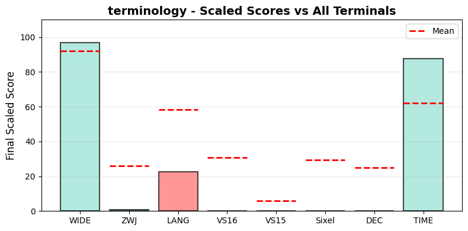

.. _terminology:

terminology
-----------

Tested Software version 1.13.0 on Linux.
The homepage URL of this terminal is https://www.enlightenment.org/about-terminology.
Full results available at ucs-detect_ repository path
`data/terminology.yaml <https://github.com/jquast/ucs-detect/blob/master/data/terminology.yaml>`_.

.. _terminologyscores:

Score Breakdown
+++++++++++++++

Detailed breakdown of how scores are calculated for *terminology*:

.. table::
   :class: sphinx-datatable

   ===  ======================================  ===========  ====================
     #  Score Type                              Raw Score    Final Scaled Score
   ===  ======================================  ===========  ====================
     1  :ref:`WIDE <terminologywide>`           96.77%       96.7%
     2  :ref:`ZWJ <terminologyzwj>`             0.69%        0.7%
     3  :ref:`LANG <terminologylang>`           52.95%       12.5%
     4  :ref:`VS16 <terminologyvs16>`           0.00%        0.0%
     5  :ref:`VS15 <terminologyvs15>`           0.00%        0.0%
     6  :ref:`Sixel <terminologysixel>`         no           0.0%
     7  :ref:`DEC Modes <terminologydecmodes>`  0            0.0%
     8  :ref:`TIME <terminologytime>`           70.06s       87.8%
   ===  ======================================  ===========  ====================

**Score Comparison Plot:**

The following plot shows how this terminal's scores compare to all other terminals tested.

   Scaled scores comparison across all metrics (normalized 0-100%)

**Final Scaled Score Calculation:**

- Raw Final Score: 25.91%
  (weighted average of all raw scores: WIDE + ZWJ + LANG + VS16 + VS15 + Sixel + DEC Modes + 0.5*TIME)
  the categorized 'average' absolute support level of this terminal
  Note: DEC Modes and TIME are normalized to 0-1 range before averaging.
  TIME is weighted at 0.5 (half as powerful as other metrics).

- Final Scaled Score: 0.0%
  (normalized across all terminals tested).
  *Final Scaled scores* are normalized (0-100%) relative to all terminals tested

**WIDE Score Details:**

Wide character support calculation:
- Total successful codepoints: 6660
- Total codepoints tested: 6882
- Best matching Unicode version: 17.0.0
- Formula: 6660 / 6882
- Result: 96.77%

**ZWJ Score Details:**

Emoji ZWJ (Zero-Width Joiner) support calculation:
- Total successful sequences: 10
- Total sequences tested: 1445
- Best matching Emoji version: None
- Formula: 10 / 1445
- Result: 0.69%

**VS16 Score Details:**

Variation Selector-16 support calculation:
- Errors: 213 of 213 codepoints tested
- Success rate: 0.0%
- Formula: 0.0 / 100
- Result: 0.00%

**VS15 Score Details:**

Variation Selector-15 support calculation:
- Errors: 158 of 158 codepoints tested
- Success rate: 0.0%
- Formula: 0.0 / 100
- Result: 0.00%

**Sixel Score Details:**

Sixel graphics support: **no**

Sixel support is determined by the terminal's response to the Device Attributes
(DA1) query. Terminals that include '4' in their DA1 extensions response support
Sixel graphics protocol.

**DEC Modes Score Details:**

DEC Private Modes support calculation:
- Changeable modes: 0
- Total modes tested: 0
- Raw score: 0 modes
- Scaled: normalized against max changeable modes across all terminals

**TIME Score Details:**

Test execution time:
- Elapsed time: 70.06 seconds
- Note: This is a raw measurement; lower is better
- Scaled score uses inverse log10 scaling across all terminals
- Scaled result: 87.8%

**LANG Score Details (Geometric Mean):**

Geometric mean calculation:
- Formula: (p₁ × p₂ × ... × pₙ)^(1/n) where n = 97 languages
- About `geometric mean <https://en.wikipedia.org/wiki/Geometric_mean>`_
- Result: 52.95%

.. _terminologywide:

Wide character support
++++++++++++++++++++++

The best wide unicode table version for terminology appears to be 
**17.0.0**, this is from a summary of the following
results:

.. table::
   :class: sphinx-datatable

   =========  ==========  =========  =============
   version      n_errors    n_total  pct_success
   =========  ==========  =========  =============
   '9.0.0'             0       5000  100.0%
   '10.0.0'            0        745  100.0%
   '11.0.0'            0         72  100.0%
   '12.0.0'            0         76  100.0%
   '12.1.0'            0          1  100.0%
   '13.0.0'            0        552  100.0%
   '14.0.0'           22         54  59.3%
   '15.0.0'            6         22  72.7%
   '15.1.0'            0          5  100.0%
   '16.0.0'          191        198  3.5%
   '17.0.0'            3        157  98.1%
   =========  ==========  =========  =============

Sequence of a WIDE character from Unicode Version 17.0.0, from midpoint of alignment failure records:

.. table::
   :class: sphinx-datatable

   ===  =================================================  =============  ==========  =========  ======
     #  Codepoint                                          Python         Category      wcwidth  Name
   ===  =================================================  =============  ==========  =========  ======
     1  `U+0001FAEA <https://codepoints.net/U+0001FAEA>`_  '\\U0001faea'  Cn                  2  na
   ===  =================================================  =============  ==========  =========  ======

Total codepoints: 1

- Shell test using `printf(1)`_, ``'|'`` should align in output::

        $ printf "\xf0\x9f\xab\xaa|\\n12|\\n"
        🫪|
        12|

- python `wcwidth.wcswidth()`_ measures width 2,
  while *terminology* measures width 1.

.. _terminologyzwj:

Emoji ZWJ support
+++++++++++++++++

The best Emoji ZWJ table version for *terminology* appears to be 
**None**, this is from a summary of the following
results:

.. table::
   :class: sphinx-datatable

   =========  ==========  =========  =============
   version      n_errors    n_total  pct_success
   =========  ==========  =========  =============
   '2.0'              21         22  4.5%
   '4.0'             571        579  1.4%
   '5.0'             100        100  0.0%
   '11.0'             73         73  0.0%
   '12.0'            112        112  0.0%
   '12.1'            165        165  0.0%
   '13.0'             50         51  2.0%
   '13.1'             83         83  0.0%
   '14.0'             20         20  0.0%
   '15.0'              1          1  0.0%
   '15.1'            109        109  0.0%
   '17.0'            130        130  0.0%
   =========  ==========  =========  =============

Sequence of an Emoji ZWJ Sequence from Emoji Version 17.0, from midpoint of alignment failure records:

.. table::
   :class: sphinx-datatable

   ===  =================================================  =============  ==========  =========  =================================
     #  Codepoint                                          Python         Category      wcwidth  Name
   ===  =================================================  =============  ==========  =========  =================================
     1  `U+0001F469 <https://codepoints.net/U+0001F469>`_  '\\U0001f469'  So                  2  WOMAN
     2  `U+0001F3FE <https://codepoints.net/U+0001F3FE>`_  '\\U0001f3fe'  Sk                  0  EMOJI MODIFIER FITZPATRICK TYPE-5
     3  `U+200D <https://codepoints.net/U+200D>`_          '\\u200d'      Cf                  0  ZERO WIDTH JOINER
     4  `U+0001FAEF <https://codepoints.net/U+0001FAEF>`_  '\\U0001faef'  Cn                  2  na
     5  `U+200D <https://codepoints.net/U+200D>`_          '\\u200d'      Cf                  0  ZERO WIDTH JOINER
     6  `U+0001F469 <https://codepoints.net/U+0001F469>`_  '\\U0001f469'  So                  2  WOMAN
     7  `U+0001F3FF <https://codepoints.net/U+0001F3FF>`_  '\\U0001f3ff'  Sk                  0  EMOJI MODIFIER FITZPATRICK TYPE-6
   ===  =================================================  =============  ==========  =========  =================================

Total codepoints: 7

- Shell test using `printf(1)`_, ``'|'`` should align in output::

        $ printf "\xf0\x9f\x91\xa9\xf0\x9f\x8f\xbe\xe2\x80\x8d\xf0\x9f\xab\xaf\xe2\x80\x8d\xf0\x9f\x91\xa9\xf0\x9f\x8f\xbf|\\n12|\\n"
        👩🏾‍🫯‍👩🏿|
        12|

- python `wcwidth.wcswidth()`_ measures width 2,
  while *terminology* measures width 9.

.. _terminologyvs16:

Variation Selector-16 support
+++++++++++++++++++++++++++++

Emoji VS-16 results for *terminology* is 213 errors
out of 213 total codepoints tested, 0.0% success.
Sequence of a NARROW Emoji made WIDE by *Variation Selector-16*, from midpoint of alignment failure records:

.. table::
   :class: sphinx-datatable

   ===  =========================================  =========  ==========  =========  =====================
     #  Codepoint                                  Python     Category      wcwidth  Name
   ===  =========================================  =========  ==========  =========  =====================
     1  `U+2733 <https://codepoints.net/U+2733>`_  '\\u2733'  So                  1  EIGHT SPOKED ASTERISK
     2  `U+FE0F <https://codepoints.net/U+FE0F>`_  '\\ufe0f'  Mn                  0  VARIATION SELECTOR-16
   ===  =========================================  =========  ==========  =========  =====================

Total codepoints: 2

- Shell test using `printf(1)`_, ``'|'`` should align in output::

        $ printf "\xe2\x9c\xb3\xef\xb8\x8f|\\n12|\\n"
        ✳️|
        12|

- python `wcwidth.wcswidth()`_ measures width 2,
  while *terminology* measures width 1.

.. _terminologyvs15:

Variation Selector-15 support
+++++++++++++++++++++++++++++

Emoji VS-15 results for *terminology* is 158 errors
out of 158 total codepoints tested, 0.0% success.
Sequence of a WIDE Emoji made NARROW by *Variation Selector-15*, from midpoint of alignment failure records:

.. table::
   :class: sphinx-datatable

   ===  =================================================  =============  ==========  =========  =====================
     #  Codepoint                                          Python         Category      wcwidth  Name
   ===  =================================================  =============  ==========  =========  =====================
     1  `U+0001F3AE <https://codepoints.net/U+0001F3AE>`_  '\\U0001f3ae'  So                  2  VIDEO GAME
     2  `U+FE0E <https://codepoints.net/U+FE0E>`_          '\\ufe0e'      Mn                  0  VARIATION SELECTOR-15
   ===  =================================================  =============  ==========  =========  =====================

Total codepoints: 2

- Shell test using `printf(1)`_, ``'|'`` should align in output::

        $ printf "\xf0\x9f\x8e\xae\xef\xb8\x8e|\\n1|\\n"
        🎮︎|
        1|

- python `wcwidth.wcswidth()`_ measures width 1,
  while *terminology* measures width 2.

.. _terminologysixel:

Sixel Graphics Support
++++++++++++++++++++++

*terminology* **does not support Sixel graphics protocol**.

Sixel support is determined by the terminal's response to the Device Attributes
(DA1) query. Terminals that include '4' in their DA1 extensions response indicate
support for the Sixel graphics protocol, which allows inline image rendering.

**Device Attributes Response:**

- Extensions reported: 1, 9, 15, 18, 21, 22
- Sixel indicator ('4'): not present

.. _terminologylang:

Language Support
++++++++++++++++

The following 52 languages were tested with 100% success:

Aja, Amarakaeri, Baatonum, Bamun, Belanda Viri, Bora, Catalan (2), Chickasaw, Chinantec, Chiltepec, Chinese, Mandarin (Simplified), Dagaare, Southern, Dangme, Dendi, Dinka, Northeastern, Ditammari, Evenki, Fon, French (Welche), Fur, Ga, Gen, Gilyak, Gumuz, Kabyle, Korean, Lamnso', Lingala (tones), Maori (2), Mazahua Central, Mirandese, Mixtec, Metlatónoc, Mòoré, Nanai, Navajo, Orok, Otomi, Mezquital, Picard, Saint Lucian Creole French, Secoya, Shipibo-Conibo, Siona, South Azerbaijani, Tamazight, Central Atlas, Tem, Ticuna, Uduk, Veps, Vietnamese, Waama, Yaneshaʼ, Yoruba, Éwé.

The following 45 languages are not fully supported:

.. table::
   :class: sphinx-datatable

   ==========================================================================  ==========  =========  =============
   lang                                                                          n_errors    n_total  pct_success
   ==========================================================================  ==========  =========  =============
   :ref:`Maldivian <terminologylangmaldivian>`                                       1000       1029  2.8%
   :ref:`Tamil <terminologylangtamil>`                                               1000       1030  2.9%
   :ref:`Tamil (Sri Lanka) <terminologylangtamilsrilanka>`                           1000       1030  2.9%
   :ref:`Burmese <terminologylangburmese>`                                           1000       1033  3.2%
   :ref:`Mon <terminologylangmon>`                                                    910        946  3.8%
   :ref:`Shan <terminologylangshan>`                                                  880        915  3.8%
   :ref:`Gujarati <terminologylanggujarati>`                                         1000       1061  5.7%
   :ref:`Malayalam <terminologylangmalayalam>`                                       1000       1061  5.7%
   :ref:`Kannada <terminologylangkannada>`                                           1000       1069  6.5%
   :ref:`Tamang, Eastern <terminologylangtamangeastern>`                               42         45  6.7%
   :ref:`Khün <terminologylangkhn>`                                                   412        442  6.8%
   :ref:`Khmer, Central <terminologylangkhmercentral>`                                492        528  6.8%
   :ref:`Chakma <terminologylangchakma>`                                             1000       1078  7.2%
   :ref:`Bengali <terminologylangbengali>`                                           1000       1085  7.8%
   :ref:`Telugu <terminologylangtelugu>`                                             1000       1091  8.3%
   :ref:`Sanskrit <terminologylangsanskrit>`                                          891       1000  10.9%
   :ref:`Sanskrit (Grantha) <terminologylangsanskritgrantha>`                         893       1006  11.2%
   :ref:`Marathi <terminologylangmarathi>`                                           1000       1151  13.1%
   :ref:`Nepali <terminologylangnepali>`                                             1000       1159  13.7%
   :ref:`Sinhala <terminologylangsinhala>`                                           1000       1168  14.4%
   :ref:`Hindi <terminologylanghindi>`                                               1000       1171  14.6%
   :ref:`Thai (2) <terminologylangthai2>`                                             267        313  14.7%
   :ref:`Panjabi, Eastern <terminologylangpanjabieastern>`                           1000       1177  15.0%
   :ref:`Bhojpuri <terminologylangbhojpuri>`                                         1000       1204  16.9%
   :ref:`Maithili <terminologylangmaithili>`                                         1000       1219  18.0%
   :ref:`Thai <terminologylangthai>`                                                  273        341  19.9%
   :ref:`Magahi <terminologylangmagahi>`                                             1000       1309  23.6%
   :ref:`Javanese (Javanese) <terminologylangjavanesejavanese>`                      1000       1405  28.8%
   :ref:`Tagalog (Tagalog) <terminologylangtagalogtagalog>`                            21         31  32.3%
   :ref:`Tibetan, Central <terminologylangtibetancentral>`                           1000       1510  33.8%
   :ref:`Dzongkha <terminologylangdzongkha>`                                         1000       1571  36.3%
   :ref:`Lao <terminologylanglao>`                                                    270        426  36.6%
   :ref:`Yiddish, Eastern <terminologylangyiddisheastern>`                            869       1775  51.0%
   :ref:`Pular (Adlam) <terminologylangpularadlam>`                                   782       1613  51.5%
   :ref:`Tai Dam <terminologylangtaidam>`                                             943       2386  60.5%
   :ref:`Mongolian, Halh (Mongolian) <terminologylangmongolianhalhmongolian>`           3         33  90.9%
   :ref:`Assyrian Neo-Aramaic <terminologylangassyrianneoaramaic>`                     51       1160  95.6%
   :ref:`Farsi, Western <terminologylangfarsiwestern>`                                 63       1822  96.5%
   :ref:`Urdu (2) <terminologylangurdu2>`                                              52       2251  97.7%
   :ref:`Urdu <terminologylangurdu>`                                                   50       2237  97.8%
   :ref:`Dari <terminologylangdari>`                                                   30       1872  98.4%
   :ref:`Arabic, Standard <terminologylangarabicstandard>`                             20       1348  98.5%
   :ref:`Panjabi, Western <terminologylangpanjabiwestern>`                             19       2419  99.2%
   :ref:`Pashto, Northern <terminologylangpashtonorthern>`                              4       2242  99.8%
   :ref:`Seraiki <terminologylangseraiki>`                                              2       2242  99.9%
   ==========================================================================  ==========  =========  =============

.. _terminologylangmaldivian:

Maldivian
^^^^^^^^^

Sequence of language *Maldivian* from midpoint of alignment failure records:

.. table::
   :class: sphinx-datatable

   ===  =========================================  =========  ==========  =========  ======================
     #  Codepoint                                  Python     Category      wcwidth  Name
   ===  =========================================  =========  ==========  =========  ======================
     1  `U+0791 <https://codepoints.net/U+0791>`_  '\\u0791'  Lo                  1  THAANA LETTER DAVIYANI
     2  `U+07A8 <https://codepoints.net/U+07A8>`_  '\\u07a8'  Mn                  0  THAANA IBIFILI
     3  `U+0790 <https://codepoints.net/U+0790>`_  '\\u0790'  Lo                  1  THAANA LETTER SEENU
     4  `U+07AC <https://codepoints.net/U+07AC>`_  '\\u07ac'  Mn                  0  THAANA EBEFILI
     5  `U+0789 <https://codepoints.net/U+0789>`_  '\\u0789'  Lo                  1  THAANA LETTER MEEMU
     6  `U+07B0 <https://codepoints.net/U+07B0>`_  '\\u07b0'  Mn                  0  THAANA SUKUN
     7  `U+0784 <https://codepoints.net/U+0784>`_  '\\u0784'  Lo                  1  THAANA LETTER BAA
     8  `U+07A6 <https://codepoints.net/U+07A6>`_  '\\u07a6'  Mn                  0  THAANA ABAFILI
     9  `U+0783 <https://codepoints.net/U+0783>`_  '\\u0783'  Lo                  1  THAANA LETTER RAA
   ===  =========================================  =========  ==========  =========  ======================

Total codepoints: 9

- Shell test using `printf(1)`_, ``'|'`` should align in output::

        $ printf "\xde\x91\xde\xa8\xde\x90\xde\xac\xde\x89\xde\xb0\xde\x84\xde\xa6\xde\x83|\\n12345|\\n"
        ޑިސެމްބަރ|
        12345|

- python `wcwidth.wcswidth()`_ measures width 5,
  while *terminology* measures width 9.

.. _terminologylangtamil:

Tamil
^^^^^

Sequence of language *Tamil* from midpoint of alignment failure records:

.. table::
   :class: sphinx-datatable

   ===  =========================================  =========  ==========  =========  ==================
     #  Codepoint                                  Python     Category      wcwidth  Name
   ===  =========================================  =========  ==========  =========  ==================
     1  `U+0BAE <https://codepoints.net/U+0BAE>`_  '\\u0bae'  Lo                  1  TAMIL LETTER MA
     2  `U+0BA9 <https://codepoints.net/U+0BA9>`_  '\\u0ba9'  Lo                  1  TAMIL LETTER NNNA
     3  `U+0BBF <https://codepoints.net/U+0BBF>`_  '\\u0bbf'  Mc                  0  TAMIL VOWEL SIGN I
     4  `U+0BA4 <https://codepoints.net/U+0BA4>`_  '\\u0ba4'  Lo                  1  TAMIL LETTER TA
   ===  =========================================  =========  ==========  =========  ==================

Total codepoints: 4

- Shell test using `printf(1)`_, ``'|'`` should align in output::

        $ printf "\xe0\xae\xae\xe0\xae\xa9\xe0\xae\xbf\xe0\xae\xa4|\\n123|\\n"
        மனித|
        123|

- python `wcwidth.wcswidth()`_ measures width 3,
  while *terminology* measures width 4.

.. _terminologylangtamilsrilanka:

Tamil (Sri Lanka)
^^^^^^^^^^^^^^^^^

Sequence of language *Tamil (Sri Lanka)* from midpoint of alignment failure records:

.. table::
   :class: sphinx-datatable

   ===  =========================================  =========  ==========  =========  ==================
     #  Codepoint                                  Python     Category      wcwidth  Name
   ===  =========================================  =========  ==========  =========  ==================
     1  `U+0BAE <https://codepoints.net/U+0BAE>`_  '\\u0bae'  Lo                  1  TAMIL LETTER MA
     2  `U+0BA9 <https://codepoints.net/U+0BA9>`_  '\\u0ba9'  Lo                  1  TAMIL LETTER NNNA
     3  `U+0BBF <https://codepoints.net/U+0BBF>`_  '\\u0bbf'  Mc                  0  TAMIL VOWEL SIGN I
     4  `U+0BA4 <https://codepoints.net/U+0BA4>`_  '\\u0ba4'  Lo                  1  TAMIL LETTER TA
   ===  =========================================  =========  ==========  =========  ==================

Total codepoints: 4

- Shell test using `printf(1)`_, ``'|'`` should align in output::

        $ printf "\xe0\xae\xae\xe0\xae\xa9\xe0\xae\xbf\xe0\xae\xa4|\\n123|\\n"
        மனித|
        123|

- python `wcwidth.wcswidth()`_ measures width 3,
  while *terminology* measures width 4.

.. _terminologylangburmese:

Burmese
^^^^^^^

Sequence of language *Burmese* from midpoint of alignment failure records:

.. table::
   :class: sphinx-datatable

   ===  =========================================  =========  ==========  =========  ================================
     #  Codepoint                                  Python     Category      wcwidth  Name
   ===  =========================================  =========  ==========  =========  ================================
     1  `U+1021 <https://codepoints.net/U+1021>`_  '\\u1021'  Lo                  1  MYANMAR LETTER A
     2  `U+1015 <https://codepoints.net/U+1015>`_  '\\u1015'  Lo                  1  MYANMAR LETTER PA
     3  `U+103C <https://codepoints.net/U+103C>`_  '\\u103c'  Mc                  0  MYANMAR CONSONANT SIGN MEDIAL RA
     4  `U+100A <https://codepoints.net/U+100A>`_  '\\u100a'  Lo                  1  MYANMAR LETTER NNYA
     5  `U+103A <https://codepoints.net/U+103A>`_  '\\u103a'  Mn                  0  MYANMAR SIGN ASAT
     6  `U+1015 <https://codepoints.net/U+1015>`_  '\\u1015'  Lo                  1  MYANMAR LETTER PA
     7  `U+103C <https://codepoints.net/U+103C>`_  '\\u103c'  Mc                  0  MYANMAR CONSONANT SIGN MEDIAL RA
     8  `U+100A <https://codepoints.net/U+100A>`_  '\\u100a'  Lo                  1  MYANMAR LETTER NNYA
     9  `U+103A <https://codepoints.net/U+103A>`_  '\\u103a'  Mn                  0  MYANMAR SIGN ASAT
    10  `U+1006 <https://codepoints.net/U+1006>`_  '\\u1006'  Lo                  1  MYANMAR LETTER CHA
    11  `U+102D <https://codepoints.net/U+102D>`_  '\\u102d'  Mn                  0  MYANMAR VOWEL SIGN I
    12  `U+102F <https://codepoints.net/U+102F>`_  '\\u102f'  Mn                  0  MYANMAR VOWEL SIGN U
    13  `U+1004 <https://codepoints.net/U+1004>`_  '\\u1004'  Lo                  1  MYANMAR LETTER NGA
    14  `U+103A <https://codepoints.net/U+103A>`_  '\\u103a'  Mn                  0  MYANMAR SIGN ASAT
    15  `U+101B <https://codepoints.net/U+101B>`_  '\\u101b'  Lo                  1  MYANMAR LETTER RA
    16  `U+102C <https://codepoints.net/U+102C>`_  '\\u102c'  Mc                  0  MYANMAR VOWEL SIGN AA
   ===  =========================================  =========  ==========  =========  ================================

Total codepoints: 16

- Shell test using `printf(1)`_, ``'|'`` should align in output::

        $ printf "\xe1\x80\xa1\xe1\x80\x95\xe1\x80\xbc\xe1\x80\x8a\xe1\x80\xba\xe1\x80\x95\xe1\x80\xbc\xe1\x80\x8a\xe1\x80\xba\xe1\x80\x86\xe1\x80\xad\xe1\x80\xaf\xe1\x80\x84\xe1\x80\xba\xe1\x80\x9b\xe1\x80\xac|\\n12345678|\\n"
        အပြည်ပြည်ဆိုင်ရာ|
        12345678|

- python `wcwidth.wcswidth()`_ measures width 8,
  while *terminology* measures width 16.

.. _terminologylangmon:

Mon
^^^

Sequence of language *Mon* from midpoint of alignment failure records:

.. table::
   :class: sphinx-datatable

   ===  =========================================  =========  ==========  =========  ======================
     #  Codepoint                                  Python     Category      wcwidth  Name
   ===  =========================================  =========  ==========  =========  ======================
     1  `U+101C <https://codepoints.net/U+101C>`_  '\\u101c'  Lo                  1  MYANMAR LETTER LA
     2  `U+102D <https://codepoints.net/U+102D>`_  '\\u102d'  Mn                  0  MYANMAR VOWEL SIGN I
     3  `U+1000 <https://codepoints.net/U+1000>`_  '\\u1000'  Lo                  1  MYANMAR LETTER KA
     4  `U+103A <https://codepoints.net/U+103A>`_  '\\u103a'  Mn                  0  MYANMAR SIGN ASAT
     5  `U+101C <https://codepoints.net/U+101C>`_  '\\u101c'  Lo                  1  MYANMAR LETTER LA
     6  `U+101C <https://codepoints.net/U+101C>`_  '\\u101c'  Lo                  1  MYANMAR LETTER LA
     7  `U+1031 <https://codepoints.net/U+1031>`_  '\\u1031'  Mc                  0  MYANMAR VOWEL SIGN E
     8  `U+102C <https://codepoints.net/U+102C>`_  '\\u102c'  Mc                  0  MYANMAR VOWEL SIGN AA
     9  `U+105A <https://codepoints.net/U+105A>`_  '\\u105a'  Lo                  1  MYANMAR LETTER MON NGA
    10  `U+103A <https://codepoints.net/U+103A>`_  '\\u103a'  Mn                  0  MYANMAR SIGN ASAT
   ===  =========================================  =========  ==========  =========  ======================

Total codepoints: 10

- Shell test using `printf(1)`_, ``'|'`` should align in output::

        $ printf "\xe1\x80\x9c\xe1\x80\xad\xe1\x80\x80\xe1\x80\xba\xe1\x80\x9c\xe1\x80\x9c\xe1\x80\xb1\xe1\x80\xac\xe1\x81\x9a\xe1\x80\xba|\\n12345|\\n"
        လိက်လလောၚ်|
        12345|

- python `wcwidth.wcswidth()`_ measures width 5,
  while *terminology* measures width 10.

.. _terminologylangshan:

Shan
^^^^

Sequence of language *Shan* from midpoint of alignment failure records:

.. table::
   :class: sphinx-datatable

   ===  =========================================  =========  ==========  =========  ================================
     #  Codepoint                                  Python     Category      wcwidth  Name
   ===  =========================================  =========  ==========  =========  ================================
     1  `U+101C <https://codepoints.net/U+101C>`_  '\\u101c'  Lo                  1  MYANMAR LETTER LA
     2  `U+102D <https://codepoints.net/U+102D>`_  '\\u102d'  Mn                  0  MYANMAR VOWEL SIGN I
     3  `U+1075 <https://codepoints.net/U+1075>`_  '\\u1075'  Lo                  1  MYANMAR LETTER SHAN KA
     4  `U+103A <https://codepoints.net/U+103A>`_  '\\u103a'  Mn                  0  MYANMAR SIGN ASAT
     5  `U+1088 <https://codepoints.net/U+1088>`_  '\\u1088'  Mc                  0  MYANMAR SIGN SHAN TONE-3
     6  `U+1015 <https://codepoints.net/U+1015>`_  '\\u1015'  Lo                  1  MYANMAR LETTER PA
     7  `U+102D <https://codepoints.net/U+102D>`_  '\\u102d'  Mn                  0  MYANMAR VOWEL SIGN I
     8  `U+102F <https://codepoints.net/U+102F>`_  '\\u102f'  Mn                  0  MYANMAR VOWEL SIGN U
     9  `U+107C <https://codepoints.net/U+107C>`_  '\\u107c'  Lo                  1  MYANMAR LETTER SHAN NA
    10  `U+103A <https://codepoints.net/U+103A>`_  '\\u103a'  Mn                  0  MYANMAR SIGN ASAT
    11  `U+107D <https://codepoints.net/U+107D>`_  '\\u107d'  Lo                  1  MYANMAR LETTER SHAN PHA
    12  `U+1062 <https://codepoints.net/U+1062>`_  '\\u1062'  Mc                  0  MYANMAR VOWEL SIGN SGAW KAREN EU
    13  `U+101D <https://codepoints.net/U+101D>`_  '\\u101d'  Lo                  1  MYANMAR LETTER WA
    14  `U+103A <https://codepoints.net/U+103A>`_  '\\u103a'  Mn                  0  MYANMAR SIGN ASAT
    15  `U+1087 <https://codepoints.net/U+1087>`_  '\\u1087'  Mc                  0  MYANMAR SIGN SHAN TONE-2
   ===  =========================================  =========  ==========  =========  ================================

Total codepoints: 15

- Shell test using `printf(1)`_, ``'|'`` should align in output::

        $ printf "\xe1\x80\x9c\xe1\x80\xad\xe1\x81\xb5\xe1\x80\xba\xe1\x82\x88\xe1\x80\x95\xe1\x80\xad\xe1\x80\xaf\xe1\x81\xbc\xe1\x80\xba\xe1\x81\xbd\xe1\x81\xa2\xe1\x80\x9d\xe1\x80\xba\xe1\x82\x87|\\n123456|\\n"
        လိၵ်ႈပိုၼ်ၽၢဝ်ႇ|
        123456|

- python `wcwidth.wcswidth()`_ measures width 6,
  while *terminology* measures width 15.

.. _terminologylanggujarati:

Gujarati
^^^^^^^^

Sequence of language *Gujarati* from midpoint of alignment failure records:

.. table::
   :class: sphinx-datatable

   ===  =========================================  =========  ==========  =========  ======================
     #  Codepoint                                  Python     Category      wcwidth  Name
   ===  =========================================  =========  ==========  =========  ======================
     1  `U+0AAE <https://codepoints.net/U+0AAE>`_  '\\u0aae'  Lo                  1  GUJARATI LETTER MA
     2  `U+0ABE <https://codepoints.net/U+0ABE>`_  '\\u0abe'  Mc                  0  GUJARATI VOWEL SIGN AA
     3  `U+0AA8 <https://codepoints.net/U+0AA8>`_  '\\u0aa8'  Lo                  1  GUJARATI LETTER NA
     4  `U+0AB5 <https://codepoints.net/U+0AB5>`_  '\\u0ab5'  Lo                  1  GUJARATI LETTER VA
   ===  =========================================  =========  ==========  =========  ======================

Total codepoints: 4

- Shell test using `printf(1)`_, ``'|'`` should align in output::

        $ printf "\xe0\xaa\xae\xe0\xaa\xbe\xe0\xaa\xa8\xe0\xaa\xb5|\\n123|\\n"
        માનવ|
        123|

- python `wcwidth.wcswidth()`_ measures width 3,
  while *terminology* measures width 4.

.. _terminologylangmalayalam:

Malayalam
^^^^^^^^^

Sequence of language *Malayalam* from midpoint of alignment failure records:

.. table::
   :class: sphinx-datatable

   ===  =========================================  =========  ==========  =========  =======================
     #  Codepoint                                  Python     Category      wcwidth  Name
   ===  =========================================  =========  ==========  =========  =======================
     1  `U+0D2E <https://codepoints.net/U+0D2E>`_  '\\u0d2e'  Lo                  1  MALAYALAM LETTER MA
     2  `U+0D28 <https://codepoints.net/U+0D28>`_  '\\u0d28'  Lo                  1  MALAYALAM LETTER NA
     3  `U+0D41 <https://codepoints.net/U+0D41>`_  '\\u0d41'  Mn                  0  MALAYALAM VOWEL SIGN U
     4  `U+0D37 <https://codepoints.net/U+0D37>`_  '\\u0d37'  Lo                  1  MALAYALAM LETTER SSA
     5  `U+0D4D <https://codepoints.net/U+0D4D>`_  '\\u0d4d'  Mn                  0  MALAYALAM SIGN VIRAMA
     6  `U+0D2F <https://codepoints.net/U+0D2F>`_  '\\u0d2f'  Lo                  1  MALAYALAM LETTER YA
     7  `U+0D3E <https://codepoints.net/U+0D3E>`_  '\\u0d3e'  Mc                  0  MALAYALAM VOWEL SIGN AA
     8  `U+0D35 <https://codepoints.net/U+0D35>`_  '\\u0d35'  Lo                  1  MALAYALAM LETTER VA
     9  `U+0D15 <https://codepoints.net/U+0D15>`_  '\\u0d15'  Lo                  1  MALAYALAM LETTER KA
    10  `U+0D3E <https://codepoints.net/U+0D3E>`_  '\\u0d3e'  Mc                  0  MALAYALAM VOWEL SIGN AA
    11  `U+0D36 <https://codepoints.net/U+0D36>`_  '\\u0d36'  Lo                  1  MALAYALAM LETTER SHA
    12  `U+0D19 <https://codepoints.net/U+0D19>`_  '\\u0d19'  Lo                  1  MALAYALAM LETTER NGA
    13  `U+0D4D <https://codepoints.net/U+0D4D>`_  '\\u0d4d'  Mn                  0  MALAYALAM SIGN VIRAMA
    14  `U+0D19 <https://codepoints.net/U+0D19>`_  '\\u0d19'  Lo                  1  MALAYALAM LETTER NGA
    15  `U+0D33 <https://codepoints.net/U+0D33>`_  '\\u0d33'  Lo                  1  MALAYALAM LETTER LLA
    16  `U+0D46 <https://codepoints.net/U+0D46>`_  '\\u0d46'  Mc                  0  MALAYALAM VOWEL SIGN E
    17  `U+0D15 <https://codepoints.net/U+0D15>`_  '\\u0d15'  Lo                  1  MALAYALAM LETTER KA
    18  `U+0D4D <https://codepoints.net/U+0D4D>`_  '\\u0d4d'  Mn                  0  MALAYALAM SIGN VIRAMA
    19  `U+0D15 <https://codepoints.net/U+0D15>`_  '\\u0d15'  Lo                  1  MALAYALAM LETTER KA
    20  `U+0D41 <https://codepoints.net/U+0D41>`_  '\\u0d41'  Mn                  0  MALAYALAM VOWEL SIGN U
    21  `U+0D31 <https://codepoints.net/U+0D31>`_  '\\u0d31'  Lo                  1  MALAYALAM LETTER RRA
    22  `U+0D3F <https://codepoints.net/U+0D3F>`_  '\\u0d3f'  Mc                  0  MALAYALAM VOWEL SIGN I
    23  `U+0D15 <https://codepoints.net/U+0D15>`_  '\\u0d15'  Lo                  1  MALAYALAM LETTER KA
    24  `U+0D4D <https://codepoints.net/U+0D4D>`_  '\\u0d4d'  Mn                  0  MALAYALAM SIGN VIRAMA
    25  `U+0D15 <https://codepoints.net/U+0D15>`_  '\\u0d15'  Lo                  1  MALAYALAM LETTER KA
    26  `U+0D41 <https://codepoints.net/U+0D41>`_  '\\u0d41'  Mn                  0  MALAYALAM VOWEL SIGN U
    27  `U+0D28 <https://codepoints.net/U+0D28>`_  '\\u0d28'  Lo                  1  MALAYALAM LETTER NA
    28  `U+0D4D <https://codepoints.net/U+0D4D>`_  '\\u0d4d'  Mn                  0  MALAYALAM SIGN VIRAMA
    29  `U+0D28 <https://codepoints.net/U+0D28>`_  '\\u0d28'  Lo                  1  MALAYALAM LETTER NA
   ===  =========================================  =========  ==========  =========  =======================

Total codepoints: 29

- Shell test using `printf(1)`_, ``'|'`` should align in output::

        $ printf "\xe0\xb4\xae\xe0\xb4\xa8\xe0\xb5\x81\xe0\xb4\xb7\xe0\xb5\x8d\xe0\xb4\xaf\xe0\xb4\xbe\xe0\xb4\xb5\xe0\xb4\x95\xe0\xb4\xbe\xe0\xb4\xb6\xe0\xb4\x99\xe0\xb5\x8d\xe0\xb4\x99\xe0\xb4\xb3\xe0\xb5\x86\xe0\xb4\x95\xe0\xb5\x8d\xe0\xb4\x95\xe0\xb5\x81\xe0\xb4\xb1\xe0\xb4\xbf\xe0\xb4\x95\xe0\xb5\x8d\xe0\xb4\x95\xe0\xb5\x81\xe0\xb4\xa8\xe0\xb5\x8d\xe0\xb4\xa8|\\n12345678901234567|\\n"
        മനുഷ്യാവകാശങ്ങളെക്കുറിക്കുന്ന|
        12345678901234567|

- python `wcwidth.wcswidth()`_ measures width 17,
  while *terminology* measures width 29.

.. _terminologylangkannada:

Kannada
^^^^^^^

Sequence of language *Kannada* from midpoint of alignment failure records:

.. table::
   :class: sphinx-datatable

   ===  =========================================  =========  ==========  =========  =====================
     #  Codepoint                                  Python     Category      wcwidth  Name
   ===  =========================================  =========  ==========  =========  =====================
     1  `U+0CAE <https://codepoints.net/U+0CAE>`_  '\\u0cae'  Lo                  1  KANNADA LETTER MA
     2  `U+0CBE <https://codepoints.net/U+0CBE>`_  '\\u0cbe'  Mc                  0  KANNADA VOWEL SIGN AA
     3  `U+0CA8 <https://codepoints.net/U+0CA8>`_  '\\u0ca8'  Lo                  1  KANNADA LETTER NA
     4  `U+0CB5 <https://codepoints.net/U+0CB5>`_  '\\u0cb5'  Lo                  1  KANNADA LETTER VA
   ===  =========================================  =========  ==========  =========  =====================

Total codepoints: 4

- Shell test using `printf(1)`_, ``'|'`` should align in output::

        $ printf "\xe0\xb2\xae\xe0\xb2\xbe\xe0\xb2\xa8\xe0\xb2\xb5|\\n123|\\n"
        ಮಾನವ|
        123|

- python `wcwidth.wcswidth()`_ measures width 3,
  while *terminology* measures width 4.

.. _terminologylangtamangeastern:

Tamang, Eastern
^^^^^^^^^^^^^^^

Sequence of language *Tamang, Eastern* from midpoint of alignment failure records:

.. table::
   :class: sphinx-datatable

   ===  =========================================  =========  ==========  =========  ========================
     #  Codepoint                                  Python     Category      wcwidth  Name
   ===  =========================================  =========  ==========  =========  ========================
     1  `U+092E <https://codepoints.net/U+092E>`_  '\\u092e'  Lo                  1  DEVANAGARI LETTER MA
     2  `U+094D <https://codepoints.net/U+094D>`_  '\\u094d'  Mn                  0  DEVANAGARI SIGN VIRAMA
     3  `U+0939 <https://codepoints.net/U+0939>`_  '\\u0939'  Lo                  1  DEVANAGARI LETTER HA
     4  `U+0940 <https://codepoints.net/U+0940>`_  '\\u0940'  Mc                  0  DEVANAGARI VOWEL SIGN II
     5  `U+0938 <https://codepoints.net/U+0938>`_  '\\u0938'  Lo                  1  DEVANAGARI LETTER SA
     6  `U+0947 <https://codepoints.net/U+0947>`_  '\\u0947'  Mn                  0  DEVANAGARI VOWEL SIGN E
   ===  =========================================  =========  ==========  =========  ========================

Total codepoints: 6

- Shell test using `printf(1)`_, ``'|'`` should align in output::

        $ printf "\xe0\xa4\xae\xe0\xa5\x8d\xe0\xa4\xb9\xe0\xa5\x80\xe0\xa4\xb8\xe0\xa5\x87|\\n123|\\n"
        म्हीसे|
        123|

- python `wcwidth.wcswidth()`_ measures width 3,
  while *terminology* measures width 6.

.. _terminologylangkhn:

Khün
^^^^

Sequence of language *Khün* from midpoint of alignment failure records:

.. table::
   :class: sphinx-datatable

   ===  =========================================  =========  ==========  =========  ===========================
     #  Codepoint                                  Python     Category      wcwidth  Name
   ===  =========================================  =========  ==========  =========  ===========================
     1  `U+1A20 <https://codepoints.net/U+1A20>`_  '\\u1a20'  Lo                  1  TAI THAM LETTER HIGH KA
     2  `U+1A32 <https://codepoints.net/U+1A32>`_  '\\u1a32'  Lo                  1  TAI THAM LETTER HIGH TA
     3  `U+1A65 <https://codepoints.net/U+1A65>`_  '\\u1a65'  Mn                  0  TAI THAM VOWEL SIGN I
     4  `U+1A20 <https://codepoints.net/U+1A20>`_  '\\u1a20'  Lo                  1  TAI THAM LETTER HIGH KA
     5  `U+1A63 <https://codepoints.net/U+1A63>`_  '\\u1a63'  Mc                  0  TAI THAM VOWEL SIGN AA
     6  `U+1A45 <https://codepoints.net/U+1A45>`_  '\\u1a45'  Lo                  1  TAI THAM LETTER WA
     7  `U+1A64 <https://codepoints.net/U+1A64>`_  '\\u1a64'  Mc                  0  TAI THAM VOWEL SIGN TALL AA
     8  `U+1A75 <https://codepoints.net/U+1A75>`_  '\\u1a75'  Mn                  0  TAI THAM SIGN TONE-1
     9  `U+1A2F <https://codepoints.net/U+1A2F>`_  '\\u1a2f'  Lo                  1  TAI THAM LETTER DA
    10  `U+1A60 <https://codepoints.net/U+1A60>`_  '\\u1a60'  Mn                  0  TAI THAM SIGN SAKOT
    11  `U+1A45 <https://codepoints.net/U+1A45>`_  '\\u1a45'  Lo                  1  TAI THAM LETTER WA
    12  `U+1A60 <https://codepoints.net/U+1A60>`_  '\\u1a60'  Mn                  0  TAI THAM SIGN SAKOT
    13  `U+1A3F <https://codepoints.net/U+1A3F>`_  '\\u1a3f'  Lo                  1  TAI THAM LETTER LOW YA
    14  `U+1A62 <https://codepoints.net/U+1A62>`_  '\\u1a62'  Mn                  0  TAI THAM VOWEL SIGN MAI SAT
    15  `U+1A3E <https://codepoints.net/U+1A3E>`_  '\\u1a3e'  Lo                  1  TAI THAM LETTER MA
    16  `U+1A36 <https://codepoints.net/U+1A36>`_  '\\u1a36'  Lo                  1  TAI THAM LETTER NA
    17  `U+1A69 <https://codepoints.net/U+1A69>`_  '\\u1a69'  Mn                  0  TAI THAM VOWEL SIGN U
    18  `U+1A54 <https://codepoints.net/U+1A54>`_  '\\u1a54'  Lo                  1  TAI THAM LETTER GREAT SA
    19  `U+1A29 <https://codepoints.net/U+1A29>`_  '\\u1a29'  Lo                  1  TAI THAM LETTER LOW CA
    20  `U+1A63 <https://codepoints.net/U+1A63>`_  '\\u1a63'  Mc                  0  TAI THAM VOWEL SIGN AA
    21  `U+1A60 <https://codepoints.net/U+1A60>`_  '\\u1a60'  Mn                  0  TAI THAM SIGN SAKOT
    22  `U+1A32 <https://codepoints.net/U+1A32>`_  '\\u1a32'  Lo                  1  TAI THAM LETTER HIGH TA
   ===  =========================================  =========  ==========  =========  ===========================

Total codepoints: 22

- Shell test using `printf(1)`_, ``'|'`` should align in output::

        $ printf "\xe1\xa8\xa0\xe1\xa8\xb2\xe1\xa9\xa5\xe1\xa8\xa0\xe1\xa9\xa3\xe1\xa9\x85\xe1\xa9\xa4\xe1\xa9\xb5\xe1\xa8\xaf\xe1\xa9\xa0\xe1\xa9\x85\xe1\xa9\xa0\xe1\xa8\xbf\xe1\xa9\xa2\xe1\xa8\xbe\xe1\xa8\xb6\xe1\xa9\xa9\xe1\xa9\x94\xe1\xa8\xa9\xe1\xa9\xa3\xe1\xa9\xa0\xe1\xa8\xb2|\\n123456789012|\\n"
        ᨠᨲᩥᨠᩣᩅᩤ᩵ᨯ᩠ᩅ᩠ᨿᩢᨾᨶᩩᩔᨩᩣ᩠ᨲ|
        123456789012|

- python `wcwidth.wcswidth()`_ measures width 12,
  while *terminology* measures width 22.

.. _terminologylangkhmercentral:

Khmer, Central
^^^^^^^^^^^^^^

Sequence of language *Khmer, Central* from midpoint of alignment failure records:

.. table::
   :class: sphinx-datatable

   ===  =========================================  =========  ==========  =========  ===================
     #  Codepoint                                  Python     Category      wcwidth  Name
   ===  =========================================  =========  ==========  =========  ===================
     1  `U+179F <https://codepoints.net/U+179F>`_  '\\u179f'  Lo                  1  KHMER LETTER SA
     2  `U+17C1 <https://codepoints.net/U+17C1>`_  '\\u17c1'  Mc                  0  KHMER VOWEL SIGN E
     3  `U+1785 <https://codepoints.net/U+1785>`_  '\\u1785'  Lo                  1  KHMER LETTER CA
     4  `U+1780 <https://codepoints.net/U+1780>`_  '\\u1780'  Lo                  1  KHMER LETTER KA
     5  `U+17D2 <https://codepoints.net/U+17D2>`_  '\\u17d2'  Mn                  0  KHMER SIGN COENG
     6  `U+178A <https://codepoints.net/U+178A>`_  '\\u178a'  Lo                  1  KHMER LETTER DA
     7  `U+17B8 <https://codepoints.net/U+17B8>`_  '\\u17b8'  Mn                  0  KHMER VOWEL SIGN II
     8  `U+1794 <https://codepoints.net/U+1794>`_  '\\u1794'  Lo                  1  KHMER LETTER BA
     9  `U+17D2 <https://codepoints.net/U+17D2>`_  '\\u17d2'  Mn                  0  KHMER SIGN COENG
    10  `U+179A <https://codepoints.net/U+179A>`_  '\\u179a'  Lo                  1  KHMER LETTER RO
    11  `U+1780 <https://codepoints.net/U+1780>`_  '\\u1780'  Lo                  1  KHMER LETTER KA
    12  `U+17B6 <https://codepoints.net/U+17B6>`_  '\\u17b6'  Mc                  0  KHMER VOWEL SIGN AA
    13  `U+179F <https://codepoints.net/U+179F>`_  '\\u179f'  Lo                  1  KHMER LETTER SA
    14  `U+1787 <https://codepoints.net/U+1787>`_  '\\u1787'  Lo                  1  KHMER LETTER CO
    15  `U+17B6 <https://codepoints.net/U+17B6>`_  '\\u17b6'  Mc                  0  KHMER VOWEL SIGN AA
    16  `U+179F <https://codepoints.net/U+179F>`_  '\\u179f'  Lo                  1  KHMER LETTER SA
    17  `U+1780 <https://codepoints.net/U+1780>`_  '\\u1780'  Lo                  1  KHMER LETTER KA
    18  `U+179B <https://codepoints.net/U+179B>`_  '\\u179b'  Lo                  1  KHMER LETTER LO
    19  `U+179F <https://codepoints.net/U+179F>`_  '\\u179f'  Lo                  1  KHMER LETTER SA
    20  `U+17D2 <https://codepoints.net/U+17D2>`_  '\\u17d2'  Mn                  0  KHMER SIGN COENG
    21  `U+178A <https://codepoints.net/U+178A>`_  '\\u178a'  Lo                  1  KHMER LETTER DA
    22  `U+17B8 <https://codepoints.net/U+17B8>`_  '\\u17b8'  Mn                  0  KHMER VOWEL SIGN II
    23  `U+1796 <https://codepoints.net/U+1796>`_  '\\u1796'  Lo                  1  KHMER LETTER PO
    24  `U+17B8 <https://codepoints.net/U+17B8>`_  '\\u17b8'  Mn                  0  KHMER VOWEL SIGN II
    25  `U+179F <https://codepoints.net/U+179F>`_  '\\u179f'  Lo                  1  KHMER LETTER SA
    26  `U+17B7 <https://codepoints.net/U+17B7>`_  '\\u17b7'  Mn                  0  KHMER VOWEL SIGN I
    27  `U+1791 <https://codepoints.net/U+1791>`_  '\\u1791'  Lo                  1  KHMER LETTER TO
    28  `U+17D2 <https://codepoints.net/U+17D2>`_  '\\u17d2'  Mn                  0  KHMER SIGN COENG
    29  `U+1792 <https://codepoints.net/U+1792>`_  '\\u1792'  Lo                  1  KHMER LETTER THO
    30  `U+17B7 <https://codepoints.net/U+17B7>`_  '\\u17b7'  Mn                  0  KHMER VOWEL SIGN I
    31  `U+1798 <https://codepoints.net/U+1798>`_  '\\u1798'  Lo                  1  KHMER LETTER MO
    32  `U+1793 <https://codepoints.net/U+1793>`_  '\\u1793'  Lo                  1  KHMER LETTER NO
    33  `U+17BB <https://codepoints.net/U+17BB>`_  '\\u17bb'  Mn                  0  KHMER VOWEL SIGN U
    34  `U+179F <https://codepoints.net/U+179F>`_  '\\u179f'  Lo                  1  KHMER LETTER SA
    35  `U+17D2 <https://codepoints.net/U+17D2>`_  '\\u17d2'  Mn                  0  KHMER SIGN COENG
    36  `U+179F <https://codepoints.net/U+179F>`_  '\\u179f'  Lo                  1  KHMER LETTER SA
   ===  =========================================  =========  ==========  =========  ===================

Total codepoints: 36

- Shell test using `printf(1)`_, ``'|'`` should align in output::

        $ printf "\xe1\x9e\x9f\xe1\x9f\x81\xe1\x9e\x85\xe1\x9e\x80\xe1\x9f\x92\xe1\x9e\x8a\xe1\x9e\xb8\xe1\x9e\x94\xe1\x9f\x92\xe1\x9e\x9a\xe1\x9e\x80\xe1\x9e\xb6\xe1\x9e\x9f\xe1\x9e\x87\xe1\x9e\xb6\xe1\x9e\x9f\xe1\x9e\x80\xe1\x9e\x9b\xe1\x9e\x9f\xe1\x9f\x92\xe1\x9e\x8a\xe1\x9e\xb8\xe1\x9e\x96\xe1\x9e\xb8\xe1\x9e\x9f\xe1\x9e\xb7\xe1\x9e\x91\xe1\x9f\x92\xe1\x9e\x92\xe1\x9e\xb7\xe1\x9e\x98\xe1\x9e\x93\xe1\x9e\xbb\xe1\x9e\x9f\xe1\x9f\x92\xe1\x9e\x9f|\\n1234567890123456789012|\\n"
        សេចក្ដីប្រកាសជាសកលស្ដីពីសិទ្ធិមនុស្ស|
        1234567890123456789012|

- python `wcwidth.wcswidth()`_ measures width 22,
  while *terminology* measures width 36.

.. _terminologylangchakma:

Chakma
^^^^^^

Sequence of language *Chakma* from midpoint of alignment failure records:

.. table::
   :class: sphinx-datatable

   ===  =================================================  =============  ==========  =========  ====================
     #  Codepoint                                          Python         Category      wcwidth  Name
   ===  =================================================  =============  ==========  =========  ====================
     1  `U+0001111F <https://codepoints.net/U+0001111F>`_  '\\U0001111f'  Lo                  1  CHAKMA LETTER MAA
     2  `U+0001111A <https://codepoints.net/U+0001111A>`_  '\\U0001111a'  Lo                  1  CHAKMA LETTER NAA
     3  `U+0001112C <https://codepoints.net/U+0001112C>`_  '\\U0001112c'  Mc                  0  CHAKMA VOWEL SIGN E
     4  `U+0001112D <https://codepoints.net/U+0001112D>`_  '\\U0001112d'  Mn                  0  CHAKMA VOWEL SIGN AI
     5  `U+00011103 <https://codepoints.net/U+00011103>`_  '\\U00011103'  Lo                  1  CHAKMA LETTER AA
     6  `U+00011107 <https://codepoints.net/U+00011107>`_  '\\U00011107'  Lo                  1  CHAKMA LETTER KAA
     7  `U+00011134 <https://codepoints.net/U+00011134>`_  '\\U00011134'  Mn                  0  CHAKMA MAAYYAA
     8  `U+00011107 <https://codepoints.net/U+00011107>`_  '\\U00011107'  Lo                  1  CHAKMA LETTER KAA
     9  `U+00011125 <https://codepoints.net/U+00011125>`_  '\\U00011125'  Lo                  1  CHAKMA LETTER SAA
    10  `U+00011127 <https://codepoints.net/U+00011127>`_  '\\U00011127'  Mn                  0  CHAKMA VOWEL SIGN A
    11  `U+00011101 <https://codepoints.net/U+00011101>`_  '\\U00011101'  Mn                  0  CHAKMA SIGN ANUSVARA
    12  `U+00011122 <https://codepoints.net/U+00011122>`_  '\\U00011122'  Lo                  1  CHAKMA LETTER RAA
    13  `U+00011134 <https://codepoints.net/U+00011134>`_  '\\U00011134'  Mn                  0  CHAKMA MAAYYAA
   ===  =================================================  =============  ==========  =========  ====================

Total codepoints: 13

- Shell test using `printf(1)`_, ``'|'`` should align in output::

        $ printf "\xf0\x91\x84\x9f\xf0\x91\x84\x9a\xf0\x91\x84\xac\xf0\x91\x84\xad\xf0\x91\x84\x83\xf0\x91\x84\x87\xf0\x91\x84\xb4\xf0\x91\x84\x87\xf0\x91\x84\xa5\xf0\x91\x84\xa7\xf0\x91\x84\x81\xf0\x91\x84\xa2\xf0\x91\x84\xb4|\\n1234567|\\n"
        𑄟𑄚𑄬𑄭𑄃𑄇𑄴𑄇𑄥𑄧𑄁𑄢𑄴|
        1234567|

- python `wcwidth.wcswidth()`_ measures width 7,
  while *terminology* measures width 13.

.. _terminologylangbengali:

Bengali
^^^^^^^

Sequence of language *Bengali* from midpoint of alignment failure records:

.. table::
   :class: sphinx-datatable

   ===  =========================================  =========  ==========  =========  =====================
     #  Codepoint                                  Python     Category      wcwidth  Name
   ===  =========================================  =========  ==========  =========  =====================
     1  `U+09AE <https://codepoints.net/U+09AE>`_  '\\u09ae'  Lo                  1  BENGALI LETTER MA
     2  `U+09BE <https://codepoints.net/U+09BE>`_  '\\u09be'  Mc                  0  BENGALI VOWEL SIGN AA
     3  `U+09A8 <https://codepoints.net/U+09A8>`_  '\\u09a8'  Lo                  1  BENGALI LETTER NA
     4  `U+09AC <https://codepoints.net/U+09AC>`_  '\\u09ac'  Lo                  1  BENGALI LETTER BA
     5  `U+09BE <https://codepoints.net/U+09BE>`_  '\\u09be'  Mc                  0  BENGALI VOWEL SIGN AA
     6  `U+09A7 <https://codepoints.net/U+09A7>`_  '\\u09a7'  Lo                  1  BENGALI LETTER DHA
     7  `U+09BF <https://codepoints.net/U+09BF>`_  '\\u09bf'  Mc                  0  BENGALI VOWEL SIGN I
     8  `U+0995 <https://codepoints.net/U+0995>`_  '\\u0995'  Lo                  1  BENGALI LETTER KA
     9  `U+09BE <https://codepoints.net/U+09BE>`_  '\\u09be'  Mc                  0  BENGALI VOWEL SIGN AA
    10  `U+09B0 <https://codepoints.net/U+09B0>`_  '\\u09b0'  Lo                  1  BENGALI LETTER RA
    11  `U+09C7 <https://codepoints.net/U+09C7>`_  '\\u09c7'  Mc                  0  BENGALI VOWEL SIGN E
    12  `U+09B0 <https://codepoints.net/U+09B0>`_  '\\u09b0'  Lo                  1  BENGALI LETTER RA
   ===  =========================================  =========  ==========  =========  =====================

Total codepoints: 12

- Shell test using `printf(1)`_, ``'|'`` should align in output::

        $ printf "\xe0\xa6\xae\xe0\xa6\xbe\xe0\xa6\xa8\xe0\xa6\xac\xe0\xa6\xbe\xe0\xa6\xa7\xe0\xa6\xbf\xe0\xa6\x95\xe0\xa6\xbe\xe0\xa6\xb0\xe0\xa7\x87\xe0\xa6\xb0|\\n1234567|\\n"
        মানবাধিকারের|
        1234567|

- python `wcwidth.wcswidth()`_ measures width 7,
  while *terminology* measures width 12.

.. _terminologylangtelugu:

Telugu
^^^^^^

Sequence of language *Telugu* from midpoint of alignment failure records:

.. table::
   :class: sphinx-datatable

   ===  =========================================  =========  ==========  =========  ====================
     #  Codepoint                                  Python     Category      wcwidth  Name
   ===  =========================================  =========  ==========  =========  ====================
     1  `U+0C2E <https://codepoints.net/U+0C2E>`_  '\\u0c2e'  Lo                  1  TELUGU LETTER MA
     2  `U+0C3E <https://codepoints.net/U+0C3E>`_  '\\u0c3e'  Mn                  0  TELUGU VOWEL SIGN AA
     3  `U+0C28 <https://codepoints.net/U+0C28>`_  '\\u0c28'  Lo                  1  TELUGU LETTER NA
     4  `U+0C35 <https://codepoints.net/U+0C35>`_  '\\u0c35'  Lo                  1  TELUGU LETTER VA
     5  `U+0C38 <https://codepoints.net/U+0C38>`_  '\\u0c38'  Lo                  1  TELUGU LETTER SA
     6  `U+0C4D <https://codepoints.net/U+0C4D>`_  '\\u0c4d'  Mn                  0  TELUGU SIGN VIRAMA
     7  `U+0C35 <https://codepoints.net/U+0C35>`_  '\\u0c35'  Lo                  1  TELUGU LETTER VA
     8  `U+0C24 <https://codepoints.net/U+0C24>`_  '\\u0c24'  Lo                  1  TELUGU LETTER TA
     9  `U+0C4D <https://codepoints.net/U+0C4D>`_  '\\u0c4d'  Mn                  0  TELUGU SIGN VIRAMA
    10  `U+0C35 <https://codepoints.net/U+0C35>`_  '\\u0c35'  Lo                  1  TELUGU LETTER VA
    11  `U+0C2E <https://codepoints.net/U+0C2E>`_  '\\u0c2e'  Lo                  1  TELUGU LETTER MA
    12  `U+0C41 <https://codepoints.net/U+0C41>`_  '\\u0c41'  Mc                  0  TELUGU VOWEL SIGN U
    13  `U+0C32 <https://codepoints.net/U+0C32>`_  '\\u0c32'  Lo                  1  TELUGU LETTER LA
   ===  =========================================  =========  ==========  =========  ====================

Total codepoints: 13

- Shell test using `printf(1)`_, ``'|'`` should align in output::

        $ printf "\xe0\xb0\xae\xe0\xb0\xbe\xe0\xb0\xa8\xe0\xb0\xb5\xe0\xb0\xb8\xe0\xb1\x8d\xe0\xb0\xb5\xe0\xb0\xa4\xe0\xb1\x8d\xe0\xb0\xb5\xe0\xb0\xae\xe0\xb1\x81\xe0\xb0\xb2|\\n123456789|\\n"
        మానవస్వత్వముల|
        123456789|

- python `wcwidth.wcswidth()`_ measures width 9,
  while *terminology* measures width 13.

.. _terminologylangsanskrit:

Sanskrit
^^^^^^^^

Sequence of language *Sanskrit* from midpoint of alignment failure records:

.. table::
   :class: sphinx-datatable

   ===  =========================================  =========  ==========  =========  ========================
     #  Codepoint                                  Python     Category      wcwidth  Name
   ===  =========================================  =========  ==========  =========  ========================
     1  `U+092E <https://codepoints.net/U+092E>`_  '\\u092e'  Lo                  1  DEVANAGARI LETTER MA
     2  `U+093E <https://codepoints.net/U+093E>`_  '\\u093e'  Mc                  0  DEVANAGARI VOWEL SIGN AA
     3  `U+0928 <https://codepoints.net/U+0928>`_  '\\u0928'  Lo                  1  DEVANAGARI LETTER NA
     4  `U+0935 <https://codepoints.net/U+0935>`_  '\\u0935'  Lo                  1  DEVANAGARI LETTER VA
     5  `U+093E <https://codepoints.net/U+093E>`_  '\\u093e'  Mc                  0  DEVANAGARI VOWEL SIGN AA
     6  `U+0927 <https://codepoints.net/U+0927>`_  '\\u0927'  Lo                  1  DEVANAGARI LETTER DHA
     7  `U+093F <https://codepoints.net/U+093F>`_  '\\u093f'  Mc                  0  DEVANAGARI VOWEL SIGN I
     8  `U+0915 <https://codepoints.net/U+0915>`_  '\\u0915'  Lo                  1  DEVANAGARI LETTER KA
     9  `U+093E <https://codepoints.net/U+093E>`_  '\\u093e'  Mc                  0  DEVANAGARI VOWEL SIGN AA
    10  `U+0930 <https://codepoints.net/U+0930>`_  '\\u0930'  Lo                  1  DEVANAGARI LETTER RA
    11  `U+093E <https://codepoints.net/U+093E>`_  '\\u093e'  Mc                  0  DEVANAGARI VOWEL SIGN AA
    12  `U+0923 <https://codepoints.net/U+0923>`_  '\\u0923'  Lo                  1  DEVANAGARI LETTER NNA
    13  `U+093E <https://codepoints.net/U+093E>`_  '\\u093e'  Mc                  0  DEVANAGARI VOWEL SIGN AA
    14  `U+0902 <https://codepoints.net/U+0902>`_  '\\u0902'  Mn                  0  DEVANAGARI SIGN ANUSVARA
   ===  =========================================  =========  ==========  =========  ========================

Total codepoints: 14

- Shell test using `printf(1)`_, ``'|'`` should align in output::

        $ printf "\xe0\xa4\xae\xe0\xa4\xbe\xe0\xa4\xa8\xe0\xa4\xb5\xe0\xa4\xbe\xe0\xa4\xa7\xe0\xa4\xbf\xe0\xa4\x95\xe0\xa4\xbe\xe0\xa4\xb0\xe0\xa4\xbe\xe0\xa4\xa3\xe0\xa4\xbe\xe0\xa4\x82|\\n1234567|\\n"
        मानवाधिकाराणां|
        1234567|

- python `wcwidth.wcswidth()`_ measures width 7,
  while *terminology* measures width 14.

.. _terminologylangsanskritgrantha:

Sanskrit (Grantha)
^^^^^^^^^^^^^^^^^^

Sequence of language *Sanskrit (Grantha)* from midpoint of alignment failure records:

.. table::
   :class: sphinx-datatable

   ===  =================================================  =============  ==========  =========  =====================
     #  Codepoint                                          Python         Category      wcwidth  Name
   ===  =================================================  =============  ==========  =========  =====================
     1  `U+0001132E <https://codepoints.net/U+0001132E>`_  '\\U0001132e'  Lo                  1  GRANTHA LETTER MA
     2  `U+0001133E <https://codepoints.net/U+0001133E>`_  '\\U0001133e'  Mc                  0  GRANTHA VOWEL SIGN AA
     3  `U+00011328 <https://codepoints.net/U+00011328>`_  '\\U00011328'  Lo                  1  GRANTHA LETTER NA
     4  `U+00011335 <https://codepoints.net/U+00011335>`_  '\\U00011335'  Lo                  1  GRANTHA LETTER VA
     5  `U+0001133E <https://codepoints.net/U+0001133E>`_  '\\U0001133e'  Mc                  0  GRANTHA VOWEL SIGN AA
     6  `U+00011327 <https://codepoints.net/U+00011327>`_  '\\U00011327'  Lo                  1  GRANTHA LETTER DHA
     7  `U+0001133F <https://codepoints.net/U+0001133F>`_  '\\U0001133f'  Mc                  0  GRANTHA VOWEL SIGN I
     8  `U+00011315 <https://codepoints.net/U+00011315>`_  '\\U00011315'  Lo                  1  GRANTHA LETTER KA
     9  `U+0001133E <https://codepoints.net/U+0001133E>`_  '\\U0001133e'  Mc                  0  GRANTHA VOWEL SIGN AA
    10  `U+00011330 <https://codepoints.net/U+00011330>`_  '\\U00011330'  Lo                  1  GRANTHA LETTER RA
    11  `U+0001133E <https://codepoints.net/U+0001133E>`_  '\\U0001133e'  Mc                  0  GRANTHA VOWEL SIGN AA
    12  `U+00011323 <https://codepoints.net/U+00011323>`_  '\\U00011323'  Lo                  1  GRANTHA LETTER NNA
    13  `U+0001133E <https://codepoints.net/U+0001133E>`_  '\\U0001133e'  Mc                  0  GRANTHA VOWEL SIGN AA
    14  `U+00011302 <https://codepoints.net/U+00011302>`_  '\\U00011302'  Mc                  0  GRANTHA SIGN ANUSVARA
   ===  =================================================  =============  ==========  =========  =====================

Total codepoints: 14

- Shell test using `printf(1)`_, ``'|'`` should align in output::

        $ printf "\xf0\x91\x8c\xae\xf0\x91\x8c\xbe\xf0\x91\x8c\xa8\xf0\x91\x8c\xb5\xf0\x91\x8c\xbe\xf0\x91\x8c\xa7\xf0\x91\x8c\xbf\xf0\x91\x8c\x95\xf0\x91\x8c\xbe\xf0\x91\x8c\xb0\xf0\x91\x8c\xbe\xf0\x91\x8c\xa3\xf0\x91\x8c\xbe\xf0\x91\x8c\x82|\\n1234567|\\n"
        𑌮𑌾𑌨𑌵𑌾𑌧𑌿𑌕𑌾𑌰𑌾𑌣𑌾𑌂|
        1234567|

- python `wcwidth.wcswidth()`_ measures width 7,
  while *terminology* measures width 14.

.. _terminologylangmarathi:

Marathi
^^^^^^^

Sequence of language *Marathi* from midpoint of alignment failure records:

.. table::
   :class: sphinx-datatable

   ===  =========================================  =========  ==========  =========  ========================
     #  Codepoint                                  Python     Category      wcwidth  Name
   ===  =========================================  =========  ==========  =========  ========================
     1  `U+092E <https://codepoints.net/U+092E>`_  '\\u092e'  Lo                  1  DEVANAGARI LETTER MA
     2  `U+093E <https://codepoints.net/U+093E>`_  '\\u093e'  Mc                  0  DEVANAGARI VOWEL SIGN AA
     3  `U+0928 <https://codepoints.net/U+0928>`_  '\\u0928'  Lo                  1  DEVANAGARI LETTER NA
     4  `U+0935 <https://codepoints.net/U+0935>`_  '\\u0935'  Lo                  1  DEVANAGARI LETTER VA
     5  `U+0940 <https://codepoints.net/U+0940>`_  '\\u0940'  Mc                  0  DEVANAGARI VOWEL SIGN II
   ===  =========================================  =========  ==========  =========  ========================

Total codepoints: 5

- Shell test using `printf(1)`_, ``'|'`` should align in output::

        $ printf "\xe0\xa4\xae\xe0\xa4\xbe\xe0\xa4\xa8\xe0\xa4\xb5\xe0\xa5\x80|\\n123|\\n"
        मानवी|
        123|

- python `wcwidth.wcswidth()`_ measures width 3,
  while *terminology* measures width 5.

.. _terminologylangnepali:

Nepali
^^^^^^

Sequence of language *Nepali* from midpoint of alignment failure records:

.. table::
   :class: sphinx-datatable

   ===  =========================================  =========  ==========  =========  ========================
     #  Codepoint                                  Python     Category      wcwidth  Name
   ===  =========================================  =========  ==========  =========  ========================
     1  `U+092E <https://codepoints.net/U+092E>`_  '\\u092e'  Lo                  1  DEVANAGARI LETTER MA
     2  `U+093E <https://codepoints.net/U+093E>`_  '\\u093e'  Mc                  0  DEVANAGARI VOWEL SIGN AA
     3  `U+0928 <https://codepoints.net/U+0928>`_  '\\u0928'  Lo                  1  DEVANAGARI LETTER NA
     4  `U+0935 <https://codepoints.net/U+0935>`_  '\\u0935'  Lo                  1  DEVANAGARI LETTER VA
   ===  =========================================  =========  ==========  =========  ========================

Total codepoints: 4

- Shell test using `printf(1)`_, ``'|'`` should align in output::

        $ printf "\xe0\xa4\xae\xe0\xa4\xbe\xe0\xa4\xa8\xe0\xa4\xb5|\\n123|\\n"
        मानव|
        123|

- python `wcwidth.wcswidth()`_ measures width 3,
  while *terminology* measures width 4.

.. _terminologylangsinhala:

Sinhala
^^^^^^^

Sequence of language *Sinhala* from midpoint of alignment failure records:

.. table::
   :class: sphinx-datatable

   ===  =========================================  =========  ==========  =========  ==============================
     #  Codepoint                                  Python     Category      wcwidth  Name
   ===  =========================================  =========  ==========  =========  ==============================
     1  `U+0DB8 <https://codepoints.net/U+0DB8>`_  '\\u0db8'  Lo                  1  SINHALA LETTER MAYANNA
     2  `U+0DCF <https://codepoints.net/U+0DCF>`_  '\\u0dcf'  Mc                  0  SINHALA VOWEL SIGN AELA-PILLA
     3  `U+0DB1 <https://codepoints.net/U+0DB1>`_  '\\u0db1'  Lo                  1  SINHALA LETTER DANTAJA NAYANNA
     4  `U+0DC0 <https://codepoints.net/U+0DC0>`_  '\\u0dc0'  Lo                  1  SINHALA LETTER VAYANNA
   ===  =========================================  =========  ==========  =========  ==============================

Total codepoints: 4

- Shell test using `printf(1)`_, ``'|'`` should align in output::

        $ printf "\xe0\xb6\xb8\xe0\xb7\x8f\xe0\xb6\xb1\xe0\xb7\x80|\\n123|\\n"
        මානව|
        123|

- python `wcwidth.wcswidth()`_ measures width 3,
  while *terminology* measures width 4.

.. _terminologylanghindi:

Hindi
^^^^^

Sequence of language *Hindi* from midpoint of alignment failure records:

.. table::
   :class: sphinx-datatable

   ===  =========================================  =========  ==========  =========  ========================
     #  Codepoint                                  Python     Category      wcwidth  Name
   ===  =========================================  =========  ==========  =========  ========================
     1  `U+092E <https://codepoints.net/U+092E>`_  '\\u092e'  Lo                  1  DEVANAGARI LETTER MA
     2  `U+093E <https://codepoints.net/U+093E>`_  '\\u093e'  Mc                  0  DEVANAGARI VOWEL SIGN AA
     3  `U+0928 <https://codepoints.net/U+0928>`_  '\\u0928'  Lo                  1  DEVANAGARI LETTER NA
     4  `U+0935 <https://codepoints.net/U+0935>`_  '\\u0935'  Lo                  1  DEVANAGARI LETTER VA
   ===  =========================================  =========  ==========  =========  ========================

Total codepoints: 4

- Shell test using `printf(1)`_, ``'|'`` should align in output::

        $ printf "\xe0\xa4\xae\xe0\xa4\xbe\xe0\xa4\xa8\xe0\xa4\xb5|\\n123|\\n"
        मानव|
        123|

- python `wcwidth.wcswidth()`_ measures width 3,
  while *terminology* measures width 4.

.. _terminologylangthai2:

Thai (2)
^^^^^^^^

Sequence of language *Thai (2)* from midpoint of alignment failure records:

.. table::
   :class: sphinx-datatable

   ===  =========================================  =========  ==========  =========  =========================
     #  Codepoint                                  Python     Category      wcwidth  Name
   ===  =========================================  =========  ==========  =========  =========================
     1  `U+0E1B <https://codepoints.net/U+0E1B>`_  '\\u0e1b'  Lo                  1  THAI CHARACTER PO PLA
     2  `U+0E0F <https://codepoints.net/U+0E0F>`_  '\\u0e0f'  Lo                  1  THAI CHARACTER TO PATAK
     3  `U+0E34 <https://codepoints.net/U+0E34>`_  '\\u0e34'  Mn                  0  THAI CHARACTER SARA I
     4  `U+0E0D <https://codepoints.net/U+0E0D>`_  '\\u0e0d'  Lo                  1  THAI CHARACTER YO YING
     5  `U+0E0D <https://codepoints.net/U+0E0D>`_  '\\u0e0d'  Lo                  1  THAI CHARACTER YO YING
     6  `U+0E32 <https://codepoints.net/U+0E32>`_  '\\u0e32'  Lo                  1  THAI CHARACTER SARA AA
     7  `U+0E2A <https://codepoints.net/U+0E2A>`_  '\\u0e2a'  Lo                  1  THAI CHARACTER SO SUA
     8  `U+0E32 <https://codepoints.net/U+0E32>`_  '\\u0e32'  Lo                  1  THAI CHARACTER SARA AA
     9  `U+0E01 <https://codepoints.net/U+0E01>`_  '\\u0e01'  Lo                  1  THAI CHARACTER KO KAI
    10  `U+0E25 <https://codepoints.net/U+0E25>`_  '\\u0e25'  Lo                  1  THAI CHARACTER LO LING
    11  `U+0E27 <https://codepoints.net/U+0E27>`_  '\\u0e27'  Lo                  1  THAI CHARACTER WO WAEN
    12  `U+0E48 <https://codepoints.net/U+0E48>`_  '\\u0e48'  Mn                  0  THAI CHARACTER MAI EK
    13  `U+0E32 <https://codepoints.net/U+0E32>`_  '\\u0e32'  Lo                  1  THAI CHARACTER SARA AA
    14  `U+0E14 <https://codepoints.net/U+0E14>`_  '\\u0e14'  Lo                  1  THAI CHARACTER DO DEK
    15  `U+0E49 <https://codepoints.net/U+0E49>`_  '\\u0e49'  Mn                  0  THAI CHARACTER MAI THO
    16  `U+0E27 <https://codepoints.net/U+0E27>`_  '\\u0e27'  Lo                  1  THAI CHARACTER WO WAEN
    17  `U+0E22 <https://codepoints.net/U+0E22>`_  '\\u0e22'  Lo                  1  THAI CHARACTER YO YAK
    18  `U+0E2A <https://codepoints.net/U+0E2A>`_  '\\u0e2a'  Lo                  1  THAI CHARACTER SO SUA
    19  `U+0E34 <https://codepoints.net/U+0E34>`_  '\\u0e34'  Mn                  0  THAI CHARACTER SARA I
    20  `U+0E17 <https://codepoints.net/U+0E17>`_  '\\u0e17'  Lo                  1  THAI CHARACTER THO THAHAN
    21  `U+0E18 <https://codepoints.net/U+0E18>`_  '\\u0e18'  Lo                  1  THAI CHARACTER THO THONG
    22  `U+0E34 <https://codepoints.net/U+0E34>`_  '\\u0e34'  Mn                  0  THAI CHARACTER SARA I
    23  `U+0E21 <https://codepoints.net/U+0E21>`_  '\\u0e21'  Lo                  1  THAI CHARACTER MO MA
    24  `U+0E19 <https://codepoints.net/U+0E19>`_  '\\u0e19'  Lo                  1  THAI CHARACTER NO NU
    25  `U+0E38 <https://codepoints.net/U+0E38>`_  '\\u0e38'  Mn                  0  THAI CHARACTER SARA U
    26  `U+0E29 <https://codepoints.net/U+0E29>`_  '\\u0e29'  Lo                  1  THAI CHARACTER SO RUSI
    27  `U+0E22 <https://codepoints.net/U+0E22>`_  '\\u0e22'  Lo                  1  THAI CHARACTER YO YAK
    28  `U+0E0A <https://codepoints.net/U+0E0A>`_  '\\u0e0a'  Lo                  1  THAI CHARACTER CHO CHANG
    29  `U+0E19 <https://codepoints.net/U+0E19>`_  '\\u0e19'  Lo                  1  THAI CHARACTER NO NU
   ===  =========================================  =========  ==========  =========  =========================

Total codepoints: 29

- Shell test using `printf(1)`_, ``'|'`` should align in output::

        $ printf "\xe0\xb8\x9b\xe0\xb8\x8f\xe0\xb8\xb4\xe0\xb8\x8d\xe0\xb8\x8d\xe0\xb8\xb2\xe0\xb8\xaa\xe0\xb8\xb2\xe0\xb8\x81\xe0\xb8\xa5\xe0\xb8\xa7\xe0\xb9\x88\xe0\xb8\xb2\xe0\xb8\x94\xe0\xb9\x89\xe0\xb8\xa7\xe0\xb8\xa2\xe0\xb8\xaa\xe0\xb8\xb4\xe0\xb8\x97\xe0\xb8\x98\xe0\xb8\xb4\xe0\xb8\xa1\xe0\xb8\x99\xe0\xb8\xb8\xe0\xb8\xa9\xe0\xb8\xa2\xe0\xb8\x8a\xe0\xb8\x99|\\n12345678901234567890123|\\n"
        ปฏิญญาสากลว่าด้วยสิทธิมนุษยชน|
        12345678901234567890123|

- python `wcwidth.wcswidth()`_ measures width 23,
  while *terminology* measures width 29.

.. _terminologylangpanjabieastern:

Panjabi, Eastern
^^^^^^^^^^^^^^^^

Sequence of language *Panjabi, Eastern* from midpoint of alignment failure records:

.. table::
   :class: sphinx-datatable

   ===  =========================================  =========  ==========  =========  ======================
     #  Codepoint                                  Python     Category      wcwidth  Name
   ===  =========================================  =========  ==========  =========  ======================
     1  `U+0A2E <https://codepoints.net/U+0A2E>`_  '\\u0a2e'  Lo                  1  GURMUKHI LETTER MA
     2  `U+0A28 <https://codepoints.net/U+0A28>`_  '\\u0a28'  Lo                  1  GURMUKHI LETTER NA
     3  `U+0A41 <https://codepoints.net/U+0A41>`_  '\\u0a41'  Mn                  0  GURMUKHI VOWEL SIGN U
     4  `U+0A71 <https://codepoints.net/U+0A71>`_  '\\u0a71'  Mn                  0  GURMUKHI ADDAK
     5  `U+0A16 <https://codepoints.net/U+0A16>`_  '\\u0a16'  Lo                  1  GURMUKHI LETTER KHA
     6  `U+0A40 <https://codepoints.net/U+0A40>`_  '\\u0a40'  Mc                  0  GURMUKHI VOWEL SIGN II
   ===  =========================================  =========  ==========  =========  ======================

Total codepoints: 6

- Shell test using `printf(1)`_, ``'|'`` should align in output::

        $ printf "\xe0\xa8\xae\xe0\xa8\xa8\xe0\xa9\x81\xe0\xa9\xb1\xe0\xa8\x96\xe0\xa9\x80|\\n123|\\n"
        ਮਨੁੱਖੀ|
        123|

- python `wcwidth.wcswidth()`_ measures width 3,
  while *terminology* measures width 6.

.. _terminologylangbhojpuri:

Bhojpuri
^^^^^^^^

Sequence of language *Bhojpuri* from midpoint of alignment failure records:

.. table::
   :class: sphinx-datatable

   ===  =========================================  =========  ==========  =========  ========================
     #  Codepoint                                  Python     Category      wcwidth  Name
   ===  =========================================  =========  ==========  =========  ========================
     1  `U+092E <https://codepoints.net/U+092E>`_  '\\u092e'  Lo                  1  DEVANAGARI LETTER MA
     2  `U+093E <https://codepoints.net/U+093E>`_  '\\u093e'  Mc                  0  DEVANAGARI VOWEL SIGN AA
     3  `U+0928 <https://codepoints.net/U+0928>`_  '\\u0928'  Lo                  1  DEVANAGARI LETTER NA
     4  `U+0935 <https://codepoints.net/U+0935>`_  '\\u0935'  Lo                  1  DEVANAGARI LETTER VA
     5  `U+093E <https://codepoints.net/U+093E>`_  '\\u093e'  Mc                  0  DEVANAGARI VOWEL SIGN AA
     6  `U+0927 <https://codepoints.net/U+0927>`_  '\\u0927'  Lo                  1  DEVANAGARI LETTER DHA
     7  `U+093F <https://codepoints.net/U+093F>`_  '\\u093f'  Mc                  0  DEVANAGARI VOWEL SIGN I
     8  `U+0915 <https://codepoints.net/U+0915>`_  '\\u0915'  Lo                  1  DEVANAGARI LETTER KA
     9  `U+093E <https://codepoints.net/U+093E>`_  '\\u093e'  Mc                  0  DEVANAGARI VOWEL SIGN AA
    10  `U+0930 <https://codepoints.net/U+0930>`_  '\\u0930'  Lo                  1  DEVANAGARI LETTER RA
   ===  =========================================  =========  ==========  =========  ========================

Total codepoints: 10

- Shell test using `printf(1)`_, ``'|'`` should align in output::

        $ printf "\xe0\xa4\xae\xe0\xa4\xbe\xe0\xa4\xa8\xe0\xa4\xb5\xe0\xa4\xbe\xe0\xa4\xa7\xe0\xa4\xbf\xe0\xa4\x95\xe0\xa4\xbe\xe0\xa4\xb0|\\n123456|\\n"
        मानवाधिकार|
        123456|

- python `wcwidth.wcswidth()`_ measures width 6,
  while *terminology* measures width 10.

.. _terminologylangmaithili:

Maithili
^^^^^^^^

Sequence of language *Maithili* from midpoint of alignment failure records:

.. table::
   :class: sphinx-datatable

   ===  =========================================  =========  ==========  =========  ========================
     #  Codepoint                                  Python     Category      wcwidth  Name
   ===  =========================================  =========  ==========  =========  ========================
     1  `U+0938 <https://codepoints.net/U+0938>`_  '\\u0938'  Lo                  1  DEVANAGARI LETTER SA
     2  `U+093E <https://codepoints.net/U+093E>`_  '\\u093e'  Mc                  0  DEVANAGARI VOWEL SIGN AA
     3  `U+0930 <https://codepoints.net/U+0930>`_  '\\u0930'  Lo                  1  DEVANAGARI LETTER RA
     4  `U+094D <https://codepoints.net/U+094D>`_  '\\u094d'  Mn                  0  DEVANAGARI SIGN VIRAMA
     5  `U+0935 <https://codepoints.net/U+0935>`_  '\\u0935'  Lo                  1  DEVANAGARI LETTER VA
     6  `U+092D <https://codepoints.net/U+092D>`_  '\\u092d'  Lo                  1  DEVANAGARI LETTER BHA
     7  `U+094C <https://codepoints.net/U+094C>`_  '\\u094c'  Mc                  0  DEVANAGARI VOWEL SIGN AU
     8  `U+092E <https://codepoints.net/U+092E>`_  '\\u092e'  Lo                  1  DEVANAGARI LETTER MA
   ===  =========================================  =========  ==========  =========  ========================

Total codepoints: 8

- Shell test using `printf(1)`_, ``'|'`` should align in output::

        $ printf "\xe0\xa4\xb8\xe0\xa4\xbe\xe0\xa4\xb0\xe0\xa5\x8d\xe0\xa4\xb5\xe0\xa4\xad\xe0\xa5\x8c\xe0\xa4\xae|\\n12345|\\n"
        सार्वभौम|
        12345|

- python `wcwidth.wcswidth()`_ measures width 5,
  while *terminology* measures width 8.

.. _terminologylangthai:

Thai
^^^^

Sequence of language *Thai* from midpoint of alignment failure records:

.. table::
   :class: sphinx-datatable

   ===  =========================================  =========  ==========  =========  =========================
     #  Codepoint                                  Python     Category      wcwidth  Name
   ===  =========================================  =========  ==========  =========  =========================
     1  `U+0E1B <https://codepoints.net/U+0E1B>`_  '\\u0e1b'  Lo                  1  THAI CHARACTER PO PLA
     2  `U+0E0F <https://codepoints.net/U+0E0F>`_  '\\u0e0f'  Lo                  1  THAI CHARACTER TO PATAK
     3  `U+0E34 <https://codepoints.net/U+0E34>`_  '\\u0e34'  Mn                  0  THAI CHARACTER SARA I
     4  `U+0E0D <https://codepoints.net/U+0E0D>`_  '\\u0e0d'  Lo                  1  THAI CHARACTER YO YING
     5  `U+0E0D <https://codepoints.net/U+0E0D>`_  '\\u0e0d'  Lo                  1  THAI CHARACTER YO YING
     6  `U+0E32 <https://codepoints.net/U+0E32>`_  '\\u0e32'  Lo                  1  THAI CHARACTER SARA AA
     7  `U+0E2A <https://codepoints.net/U+0E2A>`_  '\\u0e2a'  Lo                  1  THAI CHARACTER SO SUA
     8  `U+0E32 <https://codepoints.net/U+0E32>`_  '\\u0e32'  Lo                  1  THAI CHARACTER SARA AA
     9  `U+0E01 <https://codepoints.net/U+0E01>`_  '\\u0e01'  Lo                  1  THAI CHARACTER KO KAI
    10  `U+0E25 <https://codepoints.net/U+0E25>`_  '\\u0e25'  Lo                  1  THAI CHARACTER LO LING
    11  `U+0E27 <https://codepoints.net/U+0E27>`_  '\\u0e27'  Lo                  1  THAI CHARACTER WO WAEN
    12  `U+0E48 <https://codepoints.net/U+0E48>`_  '\\u0e48'  Mn                  0  THAI CHARACTER MAI EK
    13  `U+0E32 <https://codepoints.net/U+0E32>`_  '\\u0e32'  Lo                  1  THAI CHARACTER SARA AA
    14  `U+0E14 <https://codepoints.net/U+0E14>`_  '\\u0e14'  Lo                  1  THAI CHARACTER DO DEK
    15  `U+0E49 <https://codepoints.net/U+0E49>`_  '\\u0e49'  Mn                  0  THAI CHARACTER MAI THO
    16  `U+0E27 <https://codepoints.net/U+0E27>`_  '\\u0e27'  Lo                  1  THAI CHARACTER WO WAEN
    17  `U+0E22 <https://codepoints.net/U+0E22>`_  '\\u0e22'  Lo                  1  THAI CHARACTER YO YAK
    18  `U+0E2A <https://codepoints.net/U+0E2A>`_  '\\u0e2a'  Lo                  1  THAI CHARACTER SO SUA
    19  `U+0E34 <https://codepoints.net/U+0E34>`_  '\\u0e34'  Mn                  0  THAI CHARACTER SARA I
    20  `U+0E17 <https://codepoints.net/U+0E17>`_  '\\u0e17'  Lo                  1  THAI CHARACTER THO THAHAN
    21  `U+0E18 <https://codepoints.net/U+0E18>`_  '\\u0e18'  Lo                  1  THAI CHARACTER THO THONG
    22  `U+0E34 <https://codepoints.net/U+0E34>`_  '\\u0e34'  Mn                  0  THAI CHARACTER SARA I
    23  `U+0E21 <https://codepoints.net/U+0E21>`_  '\\u0e21'  Lo                  1  THAI CHARACTER MO MA
    24  `U+0E19 <https://codepoints.net/U+0E19>`_  '\\u0e19'  Lo                  1  THAI CHARACTER NO NU
    25  `U+0E38 <https://codepoints.net/U+0E38>`_  '\\u0e38'  Mn                  0  THAI CHARACTER SARA U
    26  `U+0E29 <https://codepoints.net/U+0E29>`_  '\\u0e29'  Lo                  1  THAI CHARACTER SO RUSI
    27  `U+0E22 <https://codepoints.net/U+0E22>`_  '\\u0e22'  Lo                  1  THAI CHARACTER YO YAK
    28  `U+0E0A <https://codepoints.net/U+0E0A>`_  '\\u0e0a'  Lo                  1  THAI CHARACTER CHO CHANG
    29  `U+0E19 <https://codepoints.net/U+0E19>`_  '\\u0e19'  Lo                  1  THAI CHARACTER NO NU
   ===  =========================================  =========  ==========  =========  =========================

Total codepoints: 29

- Shell test using `printf(1)`_, ``'|'`` should align in output::

        $ printf "\xe0\xb8\x9b\xe0\xb8\x8f\xe0\xb8\xb4\xe0\xb8\x8d\xe0\xb8\x8d\xe0\xb8\xb2\xe0\xb8\xaa\xe0\xb8\xb2\xe0\xb8\x81\xe0\xb8\xa5\xe0\xb8\xa7\xe0\xb9\x88\xe0\xb8\xb2\xe0\xb8\x94\xe0\xb9\x89\xe0\xb8\xa7\xe0\xb8\xa2\xe0\xb8\xaa\xe0\xb8\xb4\xe0\xb8\x97\xe0\xb8\x98\xe0\xb8\xb4\xe0\xb8\xa1\xe0\xb8\x99\xe0\xb8\xb8\xe0\xb8\xa9\xe0\xb8\xa2\xe0\xb8\x8a\xe0\xb8\x99|\\n12345678901234567890123|\\n"
        ปฏิญญาสากลว่าด้วยสิทธิมนุษยชน|
        12345678901234567890123|

- python `wcwidth.wcswidth()`_ measures width 23,
  while *terminology* measures width 29.

.. _terminologylangmagahi:

Magahi
^^^^^^

Sequence of language *Magahi* from midpoint of alignment failure records:

.. table::
   :class: sphinx-datatable

   ===  =========================================  =========  ==========  =========  ========================
     #  Codepoint                                  Python     Category      wcwidth  Name
   ===  =========================================  =========  ==========  =========  ========================
     1  `U+092E <https://codepoints.net/U+092E>`_  '\\u092e'  Lo                  1  DEVANAGARI LETTER MA
     2  `U+093E <https://codepoints.net/U+093E>`_  '\\u093e'  Mc                  0  DEVANAGARI VOWEL SIGN AA
     3  `U+0928 <https://codepoints.net/U+0928>`_  '\\u0928'  Lo                  1  DEVANAGARI LETTER NA
     4  `U+0935 <https://codepoints.net/U+0935>`_  '\\u0935'  Lo                  1  DEVANAGARI LETTER VA
     5  `U+093E <https://codepoints.net/U+093E>`_  '\\u093e'  Mc                  0  DEVANAGARI VOWEL SIGN AA
     6  `U+0927 <https://codepoints.net/U+0927>`_  '\\u0927'  Lo                  1  DEVANAGARI LETTER DHA
     7  `U+093F <https://codepoints.net/U+093F>`_  '\\u093f'  Mc                  0  DEVANAGARI VOWEL SIGN I
     8  `U+0915 <https://codepoints.net/U+0915>`_  '\\u0915'  Lo                  1  DEVANAGARI LETTER KA
     9  `U+093E <https://codepoints.net/U+093E>`_  '\\u093e'  Mc                  0  DEVANAGARI VOWEL SIGN AA
    10  `U+0930 <https://codepoints.net/U+0930>`_  '\\u0930'  Lo                  1  DEVANAGARI LETTER RA
   ===  =========================================  =========  ==========  =========  ========================

Total codepoints: 10

- Shell test using `printf(1)`_, ``'|'`` should align in output::

        $ printf "\xe0\xa4\xae\xe0\xa4\xbe\xe0\xa4\xa8\xe0\xa4\xb5\xe0\xa4\xbe\xe0\xa4\xa7\xe0\xa4\xbf\xe0\xa4\x95\xe0\xa4\xbe\xe0\xa4\xb0|\\n123456|\\n"
        मानवाधिकार|
        123456|

- python `wcwidth.wcswidth()`_ measures width 6,
  while *terminology* measures width 10.

.. _terminologylangjavanesejavanese:

Javanese (Javanese)
^^^^^^^^^^^^^^^^^^^

Sequence of language *Javanese (Javanese)* from midpoint of alignment failure records:

.. table::
   :class: sphinx-datatable

   ===  =========================================  =========  ==========  =========  =============================
     #  Codepoint                                  Python     Category      wcwidth  Name
   ===  =========================================  =========  ==========  =========  =============================
     1  `U+A9A5 <https://codepoints.net/U+A9A5>`_  '\\ua9a5'  Lo                  1  JAVANESE LETTER PA
     2  `U+A9BF <https://codepoints.net/U+A9BF>`_  '\\ua9bf'  Mc                  0  JAVANESE CONSONANT SIGN CAKRA
     3  `U+A99A <https://codepoints.net/U+A99A>`_  '\\ua99a'  Lo                  1  JAVANESE LETTER NYA
     4  `U+A9A0 <https://codepoints.net/U+A9A0>`_  '\\ua9a0'  Lo                  1  JAVANESE LETTER TA
     5  `U+A9A4 <https://codepoints.net/U+A9A4>`_  '\\ua9a4'  Lo                  1  JAVANESE LETTER NA
   ===  =========================================  =========  ==========  =========  =============================

Total codepoints: 5

- Shell test using `printf(1)`_, ``'|'`` should align in output::

        $ printf "\xea\xa6\xa5\xea\xa6\xbf\xea\xa6\x9a\xea\xa6\xa0\xea\xa6\xa4|\\n1234|\\n"
        ꦥꦿꦚꦠꦤ|
        1234|

- python `wcwidth.wcswidth()`_ measures width 4,
  while *terminology* measures width 5.

.. _terminologylangtagalogtagalog:

Tagalog (Tagalog)
^^^^^^^^^^^^^^^^^

Sequence of language *Tagalog (Tagalog)* from midpoint of alignment failure records:

.. table::
   :class: sphinx-datatable

   ===  =========================================  =========  ==========  =========  ===================
     #  Codepoint                                  Python     Category      wcwidth  Name
   ===  =========================================  =========  ==========  =========  ===================
     1  `U+170E <https://codepoints.net/U+170E>`_  '\\u170e'  Lo                  1  TAGALOG LETTER LA
     2  `U+1711 <https://codepoints.net/U+1711>`_  '\\u1711'  Lo                  1  TAGALOG LETTER HA
     3  `U+1706 <https://codepoints.net/U+1706>`_  '\\u1706'  Lo                  1  TAGALOG LETTER TA
     4  `U+1714 <https://codepoints.net/U+1714>`_  '\\u1714'  Mn                  0  TAGALOG SIGN VIRAMA
   ===  =========================================  =========  ==========  =========  ===================

Total codepoints: 4

- Shell test using `printf(1)`_, ``'|'`` should align in output::

        $ printf "\xe1\x9c\x8e\xe1\x9c\x91\xe1\x9c\x86\xe1\x9c\x94|\\n123|\\n"
        ᜎᜑᜆ᜔|
        123|

- python `wcwidth.wcswidth()`_ measures width 3,
  while *terminology* measures width 4.

.. _terminologylangtibetancentral:

Tibetan, Central
^^^^^^^^^^^^^^^^

Sequence of language *Tibetan, Central* from midpoint of alignment failure records:

.. table::
   :class: sphinx-datatable

   ===  =========================================  =========  ==========  =========  ====================
     #  Codepoint                                  Python     Category      wcwidth  Name
   ===  =========================================  =========  ==========  =========  ====================
     1  `U+0F61 <https://codepoints.net/U+0F61>`_  '\\u0f61'  Lo                  1  TIBETAN LETTER YA
     2  `U+0F7C <https://codepoints.net/U+0F7C>`_  '\\u0f7c'  Mn                  0  TIBETAN VOWEL SIGN O
     3  `U+0F44 <https://codepoints.net/U+0F44>`_  '\\u0f44'  Lo                  1  TIBETAN LETTER NGA
     4  `U+0F66 <https://codepoints.net/U+0F66>`_  '\\u0f66'  Lo                  1  TIBETAN LETTER SA
   ===  =========================================  =========  ==========  =========  ====================

Total codepoints: 4

- Shell test using `printf(1)`_, ``'|'`` should align in output::

        $ printf "\xe0\xbd\xa1\xe0\xbd\xbc\xe0\xbd\x84\xe0\xbd\xa6|\\n123|\\n"
        ཡོངས|
        123|

- python `wcwidth.wcswidth()`_ measures width 3,
  while *terminology* measures width 4.

.. _terminologylangdzongkha:

Dzongkha
^^^^^^^^

Sequence of language *Dzongkha* from midpoint of alignment failure records:

.. table::
   :class: sphinx-datatable

   ===  =========================================  =========  ==========  =========  ===========================
     #  Codepoint                                  Python     Category      wcwidth  Name
   ===  =========================================  =========  ==========  =========  ===========================
     1  `U+0F60 <https://codepoints.net/U+0F60>`_  '\\u0f60'  Lo                  1  TIBETAN LETTER -A
     2  `U+0F42 <https://codepoints.net/U+0F42>`_  '\\u0f42'  Lo                  1  TIBETAN LETTER GA
     3  `U+0FB2 <https://codepoints.net/U+0FB2>`_  '\\u0fb2'  Mn                  0  TIBETAN SUBJOINED LETTER RA
     4  `U+0F7C <https://codepoints.net/U+0F7C>`_  '\\u0f7c'  Mn                  0  TIBETAN VOWEL SIGN O
   ===  =========================================  =========  ==========  =========  ===========================

Total codepoints: 4

- Shell test using `printf(1)`_, ``'|'`` should align in output::

        $ printf "\xe0\xbd\xa0\xe0\xbd\x82\xe0\xbe\xb2\xe0\xbd\xbc|\\n12|\\n"
        འགྲོ|
        12|

- python `wcwidth.wcswidth()`_ measures width 2,
  while *terminology* measures width 4.

.. _terminologylanglao:

Lao
^^^

Sequence of language *Lao* from midpoint of alignment failure records:

.. table::
   :class: sphinx-datatable

   ===  =========================================  =========  ==========  =========  ======================
     #  Codepoint                                  Python     Category      wcwidth  Name
   ===  =========================================  =========  ==========  =========  ======================
     1  `U+0E9B <https://codepoints.net/U+0E9B>`_  '\\u0e9b'  Lo                  1  LAO LETTER PO
     2  `U+0EB0 <https://codepoints.net/U+0EB0>`_  '\\u0eb0'  Lo                  1  LAO VOWEL SIGN A
     3  `U+0E81 <https://codepoints.net/U+0E81>`_  '\\u0e81'  Lo                  1  LAO LETTER KO
     4  `U+0EB2 <https://codepoints.net/U+0EB2>`_  '\\u0eb2'  Lo                  1  LAO VOWEL SIGN AA
     5  `U+0E94 <https://codepoints.net/U+0E94>`_  '\\u0e94'  Lo                  1  LAO LETTER DO
     6  `U+0EAA <https://codepoints.net/U+0EAA>`_  '\\u0eaa'  Lo                  1  LAO LETTER SO SUNG
     7  `U+0EB2 <https://codepoints.net/U+0EB2>`_  '\\u0eb2'  Lo                  1  LAO VOWEL SIGN AA
     8  `U+0E81 <https://codepoints.net/U+0E81>`_  '\\u0e81'  Lo                  1  LAO LETTER KO
     9  `U+0EBB <https://codepoints.net/U+0EBB>`_  '\\u0ebb'  Mn                  0  LAO VOWEL SIGN MAI KON
    10  `U+0E99 <https://codepoints.net/U+0E99>`_  '\\u0e99'  Lo                  1  LAO LETTER NO
   ===  =========================================  =========  ==========  =========  ======================

Total codepoints: 10

- Shell test using `printf(1)`_, ``'|'`` should align in output::

        $ printf "\xe0\xba\x9b\xe0\xba\xb0\xe0\xba\x81\xe0\xba\xb2\xe0\xba\x94\xe0\xba\xaa\xe0\xba\xb2\xe0\xba\x81\xe0\xba\xbb\xe0\xba\x99|\\n123456789|\\n"
        ປະກາດສາກົນ|
        123456789|

- python `wcwidth.wcswidth()`_ measures width 9,
  while *terminology* measures width 10.

.. _terminologylangyiddisheastern:

Yiddish, Eastern
^^^^^^^^^^^^^^^^

Sequence of language *Yiddish, Eastern* from midpoint of alignment failure records:

.. table::
   :class: sphinx-datatable

   ===  =========================================  =========  ==========  =========  ==================================
     #  Codepoint                                  Python     Category      wcwidth  Name
   ===  =========================================  =========  ==========  =========  ==================================
     1  `U+05D0 <https://codepoints.net/U+05D0>`_  '\\u05d0'  Lo                  1  HEBREW LETTER ALEF
     2  `U+05B7 <https://codepoints.net/U+05B7>`_  '\\u05b7'  Mn                  0  HEBREW POINT PATAH
     3  `U+05DC <https://codepoints.net/U+05DC>`_  '\\u05dc'  Lo                  1  HEBREW LETTER LAMED
     4  `U+05F0 <https://codepoints.net/U+05F0>`_  '\\u05f0'  Lo                  1  HEBREW LIGATURE YIDDISH DOUBLE VAV
     5  `U+05E2 <https://codepoints.net/U+05E2>`_  '\\u05e2'  Lo                  1  HEBREW LETTER AYIN
     6  `U+05DC <https://codepoints.net/U+05DC>`_  '\\u05dc'  Lo                  1  HEBREW LETTER LAMED
     7  `U+05D8 <https://codepoints.net/U+05D8>`_  '\\u05d8'  Lo                  1  HEBREW LETTER TET
     8  `U+05DC <https://codepoints.net/U+05DC>`_  '\\u05dc'  Lo                  1  HEBREW LETTER LAMED
     9  `U+05E2 <https://codepoints.net/U+05E2>`_  '\\u05e2'  Lo                  1  HEBREW LETTER AYIN
    10  `U+05DB <https://codepoints.net/U+05DB>`_  '\\u05db'  Lo                  1  HEBREW LETTER KAF
    11  `U+05E2 <https://codepoints.net/U+05E2>`_  '\\u05e2'  Lo                  1  HEBREW LETTER AYIN
   ===  =========================================  =========  ==========  =========  ==================================

Total codepoints: 11

- Shell test using `printf(1)`_, ``'|'`` should align in output::

        $ printf "\xd7\x90\xd6\xb7\xd7\x9c\xd7\xb0\xd7\xa2\xd7\x9c\xd7\x98\xd7\x9c\xd7\xa2\xd7\x9b\xd7\xa2|\\n1234567890|\\n"
        אַלװעלטלעכע|
        1234567890|

- python `wcwidth.wcswidth()`_ measures width 10,
  while *terminology* measures width 11.

.. _terminologylangpularadlam:

Pular (Adlam)
^^^^^^^^^^^^^

Sequence of language *Pular (Adlam)* from midpoint of alignment failure records:

.. table::
   :class: sphinx-datatable

   ===  =================================================  =============  ==========  =========  =========================
     #  Codepoint                                          Python         Category      wcwidth  Name
   ===  =================================================  =============  ==========  =========  =========================
     1  `U+0001E916 <https://codepoints.net/U+0001E916>`_  '\\U0001e916'  Lu                  1  ADLAM CAPITAL LETTER HA
     2  `U+0001E90B <https://codepoints.net/U+0001E90B>`_  '\\U0001e90b'  Lu                  1  ADLAM CAPITAL LETTER I
     3  `U+0001E902 <https://codepoints.net/U+0001E902>`_  '\\U0001e902'  Lu                  1  ADLAM CAPITAL LETTER LAAM
     4  `U+0001E946 <https://codepoints.net/U+0001E946>`_  '\\U0001e946'  Mn                  0  ADLAM GEMINATION MARK
     5  `U+0001E900 <https://codepoints.net/U+0001E900>`_  '\\U0001e900'  Lu                  1  ADLAM CAPITAL LETTER ALIF
     6  `U+0001E912 <https://codepoints.net/U+0001E912>`_  '\\U0001e912'  Lu                  1  ADLAM CAPITAL LETTER YA
     7  `U+0001E900 <https://codepoints.net/U+0001E900>`_  '\\U0001e900'  Lu                  1  ADLAM CAPITAL LETTER ALIF
     8  `U+0001E910 <https://codepoints.net/U+0001E910>`_  '\\U0001e910'  Lu                  1  ADLAM CAPITAL LETTER NUN
     9  `U+0001E911 <https://codepoints.net/U+0001E911>`_  '\\U0001e911'  Lu                  1  ADLAM CAPITAL LETTER KAF
    10  `U+0001E90C <https://codepoints.net/U+0001E90C>`_  '\\U0001e90c'  Lu                  1  ADLAM CAPITAL LETTER O
    11  `U+0001E945 <https://codepoints.net/U+0001E945>`_  '\\U0001e945'  Mn                  0  ADLAM VOWEL LENGTHENER
    12  `U+0001E908 <https://codepoints.net/U+0001E908>`_  '\\U0001e908'  Lu                  1  ADLAM CAPITAL LETTER RA
    13  `U+0001E909 <https://codepoints.net/U+0001E909>`_  '\\U0001e909'  Lu                  1  ADLAM CAPITAL LETTER E
   ===  =================================================  =============  ==========  =========  =========================

Total codepoints: 13

- Shell test using `printf(1)`_, ``'|'`` should align in output::

        $ printf "\xf0\x9e\xa4\x96\xf0\x9e\xa4\x8b\xf0\x9e\xa4\x82\xf0\x9e\xa5\x86\xf0\x9e\xa4\x80\xf0\x9e\xa4\x92\xf0\x9e\xa4\x80\xf0\x9e\xa4\x90\xf0\x9e\xa4\x91\xf0\x9e\xa4\x8c\xf0\x9e\xa5\x85\xf0\x9e\xa4\x88\xf0\x9e\xa4\x89|\\n12345678901|\\n"
        𞤖𞤋𞤂𞥆𞤀𞤒𞤀𞤐𞤑𞤌𞥅𞤈𞤉|
        12345678901|

- python `wcwidth.wcswidth()`_ measures width 11,
  while *terminology* measures width 13.

.. _terminologylangtaidam:

Tai Dam
^^^^^^^

Sequence of language *Tai Dam* from midpoint of alignment failure records:

.. table::
   :class: sphinx-datatable

   ===  =========================================  =========  ==========  =========  ========================
     #  Codepoint                                  Python     Category      wcwidth  Name
   ===  =========================================  =========  ==========  =========  ========================
     1  `U+AAB9 <https://codepoints.net/U+AAB9>`_  '\\uaab9'  Lo                  1  TAI VIET VOWEL UEA
     2  `U+AA95 <https://codepoints.net/U+AA95>`_  '\\uaa95'  Lo                  1  TAI VIET LETTER HIGH TO
     3  `U+AAB8 <https://codepoints.net/U+AAB8>`_  '\\uaab8'  Mn                  0  TAI VIET VOWEL IA
     4  `U+AA89 <https://codepoints.net/U+AA89>`_  '\\uaa89'  Lo                  1  TAI VIET LETTER HIGH NGO
   ===  =========================================  =========  ==========  =========  ========================

Total codepoints: 4

- Shell test using `printf(1)`_, ``'|'`` should align in output::

        $ printf "\xea\xaa\xb9\xea\xaa\x95\xea\xaa\xb8\xea\xaa\x89|\\n123|\\n"
        ꪹꪕꪸꪉ|
        123|

- python `wcwidth.wcswidth()`_ measures width 3,
  while *terminology* measures width 4.

.. _terminologylangmongolianhalhmongolian:

Mongolian, Halh (Mongolian)
^^^^^^^^^^^^^^^^^^^^^^^^^^^

Sequence of language *Mongolian, Halh (Mongolian)* from midpoint of alignment failure records:

.. table::
   :class: sphinx-datatable

   ===  =========================================  =========  ==========  =========  =========================
     #  Codepoint                                  Python     Category      wcwidth  Name
   ===  =========================================  =========  ==========  =========  =========================
     1  `U+1828 <https://codepoints.net/U+1828>`_  '\\u1828'  Lo                  1  MONGOLIAN LETTER NA
     2  `U+1821 <https://codepoints.net/U+1821>`_  '\\u1821'  Lo                  1  MONGOLIAN LETTER E
     3  `U+1837 <https://codepoints.net/U+1837>`_  '\\u1837'  Lo                  1  MONGOLIAN LETTER RA
     4  `U+180E <https://codepoints.net/U+180E>`_  '\\u180e'  Cf                  0  MONGOLIAN VOWEL SEPARATOR
     5  `U+1821 <https://codepoints.net/U+1821>`_  '\\u1821'  Lo                  1  MONGOLIAN LETTER E
   ===  =========================================  =========  ==========  =========  =========================

Total codepoints: 5

- Shell test using `printf(1)`_, ``'|'`` should align in output::

        $ printf "\xe1\xa0\xa8\xe1\xa0\xa1\xe1\xa0\xb7\xe1\xa0\x8e\xe1\xa0\xa1|\\n1234|\\n"
        ᠨᠡᠷ᠎ᠡ|
        1234|

- python `wcwidth.wcswidth()`_ measures width 4,
  while *terminology* measures width 5.

.. _terminologylangassyrianneoaramaic:

Assyrian Neo-Aramaic
^^^^^^^^^^^^^^^^^^^^

Sequence of language *Assyrian Neo-Aramaic* from midpoint of alignment failure records:

.. table::
   :class: sphinx-datatable

   ===  =========================================  =========  ==========  =========  ====================
     #  Codepoint                                  Python     Category      wcwidth  Name
   ===  =========================================  =========  ==========  =========  ====================
     1  `U+072C <https://codepoints.net/U+072C>`_  '\\u072c'  Lo                  1  SYRIAC LETTER TAW
     2  `U+071D <https://codepoints.net/U+071D>`_  '\\u071d'  Lo                  1  SYRIAC LETTER YUDH
     3  `U+0712 <https://codepoints.net/U+0712>`_  '\\u0712'  Lo                  1  SYRIAC LETTER BETH
     4  `U+0742 <https://codepoints.net/U+0742>`_  '\\u0742'  Mn                  0  SYRIAC RUKKAKHA
     5  `U+0720 <https://codepoints.net/U+0720>`_  '\\u0720'  Lo                  1  SYRIAC LETTER LAMADH
     6  `U+071D <https://codepoints.net/U+071D>`_  '\\u071d'  Lo                  1  SYRIAC LETTER YUDH
     7  `U+0710 <https://codepoints.net/U+0710>`_  '\\u0710'  Lo                  1  SYRIAC LETTER ALAPH
   ===  =========================================  =========  ==========  =========  ====================

Total codepoints: 7

- Shell test using `printf(1)`_, ``'|'`` should align in output::

        $ printf "\xdc\xac\xdc\x9d\xdc\x92\xdd\x82\xdc\xa0\xdc\x9d\xdc\x90|\\n123456|\\n"
        ܬܝܒ݂ܠܝܐ|
        123456|

- python `wcwidth.wcswidth()`_ measures width 6,
  while *terminology* measures width 7.

.. _terminologylangfarsiwestern:

Farsi, Western
^^^^^^^^^^^^^^

Sequence of language *Farsi, Western* from midpoint of alignment failure records:

.. table::
   :class: sphinx-datatable

   ===  =========================================  =========  ==========  =========  =======================
     #  Codepoint                                  Python     Category      wcwidth  Name
   ===  =========================================  =========  ==========  =========  =======================
     1  `U+06A9 <https://codepoints.net/U+06A9>`_  '\\u06a9'  Lo                  1  ARABIC LETTER KEHEH
     2  `U+0644 <https://codepoints.net/U+0644>`_  '\\u0644'  Lo                  1  ARABIC LETTER LAM
     3  `U+06CC <https://codepoints.net/U+06CC>`_  '\\u06cc'  Lo                  1  ARABIC LETTER FARSI YEH
     4  `U+0647 <https://codepoints.net/U+0647>`_  '\\u0647'  Lo                  1  ARABIC LETTER HEH
     5  `U+0654 <https://codepoints.net/U+0654>`_  '\\u0654'  Mn                  0  ARABIC HAMZA ABOVE
   ===  =========================================  =========  ==========  =========  =======================

Total codepoints: 5

- Shell test using `printf(1)`_, ``'|'`` should align in output::

        $ printf "\xda\xa9\xd9\x84\xdb\x8c\xd9\x87\xd9\x94|\\n1234|\\n"
        کلیهٔ|
        1234|

- python `wcwidth.wcswidth()`_ measures width 4,
  while *terminology* measures width 5.

.. _terminologylangurdu2:

Urdu (2)
^^^^^^^^

Sequence of language *Urdu (2)* from midpoint of alignment failure records:

.. table::
   :class: sphinx-datatable

   ===  =========================================  =========  ==========  =========  ==================
     #  Codepoint                                  Python     Category      wcwidth  Name
   ===  =========================================  =========  ==========  =========  ==================
     1  `U+0627 <https://codepoints.net/U+0627>`_  '\\u0627'  Lo                  1  ARABIC LETTER ALEF
     2  `U+0642 <https://codepoints.net/U+0642>`_  '\\u0642'  Lo                  1  ARABIC LETTER QAF
     3  `U+0648 <https://codepoints.net/U+0648>`_  '\\u0648'  Lo                  1  ARABIC LETTER WAW
     4  `U+0627 <https://codepoints.net/U+0627>`_  '\\u0627'  Lo                  1  ARABIC LETTER ALEF
     5  `U+0645 <https://codepoints.net/U+0645>`_  '\\u0645'  Lo                  1  ARABIC LETTER MEEM
     6  `U+0650 <https://codepoints.net/U+0650>`_  '\\u0650'  Mn                  0  ARABIC KASRA
   ===  =========================================  =========  ==========  =========  ==================

Total codepoints: 6

- Shell test using `printf(1)`_, ``'|'`` should align in output::

        $ printf "\xd8\xa7\xd9\x82\xd9\x88\xd8\xa7\xd9\x85\xd9\x90|\\n12345|\\n"
        اقوامِ|
        12345|

- python `wcwidth.wcswidth()`_ measures width 5,
  while *terminology* measures width 6.

.. _terminologylangurdu:

Urdu
^^^^

Sequence of language *Urdu* from midpoint of alignment failure records:

.. table::
   :class: sphinx-datatable

   ===  =========================================  =========  ==========  =========  ==================
     #  Codepoint                                  Python     Category      wcwidth  Name
   ===  =========================================  =========  ==========  =========  ==================
     1  `U+0627 <https://codepoints.net/U+0627>`_  '\\u0627'  Lo                  1  ARABIC LETTER ALEF
     2  `U+0642 <https://codepoints.net/U+0642>`_  '\\u0642'  Lo                  1  ARABIC LETTER QAF
     3  `U+0648 <https://codepoints.net/U+0648>`_  '\\u0648'  Lo                  1  ARABIC LETTER WAW
     4  `U+0627 <https://codepoints.net/U+0627>`_  '\\u0627'  Lo                  1  ARABIC LETTER ALEF
     5  `U+0645 <https://codepoints.net/U+0645>`_  '\\u0645'  Lo                  1  ARABIC LETTER MEEM
     6  `U+0650 <https://codepoints.net/U+0650>`_  '\\u0650'  Mn                  0  ARABIC KASRA
   ===  =========================================  =========  ==========  =========  ==================

Total codepoints: 6

- Shell test using `printf(1)`_, ``'|'`` should align in output::

        $ printf "\xd8\xa7\xd9\x82\xd9\x88\xd8\xa7\xd9\x85\xd9\x90|\\n12345|\\n"
        اقوامِ|
        12345|

- python `wcwidth.wcswidth()`_ measures width 5,
  while *terminology* measures width 6.

.. _terminologylangdari:

Dari
^^^^

Sequence of language *Dari* from midpoint of alignment failure records:

.. table::
   :class: sphinx-datatable

   ===  =========================================  =========  ==========  =========  =======================
     #  Codepoint                                  Python     Category      wcwidth  Name
   ===  =========================================  =========  ==========  =========  =======================
     1  `U+06A9 <https://codepoints.net/U+06A9>`_  '\\u06a9'  Lo                  1  ARABIC LETTER KEHEH
     2  `U+0644 <https://codepoints.net/U+0644>`_  '\\u0644'  Lo                  1  ARABIC LETTER LAM
     3  `U+06CC <https://codepoints.net/U+06CC>`_  '\\u06cc'  Lo                  1  ARABIC LETTER FARSI YEH
     4  `U+0647 <https://codepoints.net/U+0647>`_  '\\u0647'  Lo                  1  ARABIC LETTER HEH
     5  `U+0654 <https://codepoints.net/U+0654>`_  '\\u0654'  Mn                  0  ARABIC HAMZA ABOVE
   ===  =========================================  =========  ==========  =========  =======================

Total codepoints: 5

- Shell test using `printf(1)`_, ``'|'`` should align in output::

        $ printf "\xda\xa9\xd9\x84\xdb\x8c\xd9\x87\xd9\x94|\\n1234|\\n"
        کلیهٔ|
        1234|

- python `wcwidth.wcswidth()`_ measures width 4,
  while *terminology* measures width 5.

.. _terminologylangarabicstandard:

Arabic, Standard
^^^^^^^^^^^^^^^^

Sequence of language *Arabic, Standard* from midpoint of alignment failure records:

.. table::
   :class: sphinx-datatable

   ===  =========================================  =========  ==========  =========  ==================
     #  Codepoint                                  Python     Category      wcwidth  Name
   ===  =========================================  =========  ==========  =========  ==================
     1  `U+0627 <https://codepoints.net/U+0627>`_  '\\u0627'  Lo                  1  ARABIC LETTER ALEF
     2  `U+0639 <https://codepoints.net/U+0639>`_  '\\u0639'  Lo                  1  ARABIC LETTER AIN
     3  `U+062A <https://codepoints.net/U+062A>`_  '\\u062a'  Lo                  1  ARABIC LETTER TEH
     4  `U+064F <https://codepoints.net/U+064F>`_  '\\u064f'  Mn                  0  ARABIC DAMMA
     5  `U+0645 <https://codepoints.net/U+0645>`_  '\\u0645'  Lo                  1  ARABIC LETTER MEEM
     6  `U+062F <https://codepoints.net/U+062F>`_  '\\u062f'  Lo                  1  ARABIC LETTER DAL
   ===  =========================================  =========  ==========  =========  ==================

Total codepoints: 6

- Shell test using `printf(1)`_, ``'|'`` should align in output::

        $ printf "\xd8\xa7\xd8\xb9\xd8\xaa\xd9\x8f\xd9\x85\xd8\xaf|\\n12345|\\n"
        اعتُمد|
        12345|

- python `wcwidth.wcswidth()`_ measures width 5,
  while *terminology* measures width 6.

.. _terminologylangpanjabiwestern:

Panjabi, Western
^^^^^^^^^^^^^^^^

Sequence of language *Panjabi, Western* from midpoint of alignment failure records:

.. table::
   :class: sphinx-datatable

   ===  =========================================  =========  ==========  =========  =======================
     #  Codepoint                                  Python     Category      wcwidth  Name
   ===  =========================================  =========  ==========  =========  =======================
     1  `U+0627 <https://codepoints.net/U+0627>`_  '\\u0627'  Lo                  1  ARABIC LETTER ALEF
     2  `U+064F <https://codepoints.net/U+064F>`_  '\\u064f'  Mn                  0  ARABIC DAMMA
     3  `U+0646 <https://codepoints.net/U+0646>`_  '\\u0646'  Lo                  1  ARABIC LETTER NOON
     4  `U+06CC <https://codepoints.net/U+06CC>`_  '\\u06cc'  Lo                  1  ARABIC LETTER FARSI YEH
   ===  =========================================  =========  ==========  =========  =======================

Total codepoints: 4

- Shell test using `printf(1)`_, ``'|'`` should align in output::

        $ printf "\xd8\xa7\xd9\x8f\xd9\x86\xdb\x8c|\\n123|\\n"
        اُنی|
        123|

- python `wcwidth.wcswidth()`_ measures width 3,
  while *terminology* measures width 4.

.. _terminologylangpashtonorthern:

Pashto, Northern
^^^^^^^^^^^^^^^^

Sequence of language *Pashto, Northern* from midpoint of alignment failure records:

.. table::
   :class: sphinx-datatable

   ===  =========================================  =========  ==========  =========  ==================
     #  Codepoint                                  Python     Category      wcwidth  Name
   ===  =========================================  =========  ==========  =========  ==================
     1  `U+0627 <https://codepoints.net/U+0627>`_  '\\u0627'  Lo                  1  ARABIC LETTER ALEF
     2  `U+0633 <https://codepoints.net/U+0633>`_  '\\u0633'  Lo                  1  ARABIC LETTER SEEN
     3  `U+0627 <https://codepoints.net/U+0627>`_  '\\u0627'  Lo                  1  ARABIC LETTER ALEF
     4  `U+0633 <https://codepoints.net/U+0633>`_  '\\u0633'  Lo                  1  ARABIC LETTER SEEN
     5  `U+0627 <https://codepoints.net/U+0627>`_  '\\u0627'  Lo                  1  ARABIC LETTER ALEF
     6  `U+064B <https://codepoints.net/U+064B>`_  '\\u064b'  Mn                  0  ARABIC FATHATAN
   ===  =========================================  =========  ==========  =========  ==================

Total codepoints: 6

- Shell test using `printf(1)`_, ``'|'`` should align in output::

        $ printf "\xd8\xa7\xd8\xb3\xd8\xa7\xd8\xb3\xd8\xa7\xd9\x8b|\\n12345|\\n"
        اساساً|
        12345|

- python `wcwidth.wcswidth()`_ measures width 5,
  while *terminology* measures width 6.

.. _terminologylangseraiki:

Seraiki
^^^^^^^

Sequence of language *Seraiki* from midpoint of alignment failure records:

.. table::
   :class: sphinx-datatable

   ===  =========================================  =========  ==========  =========  ========================
     #  Codepoint                                  Python     Category      wcwidth  Name
   ===  =========================================  =========  ==========  =========  ========================
     1  `U+0627 <https://codepoints.net/U+0627>`_  '\\u0627'  Lo                  1  ARABIC LETTER ALEF
     2  `U+064F <https://codepoints.net/U+064F>`_  '\\u064f'  Mn                  0  ARABIC DAMMA
     3  `U+062A <https://codepoints.net/U+062A>`_  '\\u062a'  Lo                  1  ARABIC LETTER TEH
     4  `U+06D2 <https://codepoints.net/U+06D2>`_  '\\u06d2'  Lo                  1  ARABIC LETTER YEH BARREE
   ===  =========================================  =========  ==========  =========  ========================

Total codepoints: 4

- Shell test using `printf(1)`_, ``'|'`` should align in output::

        $ printf "\xd8\xa7\xd9\x8f\xd8\xaa\xdb\x92|\\n123|\\n"
        اُتے|
        123|

- python `wcwidth.wcswidth()`_ measures width 3,
  while *terminology* measures width 4.

.. _terminologydecmodes:

DEC Private Modes Support
+++++++++++++++++++++++++

This Terminal does not appear capable of reporting about any DEC Private modes.

.. _terminologyreproduce:

Reproduction
++++++++++++

To reproduce these results for *terminology*, install and run ucs-detect_
with the following commands::

    pip install ucs-detect
    ucs-detect --save-yaml=terminology.yaml \
        --limit-codepoints=5000 \
        --limit-words=5000 \
        --limit-errors=1000

.. _terminologytime:

Test Execution Time
+++++++++++++++++++

The test suite completed in **70.06 seconds** (70s).

This time measurement represents the total duration of the test execution,
including all Unicode wide character tests, emoji ZWJ sequences, variation
selectors, language support checks, and DEC mode detection.

.. _`printf(1)`: https://www.man7.org/linux/man-pages/man1/printf.1.html
.. _`wcwidth.wcswidth()`: https://wcwidth.readthedocs.io/en/latest/intro.html
.. _`ucs-detect`: https://github.com/jquast/ucs-detect
.. _`DEC Private Modes`: https://blessed.readthedocs.io/en/latest/dec_modes.html
